现在我已经收集了足够的信息来生成关于Pinia状态管理系统的详细文档。让我开始编写文档：

<docs>
# Pinia状态管理系统详细文档

<cite>
**本文档引用的文件**
- [src/stores/auth.ts](file://src/stores/auth.ts)
- [src/stores/products.ts](file://src/stores/products.ts)
- [src/stores/tools.ts](file://src/stores/tools.ts)
- [src/stores/categories.ts](file://src/stores/categories.ts)
- [src/stores/localManagement.ts](file://src/stores/localManagement.ts)
- [src/services/localStorageService.ts](file://src/services/localStorageService.ts)
- [src/services/productsService.ts](file://src/services/productsService.ts)
- [src/main.ts](file://src/main.ts)
- [src/router/index.ts](file://src/router/index.ts)
- [src/components/auth/LoginForm.vue](file://src/components/auth/LoginForm.vue)
- [src/views/auth/LoginView.vue](file://src/views/auth/LoginView.vue)
- [src/tests/integration/components.test.ts](file://src/tests/integration/components.test.ts)
</cite>

## 目录
1. [简介](#简介)
2. [项目架构概览](#项目架构概览)
3. [核心Store模块分析](#核心store模块分析)
4. [状态管理模式](#状态管理模式)
5. [数据流机制](#数据流机制)
6. [持久化策略](#持久化策略)
7. [错误处理模式](#错误处理模式)
8. [性能优化策略](#性能优化策略)
9. [调试技巧与最佳实践](#调试技巧与最佳实践)
10. [常见陷阱与规避指南](#常见陷阱与规避指南)

## 简介

本项目采用Pinia作为状态管理解决方案，构建了一个现代化的Vue 3应用程序。系统包含五个核心store模块：auth（认证）、products（产品）、tools（工具）、categories（分类）和localManagement（本地管理）。这些store模块通过统一的状态管理模式，实现了响应式的数据管理和组件间通信。

## 项目架构概览

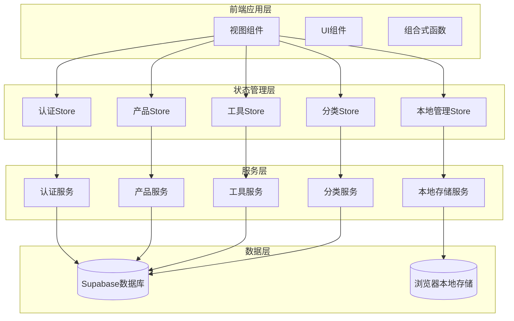

**图表来源**
- [src/stores/auth.ts](file://src/stores/auth.ts#L1-L190)
- [src/stores/products.ts](file://src/stores/products.ts#L1-L365)
- [src/stores/tools.ts](file://src/stores/tools.ts#L1-L319)
- [src/stores/categories.ts](file://src/stores/categories.ts#L1-L284)
- [src/stores/localManagement.ts](file://src/stores/localManagement.ts#L1-L359)

## 核心Store模块分析

### 认证Store (auth.ts)

认证Store负责管理用户身份验证状态、用户信息和认证相关的业务逻辑。

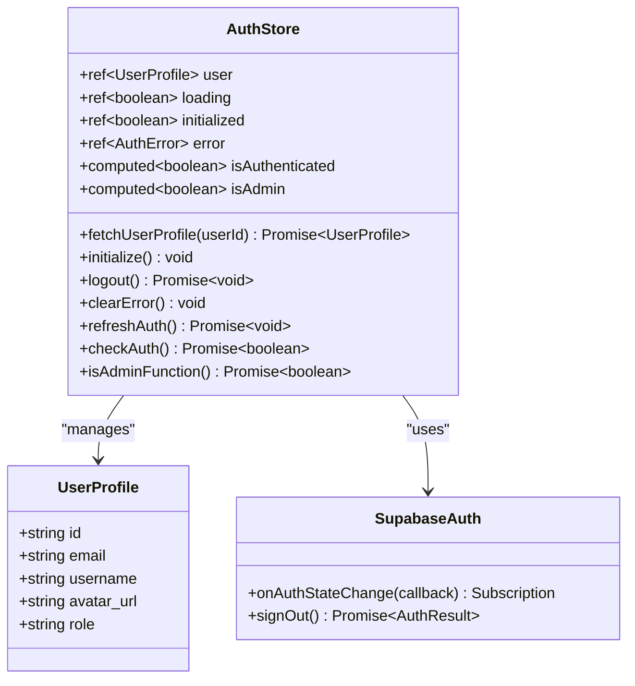

**图表来源**
- [src/stores/auth.ts](file://src/stores/auth.ts#L15-L190)

**章节来源**
- [src/stores/auth.ts](file://src/stores/auth.ts#L1-L190)

### 产品Store (products.ts)

产品Store管理产品数据、搜索过滤和产品相关的业务逻辑。

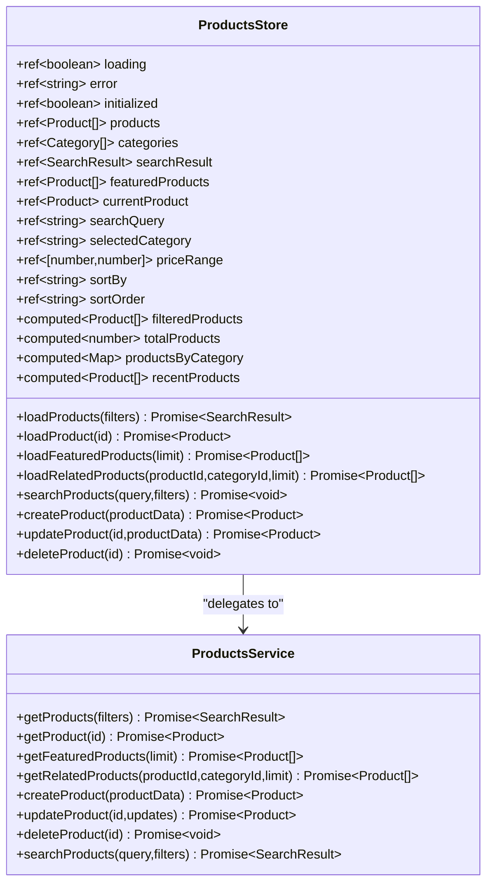

**图表来源**
- [src/stores/products.ts](file://src/stores/products.ts#L5-L365)

**章节来源**
- [src/stores/products.ts](file://src/stores/products.ts#L1-L365)

### 工具Store (tools.ts)

工具Store管理工具数据、分类和工具相关的业务逻辑。

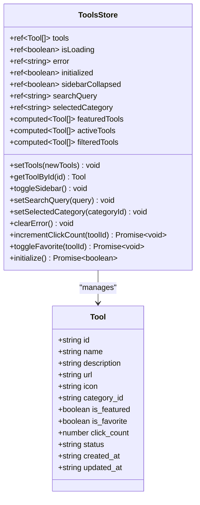

**图表来源**
- [src/stores/tools.ts](file://src/stores/tools.ts#L80-L319)

**章节来源**
- [src/stores/tools.ts](file://src/stores/tools.ts#L1-L319)

### 分类Store (categories.ts)

分类Store管理分类数据和分类相关的业务逻辑。

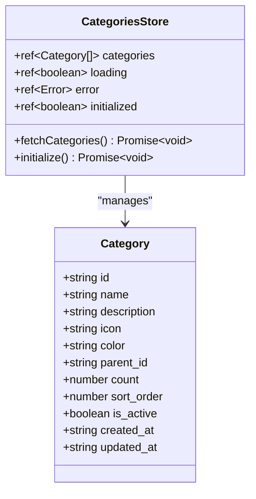

**图表来源**
- [src/stores/categories.ts](file://src/stores/categories.ts#L5-L284)

**章节来源**
- [src/stores/categories.ts](file://src/stores/categories.ts#L1-L284)

### 本地管理Store (localManagement.ts)

本地管理Store处理离线功能、数据同步和本地存储管理。

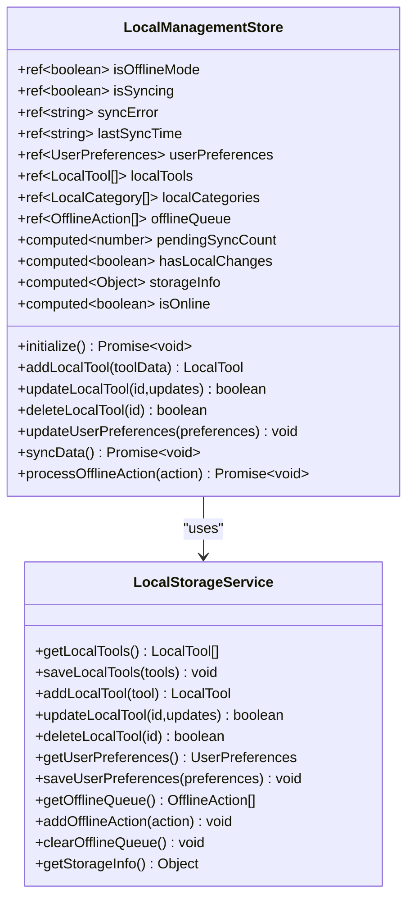

**图表来源**
- [src/stores/localManagement.ts](file://src/stores/localManagement.ts#L20-L359)
- [src/services/localStorageService.ts](file://src/services/localStorageService.ts#L40-L339)

**章节来源**
- [src/stores/localManagement.ts](file://src/stores/localManagement.ts#L1-L359)
- [src/services/localStorageService.ts](file://src/services/localStorageService.ts#L1-L339)

## 状态管理模式

### 响应式状态设计

每个store都采用了Vue 3的响应式系统，使用ref和computed来管理状态：

```typescript
// 状态定义
const user = ref<UserProfile | null>(null);
const loading = ref(false);
const initialized = ref(false);

// 计算属性
const isAuthenticated = computed(() => !!user.value);
const isAdmin = computed(() => {
  return user.value?.role === "admin" || user.value?.role === "super_admin";
});
```

### 状态封装原则

1. **单一职责**: 每个store专注于特定领域的状态管理
2. **不可变性**: 通过ref创建响应式状态，避免直接修改原始数据
3. **封装性**: 外部只能通过actions修改状态，getter提供只读访问

### 状态生命周期

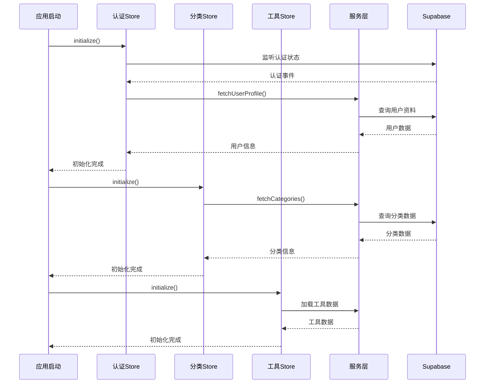

**图表来源**
- [src/main.ts](file://src/main.ts#L20-L45)
- [src/stores/auth.ts](file://src/stores/auth.ts#L60-L90)

## 数据流机制

### 异步操作流程

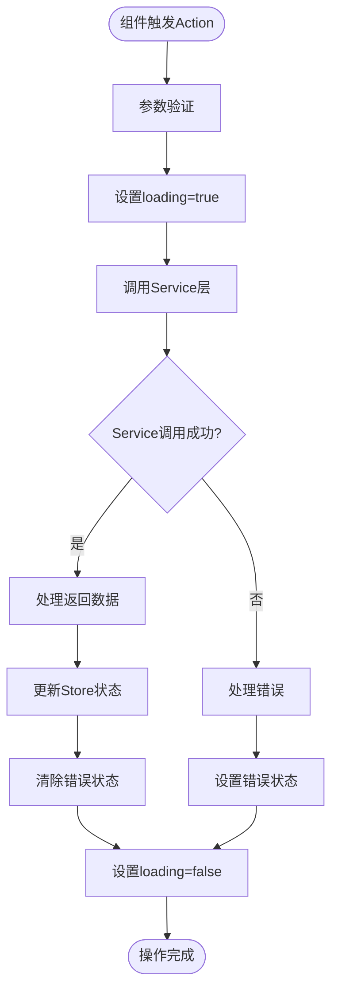

**图表来源**
- [src/stores/products.ts](file://src/stores/products.ts#L60-L90)
- [src/stores/auth.ts](file://src/stores/auth.ts#L120-L150)

### Action调用示例

以用户登录为例，展示完整的数据流：

```typescript
// 组件中的调用
async function handleSubmit() {
  try {
    loading.value = true;
    error.value = '';
    
    const result = await AuthService.login(form.value);
    
    // 强制刷新用户状态
    const authStore = useAuthStore();
    await authStore.initialize();
    
    // 添加短暂延迟确保状态更新
    setTimeout(() => {
      emit('success');
    }, 300);
  } catch (err) {
    error.value = err instanceof Error ? err.message : '登录失败';
  } finally {
    loading.value = false;
  }
}
```

**章节来源**
- [src/components/auth/LoginForm.vue](file://src/components/auth/LoginForm.vue#L40-L60)

### Getter派生状态

Store提供了丰富的计算属性来实现派生状态：

```typescript
// 产品Store中的计算属性
const filteredProducts = computed(() => {
  if (searchResult.value) {
    return searchResult.value.items;
  }
  return products.value;
});

const totalProducts = computed(() => {
  return searchResult.value
    ? searchResult.value.total
    : products.value.length;
});

const productsByCategory = computed(() => {
  const grouped = new Map<string, Product[]>();
  products.value.forEach((product) => {
    const categoryId = product.category.id;
    if (!grouped.has(categoryId)) {
      grouped.set(categoryId, []);
    }
    grouped.get(categoryId)!.push(product);
  });
  return grouped;
});
```

**章节来源**
- [src/stores/products.ts](file://src/stores/products.ts#L25-L45)

## 持久化策略

### localStorageService集成

系统实现了完整的本地存储管理，支持离线功能和数据持久化：

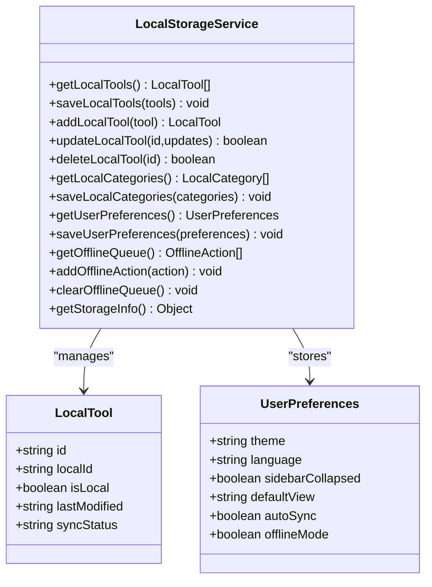

**图表来源**
- [src/services/localStorageService.ts](file://src/services/localStorageService.ts#L40-L339)

### 数据同步机制

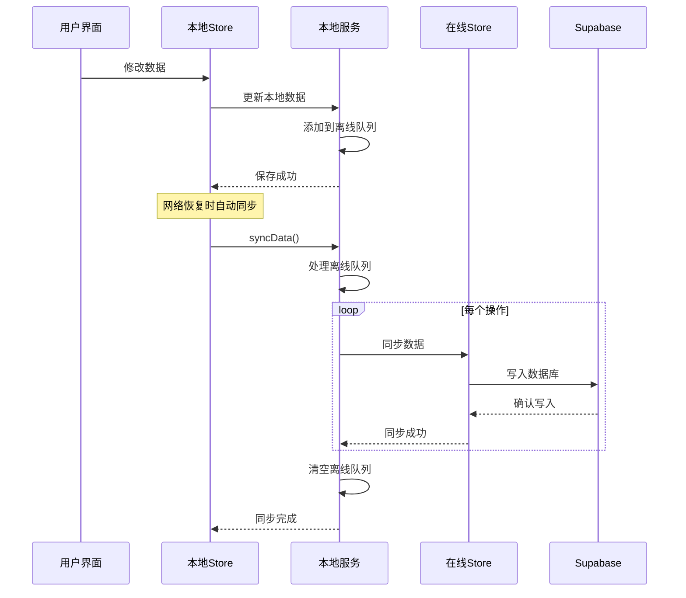

**图表来源**
- [src/stores/localManagement.ts](file://src/stores/localManagement.ts#L120-L180)

**章节来源**
- [src/stores/localManagement.ts](file://src/stores/localManagement.ts#L1-L359)
- [src/services/localStorageService.ts](file://src/services/localStorageService.ts#L1-L339)

## 错误处理模式

### 统一错误处理策略

每个store都实现了标准化的错误处理机制：

```typescript
// 错误处理模板
const loadProducts = async (filters?: SearchFilters) => {
  try {
    loading.value = true;
    error.value = null;

    const result = await ProductsService.getProducts(filters);

    if (filters) {
      searchResult.value = result;
    } else {
      products.value = result.items;
      searchResult.value = null;
    }

    return result;
  } catch (err) {
    error.value = err instanceof Error ? err.message : "加载产品失败";
    console.error("Error loading products:", err);
    throw err;
  } finally {
    loading.value = false;
  }
};
```

### 错误类型分类

1. **网络错误**: 网络连接问题导致的操作失败
2. **认证错误**: 用户认证状态异常
3. **数据错误**: 数据格式或完整性问题
4. **业务错误**: 业务逻辑验证失败

### 错误恢复机制

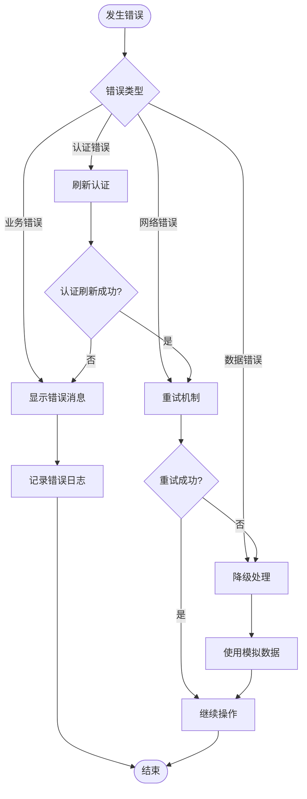

**章节来源**
- [src/stores/products.ts](file://src/stores/products.ts#L60-L90)
- [src/stores/auth.ts](file://src/stores/auth.ts#L120-L150)

## 性能优化策略

### 并发初始化

应用启动时采用并发初始化多个store：

```typescript
// 主应用初始化
async function initializeCoreStores() {
  const authStore = useAuthStore();
  const categoriesStore = useCategoriesStore();
  const toolsStore = useToolsStore();

  // 使用Promise.all并发执行所有stores的初始化
  await Promise.all([
    authStore.initialize(),
    categoriesStore.initialize(),
    toolsStore.initialize(),
  ]);
}
```

### 懒加载策略

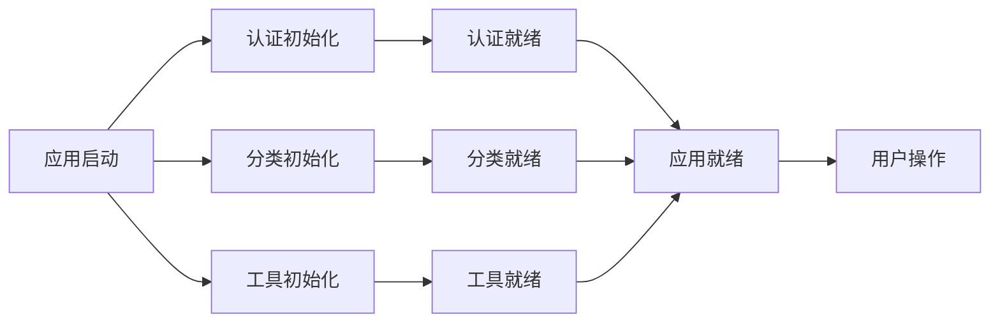

**图表来源**
- [src/main.ts](file://src/main.ts#L20-L45)

### 计算属性优化

使用computed来避免重复计算：

```typescript
// 优化前：每次访问都重新计算
const expensiveCalculation = () => {
  return products.value.filter(p => p.price > 100).reduce((sum, p) => sum + p.price, 0);
};

// 优化后：使用computed缓存结果
const totalExpensiveValue = computed(() => {
  return products.value.filter(p => p.price > 10