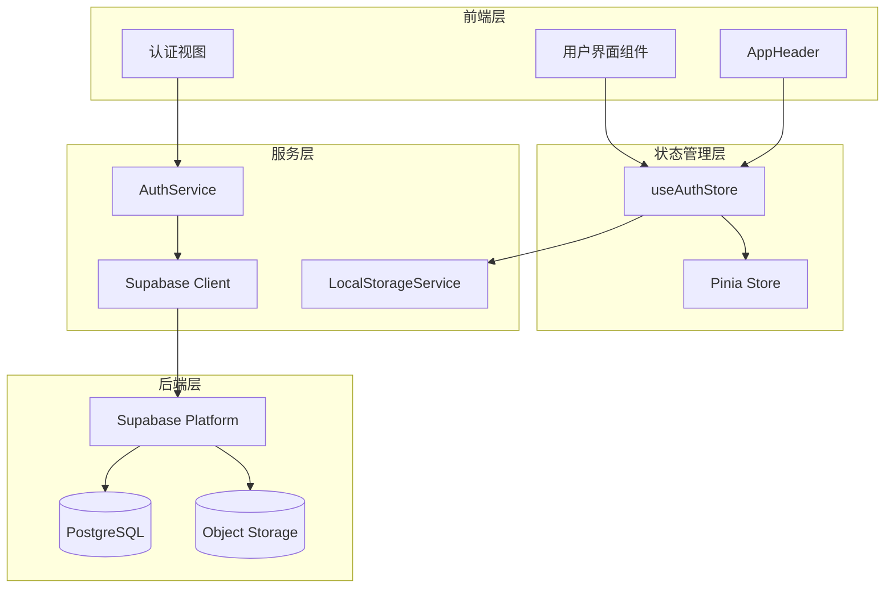
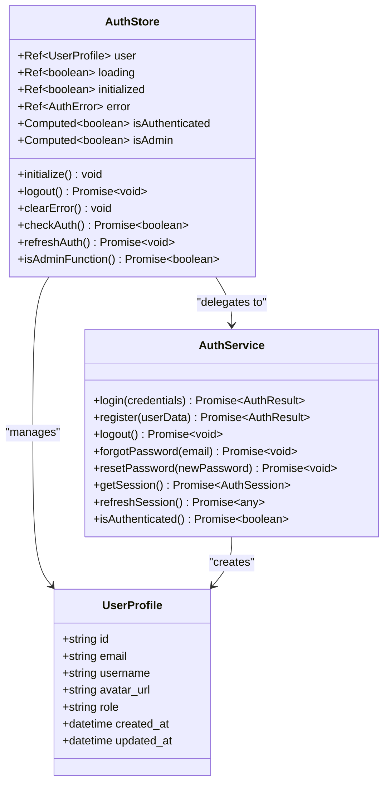
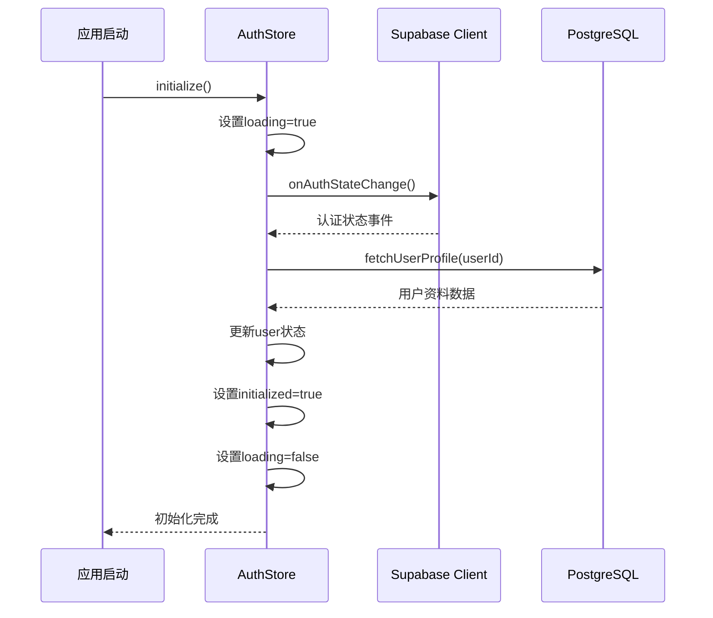
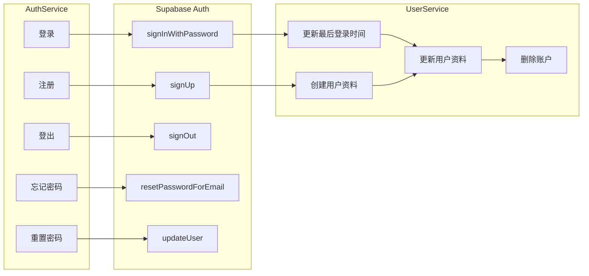
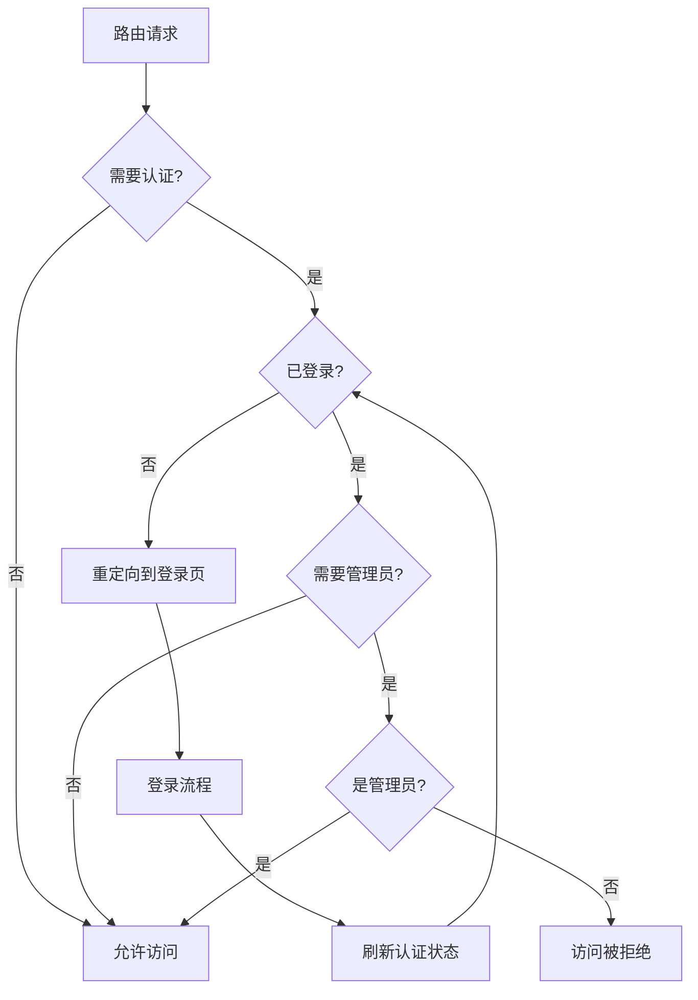
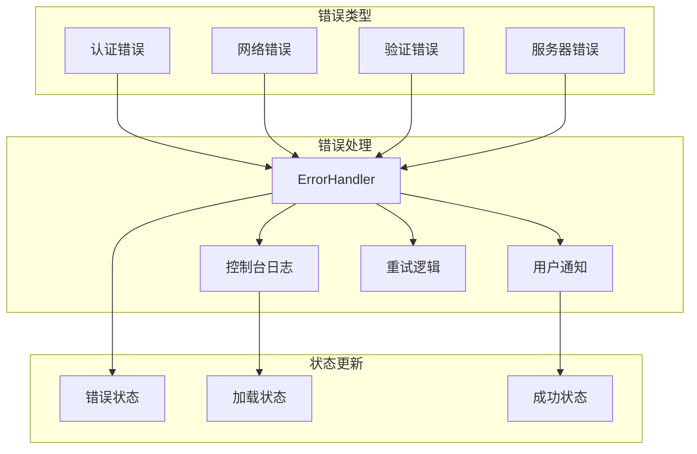

# 认证状态管理

<cite>
**本文档引用的文件**
- [auth.ts](file://src/stores/auth.ts)
- [supabaseClient.ts](file://src/lib/supabaseClient.ts)
- [authService.ts](file://src/services/authService.ts)
- [LoginForm.vue](file://src/components/auth/LoginForm.vue)
- [LoginView.vue](file://src/views/auth/LoginView.vue)
- [AppHeader.vue](file://src/components/AppHeader.vue)
- [index.ts](file://src/router/index.ts)
- [localStorageService.ts](file://src/services/localStorageService.ts)
</cite>

## 目录
1. [简介](#简介)
2. [项目架构概览](#项目架构概览)
3. [核心组件分析](#核心组件分析)
4. [认证状态管理机制](#认证状态管理机制)
5. [Supabase集成](#supabase集成)
6. [路由守卫与权限控制](#路由守卫与权限控制)
7. [错误处理与调试](#错误处理与调试)
8. [性能优化与最佳实践](#性能优化与最佳实践)
9. [故障排除指南](#故障排除指南)
10. [总结](#总结)

## 简介

认证状态管理模块是现代Web应用程序的核心基础设施，负责管理用户身份验证、授权和会话状态。本项目采用Pinia状态管理库结合Supabase认证服务，构建了一个完整且响应式的认证状态管理系统。

该系统的主要特点包括：
- 基于Pinia的状态管理模式
- 与Supabase认证服务的深度集成
- 自动化的会话管理和状态同步
- 完整的路由守卫和权限控制
- 响应式的用户界面状态更新
- 完善的错误处理和调试机制

## 项目架构概览



**图表来源**
- [auth.ts](file://src/stores/auth.ts#L1-L190)
- [supabaseClient.ts](file://src/lib/supabaseClient.ts#L1-L246)
- [authService.ts](file://src/services/authService.ts#L1-L306)

## 核心组件分析

### useAuthStore - 认证状态管理器

`useAuthStore` 是整个认证系统的核心，基于Pinia构建，提供了完整的状态管理功能。

```typescript
export const useAuthStore = defineStore("auth", () => {
  // 状态定义
  const user = ref<UserProfile | null>(null);
  const loading = ref(false);
  const initialized = ref(false);
  const error = ref<AuthError | null>(null);

  // 计算属性
  const isAuthenticated = computed(() => !!user.value);
  const isAdmin = computed(() => {
    return user.value?.role === "admin" || user.value?.role === "super_admin";
  });
});
```

**节来源**
- [auth.ts](file://src/stores/auth.ts#L15-L37)

#### 状态结构设计



**图表来源**
- [auth.ts](file://src/stores/auth.ts#L15-L37)
- [authService.ts](file://src/services/authService.ts#L15-L306)

### Supabase客户端集成

```typescript
// Supabase客户端配置
export const supabase = createClient(
  supabaseConfig.url,
  supabaseConfig.anonKey,
  supabaseConfig.options,
);

// 认证状态监听
const { data: { subscription } } = supabase.auth.onAuthStateChange(
  async (event, session) => {
    // 处理会话变化
  }
);
```

**节来源**
- [supabaseClient.ts](file://src/lib/supabaseClient.ts#L10-L20)
- [auth.ts](file://src/stores/auth.ts#L73-L113)

## 认证状态管理机制

### 初始化流程



**图表来源**
- [auth.ts](file://src/stores/auth.ts#L58-L113)

### 会话生命周期管理

认证状态管理遵循以下生命周期模式：

1. **初始化阶段**：监听Supabase认证状态变化
2. **认证阶段**：处理登录、注册、登出操作
3. **会话保持**：自动刷新和状态同步
4. **错误恢复**：处理认证失败和会话过期

```typescript
// 初始化认证监听
function initialize() {
  if (initialized.value) return;
  
  loading.value = true;
  console.log("🔐 初始化Supabase认证监听...");
  
  const { data: { subscription } } = supabase.auth.onAuthStateChange(
    async (event, session) => {
      // 处理认证状态变化
      if (session?.user) {
        const profile = await fetchUserProfile(session.user.id);
        // 更新用户状态
      } else {
        user.value = null;
      }
      
      initialized.value = true;
      loading.value = false;
    }
  );
}
```

**节来源**
- [auth.ts](file://src/stores/auth.ts#L58-L113)

## Supabase集成

### 认证服务架构



**图表来源**
- [authService.ts](file://src/services/authService.ts#L15-L306)

### 用户资料管理

系统通过扩展的`UserProfile`类型整合Supabase用户数据和自定义用户资料：

```typescript
export type UserProfile = SupabaseUser & {
  username: string;
  avatar_url: string;
  role: "user" | "admin" | "super_admin";
};
```

用户资料获取流程：

```typescript
async function fetchUserProfile(userId: string) {
  const { data, error: profileError } = await supabase
    .from("user_profiles")
    .select("*")
    .eq("id", userId)
    .single();

  if (profileError) {
    error.value = {
      name: "ProfileFetchError",
      message: `无法加载用户资料: ${profileError.message}`,
    } as AuthError;
    return null;
  }
  return data;
}
```

**节来源**
- [auth.ts](file://src/stores/auth.ts#L37-L57)

## 路由守卫与权限控制

### 权限控制架构



**图表来源**
- [index.ts](file://src/router/index.ts#L350-L398)

### 路由元数据配置

```typescript
// 路由配置示例
{
  path: "/admin",
  name: "Admin",
  meta: {
    requiresAuth: true,
    requiresAdmin: true,
  }
}
```

### 权限检查实现

```typescript
// 路由守卫中的权限检查
router.beforeEach(async (to, from, next) => {
  const authStore = useAuthStore();
  
  // 检查是否需要认证
  if (to.meta.requiresAuth) {
    const isAuthenticated = authStore.isAuthenticated;
    
    if (!isAuthenticated) {
      await authStore.refreshAuth();
      if (!authStore.isAuthenticated) {
        return next({
          name: 'Login',
          query: { redirect: to.fullPath }
        });
      }
    }
  }

  // 检查是否需要管理员权限
  if (to.meta.requiresAdmin) {
    const isAdmin = await authStore.isAdminFunction();
    if (!isAdmin) {
      return next({ name: 'NotFound' });
    }
  }
});
```

**节来源**
- [index.ts](file://src/router/index.ts#L350-L398)

## 错误处理与调试

### 错误处理策略

系统实现了多层次的错误处理机制：



**图表来源**
- [authService.ts](file://src/services/authService.ts#L15-L306)

### 登录表单错误处理

```typescript
async function handleSubmit() {
  try {
    loading.value = true;
    error.value = '';
    
    const result = await AuthService.login(form.value);
    
    // 强制刷新用户状态
    const authStore = useAuthStore();
    await authStore.initialize();
    
    // 添加短暂延迟确保状态更新
    setTimeout(() => {
      emit('success');
    }, 300);
  } catch (err) {
    error.value = err instanceof Error ? err.message : '登录失败';
  } finally {
    loading.value = false;
  }
}
```

**节来源**
- [LoginForm.vue](file://src/components/auth/LoginForm.vue#L35-L55)

## 性能优化与最佳实践

### 状态同步优化

1. **懒加载初始化**：仅在需要时初始化认证监听
2. **状态缓存**：避免重复的API调用
3. **防抖处理**：减少频繁的状态更新

```typescript
// 防止重复初始化
function initialize() {
  if (initialized.value) return;
  
  // 一次性设置初始化标志
  loading.value = true;
  console.log("🔐 初始化Supabase认证监听...");
  
  // 监听认证状态变化
  const { data: { subscription } } = supabase.auth.onAuthStateChange(
    async (event, session) => {
      // 处理状态变化...
    }
  );
}
```

**节来源**
- [auth.ts](file://src/stores/auth.ts#L58-L113)

### 内存管理

```typescript
// 组件卸载时清理订阅
onScopeDispose(() => {
  subscription?.unsubscribe();
});
```

### 本地存储集成

系统集成了本地存储服务来增强离线体验：

```typescript
// 用户偏好设置持久化
static saveUserPreferences(preferences: Partial<UserPreferences>): void {
  try {
    const current = this.getUserPreferences();
    const updated = { ...current, ...preferences };
    localStorage.setItem(
      LOCAL_STORAGE_KEYS.USER_PREFERENCES,
      JSON.stringify(updated),
    );
  } catch (error) {
    console.error("保存用户偏好设置失败:", error);
  }
}
```

**节来源**
- [localStorageService.ts](file://src/services/localStorageService.ts#L200-L220)

## 故障排除指南

### 常见问题与解决方案

#### 1. 认证状态不一致

**症状**：用户已登录但UI显示未登录状态

**原因**：状态同步延迟或初始化失败

**解决方案**：
```typescript
// 强制刷新认证状态
async function forceRefreshAuth() {
  const authStore = useAuthStore();
  await authStore.refreshAuth();
  // 等待状态更新
  await new Promise(resolve => setTimeout(resolve, 100));
}
```

#### 2. 会话过期处理

**症状**：API调用返回401错误

**解决方案**：
```typescript
// 自动刷新会话
async function handleSessionExpired() {
  try {
    await AuthService.refreshSession();
    // 重新尝试失败的请求
  } catch (error) {
    // 引导用户重新登录
    await AuthService.logout();
  }
}
```

#### 3. 状态初始化失败

**症状**：应用启动时认证状态异常

**解决方案**：
```typescript
// 健壮的初始化过程
function robustInitialize() {
  try {
    initialize();
  } catch (error) {
    console.error("认证初始化失败:", error);
    // 回退到默认状态
    user.value = null;
    initialized.value = true;
  }
}
```

### 调试技巧

1. **启用详细日志**：
```typescript
// 在开发环境中启用详细日志
if (process.env.NODE_ENV === 'development') {
  console.log("🔍 认证状态:", {
    user: user.value,
    isAuthenticated: isAuthenticated.value,
    isAdmin: isAdmin.value,
    loading: loading.value,
    initialized: initialized.value,
    error: error.value
  });
}
```

2. **状态监控**：
```typescript
// 监控状态变化
watch(user, (newUser, oldUser) => {
  console.log("👤 用户状态变化:", { newUser, oldUser });
});
```

3. **网络请求追踪**：
```typescript
// 追踪认证相关的API调用
const originalFetch = window.fetch;
window.fetch = async function(...args) {
  console.log("🌐 API调用:", args[0]);
  return originalFetch.apply(this, args);
};
```

### 最佳实践建议

1. **状态一致性**：确保所有认证操作都通过store进行
2. **错误边界**：为认证操作设置适当的错误边界
3. **用户体验**：提供清晰的加载状态和错误提示
4. **安全性**：定期轮换认证令牌，实施适当的访问控制
5. **监控**：建立认证相关的监控和告警机制

## 总结

本认证状态管理模块展现了现代Web应用认证系统的最佳实践。通过Pinia状态管理、Supabase认证服务和完善的路由守卫机制，系统实现了：

- **响应式状态管理**：实时响应用户认证状态变化
- **完整的权限控制**：基于角色的访问控制和路由保护
- **健壮的错误处理**：多层次的错误处理和恢复机制
- **优秀的用户体验**：流畅的认证流程和状态反馈
- **可维护性设计**：清晰的代码结构和模块化设计

该系统不仅满足了当前的功能需求，还为未来的扩展和维护奠定了坚实的基础。通过持续的监控和优化，可以进一步提升系统的稳定性和性能表现。