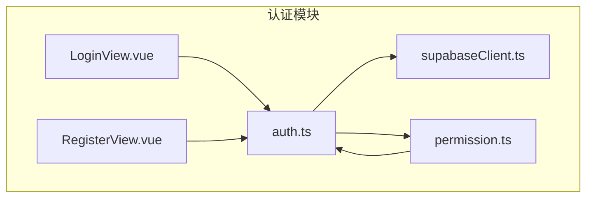
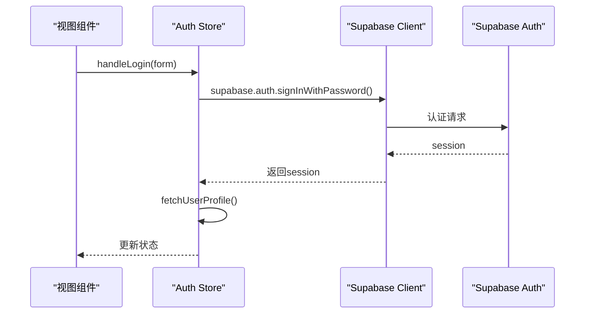
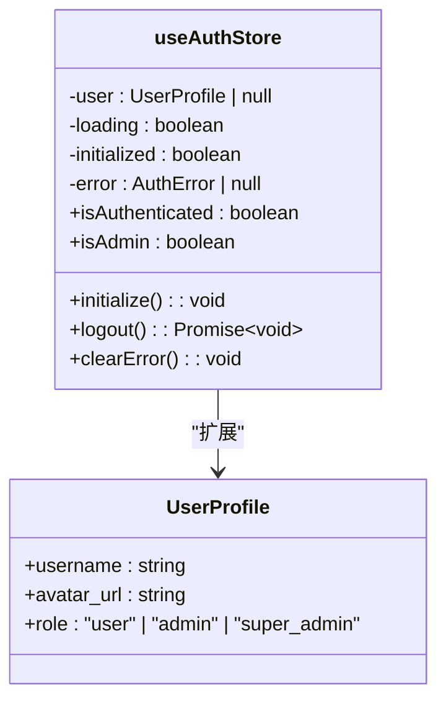
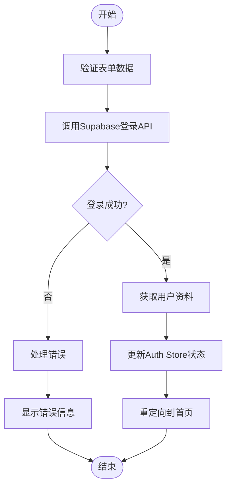
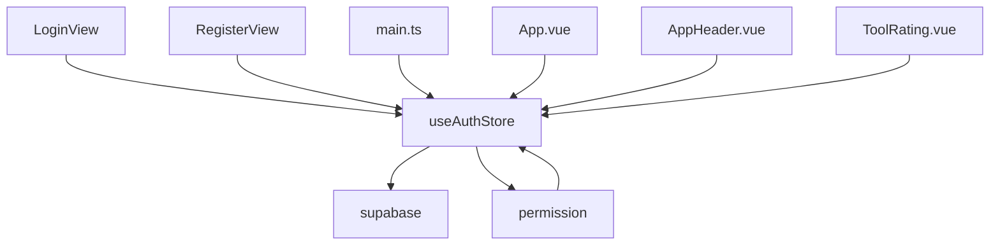

# 认证状态管理

<cite>
**本文档引用的文件**
- [auth.ts](file://src/stores/auth.ts)
- [LoginView.vue](file://src/views/auth/LoginView.vue)
- [RegisterView.vue](file://src/views/auth/RegisterView.vue)
- [supabaseClient.ts](file://src/lib/supabaseClient.ts)
- [permission.ts](file://src/permission.ts)
- [main.ts](file://src/main.ts)
- [database.ts](file://src/types/database.ts)
</cite>

## 目录
1. [简介](#简介)
2. [项目结构](#项目结构)
3. [核心组件](#核心组件)
4. [架构概述](#架构概述)
5. [详细组件分析](#详细组件分析)
6. [依赖分析](#依赖分析)
7. [性能考虑](#性能考虑)
8. [故障排除指南](#故障排除指南)
9. [结论](#结论)

## 简介
本项目是一个基于Vue 3和Pinia的前端应用，实现了完整的用户认证状态管理。系统通过集成Supabase Auth服务，提供了登录、注册、登出等核心功能，并结合Vue Router的路由守卫实现访问控制。认证状态存储在Pinia store中，支持自动登录恢复和会话管理。

## 项目结构
项目采用模块化设计，主要分为components、views、stores、services等目录。认证相关功能集中在`src/stores/auth.ts`中，视图组件位于`src/views/auth/`目录下，路由守卫在`src/permission.ts`中定义。



**图示来源**
- [auth.ts](file://src/stores/auth.ts)
- [LoginView.vue](file://src/views/auth/LoginView.vue)
- [RegisterView.vue](file://src/views/auth/RegisterView.vue)
- [supabaseClient.ts](file://src/lib/supabaseClient.ts)
- [permission.ts](file://src/permission.ts)

**本节来源**
- [auth.ts](file://src/stores/auth.ts)
- [LoginView.vue](file://src/views/auth/LoginView.vue)
- [RegisterView.vue](file://src/views/auth/RegisterView.vue)

## 核心组件
认证系统的核心是`useAuthStore`，它管理用户状态、处理认证逻辑并与Supabase服务集成。store暴露了isAuthenticated和isAdmin等getter，以及login、logout等action。

**本节来源**
- [auth.ts](file://src/stores/auth.ts)

## 架构概述
系统采用分层架构，从视图层到服务层再到外部API。认证状态在应用启动时初始化，通过监听Supabase的认证状态变化来保持同步。



**图示来源**
- [auth.ts](file://src/stores/auth.ts)
- [supabaseClient.ts](file://src/lib/supabaseClient.ts)

## 详细组件分析

### 认证Store分析
`useAuthStore`是认证系统的核心，负责管理用户状态和认证逻辑。



**图示来源**
- [auth.ts](file://src/stores/auth.ts)

#### 登录流程分析
登录流程涉及表单验证、API调用和状态更新。



**图示来源**
- [LoginView.vue](file://src/views/auth/LoginView.vue)
- [auth.ts](file://src/stores/auth.ts)

### 视图组件分析
登录和注册视图组件处理用户输入并与store交互。

#### 登录视图分析
```mermaid
classDiagram
class LoginView {
-form : {email, password, remember}
-loading : boolean
-error : string | null
-showPassword : boolean
+handleLogin() : Promise~void~
}
LoginView --> useAuthStore : "使用"
```

**图示来源**
- [LoginView.vue](file://src/views/auth/LoginView.vue)

#### 注册视图分析
```mermaid
classDiagram
class RegisterView {
-form : {fullName, email, password, confirmPassword, agreeToTerms}
-loading : boolean
-error : string | null
-showPassword : boolean
-passwordStrength : object
+handleRegister() : Promise~void~
+isFormValid : boolean
}
RegisterView --> useAuthStore : "使用"
```

**图示来源**
- [RegisterView.vue](file://src/views/auth/RegisterView.vue)

**本节来源**
- [LoginView.vue](file://src/views/auth/LoginView.vue)
- [RegisterView.vue](file://src/views/auth/RegisterView.vue)
- [auth.ts](file://src/stores/auth.ts)

## 依赖分析
认证系统依赖多个外部服务和内部模块，形成复杂的依赖关系。



**图示来源**
- [auth.ts](file://src/stores/auth.ts)
- [LoginView.vue](file://src/views/auth/LoginView.vue)
- [RegisterView.vue](file://src/views/auth/RegisterView.vue)
- [main.ts](file://src/main.ts)
- [permission.ts](file://src/permission.ts)

**本节来源**
- [auth.ts](file://src/stores/auth.ts)
- [main.ts](file://src/main.ts)
- [permission.ts](file://src/permission.ts)

## 性能考虑
系统在启动时并发初始化多个store，提升加载性能。路由守卫优化避免了不必要的认证检查。

**本节来源**
- [main.ts](file://src/main.ts)
- [permission.ts](file://src/permission.ts)

## 故障排除指南
常见问题包括环境变量配置错误、Supabase连接失败等。系统提供了详细的错误日志和警告信息。

**本节来源**
- [supabaseClient.ts](file://src/lib/supabaseClient.ts)
- [auth.ts](file://src/stores/auth.ts)

## 结论
本认证系统设计合理，功能完整，通过Pinia store集中管理状态，与Supabase Auth无缝集成，提供了良好的用户体验和安全性。