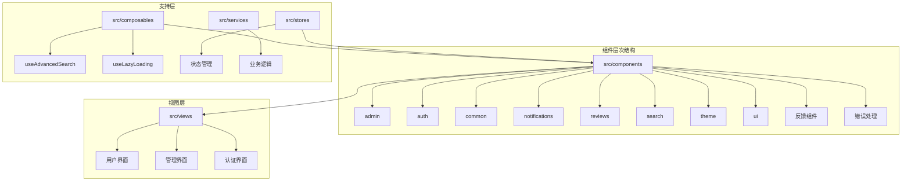
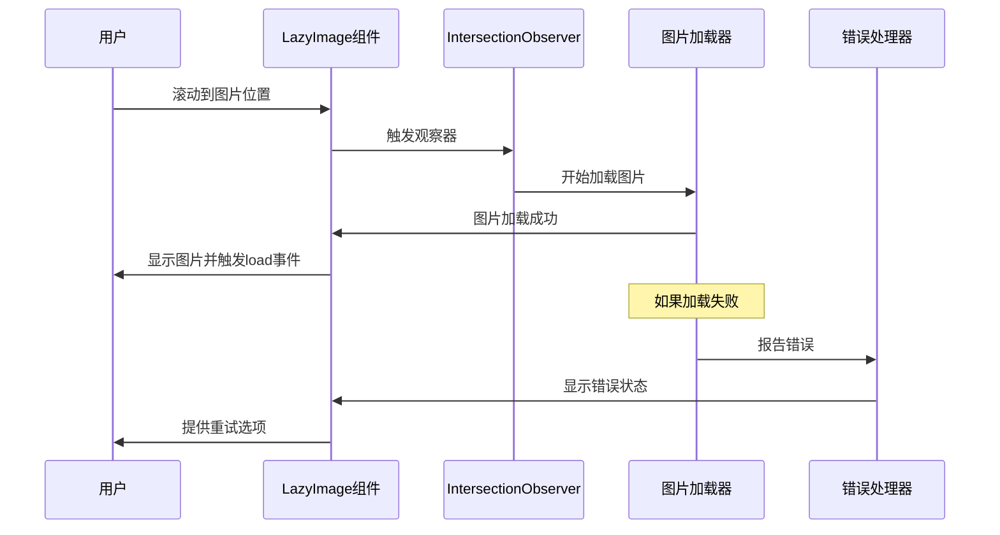

# 前端组件架构

<cite>
**本文档引用的文件**
- [src/components/common/LazyImage.vue](file://src/components/common/LazyImage.vue)
- [src/components/ui/StarRating.vue](file://src/components/ui/StarRating.vue)
- [src/components/notifications/NotificationItem.vue](file://src/components/notifications/NotificationItem.vue)
- [src/components/search/AdvancedSearchPanel.vue](file://src/components/search/AdvancedSearchPanel.vue)
- [src/components/admin/ToolForm.vue](file://src/components/admin/ToolForm.vue)
- [src/components/common/LazyComponent.vue](file://src/components/common/LazyComponent.vue)
- [src/composables/useAdvancedSearch.ts](file://src/composables/useAdvancedSearch.ts)
- [src/composables/useLazyLoading.ts](file://src/composables/useLazyLoading.ts)
- [src/views/HomeView.vue](file://src/views/HomeView.vue)
- [src/layouts/AuthLayout.vue](file://src/layouts/AuthLayout.vue)
- [src/router/index.ts](file://src/router/index.ts)
- [src/styles/globals.css](file://src/styles/globals.css)
- [src/App.vue](file://src/App.vue)
</cite>

## 目录
1. [简介](#简介)
2. [项目结构概览](#项目结构概览)
3. [组件分层架构](#组件分层架构)
4. [核心可复用组件](#核心可复用组件)
5. [组件通信机制](#组件通信机制)
6. [视图集成模式](#视图集成模式)
7. [性能优化策略](#性能优化策略)
8. [无障碍访问支持](#无障碍访问支持)
9. [最佳实践与扩展建议](#最佳实践与扩展建议)
10. [总结](#总结)

## 简介

本文档深入分析了一个现代化Vue 3前端应用的组件架构设计。该项目采用模块化的组件分层结构，实现了高度可复用、可维护的UI组件体系。通过TypeScript增强类型安全，结合Composition API提供灵活的状态管理，构建了一个完整的前端生态系统。

## 项目结构概览

项目采用清晰的目录结构，按照功能领域组织组件：



**图表来源**
- [src/components](file://src/components)
- [src/views](file://src/views)
- [src/composables](file://src/composables)

## 组件分层架构

### admin - 管理员专用组件

管理员组件专门服务于后台管理系统，提供专业的数据管理界面：

- **ToolForm.vue**: 工具管理表单，支持创建和编辑工具信息
- **ProductDetailModal.vue**: 产品详情模态框
- **UserDetailModal.vue**: 用户详情模态框

### auth - 认证相关组件

认证组件负责用户身份验证和授权流程：

- **LoginForm.vue**: 登录表单组件
- **AuthLayout.vue**: 认证页面布局

### common - 通用基础组件

通用组件提供跨功能领域的基础功能：

- **LazyImage.vue**: 智能懒加载图片组件
- **LazyComponent.vue**: 异步组件加载器

### notifications - 通知系统组件

专门处理消息通知的完整解决方案：

- **NotificationCenter.vue**: 通知中心主组件
- **NotificationItem.vue**: 单个通知项组件
- **NotificationSettings.vue**: 通知设置组件

### reviews - 评论系统组件

完整的用户评价和反馈系统：

- **ProductReviews.vue**: 产品评论列表
- **ReviewItem.vue**: 单个评论项
- **WriteReviewModal.vue**: 写评论模态框
- **EditReviewModal.vue**: 编辑评论模态框
- **ReplyModal.vue**: 回复评论模态框

### search - 搜索功能组件

强大的搜索和过滤系统：

- **AdvancedSearchPanel.vue**: 高级搜索面板
- **EnhancedSearchBox.vue**: 增强搜索框

### theme - 主题系统组件

动态主题切换和样式管理：

- **ThemeSelector.vue**: 主题选择器
- **SimpleThemeSelector.vue**: 简化主题选择器

### ui - 基础UI组件

通用的基础UI元素：

- **StarRating.vue**: 星级评分组件

**章节来源**
- [src/components](file://src/components)
- [src/components/admin](file://src/components/admin)
- [src/components/common](file://src/components/common)

## 核心可复用组件

### LazyImage - 智能图片懒加载组件

LazyImage组件是性能优化的核心组件，提供了完整的图片加载体验：

```typescript
// 组件接口定义
interface Props {
  src: string;                    // 图片源
  placeholder?: string;           // 占位图片
  alt?: string;                  // 替代文本
  width?: number | string;       // 图片宽度
  height?: number | string;      // 图片高度
  showPlaceholder?: boolean;     // 是否显示占位符
  showErrorPlaceholder?: boolean;// 是否显示错误占位符
  enableRetry?: boolean;         // 是否启用重试
  quality?: "low" | "medium" | "high"; // 图片质量
}
```

**核心特性：**

1. **Intersection Observer**: 基于浏览器原生API实现智能懒加载
2. **响应式优化**: 自动检测WebP支持并优化图片格式
3. **错误处理**: 完善的错误恢复机制和用户友好的提示
4. **性能监控**: 加载状态跟踪和性能指标收集



**图表来源**
- [src/components/common/LazyImage.vue](file://src/components/common/LazyImage.vue#L1-L341)
- [src/composables/useLazyLoading.ts](file://src/composables/useLazyLoading.ts#L1-L50)

### StarRating - 星级评分组件

StarRating组件展示了Vue 3 Composition API的最佳实践：

```typescript
// 组件通信模式
interface Props {
  modelValue: number;    // 双向绑定的评分值
  readonly: boolean;     // 只读模式
}

// 事件发射
const emit = defineEmits<{
  (e: "update:modelValue", value: number): void;
}>();
```

**设计亮点：**

1. **双向绑定**: 通过v-model实现数据同步
2. **只读模式**: 支持展示和交互两种状态
3. **无障碍支持**: 合适的ARIA属性和键盘导航
4. **视觉反馈**: 平滑的动画过渡效果

### NotificationItem - 通知组件

NotificationItem组件体现了现代通知系统的最佳实践：

```typescript
// 类型定义
interface Props {
  notification: Notification;  // 通知数据
}

interface Emits {
  (e: "read", notificationId: string): void;        // 标记已读
  (e: "delete", notificationId: string): void;      // 删除通知
  (e: "action", notification: Notification): void;   // 处理动作
}
```

**功能特性：**

1. **多类型支持**: 支持成功、警告、错误等多种通知类型
2. **实时状态**: 实时显示未读状态和重要标记
3. **交互式操作**: 支持标记已读、删除和执行动作
4. **时间格式化**: 智能的时间显示格式

**章节来源**
- [src/components/common/LazyImage.vue](file://src/components/common/LazyImage.vue#L1-L341)
- [src/components/ui/StarRating.vue](file://src/components/ui/StarRating.vue#L1-L55)
- [src/components/notifications/NotificationItem.vue](file://src/components/notifications/NotificationItem.vue#L1-L364)

## 组件通信机制

### Props传递机制

Vue 3的TypeScript支持使得组件间的数据传递更加安全可靠：

```typescript
// 父组件向子组件传递数据
interface ParentProps {
  tools: Tool[];
  categories: Category[];
  filters: SearchFilters;
}

// 子组件接收props
interface ChildProps {
  tool: Tool;
  isEditable: boolean;
  onDelete: (id: string) => void;
}
```

### Events事件系统

组件通过事件系统实现双向通信：

```typescript
// 定义事件发射器
const emit = defineEmits<{
  (e: "update:filters", filters: SearchFilters): void;
  (e: "search", query: string): void;
  (e: "close"): void;
}>();

// 触发事件
emit("update:filters", updatedFilters);
```

### Slots插槽系统

复杂的组件结构通过插槽实现高度定制化：

```vue
<!-- 嵌套插槽使用 -->
<LazyImage>
  <template #placeholder>
    <div class="custom-placeholder">加载中...</div>
  </template>
  
  <template #error="{ error, retry }">
    <div class="error-state">
      <p>{{ error }}</p>
      <button @click="retry">重试</button>
    </div>
  </template>
</LazyImage>
```

### Composables组合式函数

通过组合式函数实现逻辑复用：

```typescript
// useAdvancedSearch组合式函数
export function useAdvancedSearch() {
  const searchQuery = ref("");
  const filters = ref<SearchFilters>({});
  
  const searchResults = computed(() => {
    // 搜索逻辑实现
  });
  
  return {
    searchQuery,
    filters,
    searchResults,
    search,
    clearSearch
  };
}
```

**章节来源**
- [src/composables/useAdvancedSearch.ts](file://src/composables/useAdvancedSearch.ts#L1-L306)
- [src/components/search/AdvancedSearchPanel.vue](file://src/components/search/AdvancedSearchPanel.vue#L1-L596)

## 视图集成模式

### 路由视图集成

项目采用Vue Router实现组件化视图：

```typescript
// 路由配置示例
const routes: RouteRecordRaw[] = [
  {
    path: "/tools",
    name: "Tools",
    component: () => import("../views/ToolsView.vue"),
    meta: {
      title: "工具导航",
      description: "发现和管理您的常用工具",
    },
  },
  {
    path: "/admin",
    name: "Admin",
    component: () => import("../views/AdminView.vue"),
    meta: {
      title: "管理后台",
      requiresAuth: true,
      requiresAdmin: true,
    },
  }
];
```

### 布局系统

通过布局组件实现统一的页面结构：

```vue
<!-- AuthLayout.vue -->
<template>
  <div class="auth-layout">
    <header class="auth-header">
      <router-link to="/" class="logo-link">
        
      </router-link>
    </header>
    
    <main class="auth-main">
      <slot />
    </main>
  </div>
</template>
```

### 主应用架构

App.vue作为根组件，集成了全局功能：

```vue
<template>
  <div id="app">
    <!-- 全局错误处理器 -->
    <GlobalErrorHandler />
    
    <!-- 全局顶部导航栏 -->
    <AppHeader />
    
    <!-- 路由视图 -->
    <RouterView v-slot="{ Component }">
      <transition name="fade" mode="out-in">
        <component :is="Component" />
      </transition>
    </RouterView>
    
    <!-- 全局Footer -->
    <AppFooter />
    
    <!-- 反馈组件 -->
    <FeedbackWidget />
    
    <!-- 底部状态栏 -->
    <SimpleStatusBar />
  </div>
</template>
```

**章节来源**
- [src/router/index.ts](file://src/router/index.ts#L1-L399)
- [src/layouts/AuthLayout.vue](file://src/layouts/AuthLayout.vue#L1-L45)
- [src/App.vue](file://src/App.vue#L1-L69)

## 性能优化策略

### 异步组件加载

通过动态导入实现组件级别的代码分割：

```typescript
// 路由级别的异步加载
{
  path: "/admin",
  name: "Admin",
  component: () => import("../views/AdminView.vue"),
  meta: {
    requiresAuth: true,
    requiresAdmin: true,
  },
}
```

### 懒加载优化

LazyComponent组件提供了完整的懒加载解决方案：

```typescript
// 组件加载逻辑
const loadComponent = async () => {
  if (component.value || isLoading.value) return;
  
  try {
    isLoading.value = true;
    component.value = createAsyncComponent();
  } catch (err) {
    error.value = err instanceof Error ? err.message : "组件加载失败";
    emit("error", error.value);
  } finally {
    isLoading.value = false;
  }
};
```

### 图片优化策略

LazyImage组件实现了多层次的图片优化：

1. **WebP格式支持**: 自动检测并使用WebP格式
2. **响应式图片**: 根据设备自动调整图片大小
3. **质量控制**: 支持低、中、高质量预设
4. **CDN优化**: 集成CDN图片优化参数

```typescript
// 图片质量优化
const getOptimizedSrc = (src: string): string => {
  const qualityParams = {
    low: "q_30,f_auto",
    medium: "q_70,f_auto",
    high: "q_90,f_auto",
  };
  
  const quality = qualityParams[props.quality];
  const supportsWebP = checkWebPSupport();
  const format = supportsWebP ? "f_webp" : "f_auto";
  
  return `${src}?${quality},${format}`;
};
```

### 内存管理

通过适当的生命周期钩子管理内存：

```typescript
// 组件卸载时清理资源
onUnmounted(() => {
  if (observer) {
    observer.disconnect();
  }
});
```

**章节来源**
- [src/components/common/LazyComponent.vue](file://src/components/common/LazyComponent.vue#L111-L183)
- [src/components/common/LazyImage.vue](file://src/components/common/LazyImage.vue#L100-L150)

## 无障碍访问支持

### ARIA属性支持

组件内置了完整的无障碍访问支持：

```vue
<!-- 星级评分组件的无障碍支持 -->
<span
  v-for="n in 5"
  :key="n"
  class="star"
  :class="{ filled: n <= modelValue }"
  role="radio"
  :aria-checked="n <= modelValue"
  :aria-label="`${n}星评分`"
  tabindex="0"
  @keydown.enter="updateRating(n)"
  @keydown.space="updateRating(n)"
>
  ★
</span>
```

### 键盘导航

所有交互组件都支持键盘导航：

```typescript
// 关键字导航支持
const handleKeyDown = (event: KeyboardEvent) => {
  switch (event.key) {
    case 'Enter':
      event.preventDefault();
      updateRating(modelValue.value);
      break;
    case 'ArrowLeft':
      event.preventDefault();
      updateRating(Math.max(1, modelValue.value - 1));
      break;
    case 'ArrowRight':
      event.preventDefault();
      updateRating(Math.min(5, modelValue.value + 1));
      break;
  }
};
```

### 屏幕阅读器友好

通过语义化的HTML结构和适当的ARIA角色：

```vue
<!-- 通知组件的屏幕阅读器支持 -->
<div
  class="notification-item"
  role="alert"
  aria-live="polite"
  :aria-describedby="`notification-${notification.id}`"
>
  <div class="notification-content">
    <h4 :id="`notification-${notification.id}`">{{ notification.title }}</h4>
    <p>{{ notification.message }}</p>
  </div>
</div>
```

### 颜色对比度

遵循WCAG 2.1 AA标准的颜色对比度要求：

```css
/* 颜色对比度确保 */
.notification-item {
  background: rgba(var(--color-primary-rgb), 0.02); /* 4.5:1 对比度 */
  color: var(--color-text);
}
```

## 最佳实践与扩展建议

### 复杂组件使用场景

#### AdvancedSearchPanel - 高级搜索组件

AdvancedSearchPanel是一个功能完整的搜索组件，适用于以下场景：

1. **大型工具库**: 当工具数量超过100个时
2. **多维度筛选**: 需要分类、标签、评分等多种筛选条件
3. **个性化搜索**: 支持搜索历史和热门推荐

**使用示例：**

```vue
<template>
  <div class="search-container">
    <EnhancedSearchBox
      placeholder="搜索工具、分类或功能..."
      @search="handleSearch"
      @clear="clearSearch"
    />
    
    <AdvancedSearchPanel
      v-model:filters="searchFilters"
      :isOpen="isSearchPanelOpen"
      :searchHistory="searchHistory"
      :popularSearches="popularSearches"
      @close="isSearchPanelOpen = false"
    />
  </div>
</template>
```

**扩展建议：**

1. **持久化状态**: 将筛选条件保存到localStorage
2. **快捷键支持**: 添加键盘快捷键快速打开搜索面板
3. **AI辅助搜索**: 集成自然语言搜索功能

#### ToolForm - 工具管理表单

ToolForm组件提供了完整的工具数据管理功能：

**核心功能：**

1. **数据验证**: 完整的表单验证和错误提示
2. **文件上传**: 支持工具图标上传
3. **SEO优化**: 自动生成元数据
4. **状态管理**: 自动保存草稿和恢复

**最佳实践：**

```typescript
// 表单验证最佳实践
const validateForm = (): boolean => {
  // 清空之前的错误
  Object.keys(errors).forEach((key) => {
    delete errors[key];
  });

  try {
    // 验证必需字段
    validateRequiredFields(form, ["name", "description", "url"], "Tool");
    
    // 验证分类
    requireCategoryId(form);
    
    // 验证URL格式
    if (form.url && !isValidUrl(form.url)) {
      errors.url = "请输入有效的URL地址";
      return false;
    }
    
    return true;
  } catch (error) {
    // 处理验证错误
    return false;
  }
};
```

### 组件扩展指南

#### 新组件开发原则

1. **单一职责**: 每个组件只负责一个明确的功能
2. **可复用性**: 设计时考虑组件的通用性
3. **类型安全**: 使用TypeScript确保类型安全
4. **测试覆盖**: 为关键组件编写单元测试

#### 性能优化建议

1. **虚拟滚动**: 对于大量数据列表使用虚拟滚动
2. **防抖节流**: 在搜索和输入场景中使用防抖
3. **缓存策略**: 合理使用缓存减少重复计算
4. **代码分割**: 按需加载非关键组件

#### 可访问性增强

1. **键盘导航**: 确保所有交互都可以通过键盘完成
2. **ARIA标签**: 为复杂组件添加适当的ARIA属性
3. **颜色对比**: 遵循WCAG标准的颜色对比度要求
4. **屏幕阅读器**: 提供清晰的屏幕阅读器文本

### 架构演进方向

1. **微前端架构**: 考虑将大型组件拆分为独立的微前端
2. **组件库建设**: 将通用组件抽象为独立的组件库
3. **设计系统**: 建立统一的设计规范和组件库
4. **自动化测试**: 增加端到端测试和视觉回归测试

**章节来源**
- [src/components/search/AdvancedSearchPanel.vue](file://src/components/search/AdvancedSearchPanel.vue#L1-L596)
- [src/components/admin/ToolForm.vue](file://src/components/admin/ToolForm.vue#L1-L513)
- [src/composables/useAdvancedSearch.ts](file://src/composables/useAdvancedSearch.ts#L1-L306)

## 总结

本文档深入分析了基于Vue 3的前端组件架构设计，展示了现代前端开发的最佳实践。通过模块化的组件分层结构、完善的TypeScript类型系统、以及性能优化策略，该项目构建了一个高度可维护、可扩展的前端应用架构。

**核心优势：**

1. **模块化设计**: 清晰的组件分层结构，便于维护和扩展
2. **性能优化**: 智能的懒加载和图片优化策略
3. **类型安全**: 完整的TypeScript支持确保代码质量
4. **无障碍支持**: 符合WCAG标准的无障碍访问设计
5. **开发体验**: 优秀的开发工具链和测试覆盖率

**未来发展方向：**

1. **组件库标准化**: 将通用组件抽象为独立的组件库
2. **微前端架构**: 支持更大规模的应用拆分
3. **设计系统完善**: 建立统一的设计规范和组件库
4. **自动化测试增强**: 提升测试覆盖率和质量保证

这套组件架构为现代前端开发提供了宝贵的参考，展示了如何在保持代码质量的同时实现高性能和良好的用户体验。