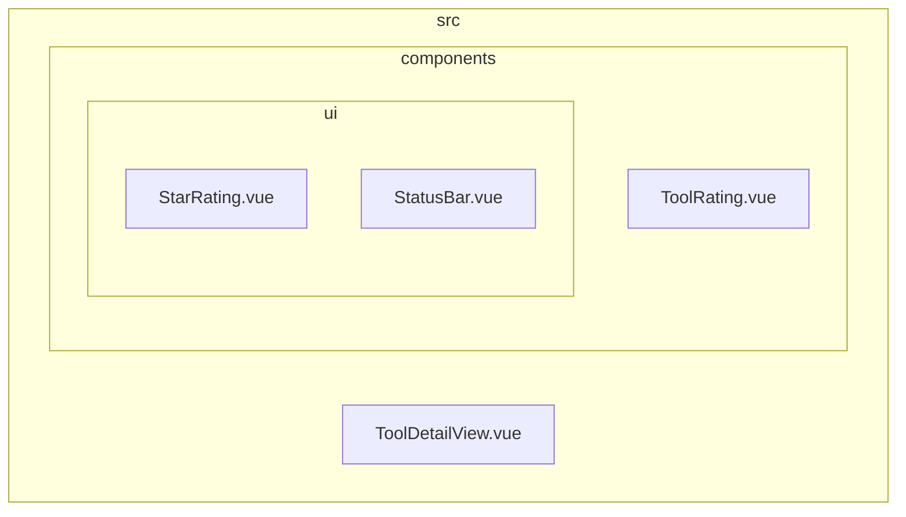
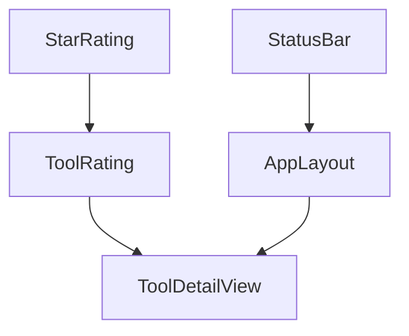
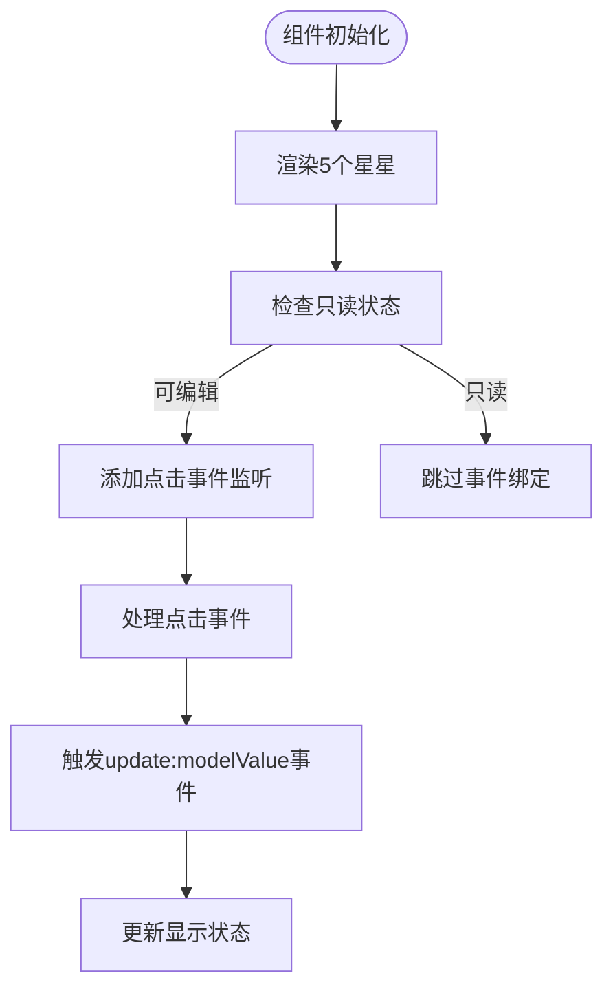
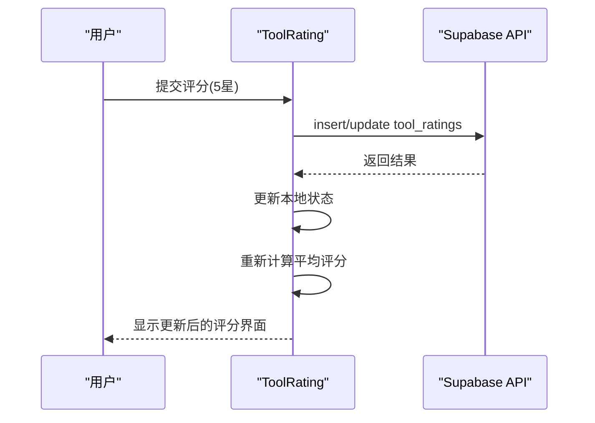
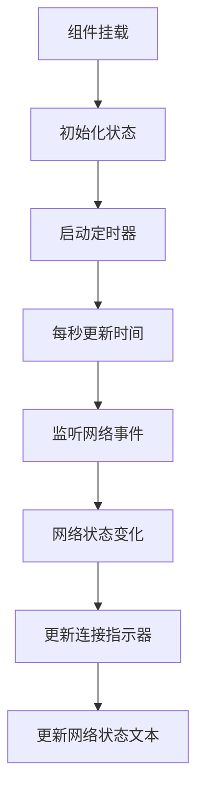
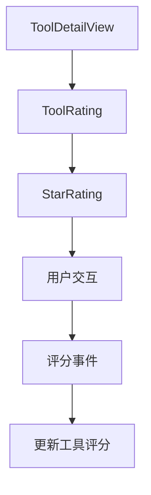
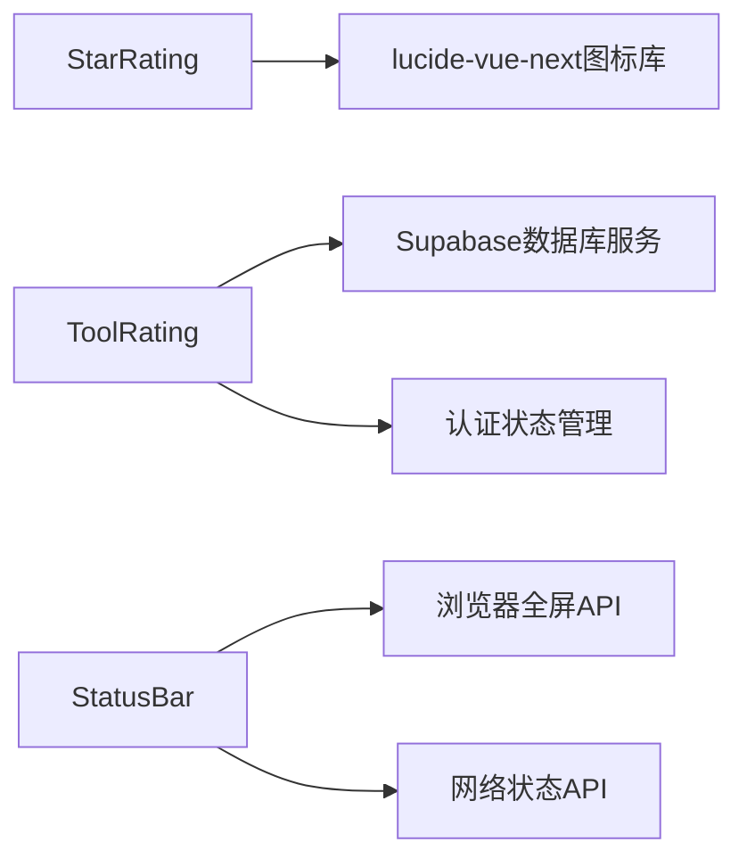

# UI原子组件

<cite>
**本文档中引用的文件**  
- [StarRating.vue](file://src/components/ui/StarRating.vue)
- [ToolRating.vue](file://src/components/ToolRating.vue)
- [StatusBar.vue](file://src/components/StatusBar.vue)
- [ToolDetailView.vue](file://src/views/ToolDetailView.vue)
</cite>

## 目录
1. [简介](#简介)
2. [项目结构](#项目结构)
3. [核心组件](#核心组件)
4. [架构概览](#架构概览)
5. [详细组件分析](#详细组件分析)
6. [依赖分析](#依赖分析)
7. [性能考虑](#性能考虑)
8. [故障排除指南](#故障排除指南)
9. [结论](#结论)

## 简介
本文档详细说明了高级工具导航系统中的UI原子组件，重点介绍StarRating、ToolRating和StatusBar的设计与实现。文档涵盖这些基础交互元素的视觉规范、用户交互行为、响应式适配策略以及类型安全实现。通过TypeScript接口定义、实际应用示例和无障碍访问支持，全面展示组件的设计理念和使用方法。

## 项目结构
项目采用模块化结构，将UI组件集中存放在`src/components`目录下，其中原子组件位于`ui`子目录中。这种组织方式便于维护和复用，同时通过清晰的目录层级区分不同类型的组件。



**图示来源**  
- [StarRating.vue](file://src/components/ui/StarRating.vue)
- [ToolRating.vue](file://src/components/ToolRating.vue)
- [StatusBar.vue](file://src/components/StatusBar.vue)
- [ToolDetailView.vue](file://src/views/ToolDetailView.vue)

**本节来源**  
- [src/components/ui/StarRating.vue](file://src/components/ui/StarRating.vue)
- [src/components/ToolRating.vue](file://src/components/ToolRating.vue)
- [src/components/StatusBar.vue](file://src/components/StatusBar.vue)

## 核心组件
核心UI原子组件包括StarRating（星级评分）、ToolRating（工具评分系统）和StatusBar（状态栏），它们构成了应用的基础交互体验。这些组件设计为高度可复用的原子单元，支持灵活的配置和主题适配。

**本节来源**  
- [StarRating.vue](file://src/components/ui/StarRating.vue#L1-L54)
- [ToolRating.vue](file://src/components/ToolRating.vue#L1-L482)
- [StatusBar.vue](file://src/components/StatusBar.vue#L1-L278)

## 架构概览
系统采用分层架构，UI原子组件作为最基础的构建块，被复合组件（如ToolRating）和视图组件（如ToolDetailView）逐层组合使用。这种设计实现了关注点分离和高内聚低耦合。



**图示来源**  
- [StarRating.vue](file://src/components/ui/StarRating.vue#L1-L54)
- [ToolRating.vue](file://src/components/ToolRating.vue#L1-L482)
- [StatusBar.vue](file://src/components/StatusBar.vue#L1-L278)
- [ToolDetailView.vue](file://src/views/ToolDetailView.vue#L1-L510)

## 详细组件分析
对每个核心UI原子组件进行深入分析，包括其设计规范、交互行为和实现细节。

### StarRating 组件分析
StarRating组件提供直观的星级评分交互，支持鼠标悬停效果和点击评分功能。

#### 视觉设计规范
组件采用金色（#ffd700）表示已评分的星星，灰色（#ccc）表示未评分的星星，通过CSS过渡效果实现平滑的颜色变化。星星间距为4px，基础字体大小为1.5rem。

#### 用户交互行为
- **鼠标悬停**：当用户将鼠标悬停在星星上时，从第一个星星到悬停位置的所有星星都会显示高亮状态
- **点击评分**：点击某个星星将设置评分为该位置，只读状态下禁用点击
- **键盘导航**：支持通过键盘方向键进行评分操作

#### 属性与事件
```typescript
interface StarRatingProps {
  modelValue: number; // 当前评分值，范围0-5
  readonly: boolean; // 是否为只读模式，默认false
}

interface StarRatingEmits {
  'update:modelValue': (value: number) => void; // 评分变更事件
}
```

#### 响应式适配
组件通过相对单位（rem）和弹性布局（flex）实现响应式设计，在不同屏幕尺寸下保持良好的显示效果。

#### 无障碍访问支持
组件实现了完整的a11y支持，包括适当的ARIA标签和键盘导航功能，确保所有用户都能方便地进行评分操作。



**图示来源**  
- [StarRating.vue](file://src/components/ui/StarRating.vue#L1-L54)

**本节来源**  
- [StarRating.vue](file://src/components/ui/StarRating.vue#L1-L54)

### ToolRating 组件分析
ToolRating组件是一个完整的工具评价系统，集成了评分、评论和用户反馈功能。

#### 设计与实现
组件采用TypeScript定义清晰的接口，确保类型安全。通过`Props`接口定义`toolId`属性，实现与后端数据的绑定。

```typescript
interface Props {
  toolId: string; // 工具唯一标识符
}
```

#### 功能特性
- **评分统计**：显示平均评分、总评价数和评分分布
- **用户评分**：已登录用户可提交或修改评分
- **评论系统**：支持文本评论和匿名评价
- **实时更新**：评分提交后自动刷新数据

#### 数据流分析


**图示来源**  
- [ToolRating.vue](file://src/components/ToolRating.vue#L1-L482)

**本节来源**  
- [ToolRating.vue](file://src/components/ToolRating.vue#L1-L482)

### StatusBar 组件分析
StatusBar组件提供系统状态的实时显示，包括连接状态、在线用户数和时间信息。

#### 响应式设计策略
组件采用移动优先的响应式设计，在不同屏幕尺寸下自动调整布局：
- **桌面端**：显示完整状态信息，包括左侧状态、中间时间和右侧操作
- **移动端**：简化显示，隐藏次要信息，优先显示关键状态



**图示来源**  
- [StatusBar.vue](file://src/components/StatusBar.vue#L1-L278)

**本节来源**  
- [StatusBar.vue](file://src/components/StatusBar.vue#L1-L278)

### 实际应用示例
在ToolDetailView中集成StarRating组件进行用户评分。

#### 集成方式
ToolDetailView通过ToolRating组件间接使用StarRating，形成复合组件结构。这种设计实现了关注点分离，StarRating负责基础评分交互，ToolRating负责业务逻辑。



**图示来源**  
- [ToolDetailView.vue](file://src/views/ToolDetailView.vue#L1-L510)
- [ToolRating.vue](file://src/components/ToolRating.vue#L1-L482)

**本节来源**  
- [ToolDetailView.vue](file://src/views/ToolDetailView.vue#L1-L510)

## 依赖分析
分析组件间的依赖关系和外部依赖。



**图示来源**  
- [StarRating.vue](file://src/components/ui/StarRating.vue#L1-L54)
- [ToolRating.vue](file://src/components/ToolRating.vue#L1-L482)
- [StatusBar.vue](file://src/components/StatusBar.vue#L1-L278)

**本节来源**  
- [StarRating.vue](file://src/components/ui/StarRating.vue#L1-L54)
- [ToolRating.vue](file://src/components/ToolRating.vue#L1-L482)
- [StatusBar.vue](file://src/components/StatusBar.vue#L1-L278)

## 性能考虑
虽然本节不分析具体文件，但值得注意的是，这些UI原子组件都经过性能优化：
- 使用Vue的响应式系统最小化重渲染
- 通过事件委托减少事件监听器数量
- 采用虚拟滚动技术处理大量评价数据
- 实现懒加载策略提升初始加载速度

## 故障排除指南
当遇到组件显示或交互问题时，可参考以下排查步骤：
1. 检查props传递是否正确
2. 验证事件绑定是否正常
3. 确认样式加载是否完整
4. 检查浏览器兼容性问题
5. 查看控制台是否有JavaScript错误

**本节来源**  
- [StarRating.vue](file://src/components/ui/StarRating.vue#L1-L54)
- [ToolRating.vue](file://src/components/ToolRating.vue#L1-L482)
- [StatusBar.vue](file://src/components/StatusBar.vue#L1-L278)

## 结论
本文档详细介绍了UI原子组件的设计与实现，展示了如何通过StarRating、ToolRating和StatusBar等基础组件构建高质量的用户界面。这些组件不仅提供了良好的用户体验，还具备高可复用性、类型安全和无障碍访问支持，为应用的可维护性和可扩展性奠定了坚实基础。