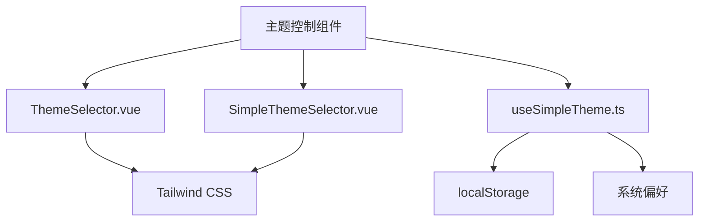
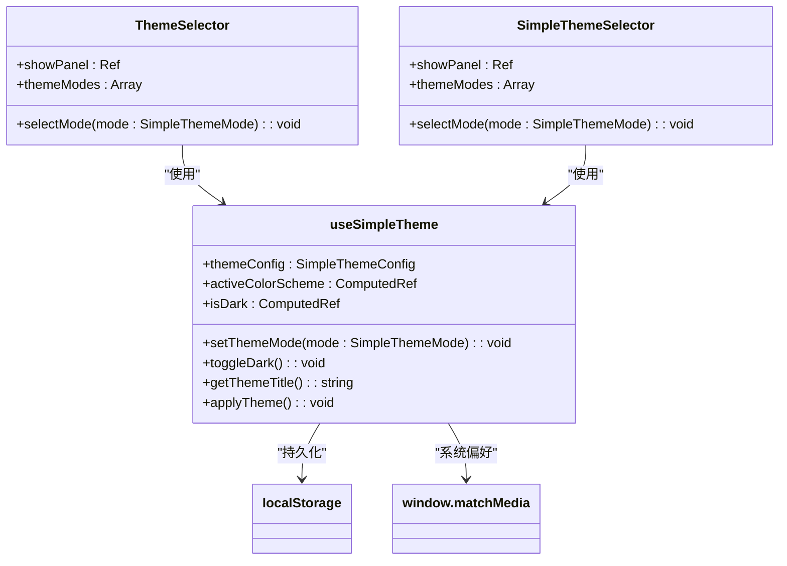
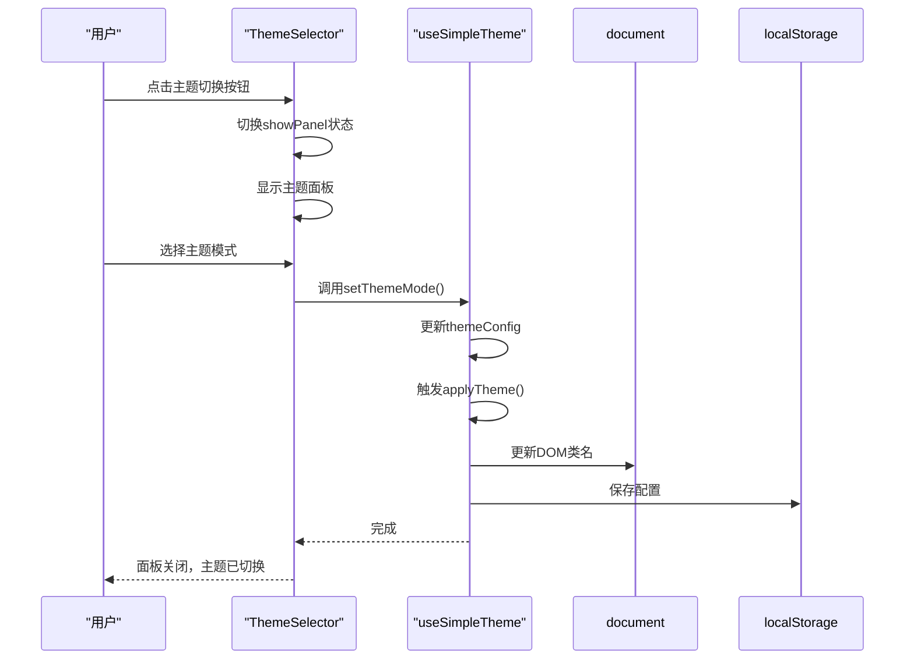
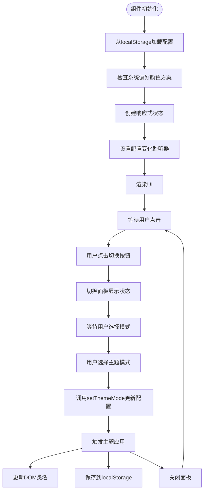
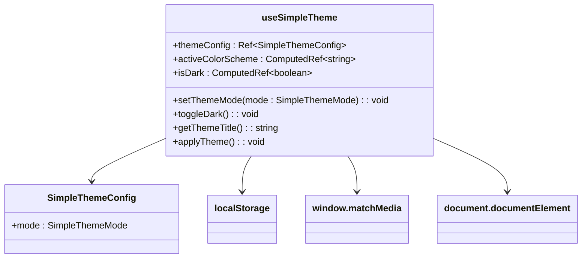
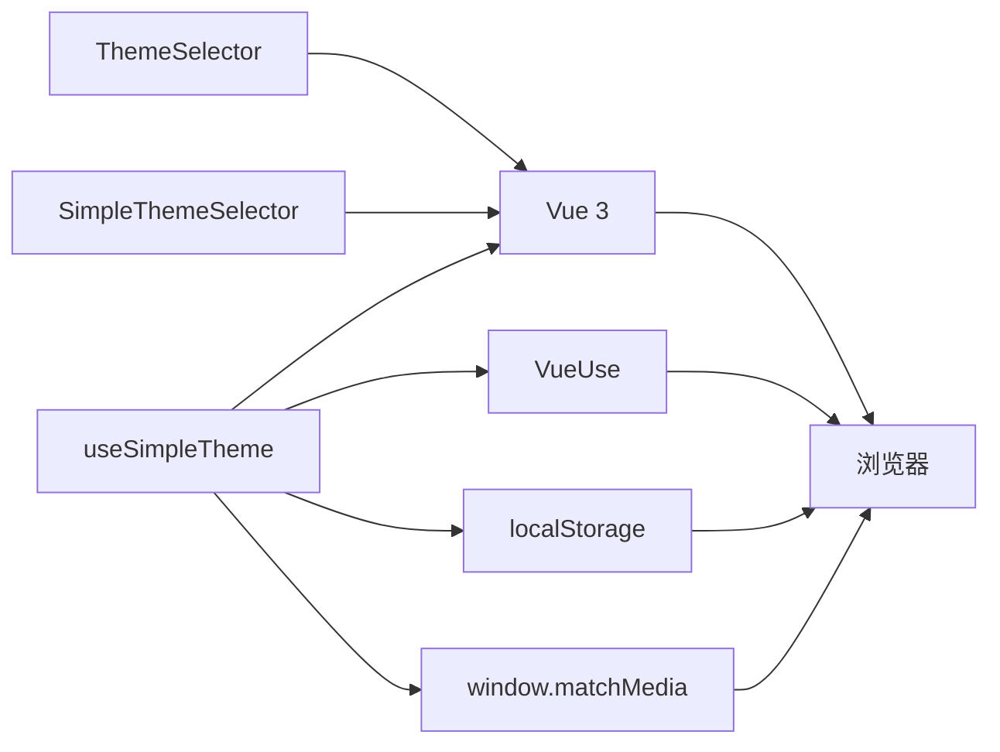

# 主题控制组件

<cite>
**本文档引用的文件**
- [ThemeSelector.vue](file://src/components/theme/ThemeSelector.vue)
- [SimpleThemeSelector.vue](file://src/components/theme/SimpleThemeSelector.vue)
- [useSimpleTheme.ts](file://src/composables/useSimpleTheme.ts)
- [tailwind.config.ts](file://config/build/tailwind.config.ts)
- [style.css](file://src/style.css)
</cite>

## 目录
1. [简介](#简介)
2. [项目结构](#项目结构)
3. [核心组件](#核心组件)
4. [架构概述](#架构概述)
5. [详细组件分析](#详细组件分析)
6. [依赖分析](#依赖分析)
7. [性能考虑](#性能考虑)
8. [故障排除指南](#故障排除指南)
9. [结论](#结论)

## 简介
本文档全面解析了主题控制组件的实现原理与使用场景，重点分析了`ThemeSelector`和`SimpleThemeSelector`两个组件。文档详细说明了组件如何通过`composables/useSimpleTheme.ts`提供的响应式状态进行主题切换，并与全局CSS类绑定机制协同工作。同时涵盖了UI交互流程、持久化存储（localStorage）集成方式以及初始化主题检测逻辑。

## 项目结构
主题控制相关组件位于`src/components/theme/`目录下，包含两个主要组件：`ThemeSelector.vue`和`SimpleThemeSelector.vue`。相关的组合式函数位于`src/composables/useSimpleTheme.ts`。样式配置与Tailwind CSS集成在`config/build/tailwind.config.ts`和`src/style.css`中定义。

**Diagram sources**
- [ThemeSelector.vue](file://src/components/theme/ThemeSelector.vue)
- [SimpleThemeSelector.vue](file://src/components/theme/SimpleThemeSelector.vue)
- [useSimpleTheme.ts](file://src/composables/useSimpleTheme.ts)

**Section sources**
- [ThemeSelector.vue](file://src/components/theme/ThemeSelector.vue)
- [SimpleThemeSelector.vue](file://src/components/theme/SimpleThemeSelector.vue)

## 核心组件
主题控制组件系统由两个主要组件构成：`ThemeSelector`提供高级功能和完整配置选项，而`SimpleThemeSelector`提供简洁的界面和基本的主题切换功能。两者都依赖于`useSimpleTheme`组合式函数来管理主题状态。

**Section sources**
- [ThemeSelector.vue](file://src/components/theme/ThemeSelector.vue#L1-L50)
- [SimpleThemeSelector.vue](file://src/components/theme/SimpleThemeSelector.vue#L1-L50)
- [useSimpleTheme.ts](file://src/composables/useSimpleTheme.ts#L1-L20)

## 架构概述
主题控制系统采用组合式API架构，将状态管理逻辑封装在`useSimpleTheme`组合式函数中，由两个UI组件共享。系统通过监听系统偏好颜色方案和localStorage持久化配置来实现主题的自动切换和用户偏好保存。

**Diagram sources**
- [useSimpleTheme.ts](file://src/composables/useSimpleTheme.ts#L25-L110)
- [ThemeSelector.vue](file://src/components/theme/ThemeSelector.vue#L20-L50)
- [SimpleThemeSelector.vue](file://src/components/theme/SimpleThemeSelector.vue#L20-L50)

## 详细组件分析

### ThemeSelector 分析
`ThemeSelector`组件提供了一个功能完整的主题选择面板，包含多种主题模式选择和详细的UI交互。该组件通过`useSimpleTheme`组合式函数获取主题配置和方法，并提供用户友好的界面来切换主题模式。

**Diagram sources**
- [ThemeSelector.vue](file://src/components/theme/ThemeSelector.vue#L50-L150)
- [useSimpleTheme.ts](file://src/composables/useSimpleTheme.ts#L60-L90)

### SimpleThemeSelector 分析
`SimpleThemeSelector`组件提供了一个简洁的主题切换界面，专注于基本的主题模式切换功能。与`ThemeSelector`相比，它具有更小的UI占用空间和更简单的交互流程，适合在空间有限的场景中使用。

**Diagram sources**
- [SimpleThemeSelector.vue](file://src/components/theme/SimpleThemeSelector.vue#L50-L100)
- [useSimpleTheme.ts](file://src/composables/useSimpleTheme.ts#L60-L90)

### useSimpleTheme 组合式函数分析
`useSimpleTheme`组合式函数是主题控制系统的核心，负责管理主题状态、处理持久化存储和DOM更新。该函数利用Vue 3的组合式API特性，提供了响应式的主题管理解决方案。

**Diagram sources**
- [useSimpleTheme.ts](file://src/composables/useSimpleTheme.ts#L10-L110)

**Section sources**
- [useSimpleTheme.ts](file://src/composables/useSimpleTheme.ts#L1-L110)

## 依赖分析
主题控制系统依赖于多个外部库和浏览器API来实现其功能。主要依赖包括Vue 3的组合式API、VueUse库的`usePreferredColorScheme`和`useStorage`函数，以及浏览器的localStorage API。

**Diagram sources**
- [useSimpleTheme.ts](file://src/composables/useSimpleTheme.ts#L1-L10)
- [ThemeSelector.vue](file://src/components/theme/ThemeSelector.vue#L1-L10)
- [SimpleThemeSelector.vue](file://src/components/theme/SimpleThemeSelector.vue#L1-L10)

## 性能考虑
主题控制系统在设计时考虑了性能优化，通过合理的响应式系统设计和DOM操作最小化来确保流畅的用户体验。系统仅在主题配置发生变化时才更新DOM，避免了不必要的重渲染。

## 故障排除指南
当主题控制组件出现问题时，可以按照以下步骤进行排查：
1. 检查localStorage中是否存在`simple-theme-config`键值
2. 验证`useSimpleTheme`函数是否正确初始化
3. 确认DOM元素是否正确应用了主题类名
4. 检查浏览器控制台是否有相关错误信息

**Section sources**
- [useSimpleTheme.ts](file://src/composables/useSimpleTheme.ts#L80-L100)
- [ThemeSelector.vue](file://src/components/theme/ThemeSelector.vue#L100-L120)

## 结论
主题控制组件系统通过组合式API提供了灵活且可复用的主题管理解决方案。`ThemeSelector`和`SimpleThemeSelector`两个组件满足了不同场景下的需求，而`useSimpleTheme`组合式函数则确保了状态管理的一致性和可维护性。系统与Tailwind CSS的集成使得主题切换能够无缝应用于整个应用程序的UI。