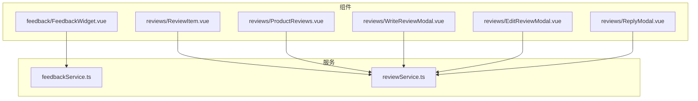
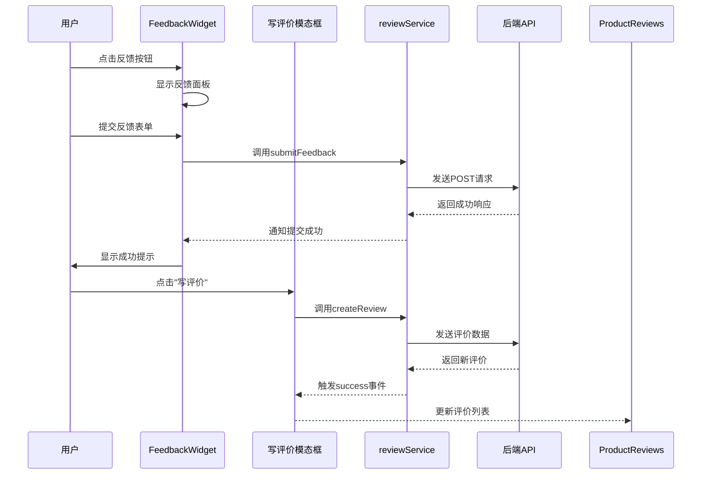
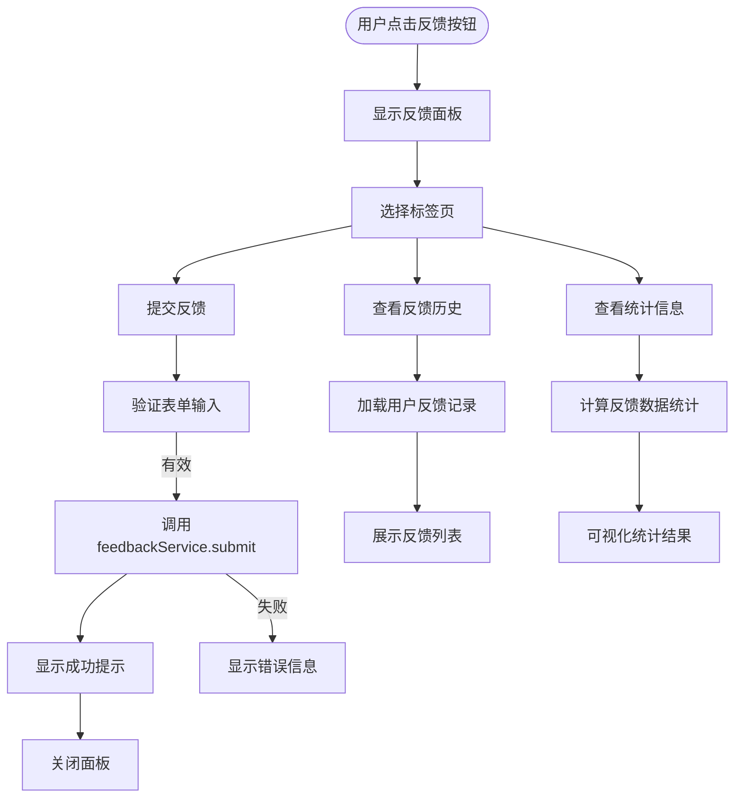
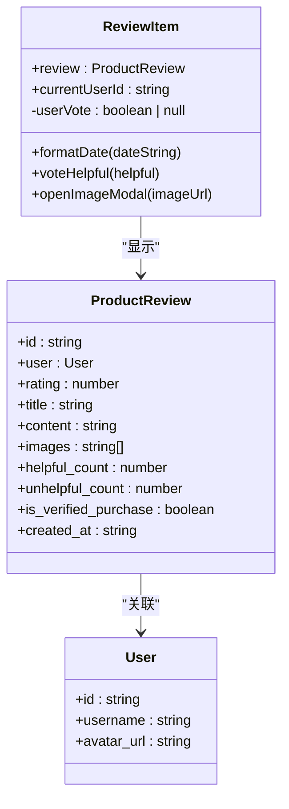
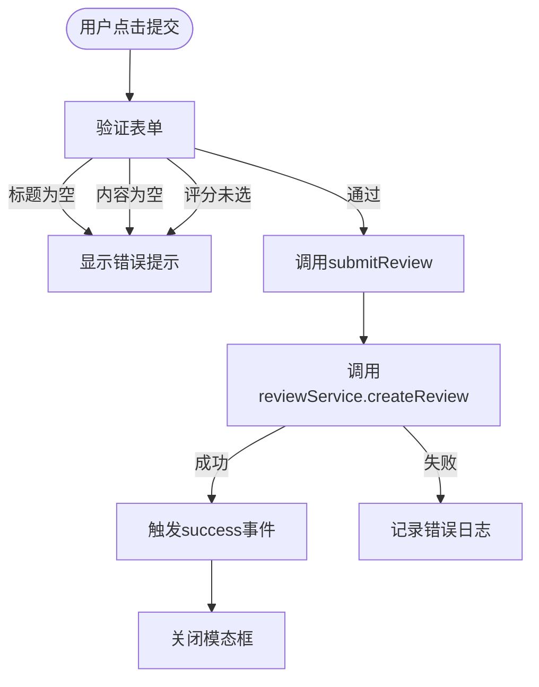
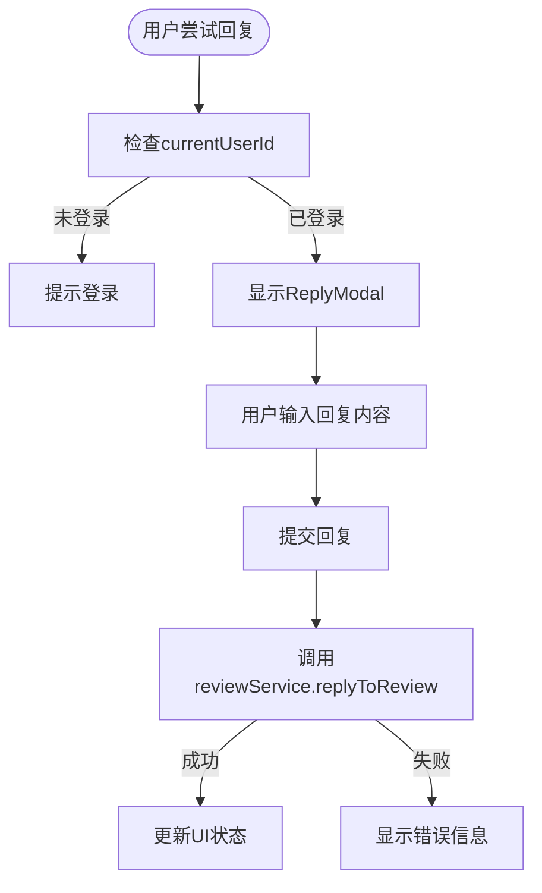
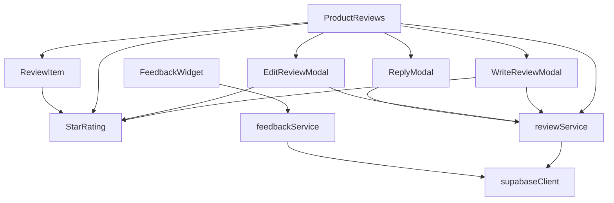

# 反馈与评价组件

<cite>
**本文档引用的文件**  
- [FeedbackWidget.vue](file://src/components/feedback/FeedbackWidget.vue)
- [ReviewItem.vue](file://src/components/reviews/ReviewItem.vue)
- [ProductReviews.vue](file://src/components/reviews/ProductReviews.vue)
- [WriteReviewModal.vue](file://src/components/reviews/WriteReviewModal.vue)
- [EditReviewModal.vue](file://src/components/reviews/EditReviewModal.vue)
- [ReplyModal.vue](file://src/components/reviews/ReplyModal.vue)
- [reviewService.ts](file://src/services/reviewService.ts)
- [feedbackService.ts](file://src/services/feedbackService.ts)
</cite>

## 目录
1. [简介](#简介)
2. [项目结构](#项目结构)
3. [核心组件](#核心组件)
4. [架构概览](#架构概览)
5. [详细组件分析](#详细组件分析)
6. [依赖分析](#依赖分析)
7. [性能考虑](#性能考虑)
8. [故障排除指南](#故障排除指南)
9. [结论](#结论)

## 简介
本文档全面介绍反馈与评价系统的设计与实现，涵盖用户反馈入口 `FeedbackWidget` 和完整的产品评价功能。详细说明反馈组件的交互流程、数据提交机制、UI 设计原则以及在高并发场景下的性能优化策略。

## 项目结构
反馈与评价功能分布在 `src/components/feedback` 和 `src/components/reviews` 目录中，服务逻辑由 `src/services` 提供支持。



**Diagram sources**  
- [FeedbackWidget.vue](file://src/components/feedback/FeedbackWidget.vue)
- [ReviewItem.vue](file://src/components/reviews/ReviewItem.vue)
- [ProductReviews.vue](file://src/components/reviews/ProductReviews.vue)
- [WriteReviewModal.vue](file://src/components/reviews/WriteReviewModal.vue)
- [EditReviewModal.vue](file://src/components/reviews/EditReviewModal.vue)
- [ReplyModal.vue](file://src/components/reviews/ReplyModal.vue)
- [reviewService.ts](file://src/services/reviewService.ts)
- [feedbackService.ts](file://src/services/feedbackService.ts)

**Section sources**  
- [FeedbackWidget.vue](file://src/components/feedback/FeedbackWidget.vue)
- [ReviewItem.vue](file://src/components/reviews/ReviewItem.vue)
- [ProductReviews.vue](file://src/components/reviews/ProductReviews.vue)

## 核心组件
本系统包含两个主要功能模块：用户反馈（Feedback）和产品评价（Reviews）。`FeedbackWidget` 提供悬浮式反馈入口，而 `ProductReviews` 组件实现完整的评价展示与交互功能。

**Section sources**  
- [FeedbackWidget.vue](file://src/components/feedback/FeedbackWidget.vue#L1-L890)
- [ProductReviews.vue](file://src/components/reviews/ProductReviews.vue#L1-L611)

## 架构概览
系统采用分层架构，UI 组件与服务层分离，通过事件驱动和状态管理实现数据流动。



**Diagram sources**  
- [FeedbackWidget.vue](file://src/components/feedback/FeedbackWidget.vue#L1-L890)
- [WriteReviewModal.vue](file://src/components/reviews/WriteReviewModal.vue#L1-L181)
- [reviewService.ts](file://src/services/reviewService.ts)
- [ProductReviews.vue](file://src/components/reviews/ProductReviews.vue#L1-L611)

## 详细组件分析

### FeedbackWidget 分析
`FeedbackWidget` 组件实现了一个悬浮式反馈入口，包含提交、历史和统计三个标签页。

#### 交互流程


**Diagram sources**  
- [FeedbackWidget.vue](file://src/components/feedback/FeedbackWidget.vue#L1-L890)

**Section sources**  
- [FeedbackWidget.vue](file://src/components/feedback/FeedbackWidget.vue#L1-L890)
- [feedbackService.ts](file://src/services/feedbackService.ts)

### ReviewItem 分析
`ReviewItem` 组件负责单条评价的展示，包括用户信息、评分、内容和交互功能。

#### 数据展示结构


**Diagram sources**  
- [ReviewItem.vue](file://src/components/reviews/ReviewItem.vue#L1-L152)
- [types/index.ts](file://src/types/index.ts)

**Section sources**  
- [ReviewItem.vue](file://src/components/reviews/ReviewItem.vue#L1-L152)

### ProductReviews 分析
`ProductReviews` 组件实现评价系统的主界面，包含分页加载、排序和过滤功能。

#### 加载与分页逻辑
```mermaid
flowchart TD
A([组件挂载]) --> B["初始化状态"]
B --> C["调用loadReviews()"]
C --> D["设置loading=true"]
D --> E["调用reviewService.getProductReviews"]
E --> F["接收分页数据"]
F --> G["更新reviews数组"]
G --> H["更新stats统计"]
H --> I["设置hasMore标志"]
I --> J["设置loading=false"]
K([用户点击"加载更多"]) --> L["currentPage++"]
L --> M["调用loadReviews(false)"]
M --> N["设置loadingMore=true"]
N --> O["获取下一页数据"]
O --> P["追加到reviews数组"]
P --> Q["更新hasMore"]
Q --> R["设置loadingMore=false"]
```

**Diagram sources**  
- [ProductReviews.vue](file://src/components/reviews/ProductReviews.vue#L1-L611)

**Section sources**  
- [ProductReviews.vue](file://src/components/reviews/ProductReviews.vue#L1-L611)
- [reviewService.ts](file://src/services/reviewService.ts)

### 写评价与编辑模态框分析
`WriteReviewModal` 和 `EditReviewModal` 组件提供评价的创建和编辑功能。

#### 表单验证流程


**Diagram sources**  
- [WriteReviewModal.vue](file://src/components/reviews/WriteReviewModal.vue#L1-L181)
- [EditReviewModal.vue](file://src/components/reviews/EditReviewModal.vue)

**Section sources**  
- [WriteReviewModal.vue](file://src/components/reviews/WriteReviewModal.vue#L1-L181)
- [EditReviewModal.vue](file://src/components/reviews/EditReviewModal.vue)

### ReplyModal 分析
`ReplyModal` 组件实现嵌套评论功能，支持对评价进行回复。

#### 权限控制逻辑


**Diagram sources**  
- [ReplyModal.vue](file://src/components/reviews/ReplyModal.vue)
- [reviewService.ts](file://src/services/reviewService.ts)

**Section sources**  
- [ReplyModal.vue](file://src/components/reviews/ReplyModal.vue)
- [reviewService.ts](file://src/services/reviewService.ts)

## 依赖分析
评价系统依赖多个服务和组件，形成清晰的依赖关系。



**Diagram sources**  
- [ProductReviews.vue](file://src/components/reviews/ProductReviews.vue#L1-L611)
- [WriteReviewModal.vue](file://src/components/reviews/WriteReviewModal.vue#L1-L181)
- [EditReviewModal.vue](file://src/components/reviews/EditReviewModal.vue)
- [ReplyModal.vue](file://src/components/reviews/ReplyModal.vue)
- [reviewService.ts](file://src/services/reviewService.ts)
- [feedbackService.ts](file://src/services/feedbackService.ts)

**Section sources**  
- [reviewService.ts](file://src/services/reviewService.ts)
- [feedbackService.ts](file://src/services/feedbackService.ts)

## 性能考虑
在高并发评论场景下，系统通过多种策略优化性能表现。

### 数据加载优化
- **分页加载**：每次只加载10条评价，减少初始加载时间
- **无限滚动**：用户滚动到底部时按需加载更多数据
- **缓存机制**：服务层可实现数据缓存，减少数据库查询
- **防抖处理**：对频繁触发的操作（如搜索）添加防抖

### 前端性能优化
- **虚拟滚动**：对于大量评价列表，可采用虚拟滚动技术
- **图片懒加载**：评价中的图片使用懒加载，提升初始渲染速度
- **组件懒加载**：模态框等非必要组件按需加载
- **状态管理**：使用Pinia进行状态管理，避免不必要的重新渲染

### 后端优化建议
- **数据库索引**：在常用查询字段（如product_id、created_at）上创建索引
- **读写分离**：将读操作和写操作分离到不同的数据库实例
- **CDN加速**：静态资源和图片通过CDN分发
- **Rate Limiting**：对写操作实施速率限制，防止滥用

**Section sources**  
- [ProductReviews.vue](file://src/components/reviews/ProductReviews.vue#L1-L611)
- [reviewService.ts](file://src/services/reviewService.ts)

## 故障排除指南
### 常见问题及解决方案

| 问题现象 | 可能原因 | 解决方案 |
|---------|---------|---------|
| 反馈提交失败 | 网络问题或API错误 | 检查网络连接，查看浏览器控制台错误 |
| 评价无法加载 | 数据库查询失败 | 检查reviewService.getProductReviews调用 |
| 图片不显示 | 图片URL无效或权限问题 | 验证图片URL，检查存储权限设置 |
| 评分不更新 | 状态同步问题 | 检查voteHelpful方法中的状态更新逻辑 |
| 模态框无法关闭 | 事件绑定问题 | 确认close事件正确触发和处理 |

### 调试技巧
- 使用浏览器开发者工具检查网络请求
- 在关键方法中添加console.log进行跟踪
- 检查Pinia store中的状态变化
- 验证组件间的事件传递是否正常

**Section sources**  
- [ProductReviews.vue](file://src/components/reviews/ProductReviews.vue#L1-L611)
- [ReviewItem.vue](file://src/components/reviews/ReviewItem.vue#L1-L152)
- [reviewService.ts](file://src/services/reviewService.ts)

## 结论
反馈与评价系统通过模块化设计实现了完整的用户交互功能。`FeedbackWidget` 提供便捷的反馈入口，而产品评价系统则实现了从展示、创建到管理的完整闭环。系统采用清晰的分层架构，组件职责明确，便于维护和扩展。在高并发场景下，通过分页、缓存等策略确保了良好的性能表现。未来可进一步优化用户体验，如增加富文本编辑、图片上传预览等功能。