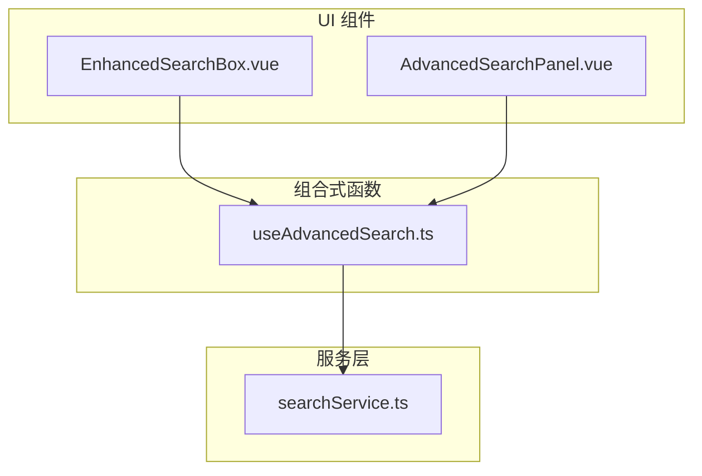
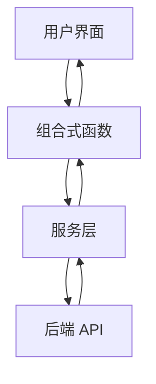
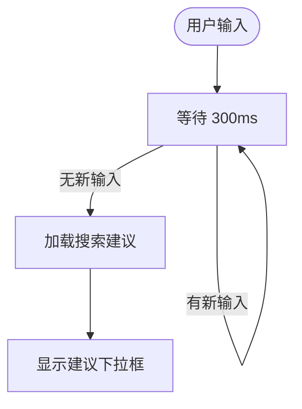
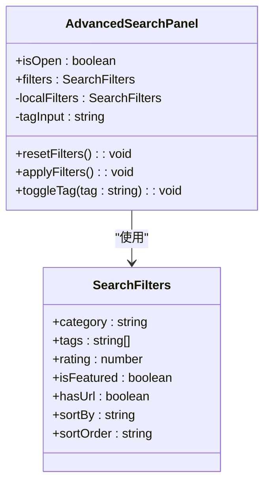
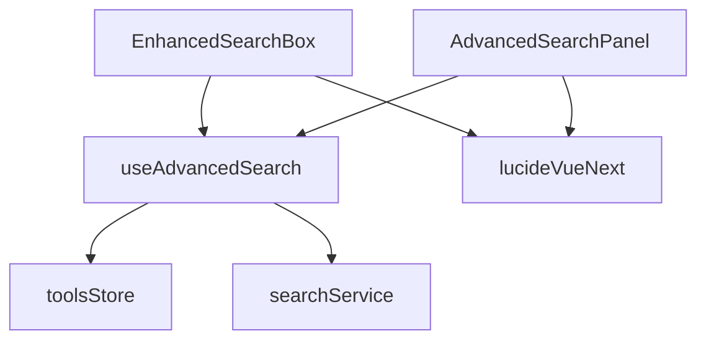

# 搜索组件

<cite>
**本文档中引用的文件**  
- [EnhancedSearchBox.vue](file://src/components/search/EnhancedSearchBox.vue)
- [AdvancedSearchPanel.vue](file://src/components/search/AdvancedSearchPanel.vue)
- [useAdvancedSearch.ts](file://src/composables/useAdvancedSearch.ts)
- [searchService.ts](file://src/services/searchService.ts)
- [ToolsView.vue](file://src/views/ToolsView.vue)
- [ProductsView.vue](file://src/views/ProductsView.vue)
</cite>

## 目录
1. [简介](#简介)
2. [项目结构](#项目结构)
3. [核心组件](#核心组件)
4. [架构概述](#架构概述)
5. [详细组件分析](#详细组件分析)
6. [依赖分析](#依赖分析)
7. [性能考虑](#性能考虑)
8. [故障排除指南](#故障排除指南)
9. [结论](#结论)

## 简介
本文档深入分析了高级搜索功能中的 `EnhancedSearchBox` 和 `AdvancedSearchPanel` 组件。重点阐述了这两个组件如何协同工作，实现复杂的搜索逻辑，包括输入处理、防抖机制、实时建议展示和多条件查询构建。文档还详细说明了 `useAdvancedSearch` 组合式函数与 `searchService.ts` 的数据交互方式，支持模糊搜索、分类过滤和排序功能。此外，文档涵盖了组件的 props 配置、事件回调、外部控制接口，以及在 `ToolsView` 和 `ProductsView` 中的集成示例。最后，文档提供了性能优化技巧、错误处理策略和可访问性改进措施。

## 项目结构
搜索功能相关的代码主要分布在 `src/components/search`、`src/composables` 和 `src/services` 目录下。`EnhancedSearchBox.vue` 和 `AdvancedSearchPanel.vue` 是核心的 UI 组件，`useAdvancedSearch.ts` 提供了搜索逻辑的组合式 API，而 `searchService.ts` 负责与后端服务进行数据交互。



**图示来源**
- [EnhancedSearchBox.vue](file://src/components/search/EnhancedSearchBox.vue)
- [AdvancedSearchPanel.vue](file://src/components/search/AdvancedSearchPanel.vue)
- [useAdvancedSearch.ts](file://src/composables/useAdvancedSearch.ts)
- [searchService.ts](file://src/services/searchService.ts)

**本节来源**
- [src/components/search](file://src/components/search)
- [src/composables](file://src/composables)
- [src/services](file://src/services)

## 核心组件
`EnhancedSearchBox` 是一个功能丰富的搜索输入框，集成了搜索建议、历史记录、热门搜索和高级搜索入口。`AdvancedSearchPanel` 则提供了一个可展开的面板，用于设置复杂的筛选条件，如分类、标签、评分和排序方式。这两个组件通过共享状态和事件进行紧密协作。

**本节来源**
- [EnhancedSearchBox.vue](file://src/components/search/EnhancedSearchBox.vue#L1-L100)
- [AdvancedSearchPanel.vue](file://src/components/search/AdvancedSearchPanel.vue#L1-L100)

## 架构概述
整个搜索功能采用分层架构。UI 组件负责用户交互和界面展示，组合式函数 `useAdvancedSearch` 封装了搜索状态管理和核心算法，服务层 `searchService` 处理与后端的数据通信。这种架构实现了关注点分离，提高了代码的可维护性和可测试性。



**图示来源**
- [EnhancedSearchBox.vue](file://src/components/search/EnhancedSearchBox.vue#L1-L50)
- [useAdvancedSearch.ts](file://src/composables/useAdvancedSearch.ts#L1-L50)
- [searchService.ts](file://src/services/searchService.ts#L1-L50)

## 详细组件分析

### EnhancedSearchBox 分析
`EnhancedSearchBox` 组件是用户进行搜索的主要入口。它处理用户的输入、键盘事件，并通过防抖机制减少不必要的搜索请求。

#### 输入处理与防抖机制
该组件使用 `@vueuse/core` 提供的 `useDebounceFn` 函数对加载搜索建议的操作进行防抖，延迟时间为 300 毫秒。这有效避免了用户在快速输入时触发过多的网络请求。



**图示来源**
- [EnhancedSearchBox.vue](file://src/components/search/EnhancedSearchBox.vue#L200-L220)

#### 实时建议展示
组件根据用户输入的关键词，动态展示搜索建议、搜索历史和热门搜索。建议内容通过 `searchService.getSmartSuggestions()` 获取，历史记录和热门搜索则分别来自本地存储和 `searchService.getPopularSearches()`。

**本节来源**
- [EnhancedSearchBox.vue](file://src/components/search/EnhancedSearchBox.vue#L150-L300)

### AdvancedSearchPanel 分析
`AdvancedSearchPanel` 组件提供了一个独立的界面，用于构建复杂的查询条件。

#### 复杂查询条件构建
该组件允许用户设置分类、标签、最低评分、特殊筛选（如仅显示特色工具）和排序方式。所有筛选条件都通过 `localFilters` 响应式对象进行管理，并通过 `update:filters` 事件与父组件同步。



**图示来源**
- [AdvancedSearchPanel.vue](file://src/components/search/AdvancedSearchPanel.vue#L50-L100)
- [useAdvancedSearch.ts](file://src/composables/useAdvancedSearch.ts#L1-L20)

**本节来源**
- [AdvancedSearchPanel.vue](file://src/components/search/AdvancedSearchPanel.vue#L1-L594)

### useAdvancedSearch 组合式函数分析
`useAdvancedSearch` 是搜索功能的核心逻辑层，它封装了搜索、过滤和排序的算法。

#### 数据交互与搜索算法
该函数通过 `toolsStore` 获取工具数据，并实现了一个智能搜索算法。该算法为不同的搜索字段（如名称、描述、标签）分配不同的权重，并结合模糊匹配来计算搜索结果的相关性得分。

```mermaid
sequenceDiagram
participant User as "用户"
participant Box as "EnhancedSearchBox"
participant Hook as "useAdvancedSearch"
participant Store as "toolsStore"
User->>Box : 输入搜索关键词
Box->>Hook : 更新 searchQuery
Hook->>Hook : performSearch()
Hook->>Store : 获取 tools 数据
Hook->>Hook : 计算每个工具的匹配得分
Hook->>Hook : applyFilters() 和 sortResults()
Hook-->>Box : 返回 searchResults
Box-->>User : 显示搜索结果
```

**图示来源**
- [useAdvancedSearch.ts](file://src/composables/useAdvancedSearch.ts#L50-L150)
- [EnhancedSearchBox.vue](file://src/components/search/EnhancedSearchBox.vue#L300-L400)

**本节来源**
- [useAdvancedSearch.ts](file://src/composables/useAdvancedSearch.ts#L1-L310)

## 依赖分析
搜索组件依赖于多个外部模块。`EnhancedSearchBox` 和 `AdvancedSearchPanel` 依赖于 `useAdvancedSearch` 来管理状态和逻辑。`useAdvancedSearch` 依赖于 `toolsStore` 来获取数据，并可能间接依赖于 `searchService` 进行网络请求。UI 组件还依赖于 `lucide-vue-next` 图标库。



**图示来源**
- [EnhancedSearchBox.vue](file://src/components/search/EnhancedSearchBox.vue#L10-L30)
- [AdvancedSearchPanel.vue](file://src/components/search/AdvancedSearchPanel.vue#L10-L30)
- [useAdvancedSearch.ts](file://src/composables/useAdvancedSearch.ts#L1-L10)

**本节来源**
- [package.json](file://package.json)
- [EnhancedSearchBox.vue](file://src/components/search/EnhancedSearchBox.vue)
- [AdvancedSearchPanel.vue](file://src/components/search/AdvancedSearchPanel.vue)
- [useAdvancedSearch.ts](file://src/composables/useAdvancedSearch.ts)

## 性能考虑
为了优化性能，系统采用了多种策略。首先，使用防抖机制减少对搜索建议的请求频率。其次，`useAdvancedSearch` 中的搜索算法在客户端进行，避免了频繁的网络往返。此外，搜索历史和热门搜索结果可以被缓存，以提高响应速度。

**本节来源**
- [EnhancedSearchBox.vue](file://src/components/search/EnhancedSearchBox.vue#L200-L220)
- [useAdvancedSearch.ts](file://src/composables/useAdvancedSearch.ts)

## 故障排除指南
如果搜索功能出现问题，可以按照以下步骤进行排查：
1.  **检查网络连接**：确认 `searchService` 是否能正常与后端通信。
2.  **检查数据加载**：确保 `toolsStore` 已成功加载工具数据。
3.  **检查事件监听**：验证 `EnhancedSearchBox` 的 `@search` 事件是否被正确监听。
4.  **检查状态同步**：确认 `AdvancedSearchPanel` 的 `update:filters` 事件是否正确更新了父组件的状态。

**本节来源**
- [searchService.ts](file://src/services/searchService.ts)
- [toolsStore.ts](file://src/stores/tools.ts)
- [EnhancedSearchBox.vue](file://src/components/search/EnhancedSearchBox.vue)
- [AdvancedSearchPanel.vue](file://src/components/search/AdvancedSearchPanel.vue)

## 结论
`EnhancedSearchBox` 和 `AdvancedSearchPanel` 组件通过清晰的职责划分和有效的状态管理，共同构建了一个强大且用户友好的搜索系统。`useAdvancedSearch` 组合式函数作为中间层，成功地将复杂的搜索逻辑与 UI 解耦，使得代码更易于维护和扩展。整体架构设计合理，兼顾了功能性和性能。