# 管理后台组件

<cite>
**本文档引用的文件**
- [ToolForm.vue](file://src/components/admin/ToolForm.vue)
- [ProductDetailModal.vue](file://src/components/admin/ProductDetailModal.vue)
- [UserDetailModal.vue](file://src/components/admin/UserDetailModal.vue)
- [ProductManagementView.vue](file://src/views/admin/ProductManagementView.vue)
- [toolsService.ts](file://src/services/toolsService.ts)
- [productsService.ts](file://src/services/productsService.ts)
- [userService.ts](file://src/services/userService.ts)
- [supabaseClient.ts](file://src/lib/supabaseClient.ts)
- [database.ts](file://src/types/database.ts)
- [index.ts](file://src/types/index.ts)
</cite>

## 目录
1. [简介](#简介)
2. [项目结构](#项目结构)
3. [核心组件](#核心组件)
4. [架构概述](#架构概述)
5. [详细组件分析](#详细组件分析)
6. [依赖分析](#依赖分析)
7. [性能考量](#性能考量)
8. [故障排除指南](#故障排除指南)
9. [结论](#结论)

## 简介
本文档详细说明了管理后台中的核心UI组件，包括ToolForm、ProductDetailModal和UserDetailModal。这些组件专为管理员设计，用于高效管理平台内容和用户。文档将深入探讨这些模态框组件的设计目的、复杂的表单结构、数据验证机制以及与后端服务的安全交互。

## 项目结构
管理后台组件位于`src/components/admin`目录下，与`src/views/admin`中的管理视图协同工作。这种结构实现了关注点分离，将UI组件与业务逻辑和数据管理解耦。

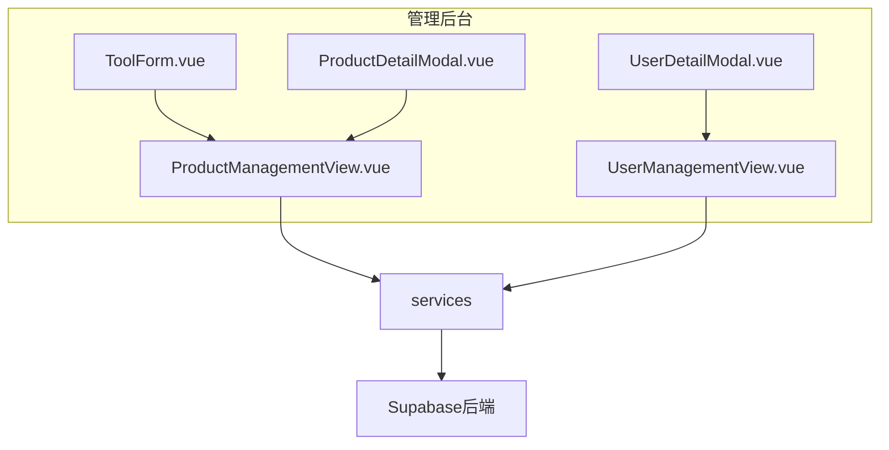

**图示来源**
- [ToolForm.vue](file://src/components/admin/ToolForm.vue)
- [ProductDetailModal.vue](file://src/components/admin/ProductDetailModal.vue)
- [UserDetailModal.vue](file://src/components/admin/UserDetailModal.vue)
- [ProductManagementView.vue](file://src/views/admin/ProductManagementView.vue)

**本节来源**
- [src/components/admin](file://src/components/admin)
- [src/views/admin](file://src/views/admin)

## 核心组件
本文档聚焦于三个核心管理组件：ToolForm用于创建和编辑工具，ProductDetailModal用于查看和管理产品详情，UserDetailModal用于查看和管理用户信息。这些组件通过清晰的UI设计和强大的功能，为管理员提供了高效的内容管理能力。

**本节来源**
- [ToolForm.vue](file://src/components/admin/ToolForm.vue#L1-L512)
- [ProductDetailModal.vue](file://src/components/admin/ProductDetailModal.vue#L1-L397)
- [UserDetailModal.vue](file://src/components/admin/UserDetailModal.vue#L1-L742)

## 架构概述
管理后台采用分层架构，前端组件通过服务层与Supabase后端进行安全交互。这种架构确保了数据的一致性和安全性，同时提供了良好的可维护性。

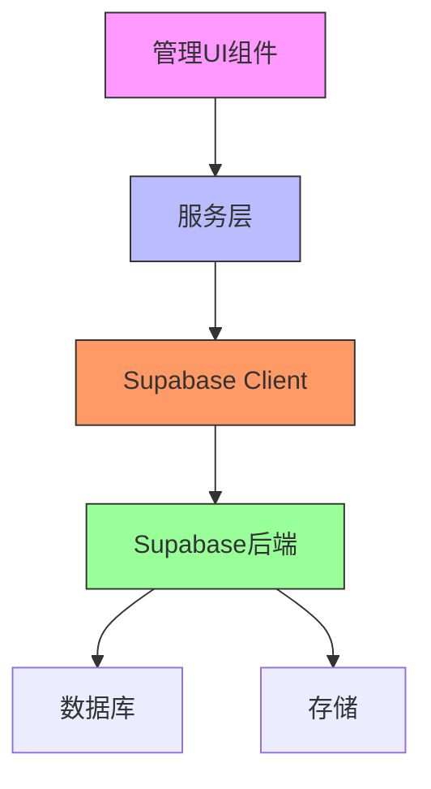

**图示来源**
- [supabaseClient.ts](file://src/lib/supabaseClient.ts#L1-L265)
- [toolsService.ts](file://src/services/toolsService.ts#L1-L470)
- [productsService.ts](file://src/services/productsService.ts#L1-L340)

## 详细组件分析
本节将深入分析每个管理组件的实现细节，包括其设计目的、功能特性和交互逻辑。

### ToolForm 组件分析
ToolForm组件是一个用于创建和编辑工具的表单组件，具有复杂的验证机制和用户友好的界面设计。

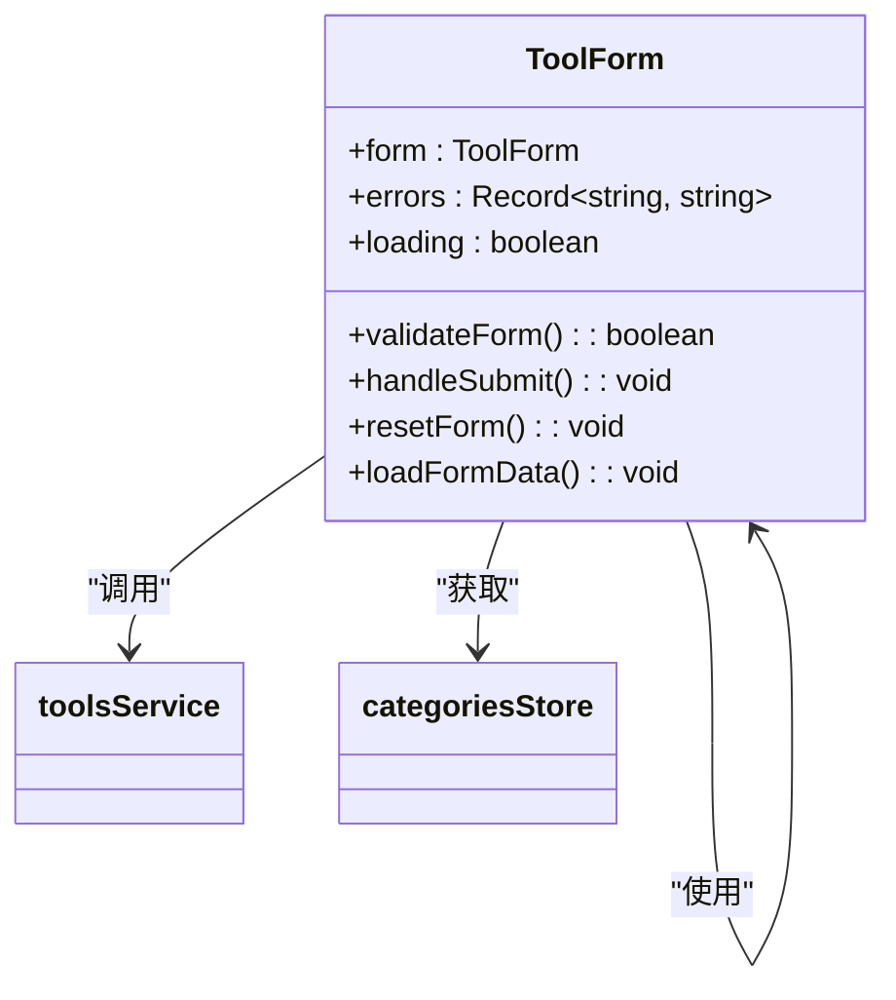

**图示来源**
- [ToolForm.vue](file://src/components/admin/ToolForm.vue#L1-L512)
- [toolsService.ts](file://src/services/toolsService.ts#L1-L470)
- [index.ts](file://src/types/index.ts#L1-L389)

#### 表单结构与验证
ToolForm组件采用了分节式设计，将表单分为基本信息、可选信息和SEO信息三个部分，提高了表单的可读性和易用性。

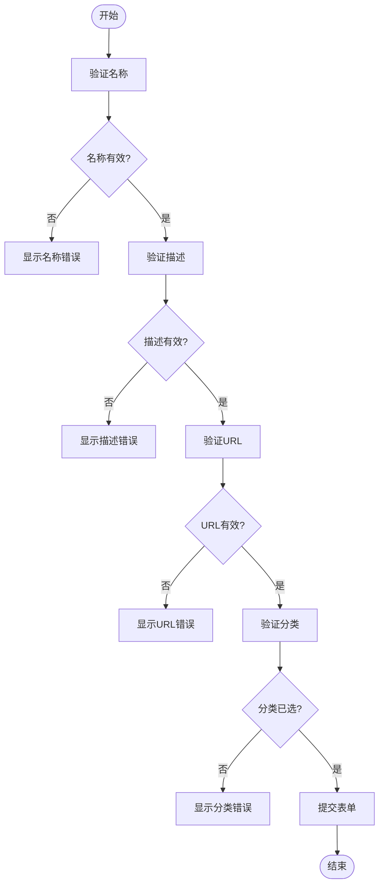

**图示来源**
- [ToolForm.vue](file://src/components/admin/ToolForm.vue#L1-L512)
- [validation.ts](file://src/utils/validation.ts)

**本节来源**
- [ToolForm.vue](file://src/components/admin/ToolForm.vue#L1-L512)
- [dataTransform.ts](file://src/utils/dataTransform.ts#L1-L100)

### ProductDetailModal 组件分析
ProductDetailModal组件用于展示产品详情并提供管理操作，包括审核、发布和删除等。

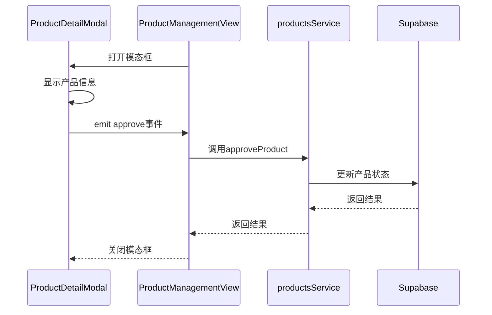

**图示来源**
- [ProductDetailModal.vue](file://src/components/admin/ProductDetailModal.vue#L1-L397)
- [ProductManagementView.vue](file://src/views/admin/ProductManagementView.vue#L1-L500)
- [productsService.ts](file://src/services/productsService.ts#L1-L340)

#### 状态管理与操作流程
ProductDetailModal根据产品状态显示不同的操作按钮，实现了基于状态的UI逻辑。

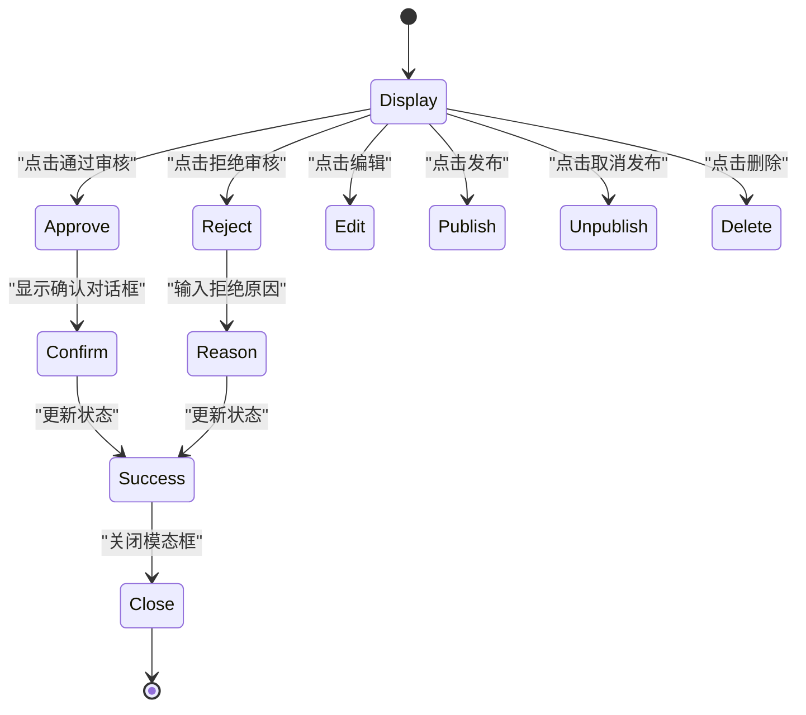

**图示来源**
- [ProductDetailModal.vue](file://src/components/admin/ProductDetailModal.vue#L1-L397)
- [productsService.ts](file://src/services/productsService.ts#L1-L340)

**本节来源**
- [ProductDetailModal.vue](file://src/components/admin/ProductDetailModal.vue#L1-L397)
- [ProductManagementView.vue](file://src/views/admin/ProductManagementView.vue#L1-L500)

### UserDetailModal 组件分析
UserDetailModal组件用于展示用户详情和统计信息，为管理员提供全面的用户管理能力。

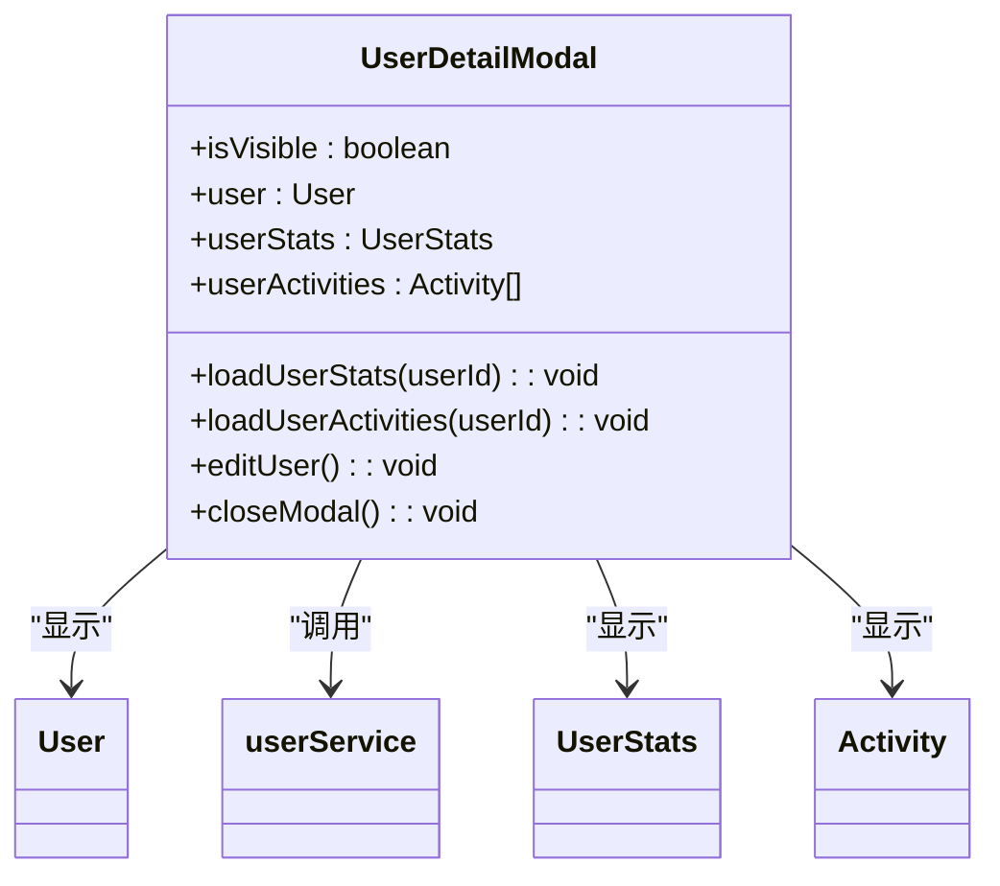

**图示来源**
- [UserDetailModal.vue](file://src/components/admin/UserDetailModal.vue#L1-L742)
- [userService.ts](file://src/services/userService.ts#L1-L288)
- [index.ts](file://src/types/index.ts#L1-L389)

#### 数据获取与统计
UserDetailModal组件在打开时会加载用户的统计信息和活动历史，为管理员提供决策支持。

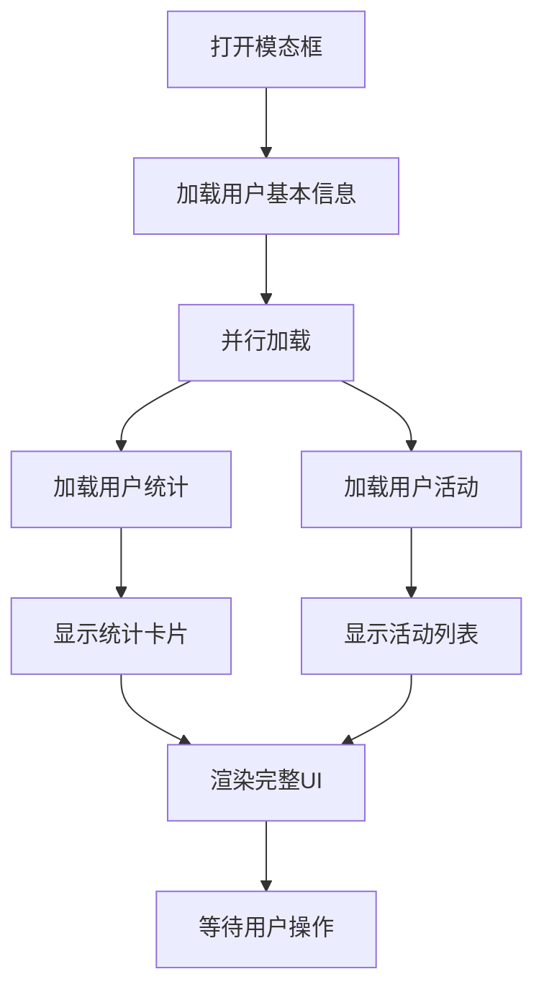

**图示来源**
- [UserDetailModal.vue](file://src/components/admin/UserDetailModal.vue#L1-L742)
- [userService.ts](file://src/services/userService.ts#L1-L288)

**本节来源**
- [UserDetailModal.vue](file://src/components/admin/UserDetailModal.vue#L1-L742)
- [userService.ts](file://src/services/userService.ts#L1-L288)

## 依赖分析
管理组件依赖于多个服务和库，形成了清晰的依赖关系图。

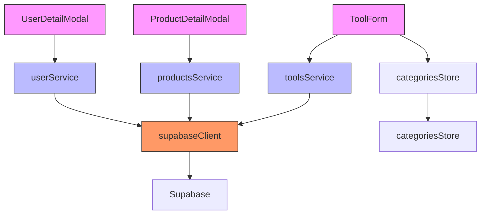

**图示来源**
- [ToolForm.vue](file://src/components/admin/ToolForm.vue)
- [ProductDetailModal.vue](file://src/components/admin/ProductDetailModal.vue)
- [UserDetailModal.vue](file://src/components/admin/UserDetailModal.vue)
- [toolsService.ts](file://src/services/toolsService.ts)
- [productsService.ts](file://src/services/productsService.ts)
- [userService.ts](file://src/services/userService.ts)
- [supabaseClient.ts](file://src/lib/supabaseClient.ts)

**本节来源**
- [package.json](file://package.json)
- [tsconfig.json](file://tsconfig.json)

## 性能考量
管理组件在大型数据集下的性能表现经过了优化，确保了良好的用户体验。

### 缓存策略
服务层实现了缓存机制，减少了对后端的重复请求。

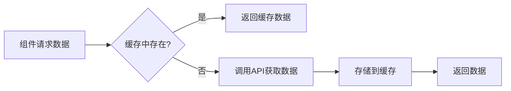

**图示来源**
- [toolsService.ts](file://src/services/toolsService.ts#L1-L470)
- [cacheManager.ts](file://src/utils/cacheManager.ts)

### 响应式设计
所有管理组件都实现了响应式设计，确保在不同设备上都有良好的用户体验。

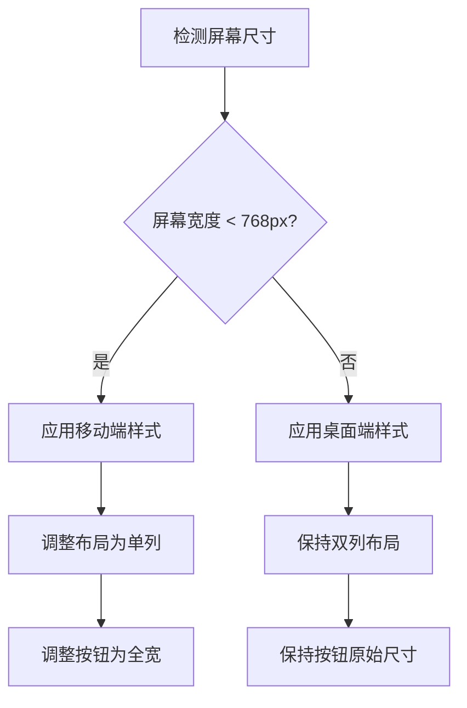

**图示来源**
- [ToolForm.vue](file://src/components/admin/ToolForm.vue#L450-L500)
- [ProductDetailModal.vue](file://src/components/admin/ProductDetailModal.vue#L350-L390)
- [UserDetailModal.vue](file://src/components/admin/UserDetailModal.vue#L650-L700)

## 故障排除指南
本节提供常见问题的解决方案和调试建议。

### 表单验证错误
当表单验证失败时，应检查输入数据的格式和必填字段。

**本节来源**
- [validation.ts](file://src/utils/validation.ts)
- [ToolForm.vue](file://src/components/admin/ToolForm.vue#L200-L250)

### 数据加载失败
当数据加载失败时，应检查网络连接和API端点。

**本节来源**
- [errorHandler.ts](file://src/utils/errorHandler.ts)
- [supabaseClient.ts](file://src/lib/supabaseClient.ts#L1-L50)

## 结论
管理后台组件通过精心设计的UI和强大的功能，为管理员提供了高效的内容管理能力。组件间的清晰分离和与后端的安全交互确保了系统的稳定性和可维护性。未来的优化方向包括增强表单的富文本编辑功能和文件上传能力。