# 组件架构

<cite>
**本文档中引用的文件**  
- [LazyComponent.vue](file://src/components/common/LazyComponent.vue)
- [LazyImage.vue](file://src/components/common/LazyImage.vue)
- [AppHeader.vue](file://src/components/AppHeader.vue)
- [AppFooter.vue](file://src/components/AppFooter.vue)
- [ThemeSelector.vue](file://src/components/theme/ThemeSelector.vue)
- [NotificationCenter.vue](file://src/components/notifications/NotificationCenter.vue)
- [EnhancedSearchBox.vue](file://src/components/search/EnhancedSearchBox.vue)
- [AdvancedSearchPanel.vue](file://src/components/search/AdvancedSearchPanel.vue)
- [StarRating.vue](file://src/components/ui/StarRating.vue)
- [useLazyLoading.ts](file://src/composables/useLazyLoading.ts)
- [useSimpleTheme.ts](file://src/composables/useSimpleTheme.ts)
- [tools.ts](file://src/stores/tools.ts)
- [auth.ts](file://src/stores/auth.ts)
- [notificationService.ts](file://src/services/notificationService.ts)
- [searchService.ts](file://src/services/searchService.ts)
</cite>

## 目录
1. [项目结构概览](#项目结构概览)
2. [视图层设计：views目录](#视图层设计views目录)
3. [组件分层架构](#组件分层架构)
4. [全局布局组件](#全局布局组件)
5. [通用功能组件](#通用功能组件)
6. [UI原子组件](#ui原子组件)
7. [主题控制组件](#主题控制组件)
8. [搜索组件系统](#搜索组件系统)
9. [通知系统组件](#通知系统组件)
10. [组件通信机制](#组件通信机制)
11. [性能优化策略](#性能优化策略)
12. [类型安全实现](#类型安全实现)

## 项目结构概览

项目采用基于功能的分层组件架构，核心组件组织如下：

- `src/views`：路由驱动的页面容器
- `src/components`：可复用的UI组件，进一步细分为：
  - `common`：通用功能组件
  - `ui`：基础UI原子组件
  - `theme`：主题控制组件
  - `search`：搜索相关组件
  - `notifications`：通知系统组件
  - 其他业务组件

该架构实现了清晰的职责划分和高复用性。

## 视图层设计：views目录

`views`目录作为路由驱动的页面容器，承担着数据加载、布局分发和状态管理的核心职责。每个视图组件（如`HomeView.vue`、`ToolsView.vue`）通过组合多个子组件来构建完整的页面。

视图组件的主要职责包括：
- 通过Pinia store获取和管理页面数据
- 协调不同组件之间的数据流
- 处理路由参数和导航逻辑
- 实现页面级别的生命周期管理

**Section sources**
- [HomeView.vue](file://src/views/HomeView.vue)
- [ToolsView.vue](file://src/views/ToolsView.vue)
- [ProductDetailView.vue](file://src/views/ProductDetailView.vue)

## 组件分层架构

项目采用分层组件架构，将组件按功能和复用性进行分类：

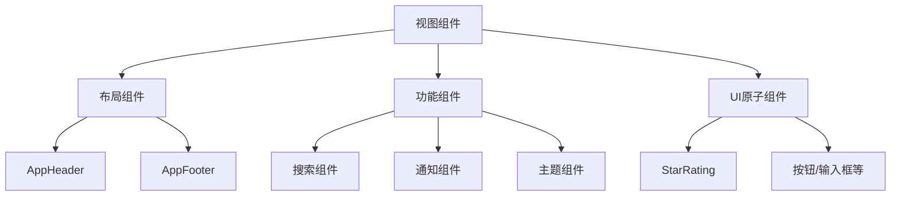

**Diagram sources**
- [App.vue](file://src/App.vue)
- [views目录](file://src/views)

**Section sources**
- [App.vue](file://src/App.vue)
- [components目录](file://src/components)

## 全局布局组件

### AppHeader 组件分析

`AppHeader.vue`作为全局头部组件，集成了多个功能模块，包括搜索框、主题切换、通知中心和用户菜单。

组件通过以下方式与系统集成：
- 使用`useToolsStore`管理搜索状态
- 使用`useAuthStore`管理用户认证状态
- 集成`ThemeSelector`和`NotificationCenter`子组件
- 通过Vue Router实现导航功能

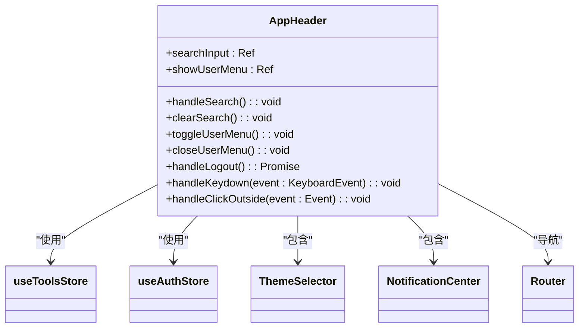

**Diagram sources**
- [AppHeader.vue](file://src/components/AppHeader.vue)
- [tools.ts](file://src/stores/tools.ts)
- [auth.ts](file://src/stores/auth.ts)

**Section sources**
- [AppHeader.vue](file://src/components/AppHeader.vue)

### AppFooter 组件分析

`AppFooter.vue`作为全局底部组件，提供了网站信息、导航链接和联系信息。

组件特点：
- 响应式设计，适配不同屏幕尺寸
- 支持配置化，通过`siteConfig`和`footerConfig`管理内容
- 集成社交媒体链接和联系信息

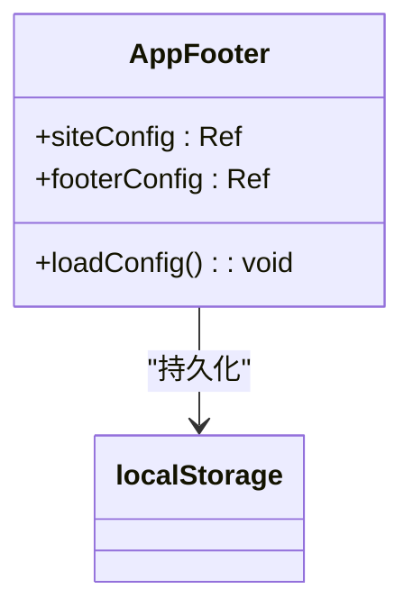

**Diagram sources**
- [AppFooter.vue](file://src/components/AppFooter.vue)

**Section sources**
- [AppFooter.vue](file://src/components/AppFooter.vue)

## 通用功能组件

### LazyComponent 组件

`LazyComponent.vue`实现了组件的懒加载和错误处理机制，通过`defineAsyncComponent`实现异步组件加载。

核心功能：
- 基于Intersection Observer的懒加载
- 自定义加载占位符和错误状态
- 支持重试机制
- 可配置的预加载距离

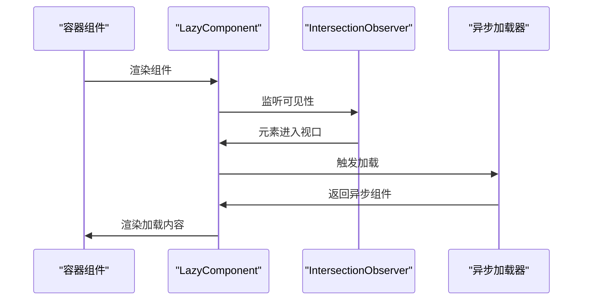

**Diagram sources**
- [LazyComponent.vue](file://src/components/common/LazyComponent.vue)
- [useLazyLoading.ts](file://src/composables/useLazyLoading.ts)

**Section sources**
- [LazyComponent.vue](file://src/components/common/LazyComponent.vue)

### LazyImage 组件

`LazyImage.vue`实现了图片的懒加载和优化，支持WebP格式检测和质量优化。

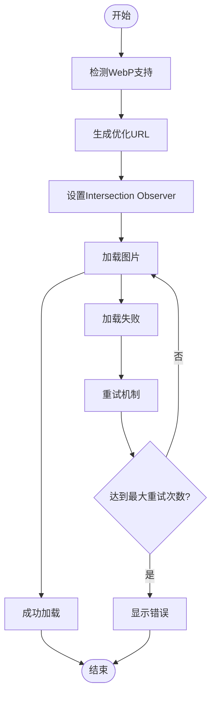

**Diagram sources**
- [LazyImage.vue](file://src/components/common/LazyImage.vue)
- [useLazyLoading.ts](file://src/composables/useLazyLoading.ts)

**Section sources**
- [LazyImage.vue](file://src/components/common/LazyImage.vue)

## UI原子组件

### StarRating 组件

`StarRating.vue`是一个基础的评分组件，支持只读模式和交互模式。

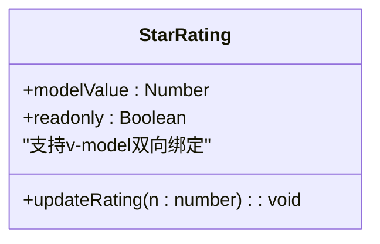

**Diagram sources**
- [StarRating.vue](file://src/components/ui/StarRating.vue)

**Section sources**
- [StarRating.vue](file://src/components/ui/StarRating.vue)

## 主题控制组件

### ThemeSelector 组件

`ThemeSelector.vue`提供了完整的主题切换功能，支持浅色、深色和跟随系统三种模式。

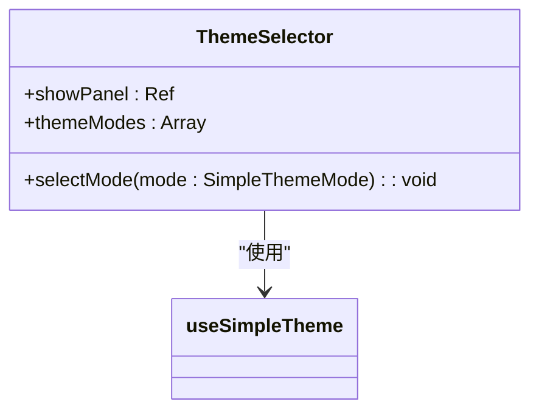

**Diagram sources**
- [ThemeSelector.vue](file://src/components/theme/ThemeSelector.vue)
- [useSimpleTheme.ts](file://src/composables/useSimpleTheme.ts)

**Section sources**
- [ThemeSelector.vue](file://src/components/theme/ThemeSelector.vue)

## 搜索组件系统

### EnhancedSearchBox 组件

`EnhancedSearchBox.vue`提供了完整的搜索功能，包括智能建议、历史记录和高级筛选。

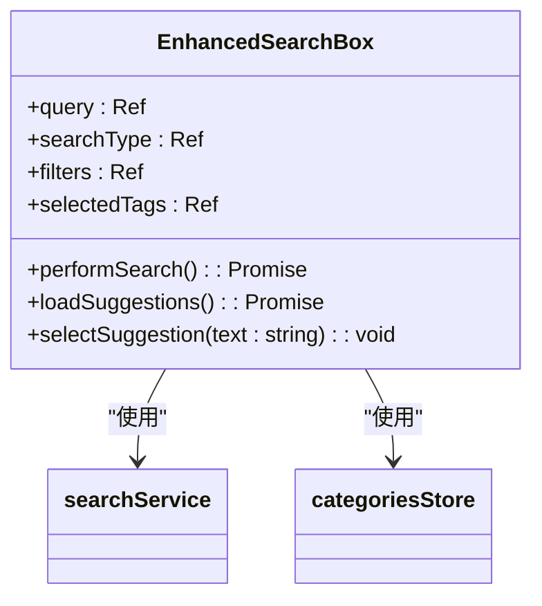

**Diagram sources**
- [EnhancedSearchBox.vue](file://src/components/search/EnhancedSearchBox.vue)
- [searchService.ts](file://src/services/searchService.ts)

**Section sources**
- [EnhancedSearchBox.vue](file://src/components/search/EnhancedSearchBox.vue)

### AdvancedSearchPanel 组件

`AdvancedSearchPanel.vue`提供了高级搜索功能，支持多维度筛选和排序。

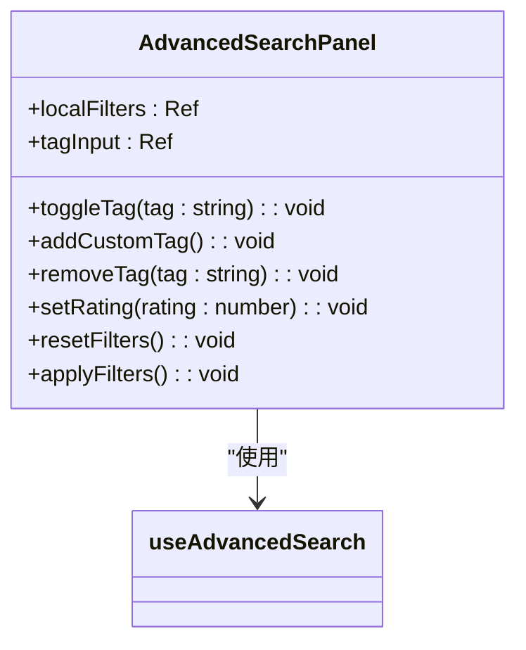

**Diagram sources**
- [AdvancedSearchPanel.vue](file://src/components/search/AdvancedSearchPanel.vue)
- [useAdvancedSearch.ts](file://src/composables/useAdvancedSearch.ts)

**Section sources**
- [AdvancedSearchPanel.vue](file://src/components/search/AdvancedSearchPanel.vue)

## 通知系统组件

### NotificationCenter 组件

`NotificationCenter.vue`实现了完整的通知中心功能，支持实时更新和批量操作。

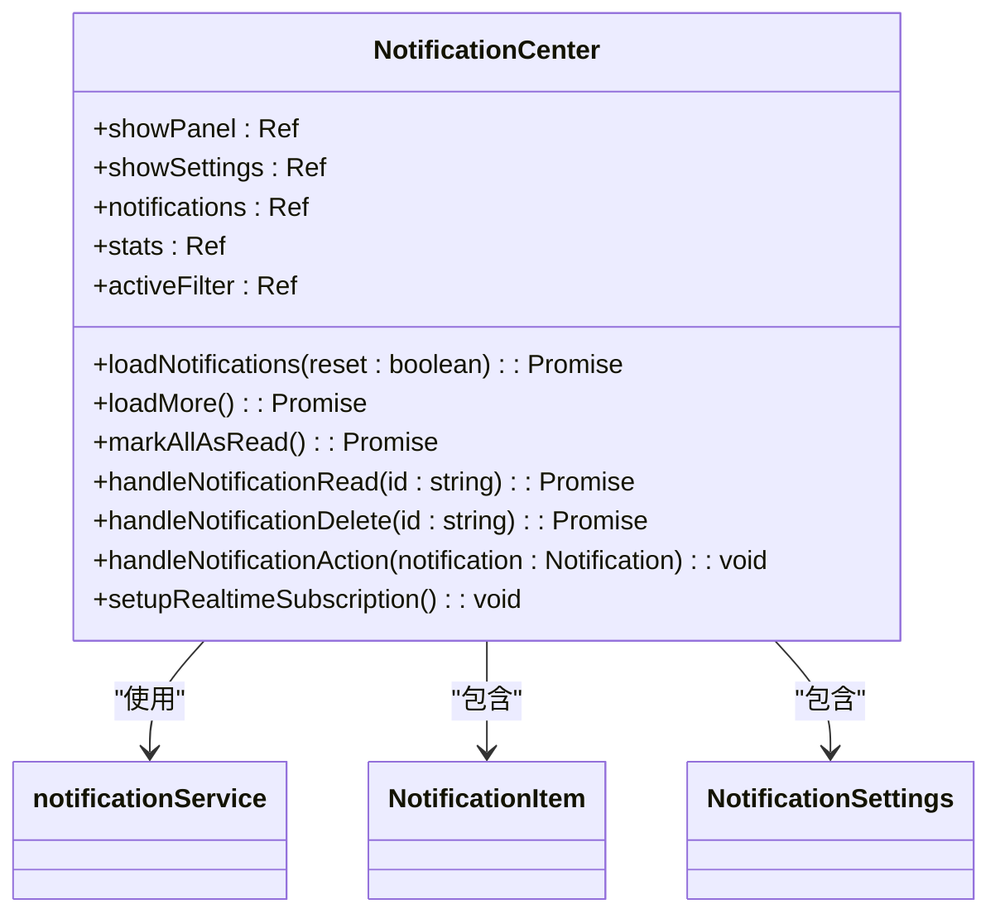

**Diagram sources**
- [NotificationCenter.vue](file://src/components/notifications/NotificationCenter.vue)
- [notificationService.ts](file://src/services/notificationService.ts)

**Section sources**
- [NotificationCenter.vue](file://src/components/notifications/NotificationCenter.vue)

## 组件通信机制

项目采用多种组件通信机制：

### Props/Emits 通信

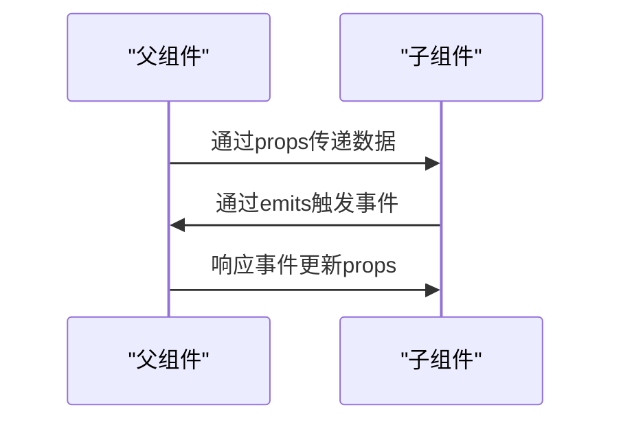

### 插槽使用

- 默认插槽：用于内容分发
- 具名插槽：用于特定位置的内容
- 作用域插槽：用于传递数据

### Pinia Store 通信

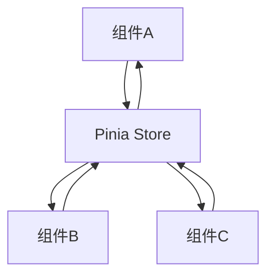

**Diagram sources**
- [tools.ts](file://src/stores/tools.ts)
- [auth.ts](file://src/stores/auth.ts)

**Section sources**
- [stores目录](file://src/stores)

## 性能优化策略

### 懒加载优化

- `LazyComponent`：异步加载组件
- `LazyImage`：懒加载图片
- Intersection Observer：检测元素可见性

### 缓存策略

- `localStorage`：持久化配置
- `Map`缓存：预加载数据
- `debounce`：防抖搜索

### 代码分割

- 动态导入：`defineAsyncComponent`
- 路由懒加载：`() => import('./views/Home.vue')`

**Section sources**
- [LazyComponent.vue](file://src/components/common/LazyComponent.vue)
- [LazyImage.vue](file://src/components/common/LazyImage.vue)
- [useLazyLoading.ts](file://src/composables/useLazyLoading.ts)

## 类型安全实现

项目采用TypeScript实现完整的类型安全：

### 类型定义

- `interface`：定义对象结构
- `type`：定义联合类型
- `Ref<T>`：定义响应式引用
- `ComputedRef<T>`：定义计算属性

### 组件类型

- `defineProps<T>()`：定义props类型
- `defineEmits<T>()`：定义emits类型
- `defineExpose<T>()`：定义暴露的API

### 服务类型

- `Promise<T>`：定义异步返回类型
- `Partial<T>`：定义部分更新
- `Readonly<T>`：定义只读类型

**Section sources**
- [types目录](file://src/types)
- [services目录](file://src/services)
- [stores目录](file://src/stores)