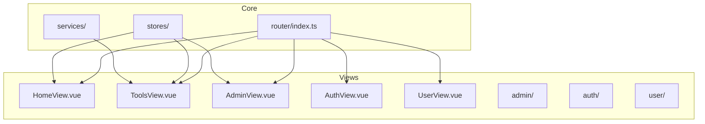
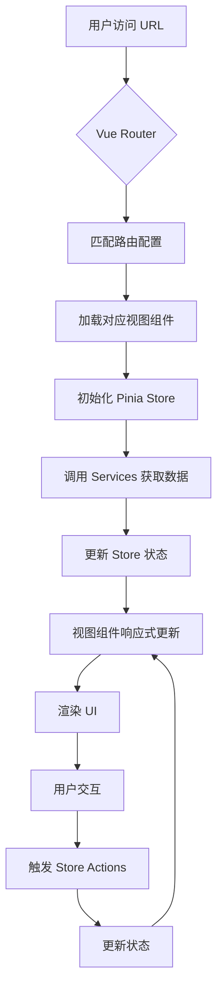
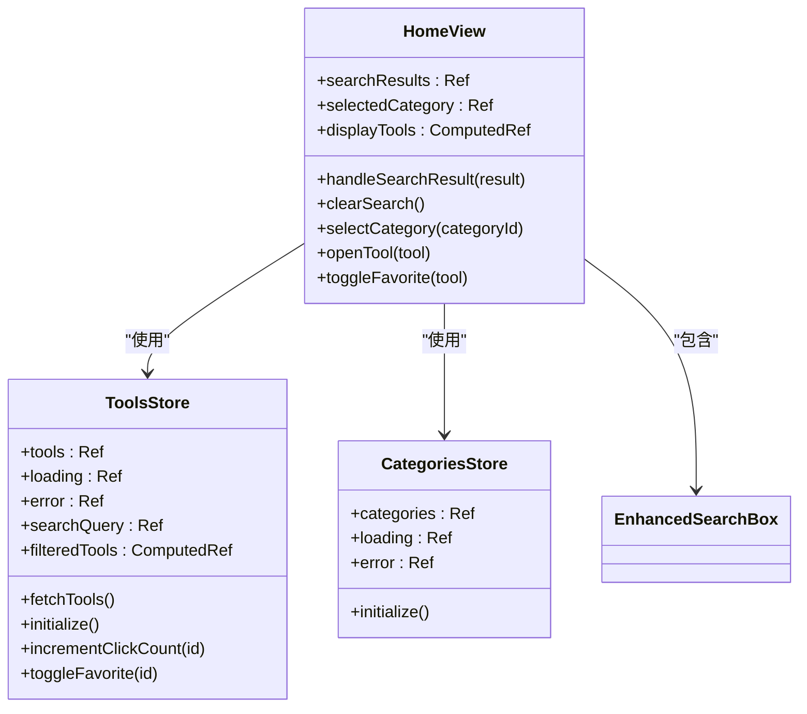
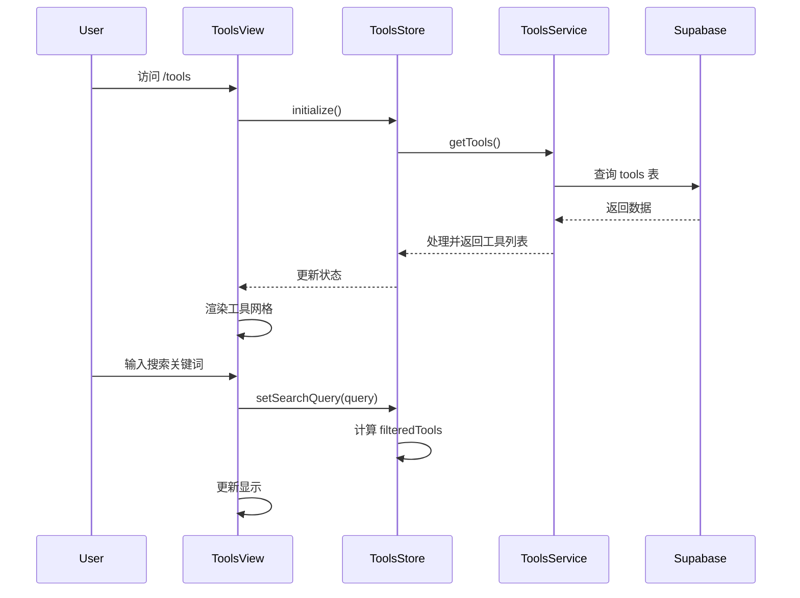
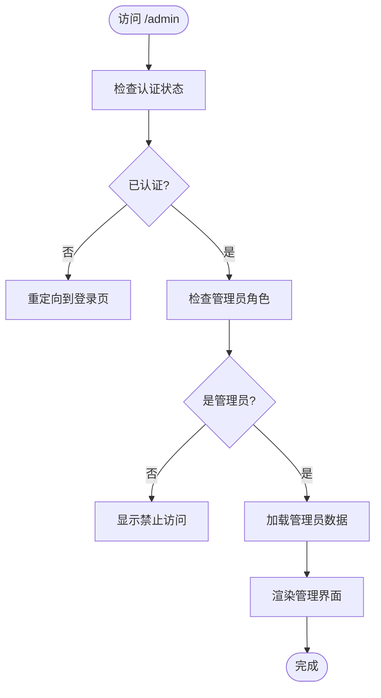
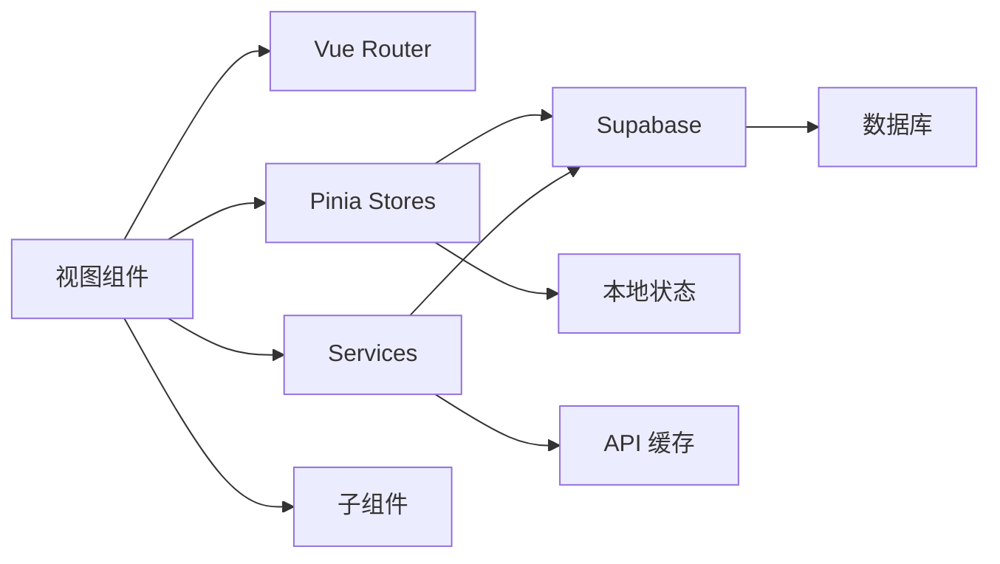

# 视图组件 (Views)

<cite>
**本文档引用的文件**
- [HomeView.vue](file://src/views/HomeView.vue)
- [ToolsView.vue](file://src/views/ToolsView.vue)
- [DashboardView.vue](file://src/views/admin/DashboardView.vue)
- [index.ts](file://src/router/index.ts)
- [auth.ts](file://src/stores/auth.ts)
- [tools.ts](file://src/stores/tools.ts)
- [toolsService.ts](file://src/services/toolsService.ts)
</cite>

## 目录
1. [简介](#简介)
2. [项目结构](#项目结构)
3. [核心组件](#核心组件)
4. [架构概述](#架构概述)
5. [详细组件分析](#详细组件分析)
6. [依赖分析](#依赖分析)
7. [性能考虑](#性能考虑)
8. [故障排除指南](#故障排除指南)
9. [结论](#结论)

## 简介
本文件详细说明了 `src/views` 目录下的视图组件，这些组件作为应用程序的主要导航节点，通过 Vue Router 进行路由映射，并集成 Pinia 状态管理进行数据获取与同步。文档重点分析了视图组件的生命周期逻辑、数据预加载模式、与子组件的布局分发机制，以及不同用户角色下的视图结构差异。

## 项目结构

**图示来源**
- [HomeView.vue](file://src/views/HomeView.vue)
- [ToolsView.vue](file://src/views/ToolsView.vue)
- [index.ts](file://src/router/index.ts)

**本节来源**
- [index.ts](file://src/router/index.ts#L1-L360)

## 核心组件

视图组件是应用的顶级路由驱动页面，负责协调数据获取、状态管理和用户界面展示。它们通过 Vue Router 映射到特定 URL，并作为布局容器分发内容给子组件。

**本节来源**
- [HomeView.vue](file://src/views/HomeView.vue#L1-L599)
- [ToolsView.vue](file://src/views/ToolsView.vue#L1-L967)

## 架构概述

**图示来源**
- [index.ts](file://src/router/index.ts#L1-L360)
- [auth.ts](file://src/stores/auth.ts#L1-L151)
- [tools.ts](file://src/stores/tools.ts#L1-L341)

## 详细组件分析

### HomeView 分析

`HomeView` 是应用的首页，展示热门工具和分类。它通过组合多个 Pinia Store 来实现数据驱动的 UI。

**图示来源**
- [HomeView.vue](file://src/views/HomeView.vue#L1-L599)
- [tools.ts](file://src/stores/tools.ts#L1-L341)
- [categories.ts](file://src/stores/categories.ts#L1-L100)

**本节来源**
- [HomeView.vue](file://src/views/HomeView.vue#L1-L599)

### ToolsView 分析

`ToolsView` 是工具导航的核心页面，支持搜索、过滤、排序和多种视图模式。

**图示来源**
- [ToolsView.vue](file://src/views/ToolsView.vue#L1-L967)
- [tools.ts](file://src/stores/tools.ts#L1-L341)
- [toolsService.ts](file://src/services/toolsService.ts#L1-L469)

**本节来源**
- [ToolsView.vue](file://src/views/ToolsView.vue#L1-L967)

### 管理员视图分析

管理员视图（如 `DashboardView`）具有特殊访问控制，仅对管理员角色可见。

**图示来源**
- [index.ts](file://src/router/index.ts#L1-L360)
- [auth.ts](file://src/stores/auth.ts#L1-L151)
- [DashboardView.vue](file://src/views/admin/DashboardView.vue#L1-L200)

**本节来源**
- [index.ts](file://src/router/index.ts#L1-L360)
- [auth.ts](file://src/stores/auth.ts#L1-L151)

## 依赖分析

**图示来源**
- [index.ts](file://src/router/index.ts#L1-L360)
- [auth.ts](file://src/stores/auth.ts#L1-L151)
- [tools.ts](file://src/stores/tools.ts#L1-L341)
- [toolsService.ts](file://src/services/toolsService.ts#L1-L469)

**本节来源**
- [index.ts](file://src/router/index.ts#L1-L360)
- [auth.ts](file://src/stores/auth.ts#L1-L151)
- [tools.ts](file://src/stores/tools.ts#L1-L341)

## 性能考虑

视图组件采用了多种性能优化策略：

1. **懒加载**：路由组件使用动态导入实现代码分割
2. **缓存**：`toolsService` 使用 `cacheManager` 实现 API 响应缓存
3. **虚拟滚动**：长列表使用虚拟滚动优化渲染性能
4. **防抖**：搜索输入使用防抖减少 API 调用频率
5. **计算属性**：使用 Pinia 的 computed 属性实现响应式数据过滤

这些优化策略显著提升了应用的加载速度和交互流畅性。

## 故障排除指南

常见问题及解决方案：

1. **视图无法加载数据**
   - 检查 `VITE_SUPABASE_URL` 和 `VITE_SUPABASE_ANON_KEY` 环境变量配置
   - 确认 Store 的 `initialize()` 方法被正确调用
   - 检查网络连接和 API 可访问性

2. **路由无法匹配**
   - 验证 `router/index.ts` 中的路径配置
   - 检查动态路由参数格式
   - 确认路由守卫逻辑正确

3. **状态更新不及时**
   - 确保使用 `ref` 或 `reactive` 创建响应式数据
   - 检查 computed 属性的依赖是否正确
   - 验证 Store 的 actions 是否正确更新 state

**本节来源**
- [tools.ts](file://src/stores/tools.ts#L1-L341)
- [toolsService.ts](file://src/services/toolsService.ts#L1-L469)
- [HomeView.vue](file://src/views/HomeView.vue#L1-L599)

## 结论

视图组件作为应用的入口点，通过 Vue Router、Pinia 和 Services 的协同工作，实现了高效的数据获取和状态管理。不同角色的视图通过路由元信息和状态检查实现访问控制，确保了应用的安全性和用户体验。