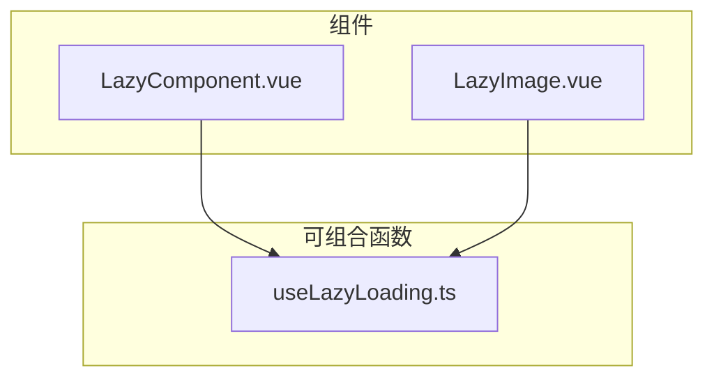
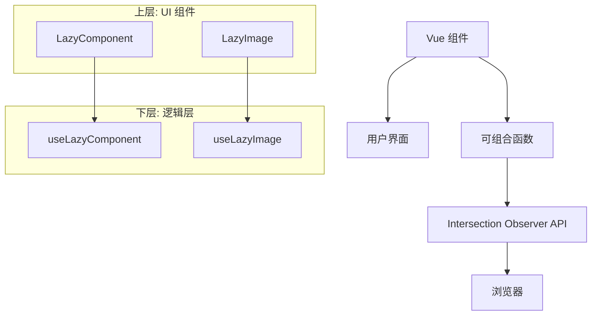
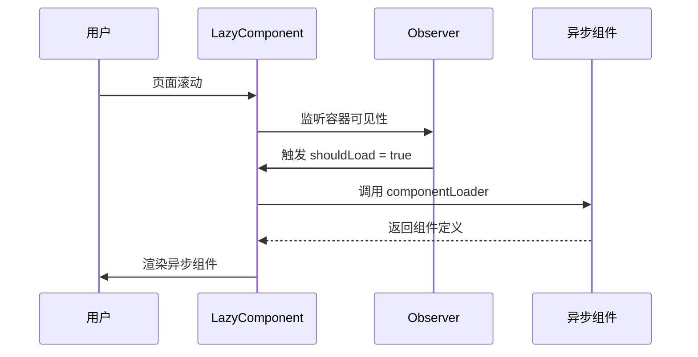
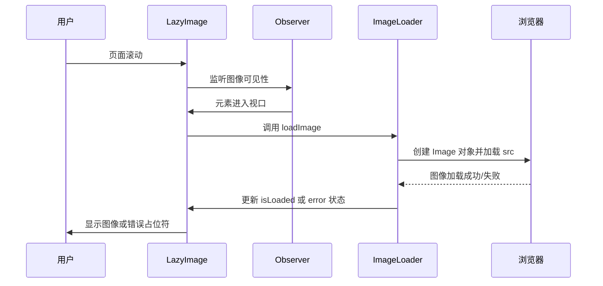
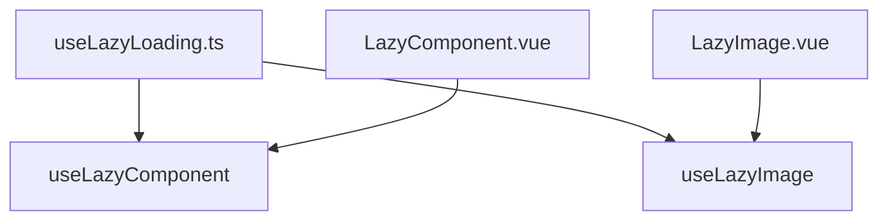

# 通用功能组件

<cite>
**本文档引用文件**  
- [LazyComponent.vue](file://src/components/common/LazyComponent.vue)
- [LazyImage.vue](file://src/components/common/LazyImage.vue)
- [useLazyLoading.ts](file://src/composables/useLazyLoading.ts)
</cite>

## 目录
1. [简介](#简介)
2. [项目结构](#项目结构)
3. [核心组件](#核心组件)
4. [架构概述](#架构概述)
5. [详细组件分析](#详细组件分析)
6. [依赖分析](#依赖分析)
7. [性能考量](#性能考量)
8. [故障排除指南](#故障排除指南)
9. [结论](#结论)

## 简介
本文档深入探讨了基于 Vue 3 的两个关键性能优化组件：`LazyComponent` 和 `LazyImage`。这两个通用功能组件通过封装 Vue 3 的异步组件机制和原生 Intersection Observer API，实现了路由级和图像级的延迟加载，显著提升了应用的首屏加载速度和整体性能。文档详细阐述了组件的设计原理、接口配置、状态管理以及在实际业务场景中的应用效果。

## 项目结构
项目采用标准的 Vue 3 + TypeScript 架构，组件按功能分类组织。通用功能组件集中存放在 `src/components/common/` 目录下，相关的可组合函数（Composables）则位于 `src/composables/` 目录，实现了逻辑与视图的清晰分离。

**图示来源**  
- [LazyComponent.vue](file://src/components/common/LazyComponent.vue)
- [LazyImage.vue](file://src/components/common/LazyImage.vue)
- [useLazyLoading.ts](file://src/composables/useLazyLoading.ts)

**本节来源**  
- [LazyComponent.vue](file://src/components/common/LazyComponent.vue)
- [LazyImage.vue](file://src/components/common/LazyImage.vue)

## 核心组件
`LazyComponent` 和 `LazyImage` 是本项目中用于性能优化的核心通用组件。它们均基于 Vue 3 的 Composition API 和响应式系统构建，通过 `useLazyLoading.ts` 提供的可组合函数来管理懒加载逻辑，实现了代码的高度复用和解耦。

**本节来源**  
- [LazyComponent.vue](file://src/components/common/LazyComponent.vue#L1-L268)
- [LazyImage.vue](file://src/components/common/LazyImage.vue#L1-L324)
- [useLazyLoading.ts](file://src/composables/useLazyLoading.ts#L1-L320)

## 架构概述
整个懒加载系统的架构分为两层：上层是具体的 Vue 组件（`LazyComponent` 和 `LazyImage`），负责 UI 展示和用户交互；下层是可复用的逻辑层（`useLazyLoading.ts`），负责核心的懒加载和状态管理。这种分层设计使得业务逻辑与视图逻辑分离，提高了代码的可维护性和可测试性。

**图示来源**  
- [LazyComponent.vue](file://src/components/common/LazyComponent.vue)
- [LazyImage.vue](file://src/components/common/LazyImage.vue)
- [useLazyLoading.ts](file://src/composables/useLazyLoading.ts)

## 详细组件分析

### LazyComponent 分析
`LazyComponent` 用于实现组件级别的懒加载，特别适用于路由组件或大型功能模块的按需加载。

#### 组件接口设计
该组件通过 `Props` 定义了清晰的配置接口，允许开发者高度自定义其行为。

**表：LazyComponent Props 接口定义**
| 属性名 | 类型 | 默认值 | 描述 |
| :--- | :--- | :--- | :--- |
| componentLoader | `() => Promise<any>` | 必填 | 异步组件加载函数 |
| componentProps | `Record<string, any>` | - | 传递给异步组件的属性 |
| showPlaceholder | `boolean` | `true` | 是否显示加载占位符 |
| placeholderText | `string` | "正在加载..." | 占位符显示文本 |
| placeholderStyle | `Record<string, string>` | `{ minHeight: '200px' }` | 占位符的内联样式 |
| preloadDistance | `number` | `100` | 预加载距离（像素） |
| enableRetry | `boolean` | `true` | 是否启用错误重试 |
| maxRetries | `number` | `3` | 最大重试次数 |

**本节来源**  
- [LazyComponent.vue](file://src/components/common/LazyComponent.vue#L47-L96)

#### Intersection Observer 集成
`LazyComponent` 通过 `useLazyComponent` 可组合函数集成 Intersection Observer。当组件进入视口（或在预加载距离内）时，`shouldLoad` 状态变为 `true`，触发组件加载。

**图示来源**  
- [LazyComponent.vue](file://src/components/common/LazyComponent.vue#L144-L215)
- [useLazyLoading.ts](file://src/composables/useLazyLoading.ts#L101-L157)

#### 加载状态管理
组件内部通过 `isLoading`、`error`、`shouldLoad` 等响应式变量精确管理加载状态，并通过插槽（Slots）提供灵活的 UI 定制能力，支持占位符、加载中、错误和重试等状态。

**本节来源**  
- [LazyComponent.vue](file://src/components/common/LazyComponent.vue#L1-L268)

### LazyImage 分析
`LazyImage` 专注于图像资源的懒加载和优化，有效减少初始页面的资源请求数量和带宽消耗。

#### 组件接口设计
`LazyImage` 提供了丰富的图像优化配置选项。

**表：LazyImage Props 接口定义**
| 属性名 | 类型 | 默认值 | 描述 |
| :--- | :--- | :--- | :--- |
| src | `string` | 必填 | 图像源地址 |
| placeholder | `string` | - | 占位图片地址 |
| alt | `string` | "" | 图像替代文本 |
| width / height | `number \| string` | - | 图像尺寸 |
| showPlaceholder | `boolean` | `true` | 是否显示加载占位符 |
| showErrorPlaceholder | `boolean` | `true` | 是否显示错误占位符 |
| enableRetry | `boolean` | `true` | 是否启用错误重试 |
| rootMargin | `string` | "50px" | Intersection Observer 的根边距 |
| threshold | `number` | `0.1` | Intersection Observer 的阈值 |
| quality | `'low' \| 'medium' \| 'high'` | `'medium'` | 图像质量优化等级 |

**本节来源**  
- [LazyImage.vue](file://src/components/common/LazyImage.vue#L43-L104)

#### Intersection Observer 集成
`LazyImage` 使用 `useLazyImage` 可组合函数，通过 Intersection Observer 监听图像元素的可见性。一旦图像进入视口，`setupIntersectionObserver` 会触发 `loadImage` 函数，开始加载真实图片。

**图示来源**  
- [LazyImage.vue](file://src/components/common/LazyImage.vue#L198-L273)
- [useLazyLoading.ts](file://src/composables/useLazyLoading.ts#L48-L104)

#### 加载状态管理与优化
组件通过 `isLoaded`、`isLoading`、`error` 状态精确控制图像的显示。此外，`getOptimizedSrc` 函数会根据 `quality` 参数和浏览器对 WebP 格式的支持情况，动态生成优化后的图片 URL，进一步提升加载性能。

**本节来源**  
- [LazyImage.vue](file://src/components/common/LazyImage.vue#L149-L203)

## 依赖分析
`LazyComponent` 和 `LazyImage` 组件都依赖于 `useLazyLoading.ts` 中定义的可组合函数，形成了清晰的依赖关系。

**图示来源**  
- [LazyComponent.vue](file://src/components/common/LazyComponent.vue)
- [LazyImage.vue](file://src/components/common/LazyImage.vue)
- [useLazyLoading.ts](file://src/composables/useLazyLoading.ts)

**本节来源**  
- [LazyComponent.vue](file://src/components/common/LazyComponent.vue)
- [LazyImage.vue](file://src/components/common/LazyImage.vue)
- [useLazyLoading.ts](file://src/composables/useLazyLoading.ts)

## 性能考量
使用 `LazyComponent` 和 `LazyImage` 能显著改善应用性能：
- **首屏加载时间**：通过延迟加载非首屏组件和图片，大幅减少了初始 JavaScript 和资源包的体积，加快了首屏渲染速度。
- **资源消耗**：避免了对用户可能永远不会看到的资源进行不必要的网络请求和内存占用，降低了整体资源消耗。
- **用户体验**：结合骨架屏（Skeleton）占位符，提供了流畅的加载体验，减少了用户等待的感知时间。

## 故障排除指南
- **组件/图片不加载**：检查浏览器是否支持 Intersection Observer API，或确认元素是否具有足够的滚动空间使其能够进入视口。
- **重复加载**：确保 `componentLoader` 函数是幂等的，或在 `useLazyComponent` 中添加加载状态检查。
- **样式问题**：检查 `placeholderStyle` 是否正确传递，或自定义插槽的 CSS 是否覆盖了默认样式。
- **错误重试失败**：确认 `maxRetries` 设置合理，并检查网络状况或资源 URL 的正确性。

**本节来源**  
- [LazyComponent.vue](file://src/components/common/LazyComponent.vue#L94-L151)
- [LazyImage.vue](file://src/components/common/LazyImage.vue#L149-L203)

## 结论
`LazyComponent` 和 `LazyImage` 是两个高效、灵活且易于使用的通用功能组件。它们通过封装 Vue 3 的现代特性，为应用提供了强大的懒加载能力。通过合理的配置和使用，可以有效提升应用的性能和用户体验，是现代 Web 应用开发中不可或缺的工具。