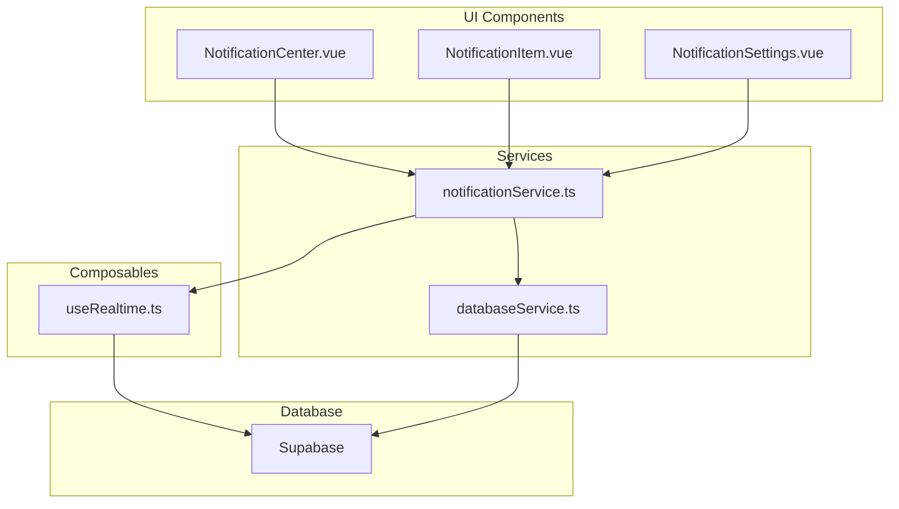
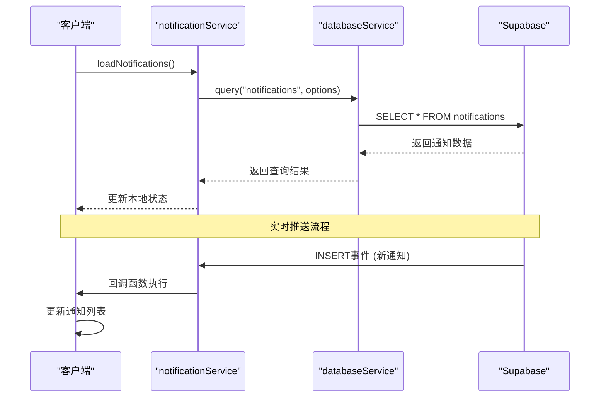
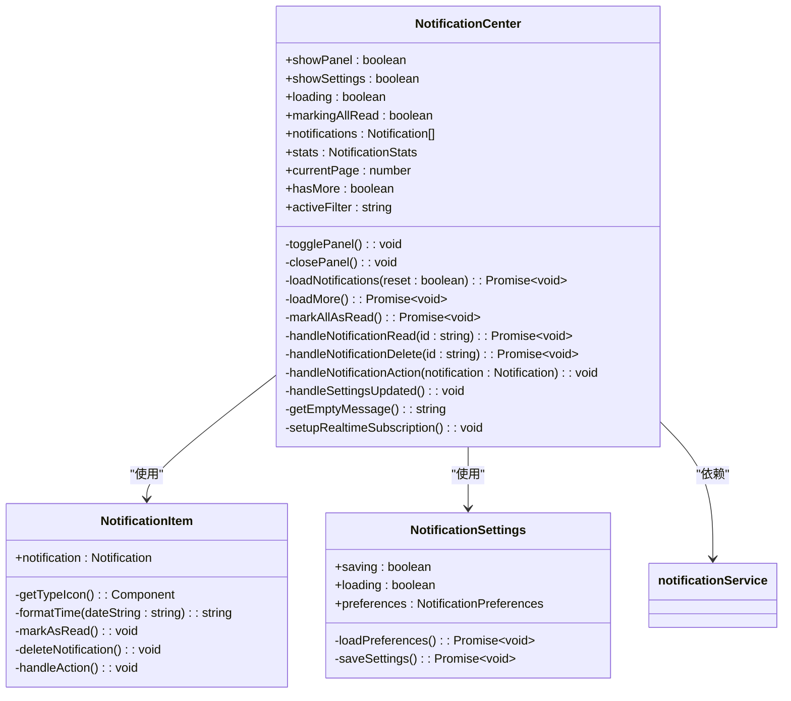
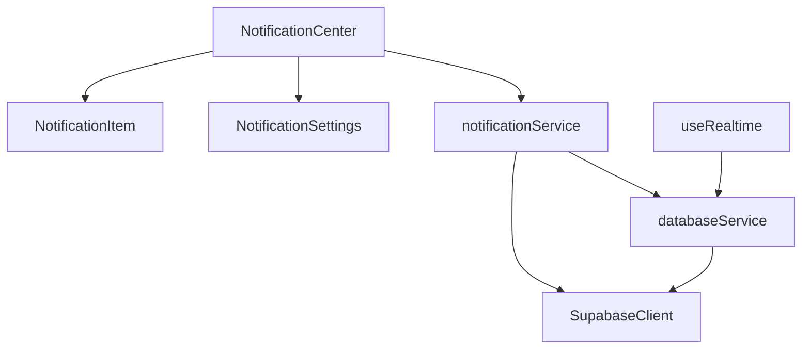

# 通知系统组件

<cite>
**本文档引用的文件**
- [NotificationCenter.vue](file://src/components/notifications/NotificationCenter.vue)
- [NotificationItem.vue](file://src/components/notifications/NotificationItem.vue)
- [NotificationSettings.vue](file://src/components/notifications/NotificationSettings.vue)
- [notificationService.ts](file://src/services/notificationService.ts)
- [useRealtime.ts](file://src/composables/useRealtime.ts)
- [supabaseClient.ts](file://src/lib/supabaseClient.ts)
- [databaseService.ts](file://src/services/databaseService.ts)
</cite>

## 目录
1. [简介](#简介)
2. [项目结构](#项目结构)
3. [核心组件](#核心组件)
4. [架构概述](#架构概述)
5. [详细组件分析](#详细组件分析)
6. [依赖分析](#依赖分析)
7. [性能考虑](#性能考虑)
8. [故障排除指南](#故障排除指南)
9. [结论](#结论)

## 简介
本技术文档全面解析了通知系统组件的设计与实现，重点阐述了`NotificationCenter`、`NotificationItem`和`NotificationSettings`三个核心组件的结构与交互逻辑。文档详细说明了通知中心的展开/收起动画、未读状态管理、批量操作功能以及与后端实时服务的集成方式。同时，深入解释了`NotificationItem`的样式分类（成功、警告、错误）、自动清除定时器和点击行为处理，以及`NotificationSettings`如何允许用户定制通知偏好并与数据库持久化同步。特别强调了组件如何通过`useRealtime.ts`接收Supabase实时推送并更新本地状态，以及WebSocket连接管理、消息去重策略和离线状态处理的实现细节。

## 项目结构
通知系统组件位于`src/components/notifications/`目录下，由三个主要的Vue组件构成：`NotificationCenter.vue`、`NotificationItem.vue`和`NotificationSettings.vue`。这些组件通过`notificationService.ts`服务与后端Supabase数据库进行交互，并利用`useRealtime.ts`组合式函数实现WebSocket实时通信。整个系统的设计遵循了清晰的分层架构，UI组件负责展示和用户交互，服务层处理业务逻辑和数据持久化，而组合式函数则封装了通用的实时通信功能。

**图示来源**
- [NotificationCenter.vue](file://src/components/notifications/NotificationCenter.vue)
- [NotificationItem.vue](file://src/components/notifications/NotificationItem.vue)
- [NotificationSettings.vue](file://src/components/notifications/NotificationSettings.vue)
- [notificationService.ts](file://src/services/notificationService.ts)
- [useRealtime.ts](file://src/composables/useRealtime.ts)
- [databaseService.ts](file://src/services/databaseService.ts)

**节来源**
- [NotificationCenter.vue](file://src/components/notifications/NotificationCenter.vue)
- [NotificationItem.vue](file://src/components/notifications/NotificationItem.vue)
- [NotificationSettings.vue](file://src/components/notifications/NotificationSettings.vue)

## 核心组件
通知系统的核心由三个Vue组件构成：`NotificationCenter`作为主控面板，负责管理通知的显示、筛选和批量操作；`NotificationItem`作为单个通知的展示单元，处理点击、标记已读和删除等交互；`NotificationSettings`则提供了一个模态框，允许用户自定义其通知偏好。这些组件通过`notificationService`服务与后端进行数据同步，并利用`useRealtime`组合式函数建立WebSocket连接，实现通知的实时推送。

**节来源**
- [NotificationCenter.vue](file://src/components/notifications/NotificationCenter.vue)
- [NotificationItem.vue](file://src/components/notifications/NotificationItem.vue)
- [NotificationSettings.vue](file://src/components/notifications/NotificationSettings.vue)

## 架构概述
通知系统的架构采用分层设计，上层为UI组件，中层为业务服务，底层为数据访问和实时通信。`NotificationCenter`组件通过`notificationService`获取用户通知列表和统计信息，并在用户交互时调用相应的服务方法。`notificationService`内部封装了对Supabase数据库的CRUD操作，并通过`databaseService`提供的`subscribeToTable`方法建立实时监听。当数据库中插入新的通知记录时，Supabase会通过WebSocket将变更事件推送给客户端，`notificationService`的订阅回调函数会立即更新本地状态并触发UI刷新。

**图示来源**
- [notificationService.ts](file://src/services/notificationService.ts)
- [databaseService.ts](file://src/services/databaseService.ts)
- [supabaseClient.ts](file://src/lib/supabaseClient.ts)

## 详细组件分析
本节将对通知系统的三个核心组件进行深入分析，探讨其内部实现细节、数据流和交互逻辑。

### NotificationCenter 分析
`NotificationCenter`组件是整个通知系统的入口和控制中心。它包含一个通知触发按钮，点击后会展开一个通知面板。面板顶部显示通知中心标题和操作按钮，包括“全部已读”、“设置”和“关闭”。下方是通知筛选器，允许用户按“全部”、“未读”、“重要”等条件过滤通知。核心区域是通知列表，动态渲染`NotificationItem`组件。

该组件的关键功能包括：
- **展开/收起动画**：通过Vue的`v-if`指令和CSS过渡效果实现面板的平滑显示与隐藏。
- **未读状态管理**：通过`stats`对象跟踪总通知数、未读数和重要通知数，并在触发按钮上显示未读数量的徽章。
- **批量操作**：提供“全部已读”按钮，可一次性将当前筛选条件下的所有未读通知标记为已读。
- **实时集成**：在`onMounted`生命周期中调用`setupRealtimeSubscription`，通过`notificationService.subscribeToNotifications`建立与后端的实时连接。

**图示来源**
- [NotificationCenter.vue](file://src/components/notifications/NotificationCenter.vue)
- [NotificationItem.vue](file://src/components/notifications/NotificationItem.vue)
- [NotificationSettings.vue](file://src/components/notifications/NotificationSettings.vue)

**节来源**
- [NotificationCenter.vue](file://src/components/notifications/NotificationCenter.vue)

### NotificationItem 分析
`NotificationItem`组件负责渲染单个通知的详细信息。它根据通知的`type`属性动态选择不同的图标和背景色，以区分“成功”、“警告”、“错误”等不同类型的通知。组件内部实现了时间格式化功能，能将ISO时间戳转换为“刚刚”、“X分钟前”等更友好的相对时间。

关键特性包括：
- **样式分类**：通过`type-${notification.type}` CSS类名和`getTypeIcon`方法，为不同类型的`NotificationItem`应用特定的视觉样式。
- **自动清除定时器**：虽然代码中未直接实现定时器，但`notificationService.showBrowserNotification`方法在显示浏览器通知5秒后会自动关闭，实现了类似“自动清除”的效果。
- **点击行为处理**：提供了“标记为已读”和“删除”两个操作按钮。点击通知主体或操作按钮会触发相应的事件，通过`emit`机制通知父组件进行状态更新。

**节来源**
- [NotificationItem.vue](file://src/components/notifications/NotificationItem.vue)

### NotificationSettings 分析
`NotificationSettings`组件提供了一个模态框，允许用户定制其通知偏好。它包含多个设置项，如邮件通知、浏览器通知、系统通知等开关，以及通知频率和免打扰时间的选择。

其核心功能是：
- **用户偏好定制**：通过`v-model`双向绑定`preferences`对象，实现表单数据的实时同步。
- **数据库持久化同步**：在`onMounted`生命周期中调用`loadPreferences`从后端加载用户的当前偏好设置。当用户点击“保存设置”时，调用`saveSettings`方法将更新后的偏好通过`notificationService.updatePreferences`持久化到数据库。

**节来源**
- [NotificationSettings.vue](file://src/components/notifications/NotificationSettings.vue)

## 依赖分析
通知系统组件之间以及与外部服务之间存在明确的依赖关系。`NotificationCenter`直接依赖`NotificationItem`和`NotificationSettings`两个子组件，同时也强依赖`notificationService`服务来获取数据和执行操作。`notificationService`服务是整个系统的核心，它依赖`supabaseClient`进行数据库操作，并通过`databaseService`的实时订阅功能接收推送。`useRealtime`组合式函数作为一个通用的实时通信工具，被`notificationService`所使用，但它本身也依赖`databaseService`来建立和管理WebSocket连接。

**图示来源**
- [NotificationCenter.vue](file://src/components/notifications/NotificationCenter.vue)
- [NotificationItem.vue](file://src/components/notifications/NotificationItem.vue)
- [NotificationSettings.vue](file://src/components/notifications/NotificationSettings.vue)
- [notificationService.ts](file://src/services/notificationService.ts)
- [databaseService.ts](file://src/services/databaseService.ts)
- [supabaseClient.ts](file://src/lib/supabaseClient.ts)

**节来源**
- [notificationService.ts](file://src/services/notificationService.ts)
- [databaseService.ts](file://src/services/databaseService.ts)

## 性能考虑
通知系统在设计时考虑了多项性能优化措施。首先，`databaseService`实现了基于内存的缓存机制，通过`Map`对象存储查询结果，并在数据更新时自动清除相关缓存，有效减少了对数据库的重复查询。其次，通知列表采用了分页加载策略，初始只加载20条通知，当用户滚动到底部时再加载更多，避免了一次性加载大量数据导致的性能问题。此外，实时订阅机制确保了数据的即时性，避免了客户端轮询带来的服务器压力。

## 故障排除指南
当通知系统出现问题时，可以按照以下步骤进行排查：
1.  **检查网络连接**：确保客户端与Supabase后端的网络连接正常。
2.  **验证认证状态**：确认用户已成功登录，`authStore.user`不为`null`。
3.  **检查实时订阅**：在浏览器开发者工具的Network标签页中，确认WebSocket连接（`wss://`）已成功建立，并且能接收到`INSERT`事件。
4.  **查看控制台日志**：检查是否有来自`notificationService`或`databaseService`的错误日志，如“获取通知失败”或“订阅失败”。
5.  **验证数据库权限**：确认Supabase的RLS（Row Level Security）策略已正确配置，允许用户读写其通知和偏好设置。

**节来源**
- [notificationService.ts](file://src/services/notificationService.ts)
- [databaseService.ts](file://src/services/databaseService.ts)

## 结论
本文档详细解析了通知系统组件的架构与实现。该系统通过清晰的分层设计和组件化思想，实现了功能丰富且响应迅速的用户体验。`NotificationCenter`、`NotificationItem`和`NotificationSettings`三个组件各司其职，通过`notificationService`服务与后端进行高效的数据交互。基于Supabase的实时功能，系统能够实现毫秒级的消息推送，确保了信息的及时性。整体设计考虑了性能、可靠性和可维护性，为应用提供了稳定可靠的通知服务。