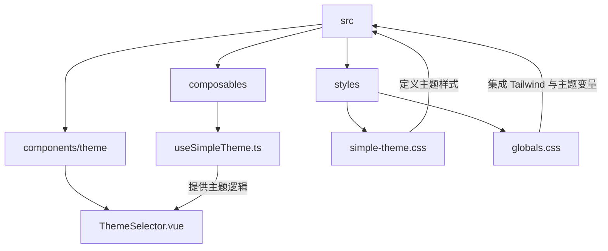
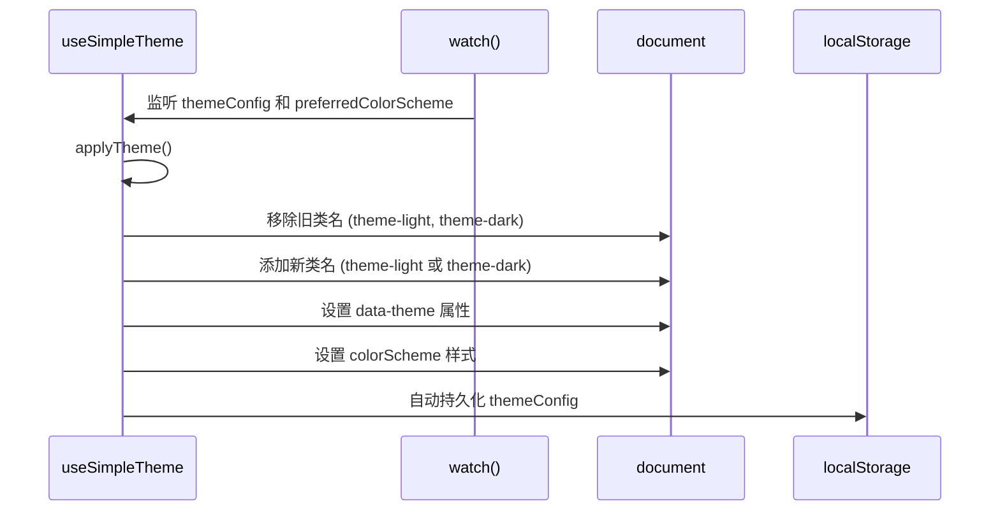
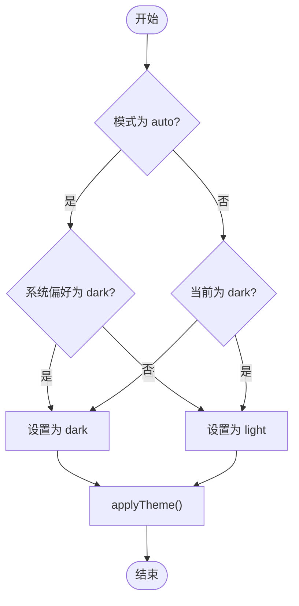
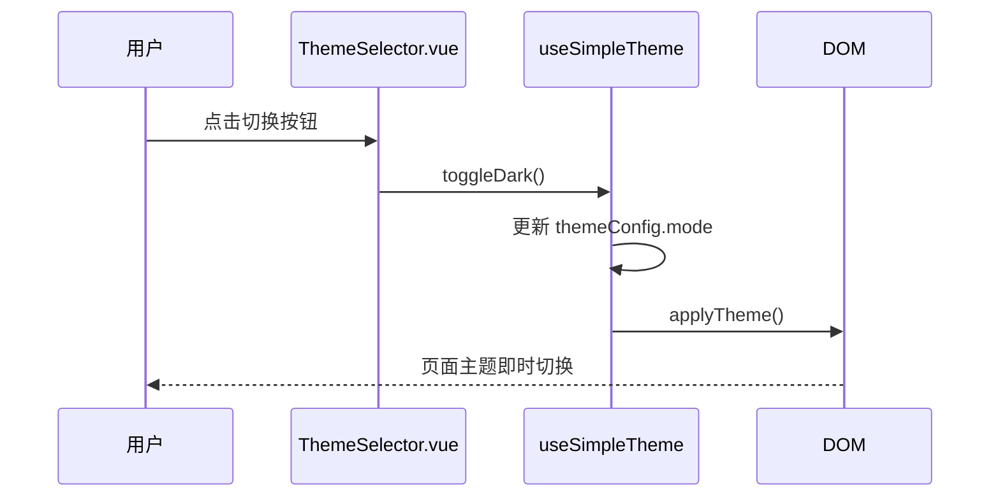

# 主题切换组合式函数

<cite>
**本文档引用的文件**  
- [useSimpleTheme.ts](file://src/composables/useSimpleTheme.ts)
- [simple-theme.css](file://src/styles/simple-theme.css)
- [globals.css](file://src/styles/globals.css)
- [ThemeSelector.vue](file://src/components/theme/ThemeSelector.vue)
</cite>

## 目录
1. [简介](#简介)
2. [项目结构](#项目结构)
3. [核心组件](#核心组件)
4. [架构概述](#架构概述)
5. [详细组件分析](#详细组件分析)
6. [依赖分析](#依赖分析)
7. [性能考虑](#性能考虑)
8. [故障排除指南](#故障排除指南)
9. [结论](#结论)

## 简介
本文档全面解析 `useSimpleTheme` 组合式函数的实现原理，详细说明其如何管理应用的主题状态（如浅色/深色模式），并通过操作 DOM 元素的 CSS 类和自定义属性实现动态样式切换。同时阐述其持久化用户偏好设置（通过 localStorage）的机制与初始化逻辑，并展示 `ThemeSelector` 组件如何调用该组合式函数完成主题切换交互。此外，还将深入解析 `simple-theme.css` 中定义的主题变量及其在 `globals.css` 中的应用方式，帮助开发者完整理解整个主题系统的工作流程。

## 项目结构
本项目采用标准的 Vue 3 + Vite 架构，主题相关代码集中于特定目录中，便于维护和扩展。



**图示来源**  
- [useSimpleTheme.ts](file://src/composables/useSimpleTheme.ts)
- [simple-theme.css](file://src/styles/simple-theme.css)
- [globals.css](file://src/styles/globals.css)
- [ThemeSelector.vue](file://src/components/theme/ThemeSelector.vue)

**本节来源**  
- [src](file://src)

## 核心组件
`useSimpleTheme` 是一个 Vue 组合式函数，用于统一管理应用的主题状态。它利用 VueUse 提供的 `usePreferredColorScheme` 检测系统偏好，并通过 `useStorage` 将用户选择持久化至 `localStorage`。通过计算属性动态确定当前激活的主题模式，并在 DOM 根元素上添加相应的 CSS 类名和 `data-theme` 属性，从而实现样式的动态切换。

**本节来源**  
- [useSimpleTheme.ts](file://src/composables/useSimpleTheme.ts#L1-L110)

## 架构概述
主题系统由三部分构成：状态管理（`useSimpleTheme.ts`）、样式定义（`simple-theme.css`）和用户交互（`ThemeSelector.vue`）。运行时，`useSimpleTheme` 监听配置变化并自动更新 DOM 结构，触发 CSS 变量的重新计算，实现无缝主题切换。

```mermaid
graph LR
A[用户操作] --> B[ThemeSelector.vue]
B --> C[useSimpleTheme.setThemeMode]
C --> D[更新 themeConfig]
D --> E[触发 watch 回调]
E --> F[applyTheme()]
F --> G[修改 document.documentElement class]
G --> H[激活 CSS 规则]
H --> I[样式重绘]
J[localStorage] --> D
K[系统偏好] --> C
```

**图示来源**  
- [useSimpleTheme.ts](file://src/composables/useSimpleTheme.ts#L1-L110)
- [ThemeSelector.vue](file://src/components/theme/ThemeSelector.vue)

## 详细组件分析

### useSimpleTheme 函数分析
该组合式函数封装了主题管理的核心逻辑，包括模式设置、状态响应、DOM 应用和持久化机制。

#### 状态与计算属性
```mermaid
classDiagram
class useSimpleTheme {
+themeConfig : Ref<SimpleThemeConfig>
+activeColorScheme : ComputedRef<'light'|'dark'>
+isDark : ComputedRef<boolean>
+setThemeMode(mode : SimpleThemeMode) : void
+toggleDark() : void
+getThemeTitle() : string
+applyTheme() : void
}
note right of useSimpleTheme
themeConfig 持久化存储于 localStorage
activeColorScheme 根据 mode 和系统偏好动态计算
end
```

**图示来源**  
- [useSimpleTheme.ts](file://src/composables/useSimpleTheme.ts#L15-L45)

#### 主题应用流程


**图示来源**  
- [useSimpleTheme.ts](file://src/composables/useSimpleTheme.ts#L60-L90)

#### 主题切换逻辑流程


**图示来源**  
- [useSimpleTheme.ts](file://src/composables/useSimpleTheme.ts#L95-L105)

**本节来源**  
- [useSimpleTheme.ts](file://src/composables/useSimpleTheme.ts#L1-L110)

### ThemeSelector 组件分析
`ThemeSelector` 是用户与主题系统交互的 UI 元素，调用 `useSimpleTheme` 提供的方法实现主题切换。



**图示来源**  
- [ThemeSelector.vue](file://src/components/theme/ThemeSelector.vue)
- [useSimpleTheme.ts](file://src/composables/useSimpleTheme.ts#L1-L110)

**本节来源**  
- [ThemeSelector.vue](file://src/components/theme/ThemeSelector.vue)

## 依赖分析
主题系统依赖于 Vue 3 的响应式系统和 VueUse 工具库，通过模块化设计实现低耦合。

```mermaid
graph TD
A[useSimpleTheme.ts] --> B[vue]
A --> C[@vueuse/core]
D[simple-theme.css] --> A
E[ThemeSelector.vue] --> A
F[globals.css] --> D
```

**图示来源**  
- [useSimpleTheme.ts](file://src/composables/useSimpleTheme.ts#L1)
- [simple-theme.css](file://src/styles/simple-theme.css)
- [globals.css](file://src/styles/globals.css)
- [ThemeSelector.vue](file://src/components/theme/ThemeSelector.vue)

**本节来源**  
- [useSimpleTheme.ts](file://src/composables/useSimpleTheme.ts#L1)
- [package.json](file://package.json)

## 性能考虑
- 使用 `watch` 监听关键状态变化，避免不必要的重复渲染
- CSS 变量结合类名切换，确保样式变更高效且可缓存
- 所有 DOM 操作集中于 `applyTheme` 方法，减少浏览器重排次数
- 利用 `useStorage` 的自动同步机制，避免手动操作 localStorage 的性能损耗

## 故障排除指南
- **主题未生效**：检查 `applyTheme` 是否被正确调用，确认 `document.documentElement` 是否正确获取
- **持久化失效**：确认浏览器是否禁用 localStorage，检查键名 `"simple-theme-config"` 是否冲突
- **样式错乱**：确保 `simple-theme.css` 已正确导入，检查 CSS 优先级是否被覆盖
- **自动模式不响应系统变化**：验证 `usePreferredColorScheme` 是否正常工作，测试系统主题切换是否触发回调

**本节来源**  
- [useSimpleTheme.ts](file://src/composables/useSimpleTheme.ts#L60-L90)
- [simple-theme.css](file://src/styles/simple-theme.css)

## 结论
`useSimpleTheme` 提供了一套简洁高效的前端主题管理系统，结合 CSS 变量与 Vue 响应式机制，实现了流畅的用户体验。通过合理的抽象与模块划分，使主题逻辑与 UI 完全解耦，便于维护和扩展。建议在实际项目中沿用此模式，以提升应用的可访问性和用户满意度。