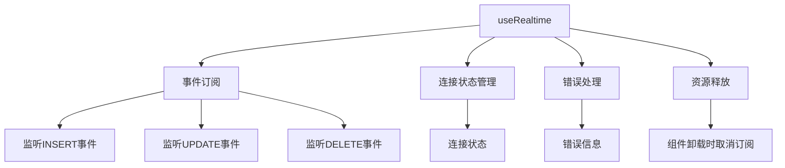
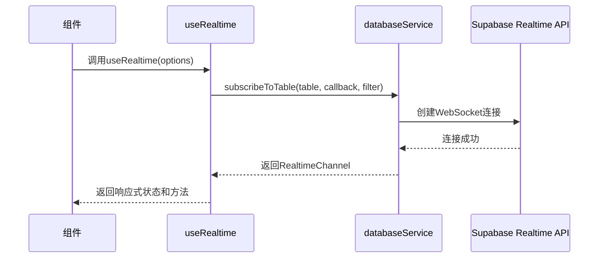
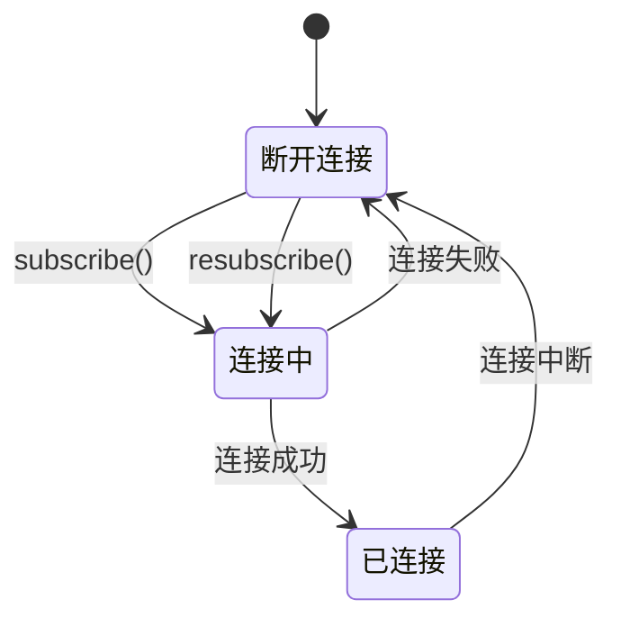
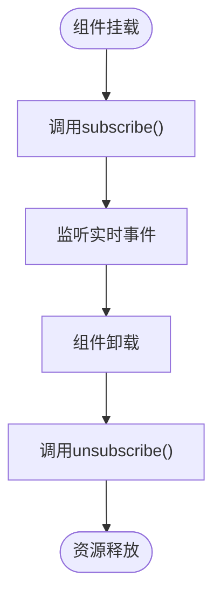
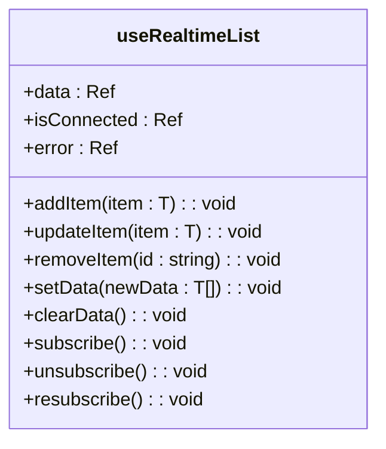
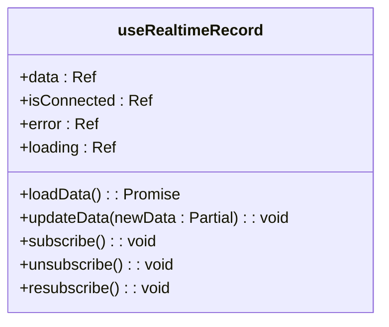
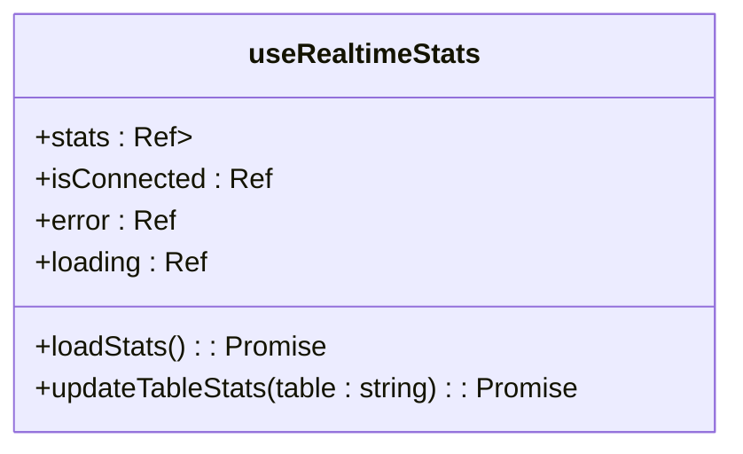

# 实时功能组合式函数

<cite>
**本文档中引用的文件**
- [useRealtime.ts](file://src/composables/useRealtime.ts)
- [databaseService.ts](file://src/services/databaseService.ts)
- [supabaseClient.ts](file://src/lib/supabaseClient.ts)
- [NotificationCenter.vue](file://src/components/notifications/NotificationCenter.vue)
- [ProductReviews.vue](file://src/components/reviews/ProductReviews.vue)
- [products.ts](file://src/stores/products.ts)
</cite>

## 目录
1. [简介](#简介)
2. [核心功能与架构](#核心功能与架构)
3. [连接建立与事件监听机制](#连接建立与事件监听机制)
4. [连接状态管理与错误重连策略](#连接状态管理与错误重连策略)
5. [资源释放与生命周期管理](#资源释放与生命周期管理)
6. [高级组合式函数](#高级组合式函数)
7. [实际应用示例](#实际应用示例)
8. [与Pinia Store集成](#与pinia-store集成)
9. [常见问题与解决方案](#常见问题与解决方案)
10. [性能优化建议](#性能优化建议)

## 简介
`useRealtime` 是一个基于 Vue 3 组合式 API 的实时功能组合式函数，它通过 Supabase Realtime API 建立 WebSocket 长连接，实现对数据库表的 INSERT、UPDATE、DELETE 变更事件的实时监听。该组合式函数提供了简洁的接口，使开发者能够轻松地在前端应用中实现数据的实时同步，确保用户界面能够即时响应后端数据的变化。

**Section sources**
- [useRealtime.ts](file://src/composables/useRealtime.ts)

## 核心功能与架构
`useRealtime` 组合式函数的核心功能包括事件订阅、连接状态管理、错误处理和资源释放。其架构设计遵循模块化原则，将不同的功能封装在独立的函数中，便于维护和扩展。



**Diagram sources**
- [useRealtime.ts](file://src/composables/useRealtime.ts)

**Section sources**
- [useRealtime.ts](file://src/composables/useRealtime.ts)

## 连接建立与事件监听机制
`useRealtime` 通过 `databaseService.subscribeToTable` 方法建立与 Supabase Realtime API 的 WebSocket 连接。该方法接收表名、回调函数和过滤条件作为参数，返回一个 `RealtimeChannel` 对象。



**Diagram sources**
- [useRealtime.ts](file://src/composables/useRealtime.ts)
- [databaseService.ts](file://src/services/databaseService.ts)

**Section sources**
- [useRealtime.ts](file://src/composables/useRealtime.ts)
- [databaseService.ts](file://src/services/databaseService.ts)

## 连接状态管理与错误重连策略
`useRealtime` 提供了连接状态管理和错误重连策略，确保在连接中断或发生错误时能够自动恢复。



**Diagram sources**
- [useRealtime.ts](file://src/composables/useRealtime.ts)

**Section sources**
- [useRealtime.ts](file://src/composables/useRealtime.ts)

## 资源释放与生命周期管理
`useRealtime` 在组件卸载时自动取消订阅，释放资源，避免内存泄漏。



**Diagram sources**
- [useRealtime.ts](file://src/composables/useRealtime.ts)

**Section sources**
- [useRealtime.ts](file://src/composables/useRealtime.ts)

## 高级组合式函数
`useRealtime` 提供了多个高级组合式函数，简化了常见场景的开发。

### useRealtimeList
用于实时同步数据列表。



**Diagram sources**
- [useRealtime.ts](file://src/composables/useRealtime.ts)

### useRealtimeRecord
用于实时同步单个记录。



**Diagram sources**
- [useRealtime.ts](file://src/composables/useRealtime.ts)

### useRealtimeStats
用于实时同步统计数据。



**Diagram sources**
- [useRealtime.ts](file://src/composables/useRealtime.ts)

**Section sources**
- [useRealtime.ts](file://src/composables/useRealtime.ts)

## 实际应用示例
### 监听用户通知
```typescript
import { useRealtime } from '@/composables/useRealtime';
import { notificationService } from '@/services/notificationService';

const { subscribe, unsubscribe } = useRealtime({
  table: 'notifications',
  filter: `user_id=eq.${userId}`,
  onInsert: (payload) => {
    // 处理新通知
    console.log('新通知:', payload.new);
  },
  onUpdate: (payload) => {
    // 处理通知更新
    console.log('通知更新:', payload.new);
  },
  onDelete: (payload) => {
    // 处理通知删除
    console.log('通知删除:', payload.old);
  },
});

// 开始监听
subscribe();

// 停止监听
// unsubscribe();
```

**Section sources**
- [useRealtime.ts](file://src/composables/useRealtime.ts)
- [NotificationCenter.vue](file://src/components/notifications/NotificationCenter.vue)

### 监听评价更新
```typescript
import { useRealtime } from '@/composables/useRealtime';
import { reviewService } from '@/services/reviewService';

const { subscribe, unsubscribe } = useRealtime({
  table: 'product_reviews',
  filter: `product_id=eq.${productId}`,
  onInsert: (payload) => {
    // 处理新评价
    console.log('新评价:', payload.new);
  },
  onUpdate: (payload) => {
    // 处理评价更新
    console.log('评价更新:', payload.new);
  },
  onDelete: (payload) => {
    // 处理评价删除
    console.log('评价删除:', payload.old);
  },
});

// 开始监听
subscribe();

// 停止监听
// unsubscribe();
```

**Section sources**
- [useRealtime.ts](file://src/composables/useRealtime.ts)
- [ProductReviews.vue](file://src/components/reviews/ProductReviews.vue)

## 与Pinia Store集成
`useRealtime` 可以与 Pinia Store 集成，确保数据变更能自动触发 UI 响应式更新。

```typescript
import { defineStore } from 'pinia';
import { useRealtime } from '@/composables/useRealtime';

export const useProductsStore = defineStore('products', () => {
  const products = ref<Product[]>([]);

  // 使用useRealtime监听产品表的变更
  useRealtime({
    table: 'products',
    onInsert: (payload) => {
      products.value.unshift(payload.new);
    },
    onUpdate: (payload) => {
      const index = products.value.findIndex(p => p.id === payload.new.id);
      if (index !== -1) {
        products.value[index] = payload.new;
      }
    },
    onDelete: (payload) => {
      products.value = products.value.filter(p => p.id !== payload.old.id);
    },
  });

  return { products };
});
```

**Section sources**
- [useRealtime.ts](file://src/composables/useRealtime.ts)
- [products.ts](file://src/stores/products.ts)

## 常见问题与解决方案
### 连接中断处理
当 WebSocket 连接中断时，`useRealtime` 会自动尝试重新连接。可以通过 `resubscribe` 方法手动触发重连。

```typescript
// 手动重连
resubscribe();
```

### 权限不足错误排查
如果出现权限不足的错误，需要检查 Supabase 项目的 RLS（Row Level Security）策略是否正确配置。

```sql
-- 检查RLS策略
SELECT * FROM pg_policies WHERE tablename = 'your_table';
```

### 性能瓶颈优化
- **减少不必要的订阅**：只订阅需要的表和字段。
- **使用过滤条件**：通过 `filter` 参数减少传输的数据量。
- **批量处理事件**：对于频繁的事件，可以使用防抖或节流技术。

**Section sources**
- [useRealtime.ts](file://src/composables/useRealtime.ts)
- [databaseService.ts](file://src/services/databaseService.ts)

## 性能优化建议
1. **合理使用缓存**：在 `databaseService` 中使用缓存机制，减少对数据库的直接查询。
2. **优化查询语句**：确保查询语句尽可能高效，避免全表扫描。
3. **限制订阅范围**：通过 `filter` 参数精确控制订阅的数据范围。
4. **监控连接状态**：使用 `useRealtimeConnection` 监控连接质量，及时发现和解决问题。

**Section sources**
- [useRealtime.ts](file://src/composables/useRealtime.ts)
- [databaseService.ts](file://src/services/databaseService.ts)