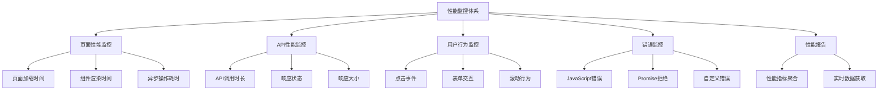
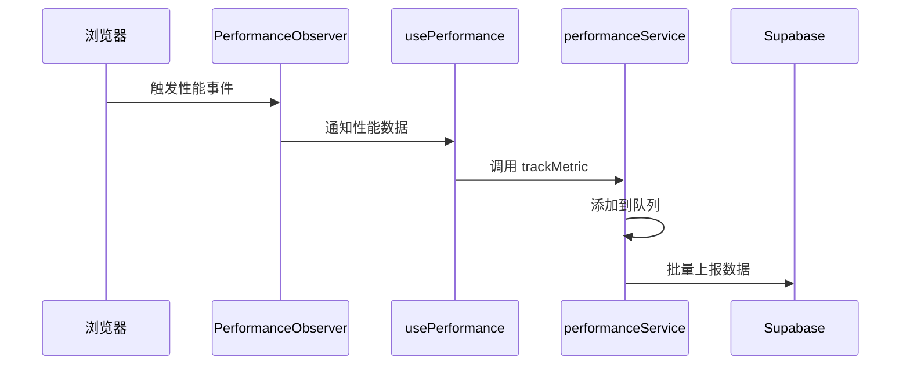
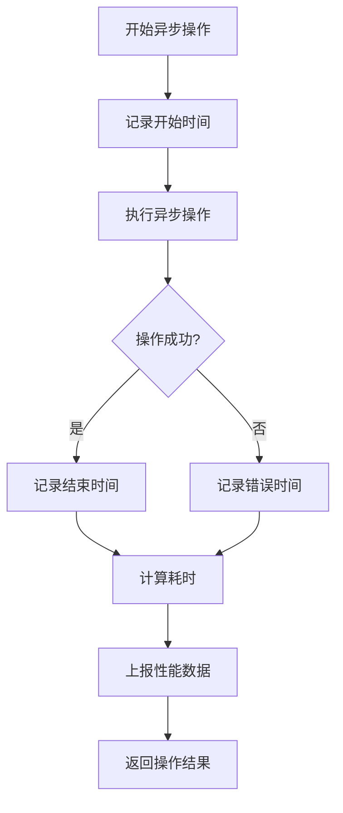
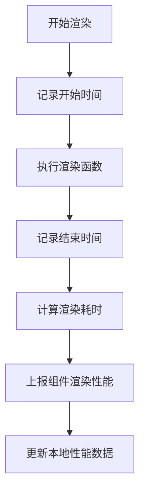
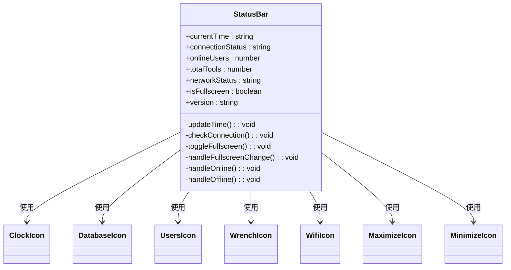
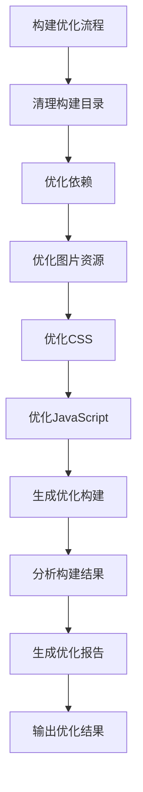
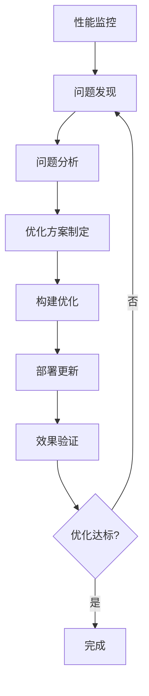

# 性能优化组合式函数

<cite>
**本文档引用的文件**
- [usePerformance.ts](file://src/composables/usePerformance.ts)
- [performanceService.ts](file://src/services/performanceService.ts)
- [StatusBar.vue](file://src/components/StatusBar.vue)
- [optimize-build.mjs](file://scripts/performance/optimize-build.mjs)
</cite>

## 目录
1. [简介](#简介)
2. [核心功能分析](#核心功能分析)
3. [性能指标收集机制](#性能指标收集机制)
4. [性能分析钩子函数](#性能分析钩子函数)
5. [实时性能数据显示](#实时性能数据显示)
6. [构建优化协同策略](#构建优化协同策略)
7. [性能瓶颈诊断与优化建议](#性能瓶颈诊断与优化建议)
8. [结论](#结论)

## 简介
`usePerformance.ts` 是一个全面的前端性能监控与优化组合式函数，旨在通过系统化的性能指标收集、分析和上报机制，提升应用的用户体验和运行效率。该模块集成了页面性能监控、API性能跟踪、用户行为分析和错误监控等功能，为开发者提供了全方位的性能洞察。

**Section sources**
- [usePerformance.ts](file://src/composables/usePerformance.ts#L0-L488)

## 核心功能分析
`usePerformance.ts` 模块通过多个专门的组合式函数实现了全面的性能监控体系：

- `usePagePerformance`: 负责页面加载性能监控
- `useAPIPerformance`: 专注于API调用性能跟踪
- `useUserBehavior`: 记录用户交互行为
- `useErrorTracking`: 捕获和上报错误信息
- `usePerformanceReport`: 生成性能报告
- `usePerformanceMonitoring`: 综合所有性能监控功能

这些函数共同构成了一个完整的性能监控解决方案，能够从多个维度收集应用的运行数据。

**Diagram sources**
- [usePerformance.ts](file://src/composables/usePerformance.ts#L0-L488)

**Section sources**
- [usePerformance.ts](file://src/composables/usePerformance.ts#L0-L488)

## 性能指标收集机制
`usePerformance.ts` 通过与 `performanceService` 的深度集成，实现了关键性能指标的自动化收集和上报。

### Web Vitals 指标收集
模块利用 Performance Observer API 收集核心 Web Vitals 指标：

- **FCP (首次内容绘制)**: 通过观察 `first-contentful-paint` 条目获取
- **LCP (最大内容绘制)**: 通过观察 `largest-contentful-paint` 条目获取
- **TTFB (首字节时间)**: 从导航性能条目中计算得出
- **FID (首次输入延迟)**: 通过观察 `first-input` 条目获取
- **CLS (累积布局偏移)**: 通过观察 `layout-shift` 条目获取

**Diagram sources**
- [usePerformance.ts](file://src/composables/usePerformance.ts#L0-L488)
- [performanceService.ts](file://src/services/performanceService.ts#L0-L499)

**Section sources**
- [usePerformance.ts](file://src/composables/usePerformance.ts#L154-L194)
- [performanceService.ts](file://src/services/performanceService.ts#L154-L194)

### 数据上报流程
性能数据通过 `performanceService` 实现批量上报，确保不影响主应用性能：

1. 收集的性能指标首先被添加到内存队列
2. 当队列达到预设大小（默认10条）或定时器触发（默认5秒）
3. 数据批量发送到 Supabase 后端存储
4. 发送失败时自动重试，确保数据不丢失

## 性能分析钩子函数
`usePerformance.ts` 提供了多种性能分析钩子函数，用于监控特定操作的耗时。

### 异步操作监控
`measureAsyncOperation` 钩子函数用于监控异步操作的执行时间：

该函数不仅监控成功操作的耗时，还能捕获失败操作的执行时间，并自动上报相关错误信息。

### 组件渲染监控
`measureComponentRender` 钩子函数用于监控组件的渲染性能：

**Section sources**
- [usePerformance.ts](file://src/composables/usePerformance.ts#L41-L90)

## 实时性能数据显示
`StatusBar` 组件利用性能监控数据，为用户提供实时的系统状态信息。

### 状态栏性能集成
虽然 `StatusBar.vue` 当前主要显示连接状态、在线用户数等信息，但其架构设计为性能数据展示预留了空间：

未来可以通过集成 `usePerformance` 提供的实时性能指标，扩展状态栏的功能，显示页面加载时间、内存使用等关键性能指标。

**Section sources**
- [StatusBar.vue](file://src/components/StatusBar.vue#L0-L278)

## 构建优化协同策略
`usePerformance.ts` 的运行时性能监控与 `optimize-build.mjs` 的构建时优化形成了完整的性能优化闭环。

### 构建优化脚本功能
`optimize-build.mjs` 脚本提供了全面的构建优化功能：

- 清理构建目录
- 优化依赖管理
- 图片资源压缩
- CSS 代码优化
- JavaScript 代码优化
- 生成优化构建
- 分析构建结果
- 生成优化报告

### 运行时与构建时协同
运行时性能监控与构建优化的协同策略体现在：

1. **问题发现**: `usePerformance` 在运行时发现性能瓶颈
2. **问题定位**: 通过性能报告定位具体问题（如大文件加载慢）
3. **构建优化**: `optimize-build.mjs` 针对性优化相关资源
4. **效果验证**: 更新后的应用通过 `usePerformance` 验证优化效果

这种闭环的优化流程确保了性能问题能够被持续发现、解决和验证。

**Section sources**
- [optimize-build.mjs](file://scripts/performance/optimize-build.mjs#L0-L436)

## 性能瓶颈诊断与优化建议
基于 `usePerformance.ts` 的监控能力和 `optimize-build.mjs` 的优化功能，可以制定系统的性能优化策略。

### 常见性能问题诊断
| 问题类型 | 诊断方法 | 优化建议 |
|--------|--------|--------|
| 页面加载慢 | 监控 FCP、LCP、TTFB | 优化关键渲染路径、预加载关键资源 |
| API 响应慢 | 监控 API 调用时长 | 优化后端查询、添加缓存、压缩响应 |
| 内存泄漏 | 监控内存使用趋势 | 检查事件监听器、定时器、闭包引用 |
| 组件渲染慢 | 监控组件渲染时间 | 优化组件逻辑、使用虚拟滚动、懒加载 |
| 资源过大 | 分析构建结果 | 压缩图片、代码分割、Tree Shaking |

### 优化实施流程

通过这一流程，可以系统性地提升应用性能，确保用户体验的持续优化。

**Section sources**
- [usePerformance.ts](file://src/composables/usePerformance.ts#L0-L488)
- [performanceService.ts](file://src/services/performanceService.ts#L0-L499)
- [optimize-build.mjs](file://scripts/performance/optimize-build.mjs#L0-L436)

## 结论
`usePerformance.ts` 作为一个全面的性能监控组合式函数，通过与 `performanceService` 的深度集成，实现了关键性能指标的自动化收集和上报。其提供的性能分析钩子函数为监控异步操作和组件渲染提供了便利。虽然当前 `StatusBar` 组件尚未完全利用这些性能数据，但其架构为未来扩展预留了空间。与 `optimize-build.mjs` 构建优化脚本的协同，形成了运行时监控与构建时优化的完整闭环，为持续性能优化提供了坚实的基础。