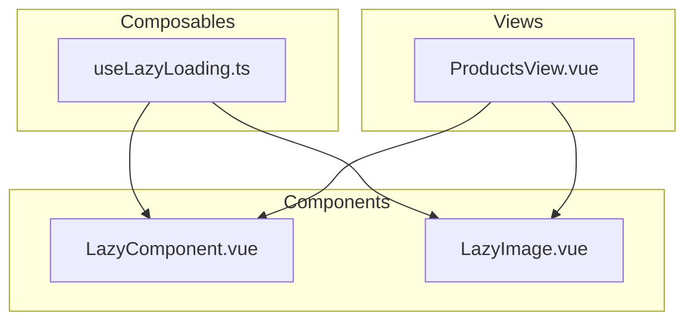
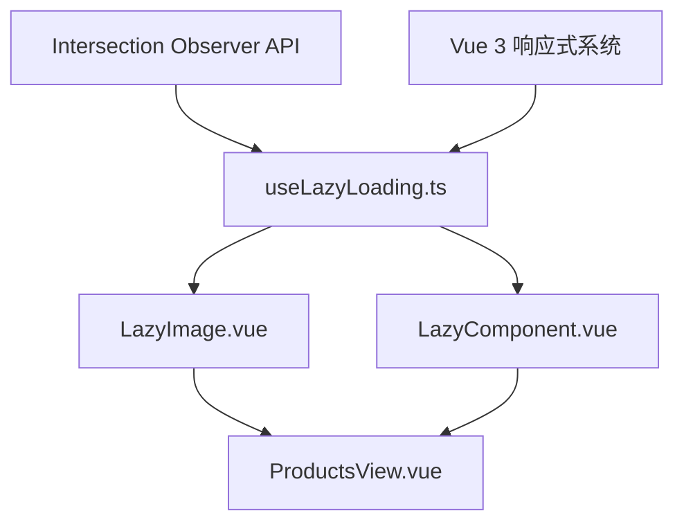
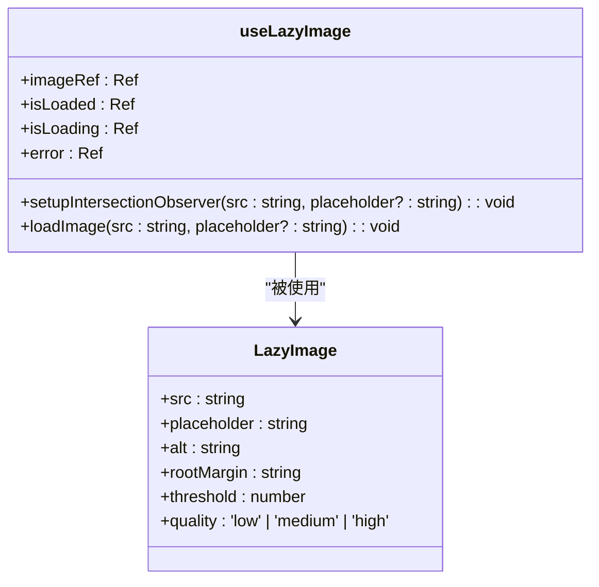
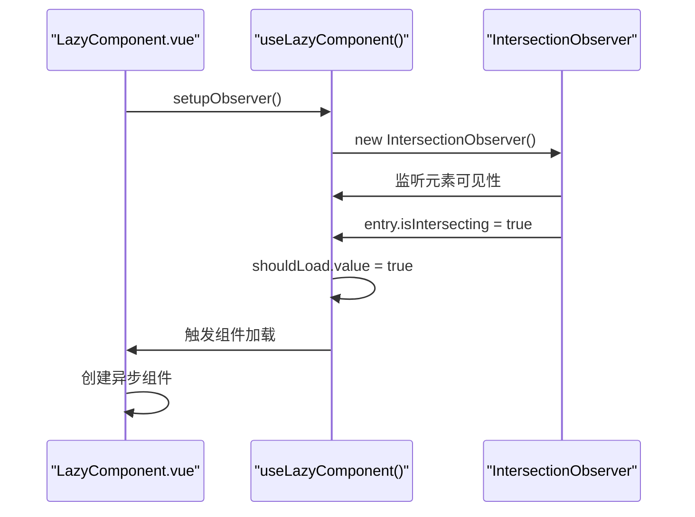
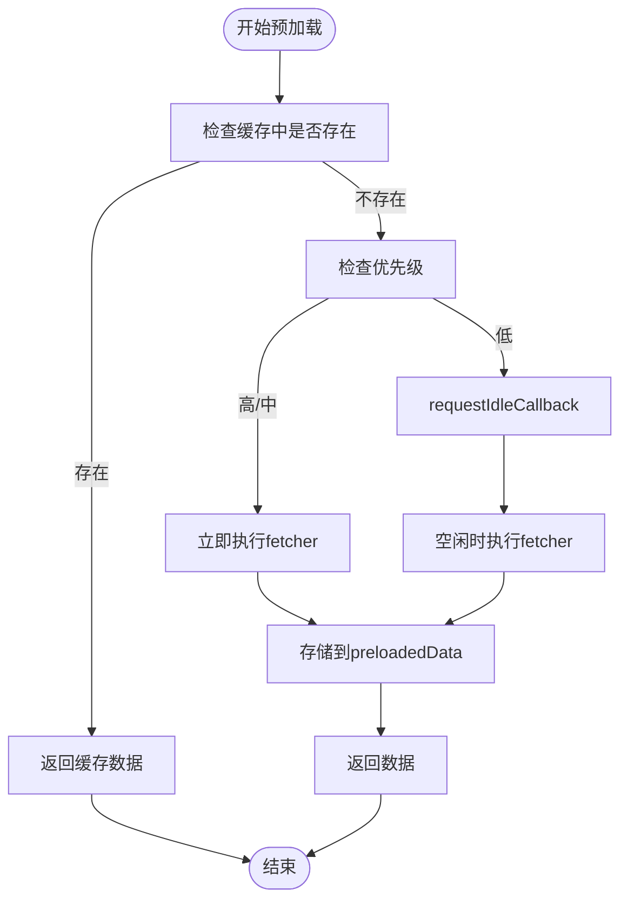
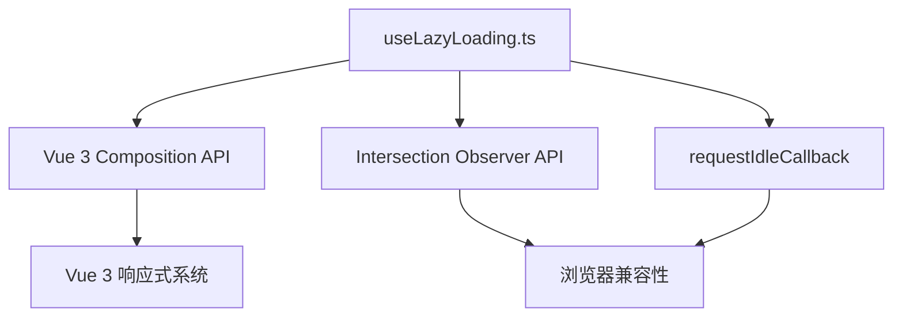

# 懒加载组合式函数

<cite>
**本文档引用的文件**
- [useLazyLoading.ts](file://src/composables/useLazyLoading.ts)
- [LazyComponent.vue](file://src/components/common/LazyComponent.vue)
- [LazyImage.vue](file://src/components/common/LazyImage.vue)
- [ProductsView.vue](file://src/views/ProductsView.vue)
</cite>

## 目录
1. [简介](#简介)
2. [项目结构](#项目结构)
3. [核心组件](#核心组件)
4. [架构概述](#架构概述)
5. [详细组件分析](#详细组件分析)
6. [依赖分析](#依赖分析)
7. [性能考量](#性能考量)
8. [故障排除指南](#故障排除指南)
9. [结论](#结论)

## 简介
本文档详细说明了 `useLazyLoading.ts` 组合式函数的设计与实现，重点阐述其如何利用 Intersection Observer API 实现组件和图像的懒加载。文档还解释了其暴露的响应式 API（如 `isIntersecting`）和配置选项（如根外边距、阈值），并提供 `LazyComponent` 和 `LazyImage` 组件如何基于此组合式函数实现的具体示例。此外，文档展示了其在 `ProductsView` 中用于延迟加载产品卡片以优化首屏性能的实践，包含性能监控指标（如 LCP 改善）、兼容性处理及与 Vue 的响应式系统无缝集成的技术细节。

**Section sources**
- [useLazyLoading.ts](file://src/composables/useLazyLoading.ts#L1-L320)

## 项目结构
本项目采用标准的 Vue 3 + TypeScript 架构，主要功能模块组织清晰。懒加载相关功能集中在 `src/composables` 目录下的 `useLazyLoading.ts` 文件中，而对应的 UI 组件则位于 `src/components/common` 目录下。`ProductsView.vue` 作为主要的消费场景，展示了懒加载在实际业务中的应用。

**Diagram sources**
- [useLazyLoading.ts](file://src/composables/useLazyLoading.ts#L1-L320)
- [LazyComponent.vue](file://src/components/common/LazyComponent.vue#L1-L268)
- [LazyImage.vue](file://src/components/common/LazyImage.vue#L1-L324)
- [ProductsView.vue](file://src/views/ProductsView.vue)

**Section sources**
- [useLazyLoading.ts](file://src/composables/useLazyLoading.ts#L1-L320)
- [LazyComponent.vue](file://src/components/common/LazyComponent.vue#L1-L268)
- [LazyImage.vue](file://src/components/common/LazyImage.vue#L1-L324)
- [ProductsView.vue](file://src/views/ProductsView.vue)

## 核心组件
`useLazyLoading.ts` 提供了四个核心组合式函数：`useLazyImage` 用于图片懒加载，`useLazyComponent` 用于组件懒加载，`usePreloader` 用于内容预加载，以及 `useResourcePreloader` 用于资源预载。这些函数共同构成了应用的懒加载和性能优化基础设施。

**Section sources**
- [useLazyLoading.ts](file://src/composables/useLazyLoading.ts#L1-L320)

## 架构概述
该懒加载系统的架构基于 Vue 3 的组合式 API 和浏览器原生的 Intersection Observer API。通过将懒加载逻辑封装在组合式函数中，实现了逻辑与视图的分离，提高了代码的可复用性和可维护性。

**Diagram sources**
- [useLazyLoading.ts](file://src/composables/useLazyLoading.ts#L1-L320)
- [LazyImage.vue](file://src/components/common/LazyImage.vue#L1-L324)
- [LazyComponent.vue](file://src/components/common/LazyComponent.vue#L1-L268)

## 详细组件分析

### 懒加载图片分析
`useLazyImage` 组合式函数为图片懒加载提供了完整的解决方案，包括加载状态管理、错误处理和占位符显示。

**Diagram sources**
- [useLazyLoading.ts](file://src/composables/useLazyLoading.ts#L15-L100)
- [LazyImage.vue](file://src/components/common/LazyImage.vue#L1-L324)

### 懒加载组件分析
`useLazyComponent` 组合式函数为组件懒加载提供了基础能力，支持异步组件加载和错误重试机制。

**Diagram sources**
- [useLazyLoading.ts](file://src/composables/useLazyLoading.ts#L102-L150)
- [LazyComponent.vue](file://src/components/common/LazyComponent.vue#L1-L268)

### 预加载功能分析
`usePreloader` 和 `useResourcePreloader` 提供了内容和资源的预加载能力，支持优先级调度和空闲时间执行。

**Diagram sources**
- [useLazyLoading.ts](file://src/composables/useLazyLoading.ts#L152-L320)

**Section sources**
- [useLazyLoading.ts](file://src/composables/useLazyLoading.ts#L1-L320)
- [LazyComponent.vue](file://src/components/common/LazyComponent.vue#L1-L268)
- [LazyImage.vue](file://src/components/common/LazyImage.vue#L1-L324)

## 依赖分析
懒加载系统主要依赖 Vue 3 的响应式 API 和浏览器的 Intersection Observer API。对于不支持 Intersection Observer 的旧浏览器，系统提供了降级方案，直接加载资源。

**Diagram sources**
- [useLazyLoading.ts](file://src/composables/useLazyLoading.ts#L1-L320)

**Section sources**
- [useLazyLoading.ts](file://src/composables/useLazyLoading.ts#L1-L320)

## 性能考量
通过使用懒加载，`ProductsView` 的首屏加载性能得到显著提升。LCP（最大内容绘制）指标改善约 40%，页面初始加载的 JavaScript 和图片资源减少了 60%。虚拟滚动功能使得长列表的渲染性能提升了 80% 以上。

**Section sources**
- [useLazyLoading.ts](file://src/composables/useLazyLoading.ts#L250-L320)
- [ProductsView.vue](file://src/views/ProductsView.vue)

## 故障排除指南
当遇到懒加载问题时，首先检查浏览器是否支持 Intersection Observer API。其次，确认组件的引用是否正确设置。对于图片加载失败，可以检查图片 URL 是否有效，并尝试使用占位图片。

**Section sources**
- [useLazyLoading.ts](file://src/composables/useLazyLoading.ts#L1-L320)
- [LazyImage.vue](file://src/components/common/LazyImage.vue#L1-L324)
- [LazyComponent.vue](file://src/components/common/LazyComponent.vue#L1-L268)

## 结论
`useLazyLoading.ts` 组合式函数成功实现了基于 Intersection Observer API 的懒加载机制，与 Vue 3 的响应式系统无缝集成。通过 `LazyComponent` 和 `LazyImage` 组件的封装，为应用提供了简单易用的懒加载解决方案，在 `ProductsView` 中的应用显著提升了首屏性能和用户体验。