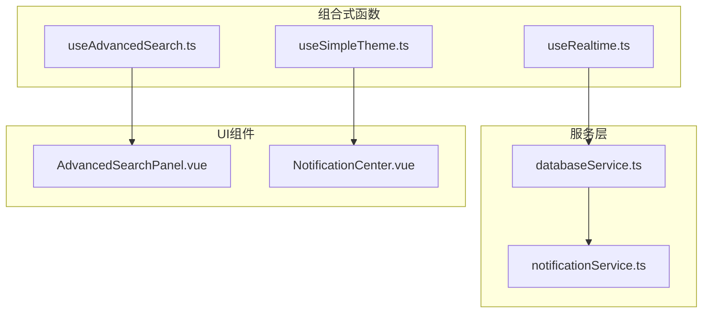
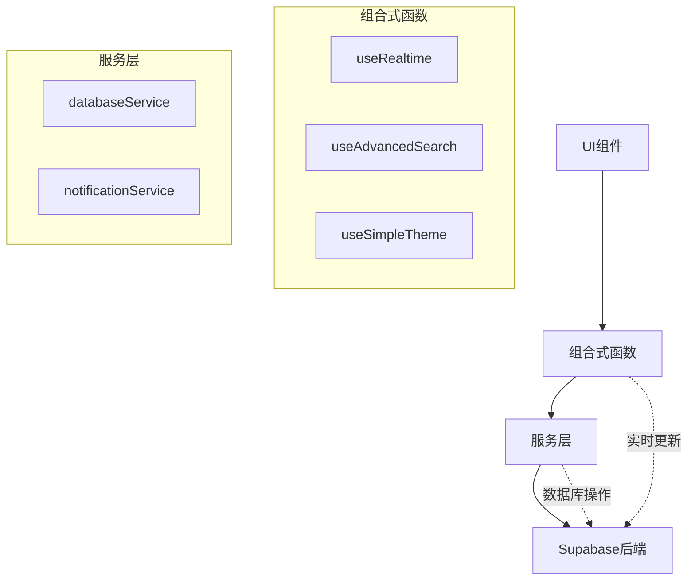
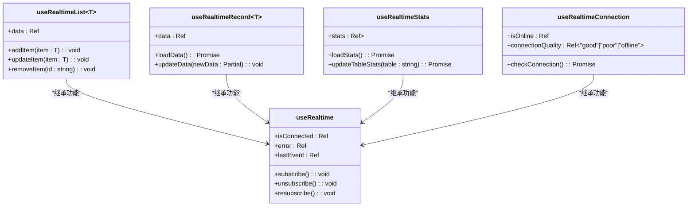
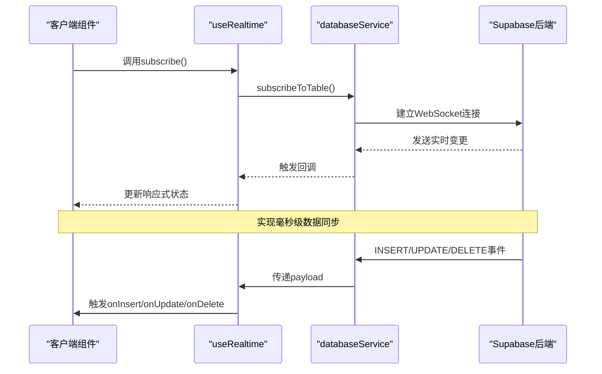
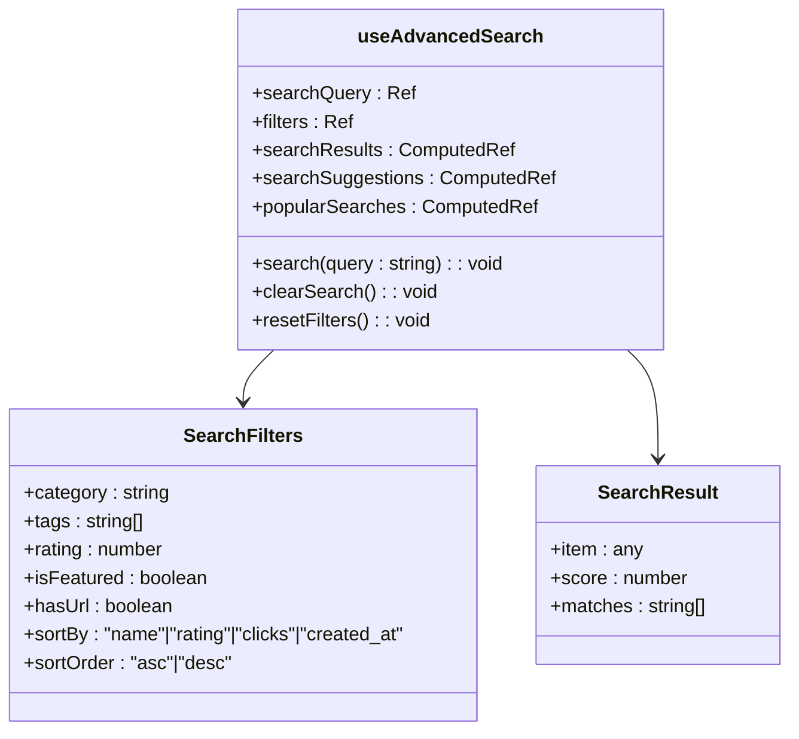
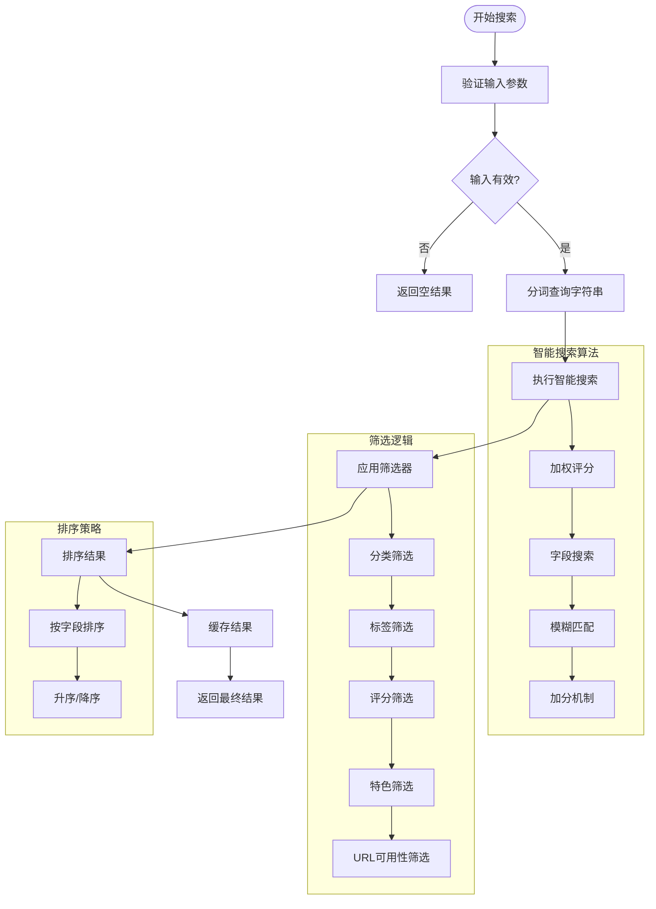
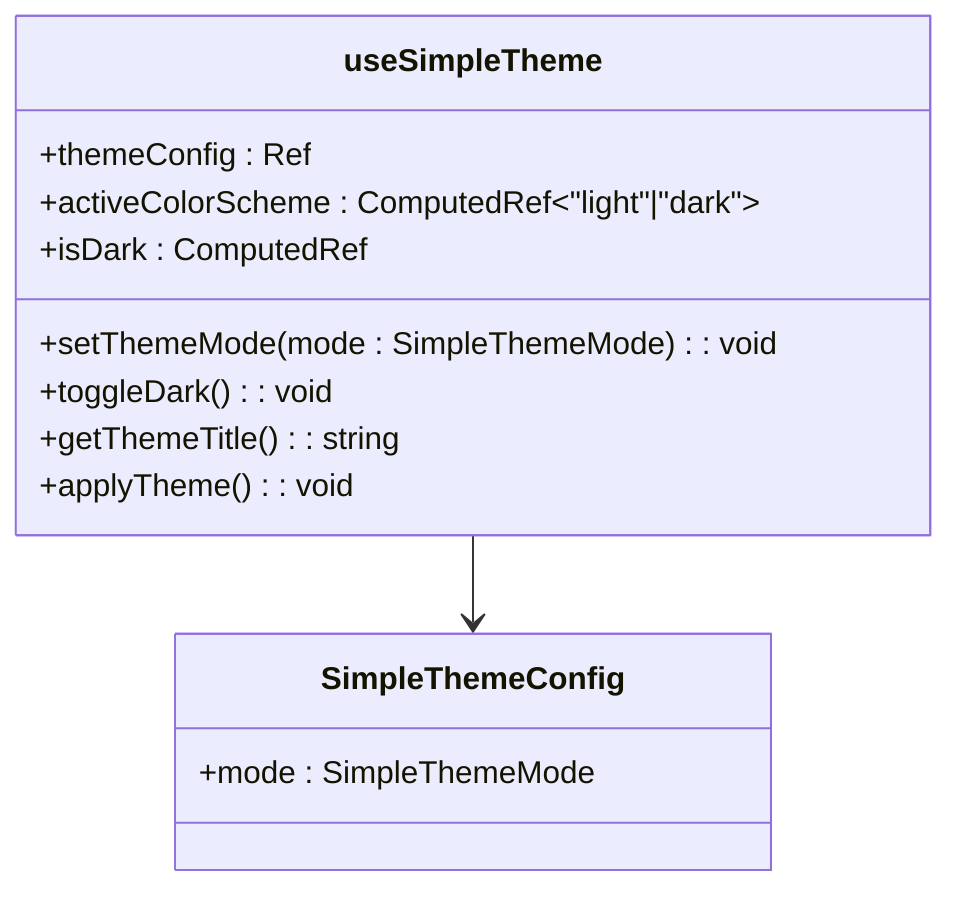
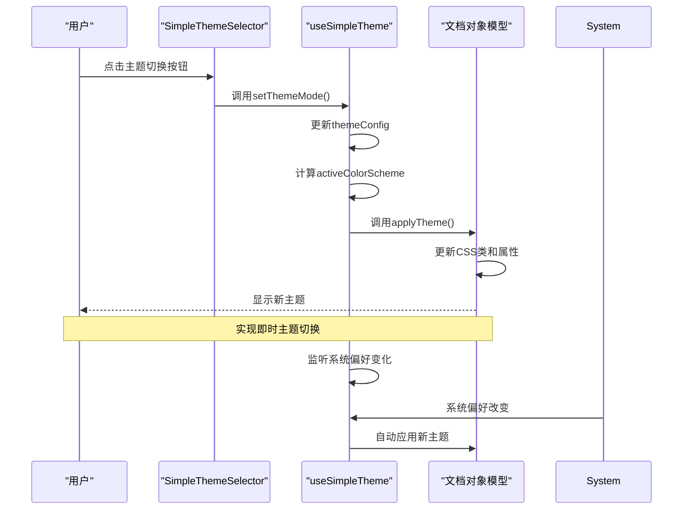
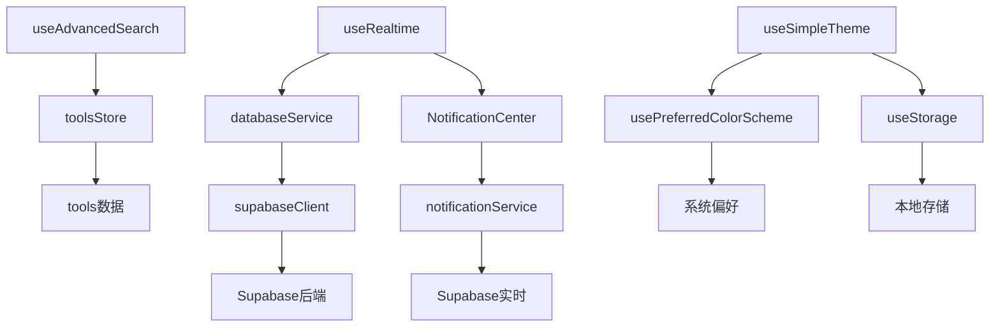

# 组合式函数

<cite>
**本文档引用的文件**   
- [useRealtime.ts](file://src/composables/useRealtime.ts)
- [useAdvancedSearch.ts](file://src/composables/useAdvancedSearch.ts)
- [useSimpleTheme.ts](file://src/composables/useSimpleTheme.ts)
- [databaseService.ts](file://src/services/databaseService.ts)
- [supabaseClient.ts](file://src/lib/supabaseClient.ts)
- [AdvancedSearchPanel.vue](file://src/components/search/AdvancedSearchPanel.vue)
- [SimpleThemeSelector.vue](file://src/components/theme/SimpleThemeSelector.vue)
- [NotificationCenter.vue](file://src/components/notifications/NotificationCenter.vue)
- [notificationService.ts](file://src/services/notificationService.ts)
</cite>

## 目录
1. [简介](#简介)
2. [项目结构](#项目结构)
3. [核心组件](#核心组件)
4. [架构概述](#架构概述)
5. [详细组件分析](#详细组件分析)
6. [依赖分析](#依赖分析)
7. [性能考虑](#性能考虑)
8. [故障排除指南](#故障排除指南)
9. [结论](#结论)

## 简介
本文档详细阐述了组合式函数（Composables）在逻辑复用与关注点分离中的核心作用。重点分析了`useRealtime.ts`如何利用Supabase Realtime API建立WebSocket连接并监听数据库变更，实现通知与数据同步；`useAdvancedSearch.ts`如何封装搜索参数构建、过滤逻辑与结果缓存机制；以及`useSimpleTheme.ts`如何管理主题切换状态并与CSS变量联动。文档还展示了这些composables在组件中如何通过ref响应式引用，并提供错误边界处理、资源清理和测试模拟的指导方案。

## 项目结构
本项目采用标准的Vue 3 + TypeScript架构，组合式函数集中存放在`src/composables`目录下，服务逻辑位于`src/services`目录，UI组件按功能模块组织在`src/components`目录中。这种结构清晰地分离了不同关注点，便于维护和扩展。

**图示来源**
- [useRealtime.ts](file://src/composables/useRealtime.ts)
- [useAdvancedSearch.ts](file://src/composables/useAdvancedSearch.ts)
- [useSimpleTheme.ts](file://src/composables/useSimpleTheme.ts)
- [databaseService.ts](file://src/services/databaseService.ts)
- [notificationService.ts](file://src/services/notificationService.ts)
- [AdvancedSearchPanel.vue](file://src/components/search/AdvancedSearchPanel.vue)
- [SimpleThemeSelector.vue](file://src/components/theme/SimpleThemeSelector.vue)
- [NotificationCenter.vue](file://src/components/notifications/NotificationCenter.vue)

**章节来源**
- [src/composables](file://src/composables)
- [src/services](file://src/services)
- [src/components](file://src/components)

## 核心组件
本文档的核心组件包括三个关键的组合式函数：`useRealtime`用于实现实时数据同步，`useAdvancedSearch`提供高级搜索功能，`useSimpleTheme`管理主题切换逻辑。这些组件通过响应式引用在Vue组件中使用，实现了逻辑的高效复用。

**章节来源**
- [useRealtime.ts](file://src/composables/useRealtime.ts)
- [useAdvancedSearch.ts](file://src/composables/useAdvancedSearch.ts)
- [useSimpleTheme.ts](file://src/composables/useSimpleTheme.ts)

## 架构概述
系统架构采用分层设计，组合式函数作为中间层，连接UI组件与底层服务。`useRealtime`依赖`databaseService`提供的Supabase连接，`useAdvancedSearch`直接操作工具商店的数据，`useSimpleTheme`则利用VueUse库的系统偏好检测功能。这种架构确保了各层之间的松耦合。

**图示来源**
- [useRealtime.ts](file://src/composables/useRealtime.ts)
- [useAdvancedSearch.ts](file://src/composables/useAdvancedSearch.ts)
- [useSimpleTheme.ts](file://src/composables/useSimpleTheme.ts)
- [databaseService.ts](file://src/services/databaseService.ts)
- [notificationService.ts](file://src/services/notificationService.ts)

## 详细组件分析
本节深入分析每个组合式函数的实现细节、使用方法和最佳实践。

### useRealtime 实时数据同步
`useRealtime`组合式函数封装了Supabase Realtime API的复杂性，提供简洁的接口用于监听数据库变更。它支持多种使用模式，包括通用实时监听、列表同步、单记录同步和统计同步。

#### 实时同步架构

**图示来源**
- [useRealtime.ts](file://src/composables/useRealtime.ts)

#### 实时数据流

**图示来源**
- [useRealtime.ts](file://src/composables/useRealtime.ts)
- [databaseService.ts](file://src/services/databaseService.ts)

**章节来源**
- [useRealtime.ts](file://src/composables/useRealtime.ts)
- [databaseService.ts](file://src/services/databaseService.ts)

### useAdvancedSearch 高级搜索
`useAdvancedSearch`组合式函数提供了一套完整的搜索解决方案，包括智能搜索算法、多维度过滤、结果排序和搜索历史管理。它与`AdvancedSearchPanel.vue`组件紧密配合，为用户提供丰富的搜索体验。

#### 搜索功能架构

**图示来源**
- [useAdvancedSearch.ts](file://src/composables/useAdvancedSearch.ts)

#### 搜索处理流程

**图示来源**
- [useAdvancedSearch.ts](file://src/composables/useAdvancedSearch.ts)

**章节来源**
- [useAdvancedSearch.ts](file://src/composables/useAdvancedSearch.ts)
- [AdvancedSearchPanel.vue](file://src/components/search/AdvancedSearchPanel.vue)

### useSimpleTheme 主题管理
`useSimpleTheme`组合式函数提供了简洁的主题管理解决方案，支持浅色、深色和跟随系统三种模式。它与CSS变量联动，确保主题切换的平滑性和一致性。

#### 主题管理架构

**图示来源**
- [useSimpleTheme.ts](file://src/composables/useSimpleTheme.ts)

#### 主题切换流程

**图示来源**
- [useSimpleTheme.ts](file://src/composables/useSimpleTheme.ts)
- [SimpleThemeSelector.vue](file://src/components/theme/SimpleThemeSelector.vue)

**章节来源**
- [useSimpleTheme.ts](file://src/composables/useSimpleTheme.ts)
- [SimpleThemeSelector.vue](file://src/components/theme/SimpleThemeSelector.vue)

## 依赖分析
组合式函数与其他系统组件存在明确的依赖关系，这些依赖确保了功能的完整性和数据的一致性。

**图示来源**
- [useRealtime.ts](file://src/composables/useRealtime.ts)
- [useAdvancedSearch.ts](file://src/composables/useAdvancedSearch.ts)
- [useSimpleTheme.ts](file://src/composables/useSimpleTheme.ts)
- [databaseService.ts](file://src/services/databaseService.ts)
- [supabaseClient.ts](file://src/lib/supabaseClient.ts)
- [notificationService.ts](file://src/services/notificationService.ts)
- [NotificationCenter.vue](file://src/components/notifications/NotificationCenter.vue)

**章节来源**
- [src/composables](file://src/composables)
- [src/services](file://src/services)
- [src/lib](file://src/lib)
- [src/components](file://src/components)

## 性能考虑
组合式函数在设计时充分考虑了性能优化，通过多种机制确保应用的响应速度和资源效率。

- **useRealtime**：自动管理WebSocket连接的生命周期，在组件卸载时自动取消订阅，避免内存泄漏。
- **useAdvancedSearch**：采用智能缓存策略，对搜索结果进行加权评分，提高搜索效率。
- **useSimpleTheme**：利用计算属性和响应式系统，最小化DOM操作，实现流畅的主题切换。
- 所有组合式函数都遵循单一职责原则，确保每个函数只关注一个特定功能领域。

## 故障排除指南
当使用组合式函数遇到问题时，可以参考以下常见问题的解决方案：

**章节来源**
- [useRealtime.ts](file://src/composables/useRealtime.ts)
- [useAdvancedSearch.ts](file://src/composables/useAdvancedSearch.ts)
- [useSimpleTheme.ts](file://src/composables/useSimpleTheme.ts)
- [databaseService.ts](file://src/services/databaseService.ts)
- [notificationService.ts](file://src/services/notificationService.ts)

### 实时连接问题
- **症状**：`isConnected`始终为false
- **解决方案**：检查Supabase连接配置，确保环境变量正确设置

### 搜索无结果
- **症状**：搜索返回空数组
- **解决方案**：验证工具商店数据是否已加载，检查搜索条件是否过于严格

### 主题不切换
- **症状**：主题切换按钮无反应
- **解决方案**：检查浏览器存储权限，确认CSS类名是否正确应用

### 内存泄漏
- **症状**：页面长时间运行后变慢
- **解决方案**：确保所有实时订阅在组件卸载时正确清理

## 结论
组合式函数是Vue 3应用中实现逻辑复用和关注点分离的关键技术。`useRealtime`、`useAdvancedSearch`和`useSimpleTheme`三个组合式函数展示了如何将复杂逻辑封装成可复用的单元，提高代码的可维护性和开发效率。通过合理的架构设计和依赖管理，这些组合式函数为应用提供了稳定、高效的功能支持。