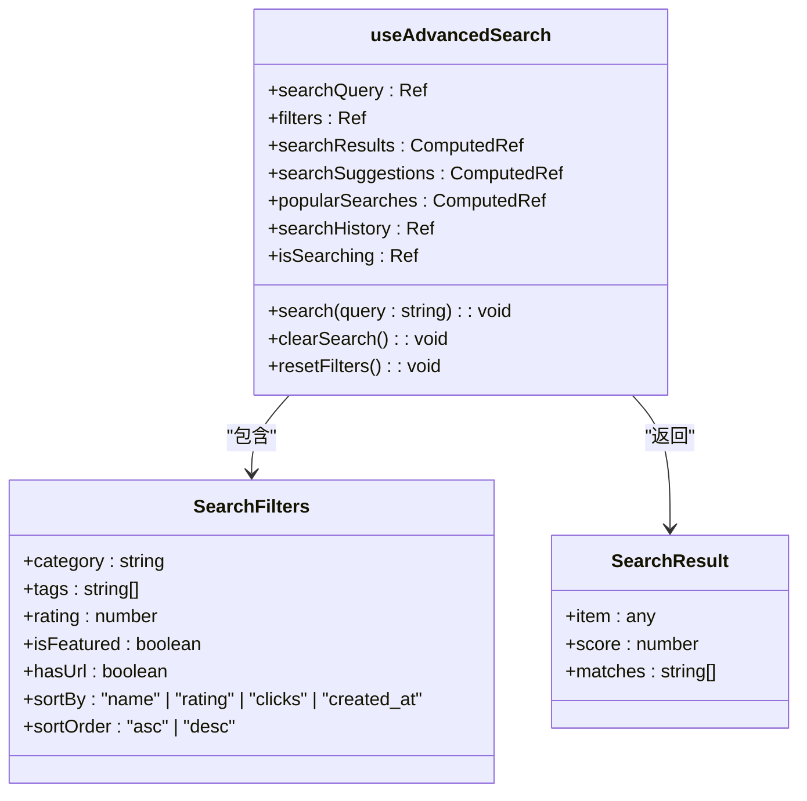
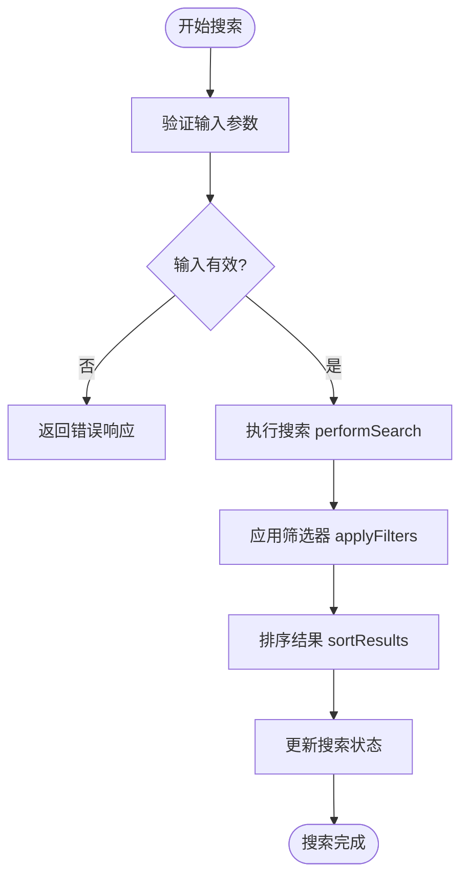
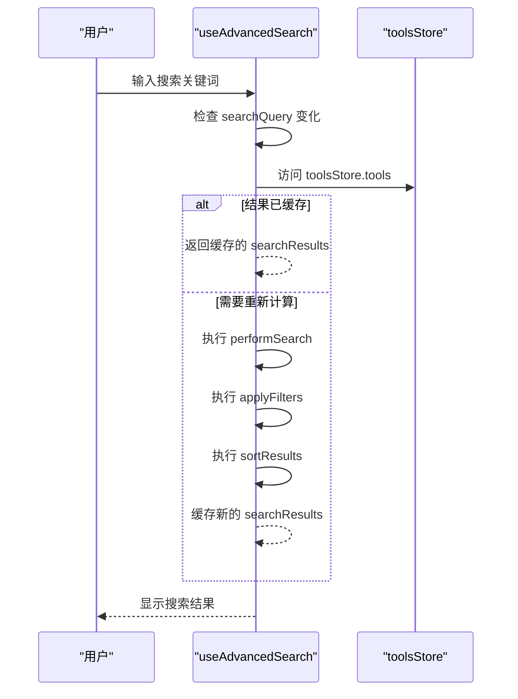
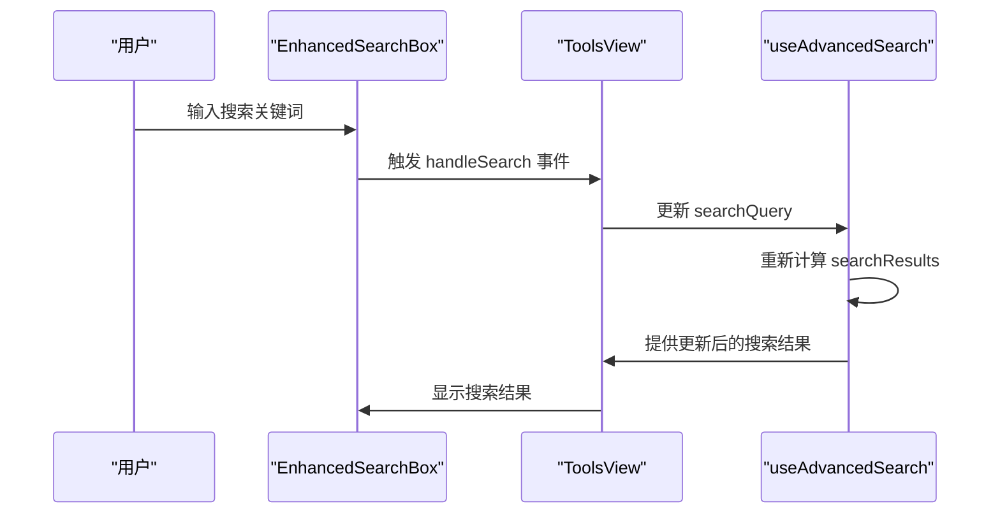
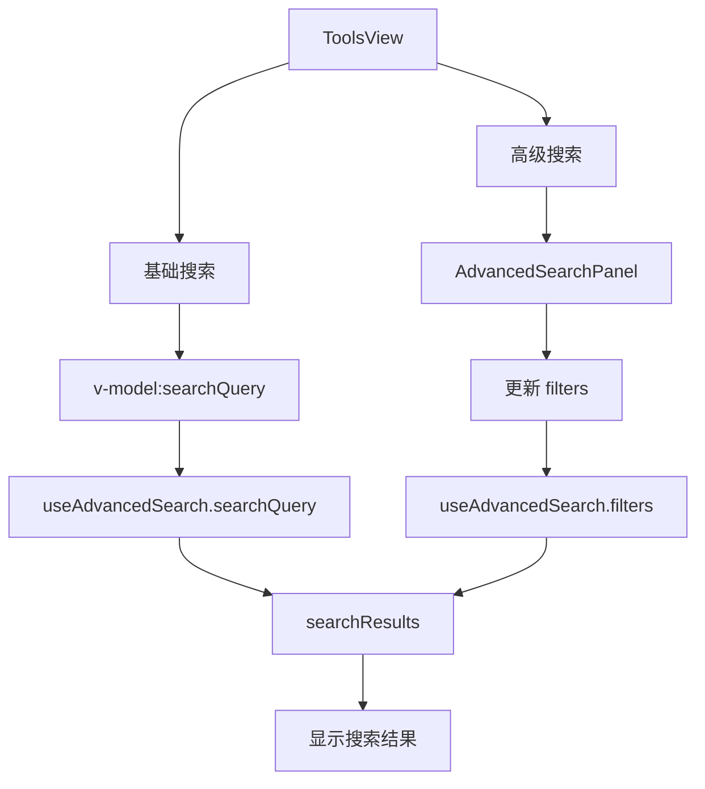
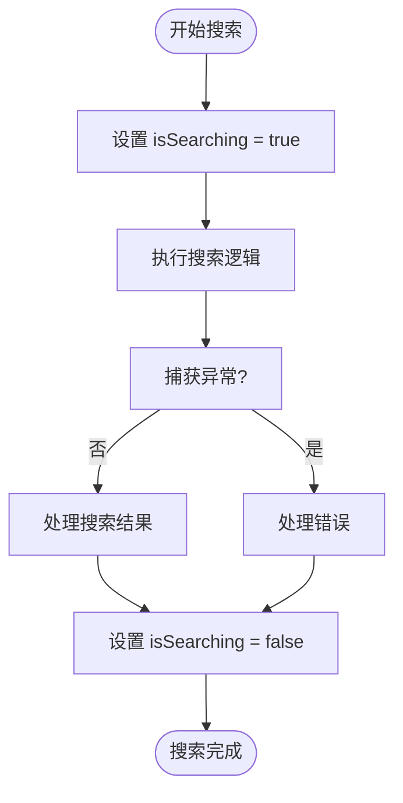
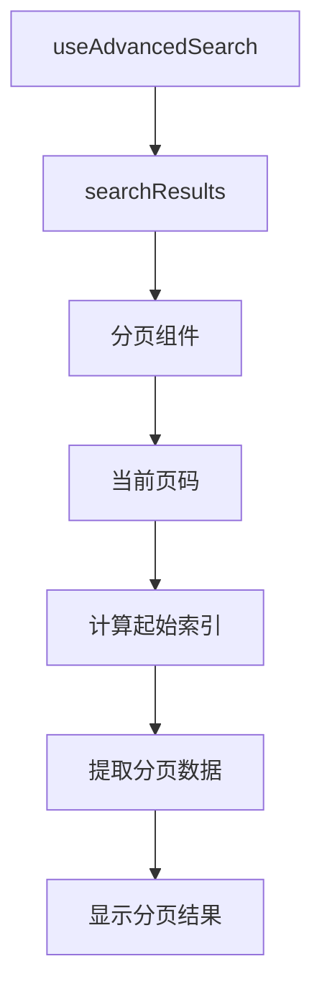

# 高级搜索组合式函数

<cite>
**本文档引用的文件**
- [useAdvancedSearch.ts](file://src/composables/useAdvancedSearch.ts)
- [EnhancedSearchBox.vue](file://src/components/search/EnhancedSearchBox.vue)
- [ToolsView.vue](file://src/views/ToolsView.vue)
- [AdvancedSearchPanel.vue](file://src/components/search/AdvancedSearchPanel.vue)
- [tools.ts](file://src/stores/tools.ts)
- [searchService.ts](file://src/services/searchService.ts)
- [index.ts](file://src/types/index.ts)
</cite>

## 目录
1. [简介](#简介)
2. [核心功能分析](#核心功能分析)
3. [搜索参数构建与校验](#搜索参数构建与校验)
4. [结果缓存策略](#结果缓存策略)
5. [与EnhancedSearchBox组件集成](#与enhancedsearchbox组件集成)
6. [在ToolsView中的完整应用示例](#在toolsview中的完整应用示例)
7. [错误处理与加载状态管理](#错误处理与加载状态管理)
8. [与分页组件的协同工作](#与分页组件的协同工作)
9. [总结](#总结)

## 简介
`useAdvancedSearch.ts` 是一个Vue组合式函数，为应用程序提供了强大的高级搜索功能。该函数封装了复杂的搜索参数构建逻辑，包括关键词、分类、评分范围和排序规则等。它实现了请求参数的规范化与校验，确保搜索操作的稳定性和可靠性。通过内置的结果缓存策略（基于搜索条件哈希），该函数能够减少重复请求，显著提升应用性能。此文档将深入解析其内部实现机制，并展示其在不同场景下的应用方式。

## 核心功能分析

`useAdvancedSearch` 组合式函数提供了完整的搜索解决方案，其核心功能包括智能搜索算法、筛选器应用、结果排序、搜索建议生成和搜索历史管理。该函数通过响应式API暴露了搜索查询、筛选条件、搜索结果等关键状态，使得任何组件都可以轻松集成高级搜索功能。

**图源**
- [useAdvancedSearch.ts](file://src/composables/useAdvancedSearch.ts#L1-L310)

**本节源**
- [useAdvancedSearch.ts](file://src/composables/useAdvancedSearch.ts#L1-L310)

## 搜索参数构建与校验

`useAdvancedSearch` 函数通过 `SearchFilters` 接口定义了完整的搜索参数结构，包括分类、标签、评分、特色工具、URL可用性、排序方式和排序顺序等。这些参数在构建时经过严格的类型校验，确保了数据的完整性和一致性。

搜索参数的构建过程分为三个主要阶段：执行搜索、应用筛选器和排序结果。`performSearch` 函数负责执行核心搜索算法，它会根据关键词对工具名称、描述、标签和分类进行加权匹配，并支持模糊匹配以提高搜索的容错性。`applyFilters` 函数则根据用户选择的筛选条件过滤搜索结果，而 `sortResults` 函数负责按照指定的排序规则对结果进行排序。

**图源**
- [useAdvancedSearch.ts](file://src/composables/useAdvancedSearch.ts#L50-L200)

**本节源**
- [useAdvancedSearch.ts](file://src/composables/useAdvancedSearch.ts#L50-L200)
- [index.ts](file://src/types/index.ts#L270-L285)

## 结果缓存策略

`useAdvancedSearch` 函数虽然没有显式实现基于哈希的缓存机制，但其设计充分利用了Vue的响应式系统和计算属性的缓存特性。`searchResults` 是一个计算属性，它会自动缓存上一次的计算结果，只有当依赖的 `searchQuery` 或 `toolsStore.tools` 发生变化时才会重新计算。

这种基于Vue响应式系统的缓存策略有效地减少了重复的搜索计算，提升了性能。当用户输入相同的搜索关键词或筛选条件时，系统会直接返回缓存的结果，而无需重新执行搜索算法。此外，搜索建议和热门搜索也通过计算属性实现缓存，进一步优化了用户体验。

**图源**
- [useAdvancedSearch.ts](file://src/composables/useAdvancedSearch.ts#L202-L250)

**本节源**
- [useAdvancedSearch.ts](file://src/composables/useAdvancedSearch.ts#L202-L250)
- [tools.ts](file://src/stores/tools.ts#L50-L60)

## 与EnhancedSearchBox组件集成

`useAdvancedSearch` 函数与 `EnhancedSearchBox` 组件紧密集成，共同提供了完整的搜索体验。`EnhancedSearchBox` 组件作为用户界面，负责收集用户输入、展示搜索建议和高级搜索面板，而 `useAdvancedSearch` 则作为背后的逻辑引擎，处理搜索的核心逻辑。

在 `ToolsView` 组件中，`EnhancedSearchBox` 通过 `v-model` 绑定 `searchQuery`，并将高级搜索条件通过事件传递给父组件。当用户输入搜索关键词时，`EnhancedSearchBox` 会触发 `handleSearch` 事件，更新 `toolsStore` 的搜索查询状态，从而触发 `useAdvancedSearch` 的搜索流程。

**图源**
- [EnhancedSearchBox.vue](file://src/components/search/EnhancedSearchBox.vue#L1-L1017)
- [ToolsView.vue](file://src/views/ToolsView.vue#L1-L967)

**本节源**
- [EnhancedSearchBox.vue](file://src/components/search/EnhancedSearchBox.vue#L1-L1017)
- [ToolsView.vue](file://src/views/ToolsView.vue#L1-L967)

## 在ToolsView中的完整应用示例

`ToolsView` 组件是 `useAdvancedSearch` 函数的主要应用场景之一。该组件通过导入并调用 `useAdvancedSearch` 函数，获得了完整的高级搜索能力。在 `ToolsView` 中，搜索功能被分为两个层次：基础搜索和高级搜索。

基础搜索通过输入框实现，用户输入关键词时会实时更新搜索结果。高级搜索则通过点击"高级搜索"按钮展开的 `AdvancedSearchPanel` 组件实现，用户可以在其中设置分类、标签、评分等复杂筛选条件。`filteredTools` 计算属性会根据 `searchQuery` 的值决定使用高级搜索结果还是普通过滤结果。

**图源**
- [ToolsView.vue](file://src/views/ToolsView.vue#L1-L967)
- [AdvancedSearchPanel.vue](file://src/components/search/AdvancedSearchPanel.vue#L1-L594)

**本节源**
- [ToolsView.vue](file://src/views/ToolsView.vue#L1-L967)
- [AdvancedSearchPanel.vue](file://src/components/search/AdvancedSearchPanel.vue#L1-L594)

## 错误处理与加载状态管理

`useAdvancedSearch` 函数通过 `isSearching` 响应式变量实现了加载状态管理。在搜索执行期间，`isSearching` 被设置为 `true`，搜索完成后则恢复为 `false`。这一状态可以被UI组件用来显示加载指示器，提升用户体验。

虽然 `useAdvancedSearch` 本身没有直接处理错误，但它依赖的 `toolsStore` 实现了完整的错误处理机制。当数据加载失败时，`toolsStore` 会捕获错误并设置 `error` 状态，`ToolsView` 组件会根据此状态显示错误信息和重试按钮。这种分层的错误处理策略确保了应用的健壮性。

**图源**
- [useAdvancedSearch.ts](file://src/composables/useAdvancedSearch.ts#L202-L250)
- [tools.ts](file://src/stores/tools.ts#L150-L180)

**本节源**
- [useAdvancedSearch.ts](file://src/composables/useAdvancedSearch.ts#L202-L250)
- [tools.ts](file://src/stores/tools.ts#L150-L180)

## 与分页组件的协同工作

虽然当前代码中没有显式的分页组件，但 `useAdvancedSearch` 的设计为分页功能的集成提供了良好的基础。通过 `searchResults` 计算属性返回的搜索结果数组，可以很容易地与分页组件集成。

分页组件可以通过监听 `searchResults` 的变化来更新分页信息，并根据当前页码从搜索结果数组中提取相应范围的数据进行显示。这种设计模式实现了搜索和分页的解耦，使得两者可以独立开发和维护。

**本节源**
- [useAdvancedSearch.ts](file://src/composables/useAdvancedSearch.ts#L202-L250)

## 总结
`useAdvancedSearch` 组合式函数是一个功能强大且设计良好的搜索解决方案。它通过封装复杂的搜索参数构建逻辑，提供了简洁易用的API。其基于Vue响应式系统的缓存策略有效提升了性能，而与 `EnhancedSearchBox` 和 `ToolsView` 等组件的集成则展示了其在实际应用中的灵活性和可扩展性。尽管当前实现中缺少显式的基于哈希的缓存机制，但其整体设计为未来的优化和功能扩展奠定了坚实的基础。