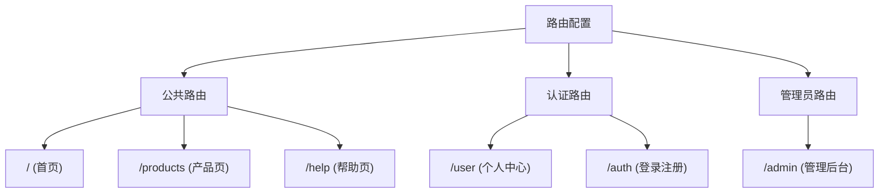
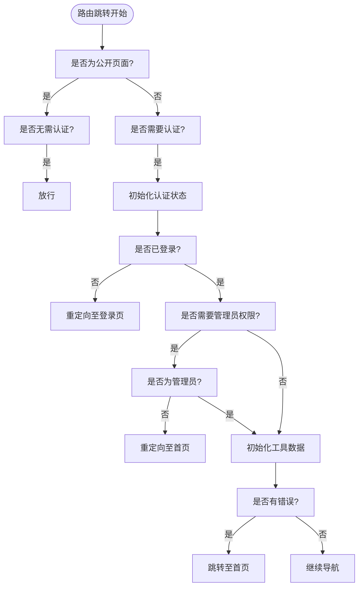

# 路由系统

<cite>
**本文档中引用的文件**  
- [index.ts](file://src/router/index.ts)
- [permission.ts](file://src/permission.ts)
- [auth.ts](file://src/stores/auth.ts)
</cite>

## 目录
1. [简介](#简介)
2. [路由配置结构](#路由配置结构)
3. [懒加载实现](#懒加载实现)
4. [嵌套路由设计](#嵌套路由设计)
5. [动态路由匹配](#动态路由匹配)
6. [权限控制策略](#权限控制策略)
7. [路由元信息应用](#路由元信息应用)
8. [全局前置守卫机制](#全局前置守卫机制)
9. [路由拦截与错误处理](#路由拦截与错误处理)
10. [性能优化建议](#性能优化建议)

## 简介
本系统基于 Vue Router 构建，实现了完整的前端路由管理功能。系统支持路由懒加载、嵌套路由、动态路径匹配及基于角色的访问控制。通过 `meta` 字段实现页面标题设置、权限校验和描述信息管理。结合 Pinia 状态管理与 Supabase 认证服务，构建了安全可靠的导航体系。

## 路由配置结构
路由表在 `src/router/index.ts` 中定义，采用 `RouteRecordRaw` 类型声明，包含路径、名称、组件和元数据等核心字段。路由分为公共页面、用户认证页面和管理员专属页面三大类，通过 `meta.requiresAuth` 和 `meta.requiresAdmin` 实现权限分级。



**Diagram sources**  
- [index.ts](file://src/router/index.ts#L15-L360)

**Section sources**  
- [index.ts](file://src/router/index.ts#L1-L360)

## 懒加载实现
所有路由组件均采用动态导入语法 `import()` 实现代码分割与懒加载，提升首屏加载性能。例如：

```ts
component: () => import("../views/HomeView.vue")
```

该语法指示 Webpack/Vite 将组件打包为独立 chunk，在访问对应路由时按需加载，有效降低初始包体积。

**Section sources**  
- [index.ts](file://src/router/index.ts#L15-L360)

## 嵌套路由设计
系统使用 `children` 属性实现多级嵌套路由结构，支持主视图内嵌子页面。典型案例如下：

- `/user` 为主路由，加载 `UserView.vue`
  - 子路由 `/user/profile` 显示个人资料
  - 子路由 `/user/favorites` 显示我的收藏
  - 子路由 `/user/orders` 显示我的订单

同理，`/admin` 路由下嵌套仪表盘、工具管理、产品管理等多个子模块，形成清晰的管理后台结构。

```mermaid
graph TB
Admin[/admin] --> Dashboard[/admin/dashboard]
Admin --> Tools[/admin/tools]
Admin --> Products[/admin/products]
Admin --> Users[/admin/users]
Admin --> Orders[/admin/orders]
Admin --> Settings[/admin/settings]
```

**Diagram sources**  
- [index.ts](file://src/router/index.ts#L155-L211)

**Section sources**  
- [index.ts](file://src/router/index.ts#L155-L211)

## 动态路由匹配
系统支持动态参数匹配，用于加载特定资源详情页。例如：

- `/tools/:id` 匹配任意工具 ID，跳转至 `ToolDetailView.vue`
- `/product/:id` 匹配任意产品 ID，跳转至 `ProductDetailView.vue`

这些路由通过 `$route.params.id` 获取动态参数，实现内容驱动的页面渲染。

**Section sources**  
- [index.ts](file://src/router/index.ts#L135-L145)

## 权限控制策略
路由权限通过 `meta` 字段实现三级隔离：
- **公共路由**：无特殊标记，所有人可访问
- **认证路由**：`requiresAuth: true`，仅登录用户可访问（如个人中心）
- **管理员路由**：`requiresAuth: true, requiresAdmin: true`，仅管理员可访问（如管理后台）

此策略确保敏感功能不被未授权访问。

**Section sources**  
- [index.ts](file://src/router/index.ts#L155-L211)

## 路由元信息应用
`meta` 字段承载多种附加信息：
- `title`: 页面标题，用于 SEO 和浏览器标签显示
- `description`: 页面描述，增强搜索引擎优化
- `requiresAuth`: 标识是否需要登录
- `requiresAdmin`: 标识是否需要管理员权限

页面标题在全局守卫中统一设置：`document.title = ${title} - 工具导航站`。

**Section sources**  
- [index.ts](file://src/router/index.ts#L15-L360)
- [permission.ts](file://src/permission.ts#L15-L25)

## 全局前置守卫机制
`permission.ts` 中的 `setupRouterGuard()` 函数注册全局前置守卫，执行以下逻辑：



**Diagram sources**  
- [permission.ts](file://src/permission.ts#L10-L85)

**Section sources**  
- [permission.ts](file://src/permission.ts#L1-L89)

## 路由拦截与错误处理
守卫逻辑包含完善的错误处理机制：
- 使用 `try-catch` 捕获异步操作异常
- 认证失败时重定向至登录页并携带 `redirect` 查询参数
- 管理员权限不足时警告并跳转首页
- 工具数据初始化失败时设置错误状态并酌情跳转
- 守卫内部错误统一降级至首页，避免阻塞导航

```ts
next({ name: "Login", query: { redirect: to.fullPath } })
```

此机制保障用户体验连续性。

**Section sources**  
- [permission.ts](file://src/permission.ts#L50-L85)

## 性能优化建议
1. **公开页面白名单**：通过 `publicPages` 数组提前放行无需认证的页面，避免不必要的状态初始化
2. **延迟初始化**：仅当目标路由需要认证时才调用 `authStore.initialize()`
3. **同步操作优先**：页面标题设置为同步操作，不影响导航性能
4. **数据预加载**：在进入关键页面前初始化工具数据，提升响应速度
5. **错误隔离**：独立处理工具数据加载失败，不影响主流程

**Section sources**  
- [permission.ts](file://src/permission.ts#L10-L89)