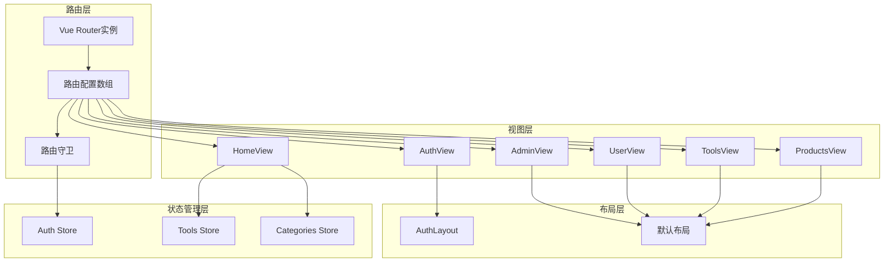
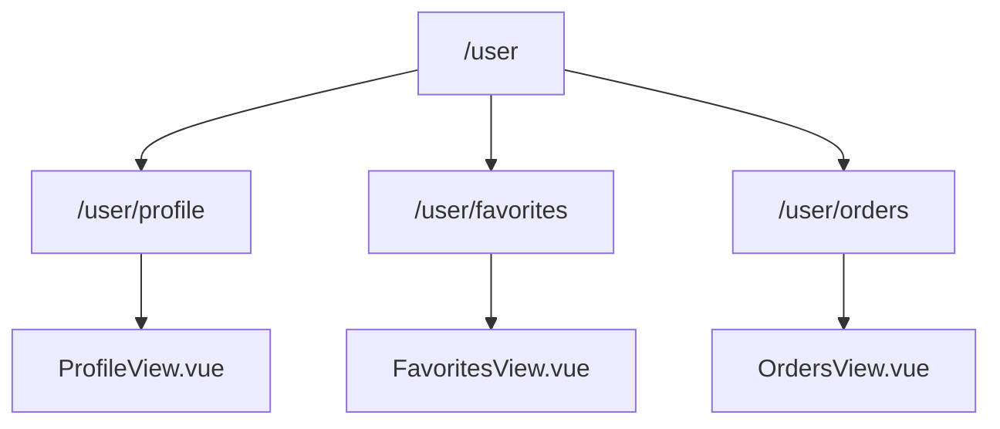
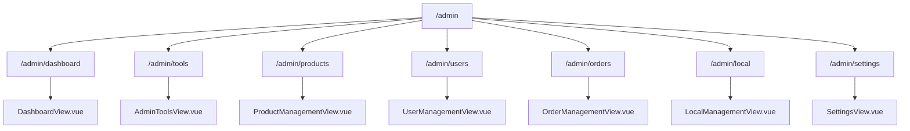
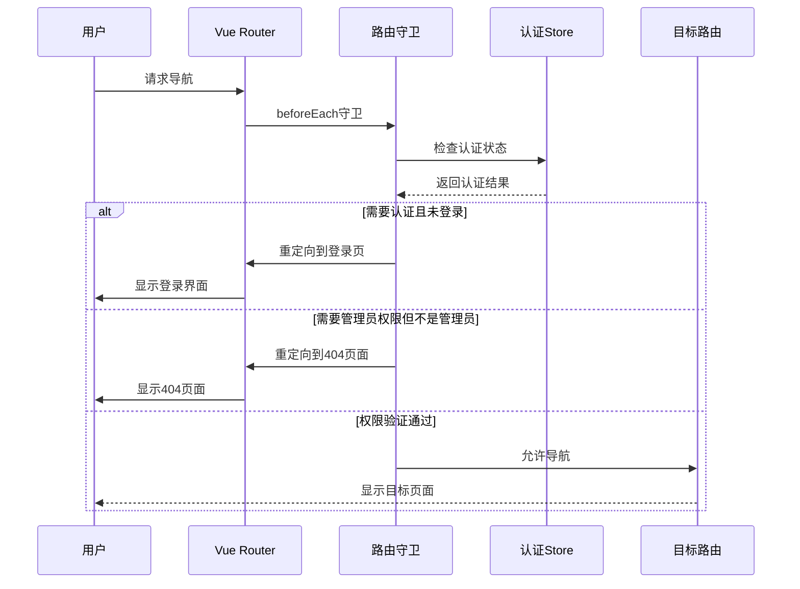
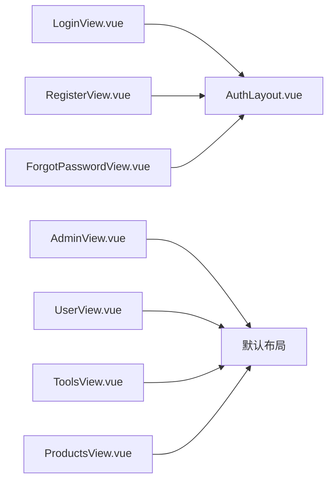
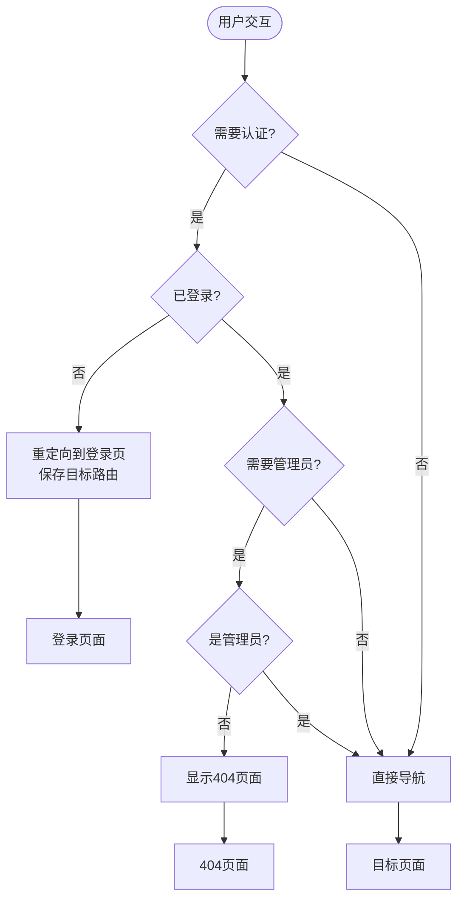
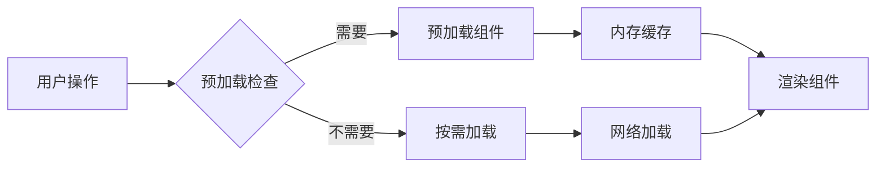

# Vue Router配置与导航控制系统

<cite>
**本文档引用的文件**
- [src/router/index.ts](file://src/router/index.ts)
- [src/views/HomeView.vue](file://src/views/HomeView.vue)
- [src/views/auth/LoginView.vue](file://src/views/auth/LoginView.vue)
- [src/layouts/AuthLayout.vue](file://src/layouts/AuthLayout.vue)
- [src/stores/auth.ts](file://src/stores/auth.ts)
- [src/App.vue](file://src/App.vue)
</cite>

## 目录
1. [简介](#简介)
2. [项目架构概览](#项目架构概览)
3. [路由配置详解](#路由配置详解)
4. [嵌套路由系统](#嵌套路由系统)
5. [路由守卫机制](#路由守卫机制)
6. [布局组件体系](#布局组件体系)
7. [动态路由参数处理](#动态路由参数处理)
8. [编程式导航实践](#编程式导航实践)
9. [SEO优化与元信息](#seo优化与元信息)
10. [性能优化策略](#性能优化策略)
11. [故障排除指南](#故障排除指南)
12. [总结](#总结)

## 简介

本项目采用Vue Router 4构建了一个功能完善的单页应用(SPA)路由系统。该系统支持嵌套路由、路由守卫、懒加载、动态参数处理等功能，为用户提供流畅的导航体验。路由配置位于`src/router/index.ts`文件中，包含了完整的前端路由映射关系和导航控制逻辑。

## 项目架构概览



**图表来源**
- [src/router/index.ts](file://src/router/index.ts#L1-L399)
- [src/App.vue](file://src/App.vue#L1-L71)

## 路由配置详解

### 基础路由结构

路由系统采用模块化设计，将不同功能的页面组织成清晰的层次结构：

```typescript
// 基础页面路由
{
  path: "/",
  name: "Home",
  component: () => import("../views/HomeView.vue"),
  meta: {
    title: "高效工具导航站",
    description: "现代化设计的工具导航平台",
  },
},

// 搜索结果页面
{
  path: "/search",
  name: "SearchResults",
  component: () => import("../views/SearchResultsView.vue"),
  meta: {
    title: "搜索结果",
    description: "搜索工具和产品",
  },
},
```

### 路由配置特点

1. **懒加载机制**：所有路由组件都采用动态导入语法，实现按需加载
2. **元信息配置**：每个路由都包含SEO友好的标题和描述信息
3. **命名规范**：使用语义化的路由名称，便于代码维护
4. **路径设计**：采用RESTful风格的URL路径设计

**章节来源**
- [src/router/index.ts](file://src/router/index.ts#L8-L399)

## 嵌套路由系统

### 用户中心嵌套路由



**图表来源**
- [src/router/index.ts](file://src/router/index.ts#L130-L150)

### 管理后台嵌套路由



**图表来源**
- [src/router/index.ts](file://src/router/index.ts#L180-L250)

### 嵌套路由的优势

1. **代码组织**：将相关功能的路由组织在一起
2. **权限控制**：父路由可以统一处理权限验证
3. **布局共享**：子路由可以继承父路由的布局
4. **导航结构**：提供清晰的导航层级关系

**章节来源**
- [src/router/index.ts](file://src/router/index.ts#L130-L250)

## 路由守卫机制

### 全局前置守卫

路由守卫是整个导航系统的核心安全机制：

```typescript
router.beforeEach(async (to, from, next) => {
  const authStore = useAuthStore();
  
  // 检查是否需要认证
  if (to.meta.requiresAuth) {
    try {
      const isAuthenticated = authStore.isAuthenticated;
      
      if (!isAuthenticated) {
        await authStore.refreshAuth();
        
        if (!authStore.isAuthenticated) {
          return next({
            name: 'Login',
            query: { redirect: to.fullPath }
          });
        }
      }
    } catch (error) {
      console.error('Authentication check failed:', error);
      return next({
        name: 'Login',
        query: { redirect: to.fullPath }
      });
    }
  }

  // 检查是否需要管理员权限
  if (to.meta.requiresAdmin) {
    const isAdmin = await authStore.isAdminFunction();
    if (!isAdmin) {
      return next({ name: 'NotFound' });
    }
  }

  // 设置页面标题
  if (to.meta.title) {
    document.title = `${to.meta.title} | ${import.meta.env.VITE_APP_NAME || '应用'}`;
  }

  next();
});
```

### 守卫执行流程



**图表来源**
- [src/router/index.ts](file://src/router/index.ts#L320-L399)

### 权限控制策略

1. **认证检查**：通过`requiresAuth`标记控制路由访问权限
2. **角色验证**：通过`requiresAdmin`标记限制管理员访问
3. **状态同步**：实时检查认证状态并自动刷新
4. **用户体验**：保持目标路由信息，导航后自动跳转

**章节来源**
- [src/router/index.ts](file://src/router/index.ts#L320-L399)
- [src/stores/auth.ts](file://src/stores/auth.ts#L1-L190)

## 布局组件体系

### AuthLayout布局组件

AuthLayout为认证相关的页面提供了统一的布局结构：

```vue
<template>
  <div class="auth-layout">
    <header class="auth-header">
      <router-link to="/" class="logo-link">
        
      </router-link>
    </header>
    
    <main class="auth-main">
      <slot />
    </main>
  </div>
</template>
```

### 布局组件特点

1. **响应式设计**：适配不同屏幕尺寸
2. **品牌一致性**：统一的Logo和导航结构
3. **内容区域**：灵活的内容插槽设计
4. **视觉层次**：清晰的头部-主体结构

### 布局组件映射



**图表来源**
- [src/views/auth/LoginView.vue](file://src/views/auth/LoginView.vue#L1-L34)
- [src/layouts/AuthLayout.vue](file://src/layouts/AuthLayout.vue#L1-L45)

**章节来源**
- [src/layouts/AuthLayout.vue](file://src/layouts/AuthLayout.vue#L1-L45)
- [src/views/auth/LoginView.vue](file://src/views/auth/LoginView.vue#L1-L34)

## 动态路由参数处理

### 参数类型与用途

系统支持多种类型的动态路由参数：

1. **工具详情参数**：
   ```typescript
   {
     path: "/tools/:id",
     name: "ToolDetail",
     component: () => import("../views/ToolDetailView.vue"),
     meta: {
       title: "工具详情",
       description: "查看工具详细信息和使用教程",
     },
   }
   ```

2. **产品详情参数**：
   ```typescript
   {
     path: "/product/:id",
     name: "ProductDetail",
     component: () => import("../views/ProductDetailView.vue"),
     meta: {
       title: "产品详情",
       description: "查看产品详细信息",
     },
   }
   ```

### 参数处理示例

```typescript
// 在组件中获取参数
const route = useRoute();
const toolId = route.params.id as string;

// 使用参数加载数据
onMounted(async () => {
  if (toolId) {
    await toolsStore.fetchToolById(toolId);
  }
});
```

### 通配符路由

```typescript
{
  path: "/:pathMatch(.*)*",
  name: "NotFound",
  component: () => import("../views/NotFoundView.vue"),
  meta: {
    title: "页面未找到",
    description: "您访问的页面不存在",
  },
}
```

**章节来源**
- [src/router/index.ts](file://src/router/index.ts#L80-L90)
- [src/router/index.ts](file://src/router/index.ts#L95-L105)
- [src/router/index.ts](file://src/router/index.ts#L380-L390)

## 编程式导航实践

### 编程式导航示例

```typescript
// 在组件中使用编程式导航
const router = useRouter();

// 导航到首页
router.push('/');

// 带参数导航
router.push({ 
  name: 'ToolDetail', 
  params: { id: '123' } 
});

// 带查询参数导航
router.push({ 
  name: 'SearchResults', 
  query: { q: 'vue', category: 'frontend' } 
});

// 带重定向的登录导航
router.push({
  name: 'Login',
  query: { redirect: '/user/profile' }
});
```

### 导航触发场景



**图表来源**
- [src/router/index.ts](file://src/router/index.ts#L320-L399)

**章节来源**
- [src/views/auth/LoginView.vue](file://src/views/auth/LoginView.vue#L15-L18)

## SEO优化与元信息

### 元信息配置

每个路由都配置了SEO友好的元信息：

```typescript
meta: {
  title: "高效工具导航站",
  description: "现代化设计的工具导航平台",
}
```

### 动态标题设置

```typescript
// 路由守卫中动态设置页面标题
if (to.meta.title) {
  document.title = `${to.meta.title} | ${import.meta.env.VITE_APP_NAME || '应用'}`;
}
```

### SEO最佳实践

1. **唯一标题**：每个页面都有独特的标题
2. **描述信息**：提供准确的页面描述
3. **动态更新**：根据路由变化实时更新
4. **环境变量**：支持多环境配置

**章节来源**
- [src/router/index.ts](file://src/router/index.ts#L10-L15)
- [src/router/index.ts](file://src/router/index.ts#L370-L375)

## 性能优化策略

### 懒加载优化

```typescript
// 懒加载组件
{
  path: "/",
  name: "Home",
  component: () => import("../views/HomeView.vue"),
}
```

### 路由预加载策略



### 性能监控点

1. **组件加载时间**：监控路由切换的加载时间
2. **内存使用**：跟踪组件实例的内存占用
3. **网络请求**：监控异步数据的加载性能
4. **用户体验**：测量导航流畅度

## 故障排除指南

### 常见问题与解决方案

#### 1. 认证失败问题

**症状**：路由守卫阻止访问，频繁重定向到登录页

**解决方案**：
```typescript
// 检查认证状态
console.log('认证状态:', authStore.isAuthenticated);
console.log('用户信息:', authStore.user);

// 强制刷新认证
await authStore.refreshAuth();
```

#### 2. 路由参数丢失

**症状**：动态路由参数为空或undefined

**解决方案**：
```typescript
// 确保参数类型正确
const toolId = route.params.id as string;

// 处理参数缺失情况
if (!toolId) {
  router.push({ name: 'NotFound' });
  return;
}
```

#### 3. 布局组件不显示

**症状**：页面内容正常，但布局组件样式异常

**解决方案**：
```vue
<!-- 确保布局组件正确使用 -->
<template>
  <AuthLayout>
    <slot />
  </AuthLayout>
</template>
```

### 调试工具

```typescript
// 启用路由调试模式
if (import.meta.env.DEV) {
  router.onError((error, to) => {
    console.error('路由错误:', error, '目标路由:', to);
  });
}
```

**章节来源**
- [src/stores/auth.ts](file://src/stores/auth.ts#L120-L140)
- [src/router/index.ts](file://src/router/index.ts#L320-L340)

## 总结

本项目的Vue Router配置展现了现代前端应用的最佳实践：

### 核心特性总结

1. **模块化设计**：清晰的路由分组和组织结构
2. **安全性保障**：完善的路由守卫和权限控制
3. **用户体验**：流畅的导航和优雅的过渡效果
4. **性能优化**：懒加载和缓存策略
5. **可维护性**：标准化的代码结构和命名规范

### 技术亮点

- **嵌套路由**：支持复杂的页面结构和权限管理
- **动态路由**：灵活的参数处理和通配符匹配
- **SEO优化**：完整的元信息配置和标题动态更新
- **错误处理**：健壮的404页面和错误恢复机制

### 最佳实践建议

1. **遵循命名规范**：使用语义化的路由名称
2. **合理使用懒加载**：平衡加载时间和性能
3. **完善错误处理**：提供友好的错误页面和提示
4. **持续优化**：定期审查路由配置和性能指标

这个路由系统为整个应用提供了坚实的基础架构，确保了良好的用户体验和系统的可扩展性。通过合理的配置和优化，能够支持复杂业务需求的同时保持优秀的性能表现。