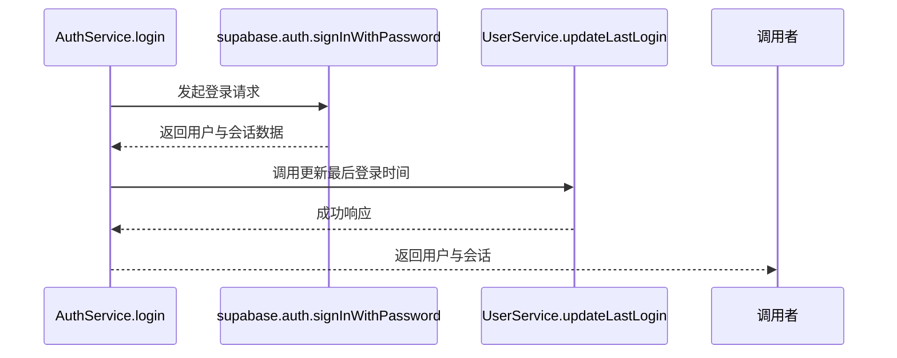
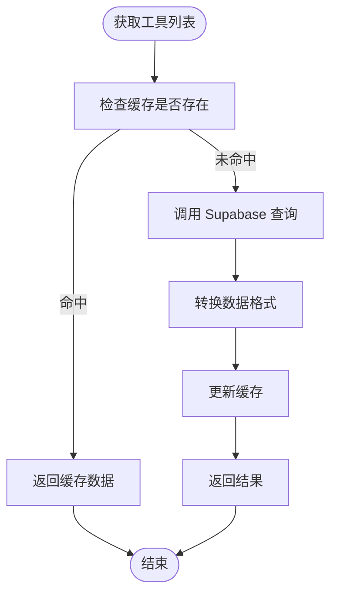
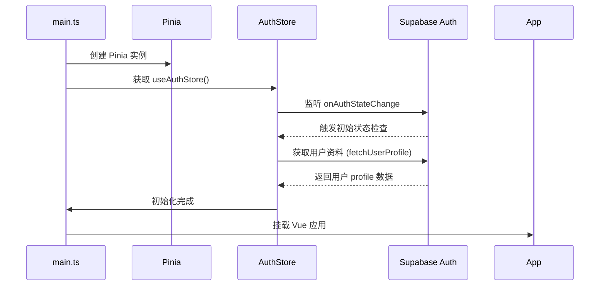

# Supabase 集成方案

<cite>
**本文档引用的文件**  
- [supabaseClient.ts](file://src/lib/supabaseClient.ts)
- [supabase.ts](file://src/lib/supabase.ts)
- [authService.ts](file://src/services/authService.ts)
- [toolsService.ts](file://src/services/toolsService.ts)
- [auth.ts](file://src/stores/auth.ts)
- [main.ts](file://src/main.ts)
</cite>

## 目录
1. [简介](#简介)
2. [Supabase 客户端封装与单例模式](#supabase-客户端封装与单例模式)
3. [环境变量加载机制](#环境变量加载机制)
4. [通用请求处理逻辑](#通用请求处理逻辑)
5. [服务层中的 Supabase 使用](#服务层中的-supabase-使用)
6. [初始化调用时序图](#初始化调用时序图)
7. [与 Pinia 状态管理的协作](#与-pinia-状态管理的协作)
8. [常见问题排查指南](#常见问题排查指南)
9. [结论](#结论)

## 简介
本文档详细说明了项目中 Supabase 的集成方案，涵盖客户端封装、环境配置、错误处理、服务调用及状态管理协作机制。通过全局单例模式提供统一访问入口，确保数据一致性与性能优化。

## Supabase 客户端封装与单例模式

`supabaseClient.ts` 文件通过 `createClient` 创建并导出一个全局唯一的 Supabase 客户端实例。该实例在应用生命周期内共享，避免重复初始化开销。

同时，`supabase.ts` 作为统一入口文件，重新导出 `supabaseClient.ts` 的所有内容，便于模块化引用。

**Section sources**
- [supabaseClient.ts](file://src/lib/supabaseClient.ts#L1-L266)
- [supabase.ts](file://src/lib/supabase.ts#L1-L2)

## 环境变量加载机制

项目使用 Vite 的 `import.meta.env` 机制加载环境变量。关键配置包括：

- `VITE_SUPABASE_URL`: Supabase 项目 API 地址
- `VITE_SUPABASE_ANON_KEY`: 匿名访问密钥

这些变量在 `.env.local`（开发环境）和 Netlify 部署环境（生产环境）中分别配置。代码中通过条件判断验证变量有效性，若未正确设置则输出警告信息并降级为模拟数据模式。

**Section sources**
- [supabaseClient.ts](file://src/lib/supabaseClient.ts#L4-L25)

## 通用请求处理逻辑

`supabaseClient.ts` 封装了统一的错误处理、数据操作和工具函数：

- `handleSupabaseError`: 标准化错误信息输出
- `createRecord`, `updateRecord`, `getRecords` 等：封装常用数据库操作，自动处理错误并抛出可读异常
- `uploadFile`, `getPublicUrl`, `deleteFile`: 存储操作工具函数
- `isAuthenticated`, `isAdmin`: 认证与权限检查辅助方法

这些函数在服务层被广泛调用，确保数据访问的一致性与健壮性。

**Section sources**
- [supabaseClient.ts](file://src/lib/supabaseClient.ts#L100-L266)

## 服务层中的 Supabase 使用

各服务模块通过导入 `supabase` 实例进行数据交互。例如：

### 认证服务（authService.ts）
使用 `supabase.auth.signInWithPassword` 实现登录逻辑，并结合 `UserService` 更新用户状态。

**Diagram sources**
- [authService.ts](file://src/services/authService.ts#L10-L45)

### 工具服务（toolsService.ts）
利用 `supabase.from(TABLES.TOOLS)` 查询工具数据，结合缓存机制提升性能。所有数据库操作均通过 `supabaseClient` 提供的封装方法执行。

**Diagram sources**
- [toolsService.ts](file://src/services/toolsService.ts#L50-L100)

## 初始化调用时序图

应用启动时，`main.ts` 中的 `initializeCoreStores` 函数负责初始化所有核心状态管理器，其中包含对 Supabase 认证状态的监听。

**Diagram sources**
- [main.ts](file://src/main.ts#L19-L45)
- [auth.ts](file://src/stores/auth.ts#L80-L120)

## 与 Pinia 状态管理的协作

`useAuthStore` 使用 Pinia 管理用户认证状态。它通过监听 `supabase.auth.onAuthStateChange` 事件，自动同步 Supabase 的登录状态到本地 store。

当用户登录时，store 会从 `user_profiles` 表加载扩展信息（如用户名、角色），并提供 `isAuthenticated` 和 `isAdmin` 等计算属性供 UI 组件使用。

这种模式实现了 Supabase 认证系统与前端状态的无缝集成。

**Section sources**
- [auth.ts](file://src/stores/auth.ts#L1-L151)

## 常见问题排查指南

### 连接超时
- **现象**：请求长时间无响应或报错 `Network Error`
- **排查步骤**：
  1. 检查 `VITE_SUPABASE_URL` 是否正确
  2. 确认网络是否可达 Supabase 域名
  3. 查看浏览器控制台是否有 CORS 错误

### CORS 错误
- **现象**：浏览器报错 `CORS policy blocked`
- **解决方案**：
  1. 登录 Supabase 控制台
  2. 进入 Settings > API
  3. 在 CORS 设置中添加当前域名（如 `http://localhost:5173`）

### 环境变量未生效
- **检查点**：
  - 开发环境：确认 `.env.local` 文件存在且包含正确变量
  - 生产环境：检查 Netlify 环境变量配置
  - 变量命名：必须以 `VITE_` 开头才能被 Vite 注入

**Section sources**
- [supabaseClient.ts](file://src/lib/supabaseClient.ts#L4-L25)
- [check-github-secrets.js](file://scripts/deployment/check-github-secrets.js#L10-L42)

## 结论
本项目通过 `supabaseClient.ts` 实现了 Supabase 客户端的统一封装与全局单例管理，结合环境变量机制支持多环境部署。服务层通过标准化接口调用 Supabase 功能，配合 Pinia 实现状态同步，形成了一套稳定、可维护的集成方案。建议在部署前严格验证环境变量配置，以避免连接与权限问题。