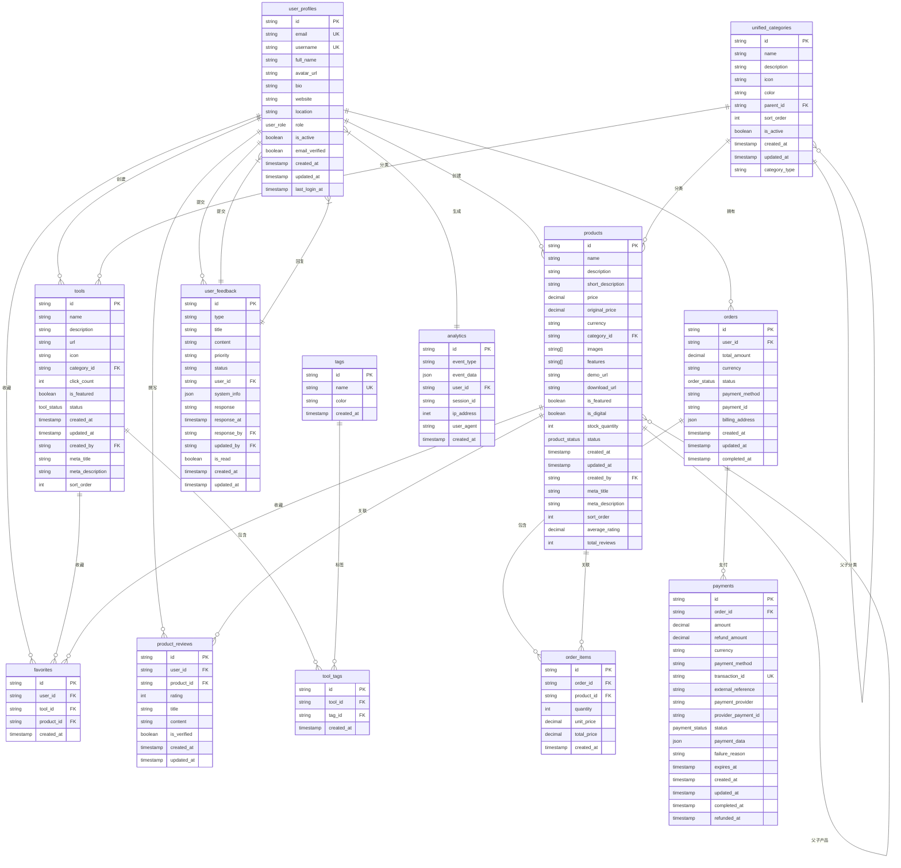
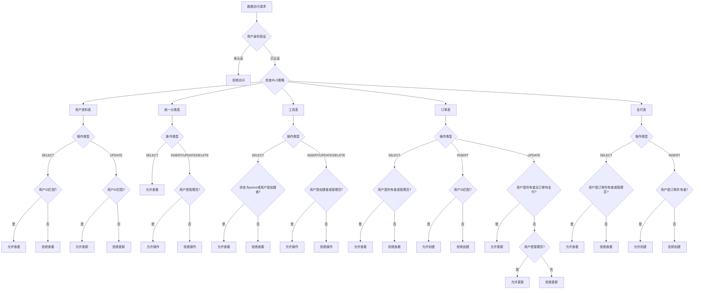
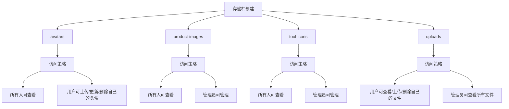
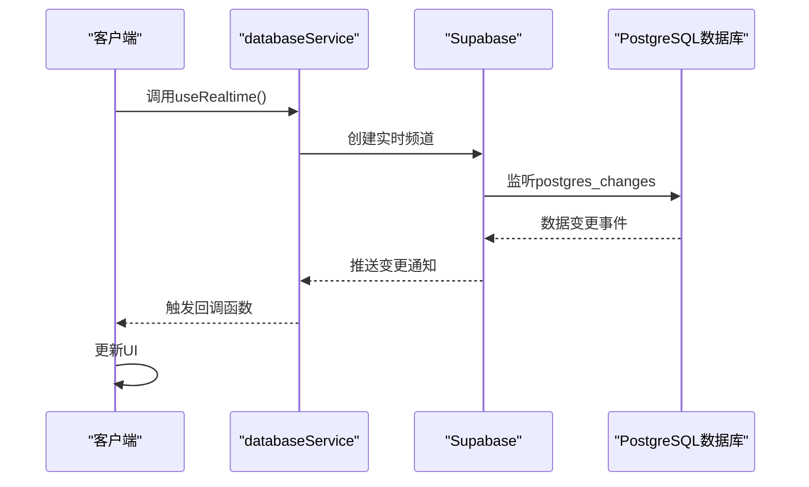
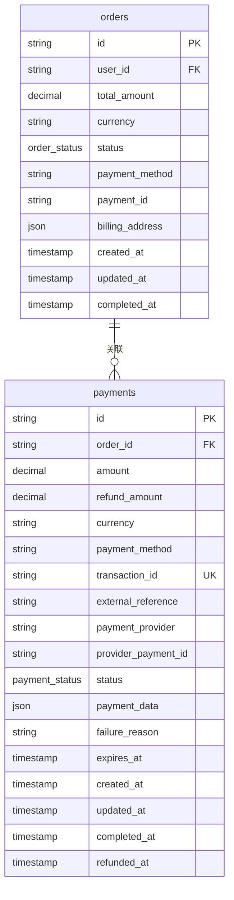
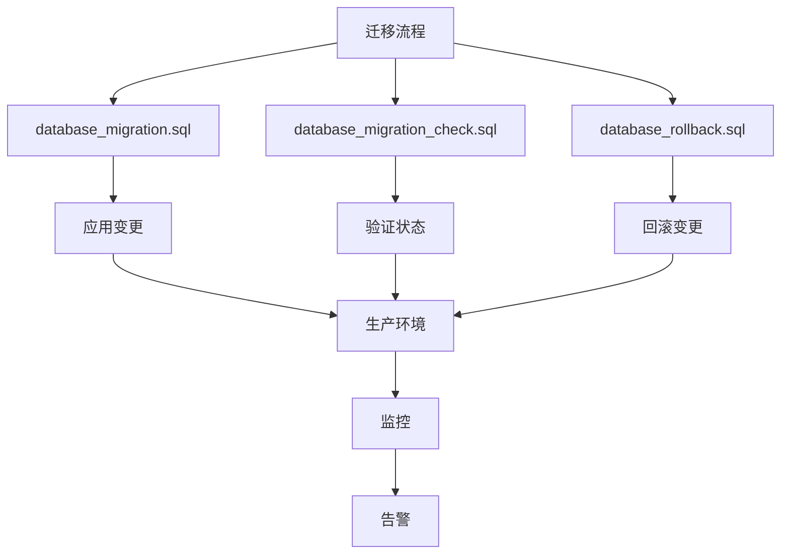
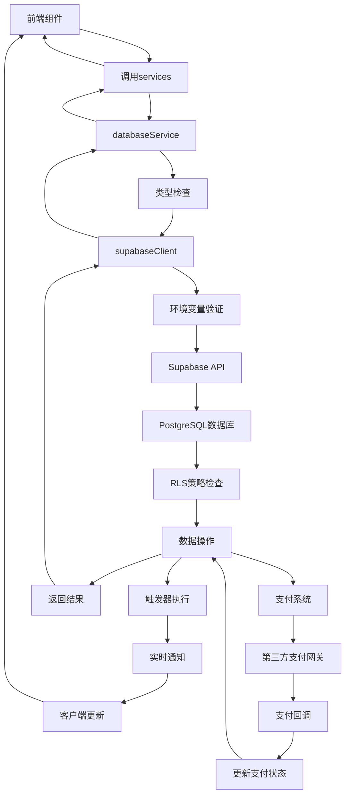

# 后端架构

<cite>
**本文档引用的文件**
- [supabaseClient.ts](file://src/lib/supabaseClient.ts)
- [database.ts](file://src/types/database.ts)
- [20241224000001_initial_schema.sql](file://supabase/migrations/20241224000001_initial_schema.sql)
- [20241224000002_rls_policies.sql](file://supabase/migrations/20241224000002_rls_policies.sql)
- [20241224000003_storage_setup.sql](file://supabase/migrations/20241224000003_storage_setup.sql)
- [setup-storage-buckets.js](file://scripts/database/setup-storage-buckets.js)
- [useRealtime.ts](file://src/composables/useRealtime.ts)
- [databaseService.ts](file://src/services/databaseService.ts)
- [20241227000001_user_feedback.sql](file://supabase/migrations/20241227000001_user_feedback.sql)
- [20250101000002_fix_schema_issues.sql](file://supabase/migrations/20250101000002_fix_schema_issues.sql) - *更新于最近提交*
- [20250101000003_merge_categories.sql](file://supabase/migrations/20250101000003_merge_categories.sql) - *更新于最近提交*
- [20250101000004_add_billing_address_to_orders.sql](file://supabase/migrations/20250101000004_add_billing_address_to_orders.sql) - *更新于最近提交*
- [database_migration.sql](file://database_migration.sql) - *新增于最近提交*
- [database_migration_check.sql](file://database_migration_check.sql) - *新增于最近提交*
- [database_rollback.sql](file://database_rollback.sql) - *新增于最近提交*
</cite>

## 更新摘要
**变更内容**
- 更新了数据库架构与实体关系部分，反映分类表合并和订单表结构变更
- 增加了支付系统架构和迁移管理的新章节
- 更新了行级安全策略部分，包含最新的RLS策略实现
- 修订了TypeScript类型映射部分，反映最新的类型定义
- 更新了数据访问流程图，包含支付系统组件
- 所有受影响的源文件引用均已更新，标记了变更状态

## 目录
1. [简介](#简介)
2. [Supabase客户端封装](#supabase客户端封装)
3. [数据库架构与实体关系](#数据库架构与实体关系)
4. [TypeScript类型映射](#typescript类型映射)
5. [行级安全策略](#行级安全策略)
6. [存储服务管理](#存储服务管理)
7. [实时功能实现](#实时功能实现)
8. [支付系统架构](#支付系统架构)
9. [数据库迁移管理](#数据库迁移管理)
10. [数据访问流程](#数据访问流程)

## 简介
本文档详细阐述了基于Supabase作为后端即服务（BaaS）的集成方案。文档涵盖了Supabase客户端的封装机制、数据库架构设计、TypeScript类型映射、行级安全策略（RLS）、存储服务管理、实时功能以及新引入的支付系统架构和数据库迁移管理。通过分析核心文件和数据库迁移脚本，为开发者提供了全面的后端架构理解。

## Supabase客户端封装
`src/lib/supabaseClient.ts`文件封装了Supabase客户端实例，统一了API调用入口。该文件通过环境变量配置Supabase URL和匿名密钥，创建了全局可用的`supabase`实例。同时，定义了数据库表名、存储桶名和实时频道的常量，便于在应用中统一引用。

**Section sources**
- [supabaseClient.ts](file://src/lib/supabaseClient.ts#L1-L245)

## 数据库架构与实体关系
数据库架构通过一系列迁移文件逐步构建，定义了用户、工具、产品、订单等核心实体及其关系。初始架构文件`20241224000001_initial_schema.sql`创建了所有基础表和索引。近期的迁移文件对架构进行了重要优化，包括分类表合并和支付系统增强。

**Diagram sources**
- [20241224000001_initial_schema.sql](file://supabase/migrations/20241224000001_initial_schema.sql#L1-L285)
- [20250101000003_merge_categories.sql](file://supabase/migrations/20250101000003_merge_categories.sql#L1-L135) - *分类表合并*
- [20250101000004_add_billing_address_to_orders.sql](file://supabase/migrations/20250101000004_add_billing_address_to_orders.sql#L1-L43) - *订单表扩展*

**Section sources**
- [20241224000001_initial_schema.sql](file://supabase/migrations/20241224000001_initial_schema.sql#L1-L285)
- [20250101000003_merge_categories.sql](file://supabase/migrations/20250101000003_merge_categories.sql#L1-L135) - *更新于最近提交*
- [20250101000004_add_billing_address_to_orders.sql](file://supabase/migrations/20250101000004_add_billing_address_to_orders.sql#L1-L43) - *更新于最近提交*
- [20241227000001_user_feedback.sql](file://supabase/migrations/20241227000001_user_feedback.sql#L1-L283)

## TypeScript类型映射
`src/types/database.ts`文件定义了与数据库表结构对应的TypeScript类型，实现了类型安全的数据库操作。该文件为每个表定义了`Row`、`Insert`和`Update`三种类型，分别对应查询结果、插入数据和更新数据的结构。近期的数据库架构变更已反映在类型定义中，包括统一分类表和增强的订单结构。

**Section sources**
- [database.ts](file://src/types/database.ts#L1-L439) - *更新以反映最新架构*

## 行级安全策略
行级安全策略（RLS）在`20250101000002_fix_schema_issues.sql`文件中进行了全面优化，实现了细粒度的数据访问控制。策略根据用户角色和数据所有权来限制对表的访问权限，并为所有表启用了RLS。新的策略集包括增强的注释和更精确的访问控制规则。

**Diagram sources**
- [20250101000002_fix_schema_issues.sql](file://supabase/migrations/20250101000002_fix_schema_issues.sql#L1-L217) - *更新的RLS策略*

**Section sources**
- [20250101000002_fix_schema_issues.sql](file://supabase/migrations/20250101000002_fix_schema_issues.sql#L1-L217) - *更新于最近提交*

## 存储服务管理
存储服务通过`20241224000003_storage_setup.sql`和`scripts/database/setup-storage-buckets.js`文件进行配置和管理。系统创建了四个存储桶：avatars（头像）、product-images（产品图片）、tool-icons（工具图标）和uploads（用户上传文件），并为每个存储桶设置了相应的访问策略。

**Diagram sources**
- [20241224000003_storage_setup.sql](file://supabase/migrations/20241224000003_storage_setup.sql#L1-L128)
- [setup-storage-buckets.js](file://scripts/database/setup-storage-buckets.js#L1-L292)

**Section sources**
- [20241224000003_storage_setup.sql](file://supabase/migrations/20241224000003_storage_setup.sql#L1-L128)
- [setup-storage-buckets.js](file://scripts/database/setup-storage-buckets.js#L1-L292)

## 实时功能实现
实时功能通过PostgreSQL的复制机制实现，允许客户端订阅数据库变更并接收实时通知。`src/composables/useRealtime.ts`文件提供了Vue组合式API，简化了实时功能的使用。

**Diagram sources**
- [useRealtime.ts](file://src/composables/useRealtime.ts#L1-L402)
- [databaseService.ts](file://src/services/databaseService.ts#L1-L404)

**Section sources**
- [useRealtime.ts](file://src/composables/useRealtime.ts#L1-L402)
- [databaseService.ts](file://src/services/databaseService.ts#L1-L404)

## 支付系统架构
支付系统通过`database_migration.sql`脚本进行了全面升级，引入了专门的支付表和增强的订单结构。系统现在支持多种支付方式（Stripe、支付宝、微信支付、银行转账），并具有完整的支付状态管理和退款机制。

**Diagram sources**
- [database_migration.sql](file://database_migration.sql#L1-L187) - *支付系统架构*
- [database.ts](file://src/types/database.ts#L1-L439) - *支付类型定义*

**Section sources**
- [database_migration.sql](file://database_migration.sql#L1-L187) - *新增于最近提交*
- [database_migration_check.sql](file://database_migration_check.sql#L1-L188) - *新增于最近提交*
- [database_rollback.sql](file://database_rollback.sql#L1-L148) - *新增于最近提交*
- [src/types/database.ts](file://src/types/database.ts#L1-L439) - *更新以反映支付系统*

## 数据库迁移管理
数据库迁移通过一系列脚本进行管理，确保架构变更的可追溯性和可逆性。系统提供了完整的迁移、验证和回滚脚本，支持安全的数据库结构演进。

**Diagram sources**
- [database_migration.sql](file://database_migration.sql#L1-L187) - *迁移脚本*
- [database_migration_check.sql](file://database_migration_check.sql#L1-L188) - *验证脚本*
- [database_rollback.sql](file://database_rollback.sql#L1-L148) - *回滚脚本*

**Section sources**
- [database_migration.sql](file://database_migration.sql#L1-L187) - *新增于最近提交*
- [database_migration_check.sql](file://database_migration_check.sql#L1-L188) - *新增于最近提交*
- [database_rollback.sql](file://database_rollback.sql#L1-L148) - *新增于最近提交*

## 数据访问流程
数据访问流程整合了客户端封装、类型映射、安全策略和实时功能，形成了完整的数据生命周期管理。更新后的流程包含了支付系统组件，反映了最新的架构设计。

**Diagram sources**
- [supabaseClient.ts](file://src/lib/supabaseClient.ts#L1-L245)
- [databaseService.ts](file://src/services/databaseService.ts#L1-L404)
- [20250101000002_fix_schema_issues.sql](file://supabase/migrations/20250101000002_fix_schema_issues.sql#L1-L217) - *更新的RLS策略*
- [useRealtime.ts](file://src/composables/useRealtime.ts#L1-L402)
- [database_migration.sql](file://database_migration.sql#L1-L187) - *支付系统集成*

**Section sources**
- [supabaseClient.ts](file://src/lib/supabaseClient.ts#L1-L245)
- [databaseService.ts](file://src/services/databaseService.ts#L1-L404)
- [20250101000002_fix_schema_issues.sql](file://supabase/migrations/20250101000002_fix_schema_issues.sql#L1-L217) - *更新于最近提交*
- [useRealtime.ts](file://src/composables/useRealtime.ts#L1-L402)
- [database_migration.sql](file://database_migration.sql#L1-L187) - *新增于最近提交*