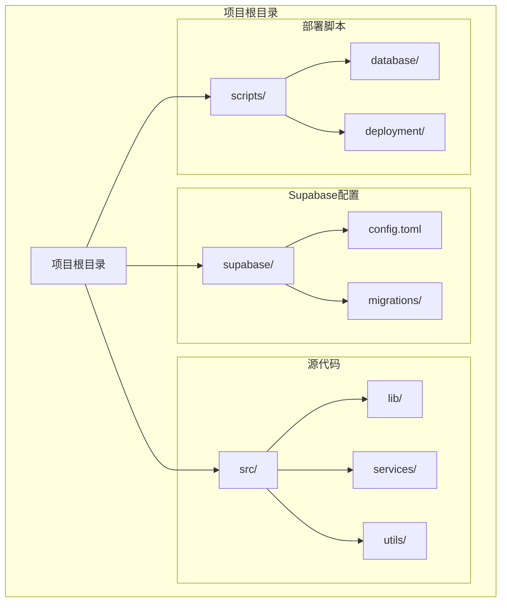
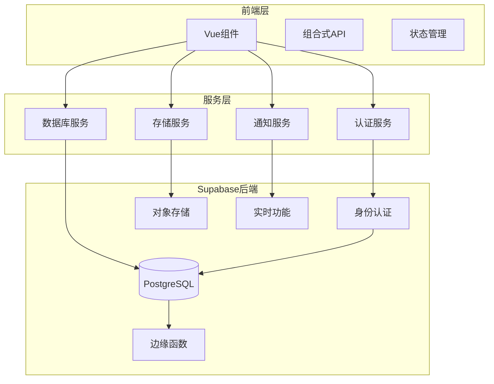
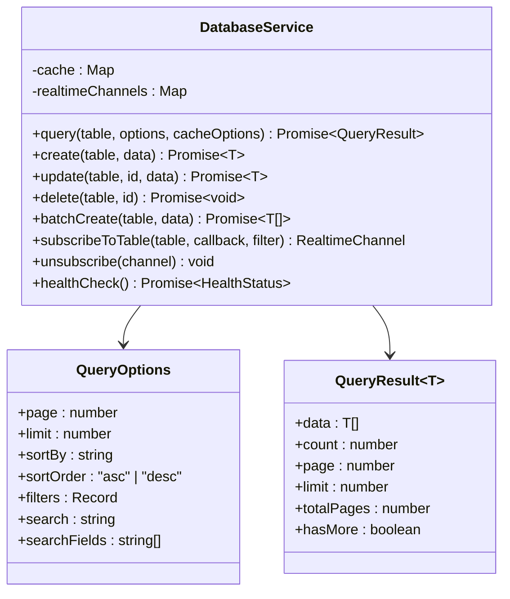
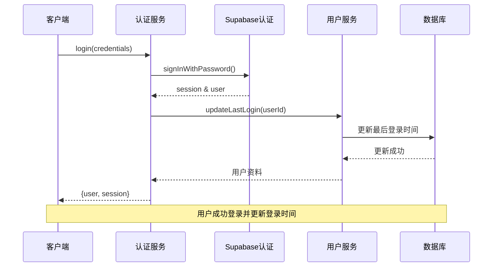
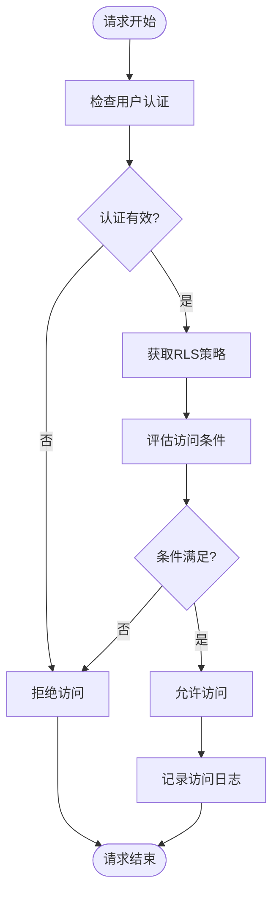
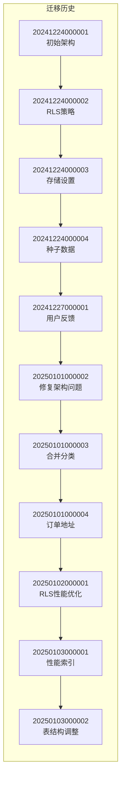
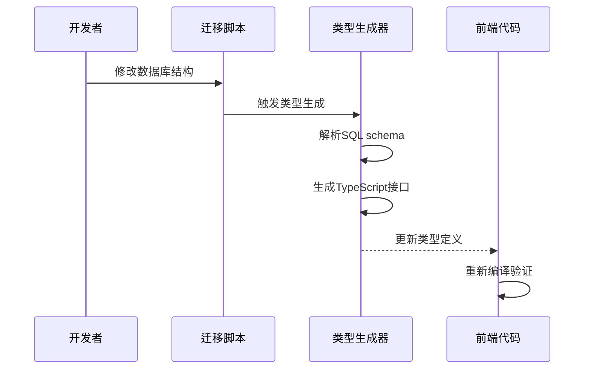

# 后端架构文档

<cite>
**本文档中引用的文件**
- [supabase/config.toml](file://supabase/config.toml)
- [src/lib/supabaseClient.ts](file://src/lib/supabaseClient.ts)
- [src/lib/supabase-schema.ts](file://src/lib/supabase-schema.ts)
- [src/utils/envValidation.ts](file://src/utils/envValidation.ts)
- [src/services/databaseService.ts](file://src/services/databaseService.ts)
- [src/services/authService.ts](file://src/services/authService.ts)
- [scripts/database/create-rls-policies-final.sql](file://scripts/database/create-rls-policies-final.sql)
- [supabase/migrations/20241224000001_initial_schema.sql](file://supabase/migrations/20241224000001_initial_schema.sql)
</cite>

## 目录
1. [简介](#简介)
2. [项目结构概览](#项目结构概览)
3. [Supabase核心组件](#supabase核心组件)
4. [架构概览](#架构概览)
5. [详细组件分析](#详细组件分析)
6. [行级安全(RLS)策略](#行级安全rls策略)
7. [数据库迁移管理](#数据库迁移管理)
8. [客户端类型定义](#客户端类型定义)
9. [性能考虑](#性能考虑)
10. [故障排除指南](#故障排除指南)
11. [结论](#结论)

## 简介

本文档详细介绍了基于Supabase的后端架构设计，重点阐述了如何通过supabase-js客户端连接数据库、利用RLS策略实现行级安全控制，以及迁移脚本在版本控制中的作用。该架构采用后端即服务（BaaS）模式，显著提升了开发效率并简化了数据库管理流程。

Supabase作为一个开源的Firebase替代方案，提供了完整的后端服务，包括PostgreSQL数据库、身份验证、存储服务和实时功能。通过精心设计的架构，我们实现了高度可扩展、安全且易于维护的后端系统。

## 项目结构概览

该项目采用了模块化的架构设计，将Supabase相关的配置、脚本和服务分离到不同的目录中：



**图表来源**
- [supabase/config.toml](file://supabase/config.toml#L1-L128)
- [src/lib/supabaseClient.ts](file://src/lib/supabaseClient.ts#L1-L50)

**章节来源**
- [supabase/config.toml](file://supabase/config.toml#L1-L128)
- [src/lib/supabaseClient.ts](file://src/lib/supabaseClient.ts#L1-L246)

## Supabase核心组件

### 环境配置验证

系统通过严格的环境配置验证确保Supabase连接的安全性和可靠性：

```typescript
interface EnvConfig {
  supabaseUrl: string;
  supabaseAnonKey: string;
  appEnv: "development" | "production" | "test";
  appVersion: string;
  debugMode: boolean;
  enableAnalytics: boolean;
}
```

环境验证包括：
- URL格式验证和域名检查
- 密钥长度和格式验证
- 开发环境与生产环境的差异化配置
- 支付配置的完整性检查

### Supabase客户端初始化

```typescript
export const supabase = createClient(
  supabaseConfig.url,
  supabaseConfig.anonKey,
  supabaseConfig.options,
);
```

客户端配置包含：
- 自动令牌刷新
- 会话持久化
- 实时连接优化
- 环境特定的事件限制

**章节来源**
- [src/utils/envValidation.ts](file://src/utils/envValidation.ts#L1-L293)
- [src/lib/supabaseClient.ts](file://src/lib/supabaseClient.ts#L1-L50)

## 架构概览

系统采用分层架构设计，将前端、服务层和数据库层清晰分离：



**图表来源**
- [src/services/authService.ts](file://src/services/authService.ts#L1-L50)
- [src/services/databaseService.ts](file://src/services/databaseService.ts#L1-L50)

## 详细组件分析

### 数据库服务层

数据库服务层提供了统一的数据访问接口，支持缓存、实时订阅和批量操作：



**图表来源**
- [src/services/databaseService.ts](file://src/services/databaseService.ts#L15-L50)

### 认证服务层

认证服务层封装了Supabase的身份验证功能，提供多种登录方式和用户管理：



**图表来源**
- [src/services/authService.ts](file://src/services/authService.ts#L20-L60)

**章节来源**
- [src/services/databaseService.ts](file://src/services/databaseService.ts#L1-L405)
- [src/services/authService.ts](file://src/services/authService.ts#L1-L306)

## 行级安全(RLS)策略

### RLS策略概述

系统实现了全面的行级安全策略，确保数据访问的安全性和权限控制：

```sql
-- 用户可以查看自己的反馈
CREATE POLICY "用户可以查看自己的反馈" ON user_feedback
FOR SELECT USING (
    auth.uid() = user_id OR 
    auth.uid() IN (
        SELECT user_profiles.id FROM user_profiles 
        WHERE user_profiles.role IN ('admin', 'super_admin')
    )
);
```

### 策略实施范围

RLS策略覆盖以下核心表：

1. **用户反馈表** (`user_feedback`)
   - 用户只能查看自己的反馈
   - 管理员可以管理所有反馈

2. **FAQ分类表** (`faq_categories`)
   - 公开可见的活跃分类
   - 管理员完全控制

3. **产品提交表** (`product_submissions`)
   - 用户查看自己的提交
   - 管理员审核和管理

4. **系统通知表** (`system_notifications`)
   - 基于目标用户的权限控制
   - 过期时间检查

### 策略验证机制



**图表来源**
- [scripts/database/create-rls-policies-final.sql](file://scripts/database/create-rls-policies-final.sql#L1-L50)

**章节来源**
- [scripts/database/create-rls-policies-final.sql](file://scripts/database/create-rls-policies-final.sql#L1-L236)

## 数据库迁移管理

### 迁移文件结构

Supabase迁移文件采用时间戳命名法，确保迁移顺序的确定性：



**图表来源**
- [supabase/migrations/20241224000001_initial_schema.sql](file://supabase/migrations/20241224000001_initial_schema.sql#L1-L50)

### 架构演进过程

初始架构包含了完整的业务实体关系：

1. **用户管理**：用户档案、角色管理
2. **内容管理**：工具、产品、分类
3. **电子商务**：订单、支付、评论
4. **分析监控**：事件跟踪、性能指标

### 迁移最佳实践

- 使用幂等性检查避免重复创建
- 采用扩展机制支持未来功能扩展
- 实施触发器自动更新时间戳
- 建立完善的索引策略提升查询性能

**章节来源**
- [supabase/migrations/20241224000001_initial_schema.sql](file://supabase/migrations/20241224000001_initial_schema.sql#L1-L288)

## 客户端类型定义

### 自动生成的TypeScript类型

系统通过自动生成的TypeScript类型确保前端与数据库schema的一致性：

```typescript
export interface Database {
  public: {
    analytics: Analytics;
    contact_info: ContactInfo;
    faq_categories: FaqCategories;
    faqs: Faqs;
    favorites: Favorites;
    order_items: OrderItems;
    orders: Orders;
    payments: Payments;
    product_reviews: ProductReviews;
    products: Products;
    tools: Tools;
    user_profiles: UserProfiles;
  };
}
```

### 类型定义特点

- **最小化形状**：保守的类型定义防止过度约束
- **可选字段**：明确区分必填和可选字段
- **联合类型**：支持灵活的数据结构
- **枚举类型**：强类型的状态和选项

### 类型同步机制



**图表来源**
- [src/lib/supabase-schema.ts](file://src/lib/supabase-schema.ts#L1-L50)

**章节来源**
- [src/lib/supabase-schema.ts](file://src/lib/supabase-schema.ts#L1-L305)

## 性能考虑

### 缓存策略

数据库服务实现了多层缓存机制：

```typescript
private cache = new Map<string, { data: unknown; timestamp: number; ttl: number }>();
```

- **内存缓存**：快速响应频繁查询
- **TTL过期**：自动清理过期数据
- **模式匹配**：智能清除相关缓存

### 实时订阅优化

- **环境适配**：生产环境限制事件频率
- **连接池管理**：高效管理实时连接
- **错误恢复**：自动重连机制

### 查询优化

- **索引策略**：针对常用查询建立索引
- **分页处理**：避免大数据集全量加载
- **条件过滤**：精确的查询条件减少扫描

## 故障排除指南

### 常见问题诊断

1. **连接问题**
   - 检查环境变量配置
   - 验证网络连接
   - 确认防火墙设置

2. **认证失败**
   - 验证用户凭据
   - 检查会话状态
   - 确认令牌有效性

3. **权限错误**
   - 检查RLS策略配置
   - 验证用户角色
   - 确认表权限设置

### 监控和健康检查

```typescript
async healthCheck(): Promise<{ status: "healthy" | "unhealthy"; latency: number }> {
  const start = Date.now();
  try {
    await supabase.from(TABLES.CATEGORIES).select("id").limit(1);
    const latency = Date.now() - start;
    return { status: "healthy", latency };
  } catch (error) {
    return { status: "unhealthy", latency: Date.now() - start };
  }
}
```

**章节来源**
- [src/services/databaseService.ts](file://src/services/databaseService.ts#L350-L380)

## 结论

本文档详细阐述了基于Supabase的后端架构设计，展示了如何通过现代化的BaaS模式实现高效、安全且可扩展的后端服务。该架构的核心优势包括：

1. **开发效率提升**：通过预构建的功能模块和自动化工具，显著缩短开发周期
2. **安全性保障**：完善的RLS策略和权限控制确保数据安全
3. **可维护性**：清晰的架构分层和标准化的开发流程
4. **性能优化**：多层次的缓存机制和查询优化策略
5. **扩展性**：模块化设计支持业务功能的持续增长

这种架构设计不仅满足了当前的业务需求，也为未来的功能扩展奠定了坚实的基础。通过合理的配置和持续的优化，系统能够稳定地支撑业务发展和技术演进。