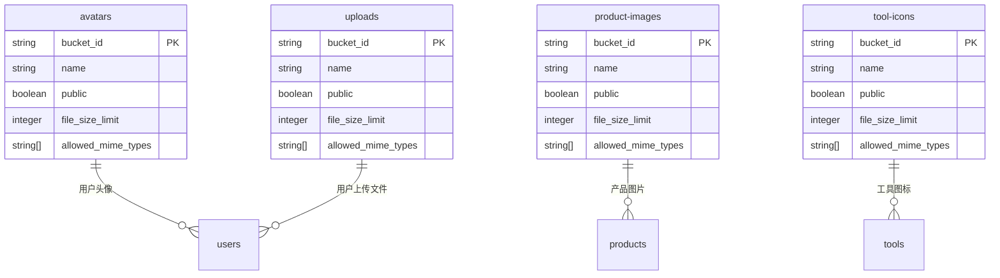
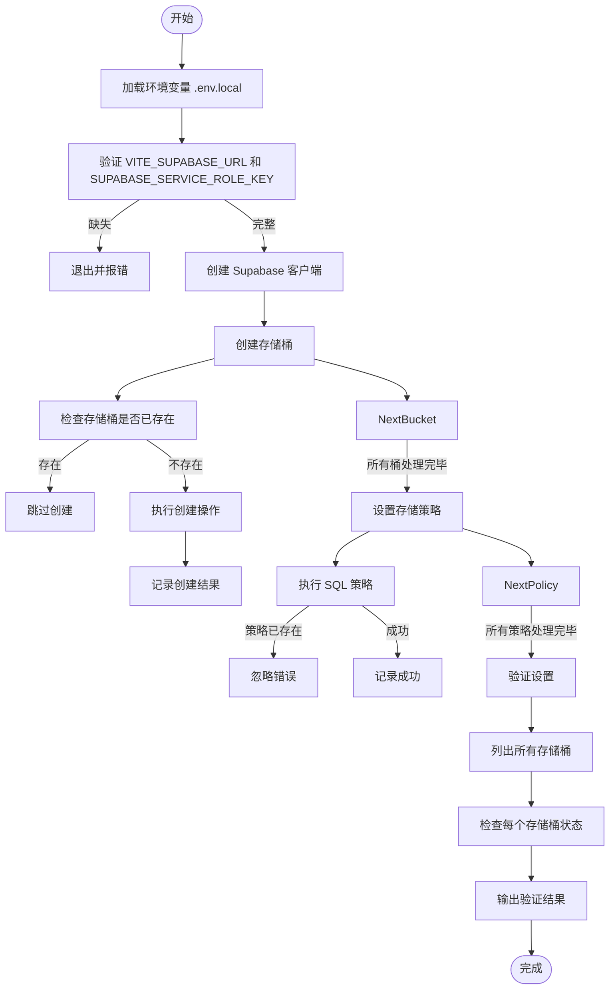
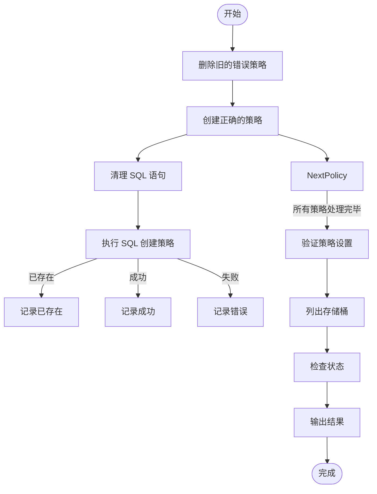
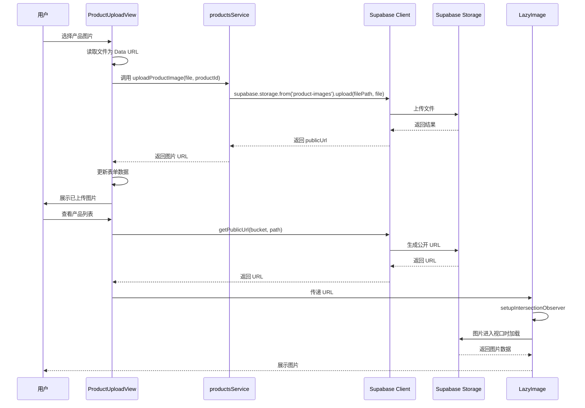

# 存储服务管理

<cite>
**本文档引用文件**  
- [storage_setup.sql](file://supabase/migrations/20241224000003_storage_setup.sql)
- [setup-storage-buckets.js](file://scripts/database/setup-storage-buckets.js)
- [fix-storage-policies.js](file://scripts/database/fix-storage-policies.js)
- [supabaseClient.ts](file://src/lib/supabaseClient.ts)
- [LazyImage.vue](file://src/components/common/LazyImage.vue)
- [useLazyLoading.ts](file://src/composables/useLazyLoading.ts)
- [productsService.ts](file://src/services/productsService.ts)
- [ProductUploadView.vue](file://src/views/ProductUploadView.vue)
</cite>

## 目录
1. [存储桶结构与初始配置](#存储桶结构与初始配置)
2. [自动化创建存储桶](#自动化创建存储桶)
3. [权限策略调整与最佳实践](#权限策略调整与最佳实践)
4. [前端文件上传与安全展示](#前端文件上传与安全展示)
5. [文件管理安全建议](#文件管理安全建议)

## 存储桶结构与初始配置

`storage_setup.sql` 文件定义了系统中用于管理用户上传资源的四个核心存储桶，每个存储桶针对特定类型的文件进行优化配置，确保安全性与性能的平衡。

**图示来源**  
- [storage_setup.sql](file://supabase/migrations/20241224000003_storage_setup.sql#L3-L128)

**本节来源**  
- [storage_setup.sql](file://supabase/migrations/20241224000003_storage_setup.sql#L3-L128)

### 存储桶详细配置

| 存储桶 ID | 名称 | 公开访问 | 文件大小限制 | 允许的 MIME 类型 |
|---------|------|--------|------------|----------------|
| `avatars` | 头像 | 是 | 5MB | image/jpeg, image/png, image/webp, image/gif |
| `product-images` | 产品图片 | 是 | 10MB | image/jpeg, image/png, image/webp |
| `tool-icons` | 工具图标 | 是 | 2MB | image/jpeg, image/png, image/webp, image/svg+xml |
| `uploads` | 用户上传文件 | 否 | 50MB | application/pdf, application/zip, text/plain |

### 存储策略说明

- **头像存储策略**：所有用户可查看任意头像，但仅允许用户上传、更新和删除自己目录下的头像文件（通过 `auth.uid()` 与文件路径匹配）。
- **产品图片策略**：所有用户可查看产品图片，仅管理员和超级管理员可上传、更新或删除。
- **工具图标策略**：所有用户可查看工具图标，仅管理员和超级管理员可管理。
- **用户上传文件策略**：用户可查看、上传和删除自己目录下的文件，管理员可查看所有用户的上传文件。

## 自动化创建存储桶

`setup-storage-buckets.js` 脚本用于自动化创建 Supabase 存储桶并设置访问策略，确保开发和生产环境的一致性。

**图示来源**  
- [setup-storage-buckets.js](file://scripts/database/setup-storage-buckets.js#L1-L292)

**本节来源**  
- [setup-storage-buckets.js](file://scripts/database/setup-storage-buckets.js#L1-L292)

### 脚本执行流程

1. **环境准备**：脚本首先加载 `.env.local` 文件中的环境变量，确保 `VITE_SUPABASE_URL` 和 `SUPABASE_SERVICE_ROLE_KEY` 已正确配置。
2. **客户端初始化**：使用 Supabase 服务角色密钥创建具有完全权限的客户端实例。
3. **存储桶创建**：遍历预定义的存储桶配置数组，逐一检查并创建存储桶。若存储桶已存在，则跳过创建步骤。
4. **策略设置**：通过 `supabase.rpc("exec_sql")` 执行 SQL 语句，创建相应的 RLS（行级安全）策略。
5. **验证与输出**：最后，脚本列出所有存储桶并验证其状态，输出成功信息及 Supabase 仪表板的管理链接。

## 权限策略调整与最佳实践

`fix-storage-policies.js` 脚本用于修正因数据库 schema 变更导致的存储策略问题，确保权限逻辑的正确性。

**图示来源**  
- [fix-storage-policies.js](file://scripts/database/fix-storage-policies.js#L1-L335)

**本节来源**  
- [fix-storage-policies.js](file://scripts/database/fix-storage-policies.js#L1-L335)

### 策略修正必要性

在 `storage_setup.sql` 中，部分策略（如“管理员可以管理产品图片”）使用了 `FOR ALL` 并合并了 `INSERT`, `UPDATE`, `DELETE` 的条件。然而，在实际部署中，可能因策略命名冲突或字段变更（如 `user_id` 字段不存在）导致策略失效。`fix-storage-policies.js` 通过以下步骤解决此问题：

1. **清理旧策略**：使用 `DROP POLICY IF EXISTS` 安全地删除可能存在的错误策略，避免冲突。
2. **精确重建**：为 `INSERT`, `UPDATE`, `DELETE` 操作分别创建独立的策略，确保每个操作的条件清晰且正确。
3. **SQL 清理**：在执行前移除 SQL 语句中的注释和多余空白，防止语法错误。

### 最佳实践

- **分步策略优于合并策略**：为不同操作（SELECT, INSERT, UPDATE, DELETE）创建独立策略，提高可读性和可维护性。
- **使用 `IF EXISTS`**：在删除策略时使用 `IF EXISTS` 避免因策略不存在而导致的脚本中断。
- **幂等性设计**：脚本应能安全地重复执行，通过检查存在性来决定是否执行创建或删除操作。

## 前端文件上传与安全展示

前端通过 `supabaseClient.ts` 提供的工具函数与 Supabase Storage 交互，实现文件上传、获取签名 URL 和安全展示。

**图示来源**  
- [supabaseClient.ts](file://src/lib/supabaseClient.ts#L1-L266)
- [productsService.ts](file://src/services/productsService.ts#L1-L339)
- [ProductUploadView.vue](file://src/views/ProductUploadView.vue#L1-L549)
- [LazyImage.vue](file://src/components/common/LazyImage.vue#L1-L324)

**本节来源**  
- [supabaseClient.ts](file://src/lib/supabaseClient.ts#L1-L266)
- [productsService.ts](file://src/services/productsService.ts#L1-L339)
- [ProductUploadView.vue](file://src/views/ProductUploadView.vue#L1-L549)
- [LazyImage.vue](file://src/components/common/LazyImage.vue#L1-L324)

### 文件上传流程

1. **文件选择**：在 `ProductUploadView.vue` 中，用户通过 `<input type="file">` 选择图片。
2. **文件读取**：使用 `FileReader` 将文件读取为 Data URL，用于在上传前预览。
3. **调用服务**：`productsService.uploadProductImage` 方法被调用，该方法使用 `supabase.storage.from('product-images').upload()` 将文件上传到指定路径。
4. **获取 URL**：上传成功后，使用 `supabase.storage.from('product-images').getPublicUrl()` 获取文件的公开访问 URL。

### 安全展示机制

- **懒加载**：`LazyImage.vue` 组件利用 `IntersectionObserver` 实现图片懒加载，仅当图片进入视口时才发起网络请求，提升页面性能。
- **占位符与错误处理**：组件提供加载占位符（骨架屏）和错误占位符（错误图标和重试按钮），提升用户体验。
- **缓存与优化**：`useLazyLoading.ts` 提供了资源预载和内容预加载功能，可提前加载关键资源。

## 文件管理安全建议

为确保文件存储服务的安全性，建议遵循以下最佳实践：

### 文件命名规范

- **使用唯一标识符**：文件名应包含唯一 ID（如 `productId` 或 `userId`）和时间戳，避免冲突。例如：`products/${productId}-${Date.now()}.${ext}`。
- **避免用户输入直接命名**：不要使用用户上传的原始文件名，防止路径遍历攻击。

### 大小限制

- **严格遵守配置**：前端应在上传前检查文件大小，与后端配置（`file_size_limit`）保持一致，提供即时反馈。
- **分块上传**：对于大文件（如 `uploads` 桶的 50MB 限制），考虑实现分块上传以提高成功率。

### MIME 类型校验

- **前端预校验**：在上传前，检查 `file.type` 是否在允许的 MIME 类型列表中。
- **后端强制校验**：依赖 Supabase 存储桶的 `allowed_mime_types` 配置进行最终校验，防止前端绕过。

### 其他安全措施

- **私有桶访问**：对于私有桶（如 `uploads`），确保生成的 URL 有适当的过期时间，或使用签名 URL 进行访问控制。
- **定期审计**：定期检查存储桶中的文件，清理无效或过期的文件。
- **监控与告警**：设置存储使用量和访问频率的监控，及时发现异常行为。

**本节来源**  
- [storage_setup.sql](file://supabase/migrations/20241224000003_storage_setup.sql#L3-L128)
- [supabaseClient.ts](file://src/lib/supabaseClient.ts#L1-L266)
- [productsService.ts](file://src/services/productsService.ts#L1-L339)