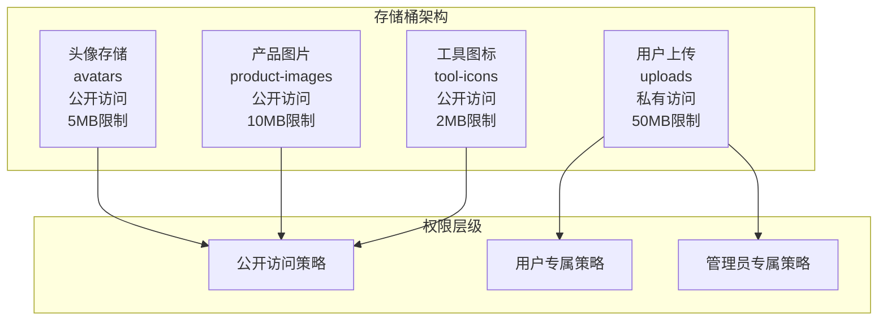
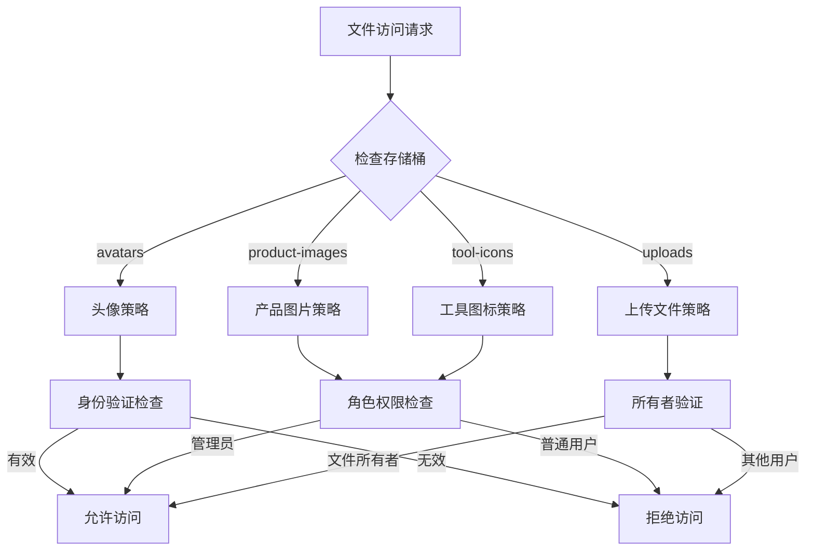
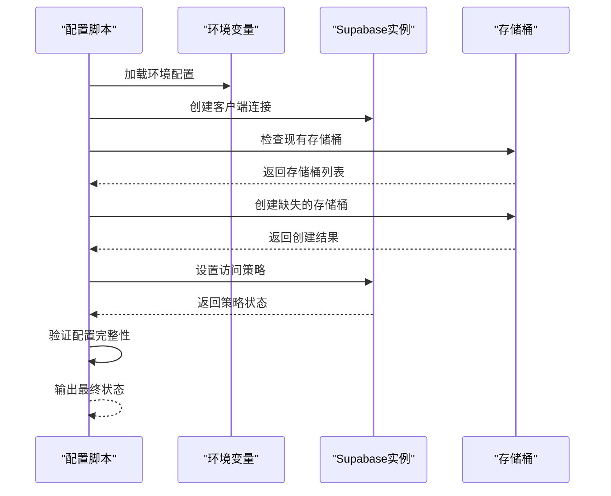
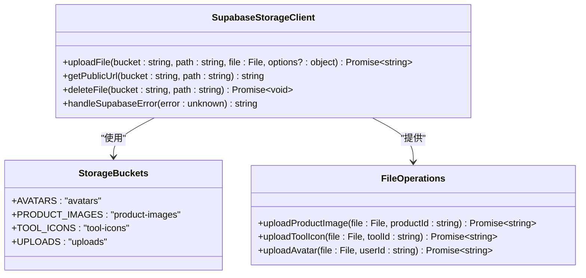
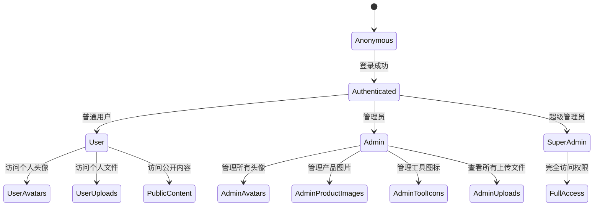
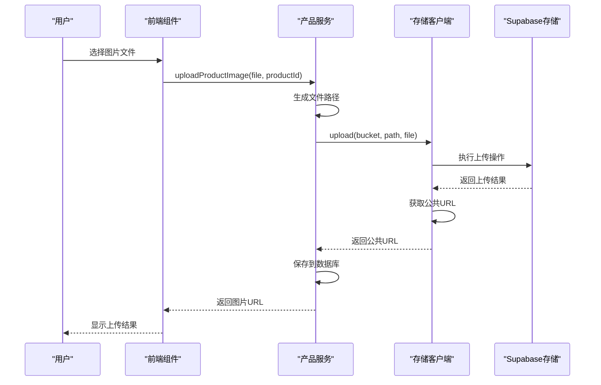
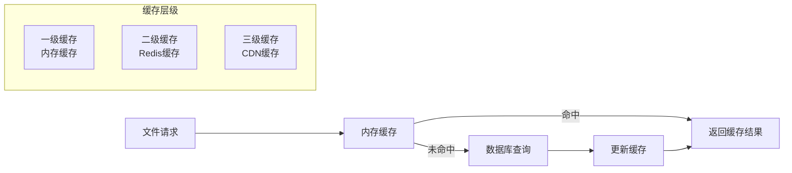

# 存储配置

<cite>
**本文档中引用的文件**
- [20241224000003_storage_setup.sql](file://supabase/migrations/20241224000003_storage_setup.sql)
- [setup-storage-buckets.js](file://scripts/database/setup-storage-buckets.js)
- [simple-storage-setup.js](file://scripts/database/simple-storage-setup.js)
- [create-storage-buckets-only.js](file://scripts/database/create-storage-buckets-only.js)
- [supabaseClient.ts](file://src/lib/supabaseClient.ts)
- [productsService.ts](file://src/services/productsService.ts)
- [toolsService.ts](file://src/services/toolsService.ts)
</cite>

## 目录
1. [简介](#简介)
2. [存储桶架构概览](#存储桶架构概览)
3. [SQL迁移脚本分析](#sql迁移脚本分析)
4. [JavaScript自动化脚本](#javascript自动化脚本)
5. [存储客户端API](#存储客户端api)
6. [权限控制机制](#权限控制机制)
7. [文件操作实现](#文件操作实现)
8. [性能优化策略](#性能优化策略)
9. [部署配置指南](#部署配置指南)
10. [故障排除](#故障排除)

## 简介

本文档详细说明了Supabase Storage模块的完整配置体系，包括存储桶初始化、权限策略设置、自动化部署脚本以及前端文件操作实现。系统采用多层权限控制机制，支持不同类型的文件存储需求，并提供了完整的文件上传、下载和删除功能。

## 存储桶架构概览

系统配置了四个专门的存储桶，每个存储桶针对特定的文件类型和访问模式进行了优化：



**图表来源**
- [20241224000003_storage_setup.sql](file://supabase/migrations/20241224000003_storage_setup.sql#L1-L129)

## SQL迁移脚本分析

### 存储桶创建语句

存储设置SQL脚本定义了四个核心存储桶，每个都经过精心配置以满足特定的业务需求：

```sql
-- 头像存储桶配置
INSERT INTO storage.buckets (id, name, public, file_size_limit, allowed_mime_types)
VALUES 
    ('avatars', 'avatars', true, 5242880, ARRAY['image/jpeg', 'image/png', 'image/webp', 'image/gif']);

-- 产品图片存储桶配置  
INSERT INTO storage.buckets (id, name, public, file_size_limit, allowed_mime_types)
VALUES 
    ('product-images', 'product-images', true, 10485760, ARRAY['image/jpeg', 'image/png', 'image/webp']);
```

### 权限策略详解

系统实现了细粒度的访问控制策略，确保数据安全性和访问合理性：



**图表来源**
- [20241224000003_storage_setup.sql](file://supabase/migrations/20241224000003_storage_setup.sql#L15-L129)

**章节来源**
- [20241224000003_storage_setup.sql](file://supabase/migrations/20241224000003_storage_setup.sql#L1-L129)

## JavaScript自动化脚本

### 主要脚本功能对比

系统提供了多个自动化脚本来简化存储桶配置过程：

| 脚本名称 | 功能特点 | 适用场景 |
|---------|---------|---------|
| setup-storage-buckets.js | 完整配置，包含策略设置 | 生产环境部署 |
| simple-storage-setup.js | 简化配置，仅创建存储桶 | 快速测试环境 |
| create-storage-buckets-only.js | 仅创建存储桶 | 修复现有环境 |

### 脚本执行流程



**图表来源**
- [setup-storage-buckets.js](file://scripts/database/setup-storage-buckets.js#L40-L120)

### 环境变量配置要求

脚本运行需要以下关键环境变量：

```javascript
const supabaseUrl = process.env.VITE_SUPABASE_URL;
const supabaseServiceKey = process.env.SUPABASE_SERVICE_ROLE_KEY || process.env.VITE_SUPABASE_ANON_KEY;
```

**章节来源**
- [setup-storage-buckets.js](file://scripts/database/setup-storage-buckets.js#L1-L293)

## 存储客户端API

### 核心API接口

系统封装了统一的存储客户端API，提供简洁的文件操作接口：



**图表来源**
- [supabaseClient.ts](file://src/lib/supabaseClient.ts#L97-L152)

### 文件上传实现

文件上传功能支持多种文件类型和大小限制：

```typescript
export const uploadFile = async (
  bucket: string,
  path: string,
  file: File,
  options?: { upsert?: boolean },
) => {
  const { data, error } = await supabase.storage
    .from(bucket)
    .upload(path, file, options);

  if (error) {
    throw new Error(handleSupabaseError(error));
  }

  return data;
};
```

**章节来源**
- [supabaseClient.ts](file://src/lib/supabaseClient.ts#L97-L152)

## 权限控制机制

### 角色基础访问控制

系统实现了基于角色的访问控制(RBAC)，确保只有授权用户才能访问相应资源：



### 权限验证逻辑

权限验证通过数据库查询和角色检查相结合：

```sql
-- 管理员权限检查示例
EXISTS (
    SELECT 1 FROM user_profiles 
    WHERE id = auth.uid() 
    AND role IN ('admin', 'super_admin')
)
```

**章节来源**
- [20241224000003_storage_setup.sql](file://supabase/migrations/20241224000003_storage_setup.sql#L30-L80)

## 文件操作实现

### 产品图片上传流程

产品图片上传展示了完整的文件处理流程：



**图表来源**
- [productsService.ts](file://src/services/productsService.ts#L180-L200)

### 文件路径管理

系统采用结构化的文件路径管理策略：

```typescript
// 产品图片路径格式：products/{productId}-{timestamp}.{extension}
const fileName = `${productId}-${Date.now()}.${fileExt}`;
const filePath = `products/${fileName}`;
```

**章节来源**
- [productsService.ts](file://src/services/productsService.ts#L180-L200)

## 性能优化策略

### 缓存机制

系统实现了多层次的缓存策略来提升性能：



### CDN集成策略

对于公开的静态资源，系统建议集成CDN以提升加载速度：

1. **头像文件**：使用Cloudflare CDN加速全球访问
2. **产品图片**：启用自动压缩和格式转换
3. **工具图标**：预缓存常用图标到边缘节点

### 存储配额管理

系统设置了合理的文件大小限制：

| 存储桶 | 最大大小 | 允许类型 | 用途 |
|-------|---------|---------|-----|
| avatars | 5MB | 图片 | 用户头像 |
| product-images | 10MB | 图片 | 产品展示 |
| tool-icons | 2MB | 图片 | 工具标识 |
| uploads | 50MB | 文档 | 用户文件 |

## 部署配置指南

### 环境准备

1. **安装依赖**：
```bash
npm install @supabase/supabase-js dotenv
```

2. **配置环境变量**：
```bash
VITE_SUPABASE_URL=https://your-project.supabase.co
SUPABASE_SERVICE_ROLE_KEY=your_service_role_key
```

3. **运行配置脚本**：
```bash
node scripts/database/setup-storage-buckets.js
```

### 自动化部署

系统支持CI/CD流水线中的自动化部署：

```yaml
deploy-storage:
  script:
    - node scripts/database/setup-storage-buckets.js
  only:
    - production
```

**章节来源**
- [setup-storage-buckets.js](file://scripts/database/setup-storage-buckets.js#L10-L30)

## 故障排除

### 常见问题及解决方案

1. **存储桶创建失败**
   - 检查服务角色密钥是否正确
   - 验证网络连接和防火墙设置
   - 确认存储桶名称唯一性

2. **权限拒绝错误**
   - 验证用户角色配置
   - 检查RLS策略设置
   - 确认文件路径格式正确

3. **文件上传超时**
   - 增加文件大小限制
   - 优化网络连接
   - 启用断点续传功能

### 监控和日志

系统建议实施以下监控措施：

```typescript
// 错误处理和日志记录
export const handleSupabaseError = (error: unknown) => {
  console.error("Supabase Error:", error);
  const err = error as { message?: string; error_description?: string } | null;
  if (err?.message) return err.message;
  if (err?.error_description) return err.error_description;
  return "操作失败，请稍后重试";
};
```

**章节来源**
- [supabaseClient.ts](file://src/lib/supabaseClient.ts#L45-L50)

### 性能监控指标

建议监控以下关键指标：

- 文件上传成功率
- 平均响应时间
- 存储桶使用率
- 权限验证延迟

通过完善的监控和告警机制，可以及时发现和解决存储相关的问题，确保系统的稳定运行。