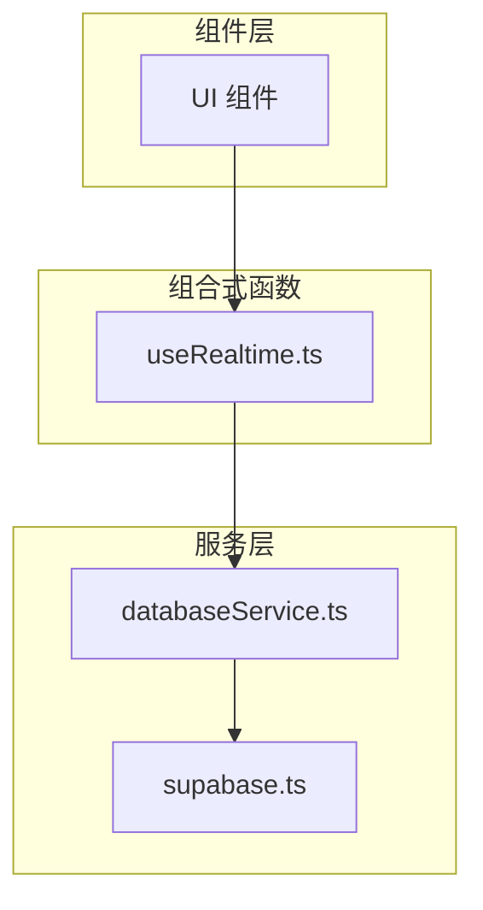
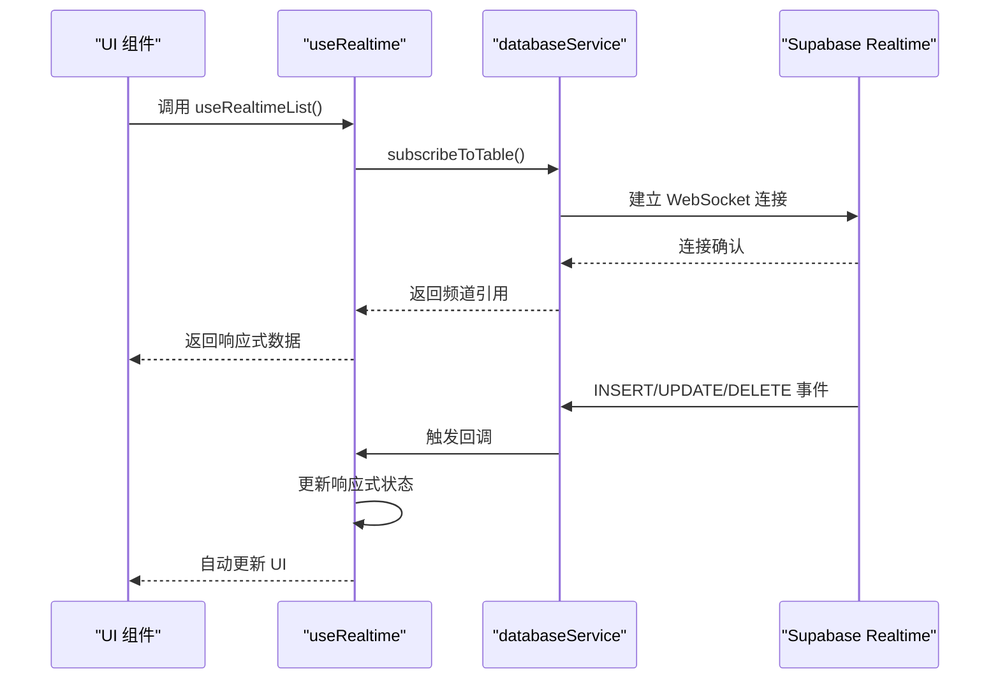
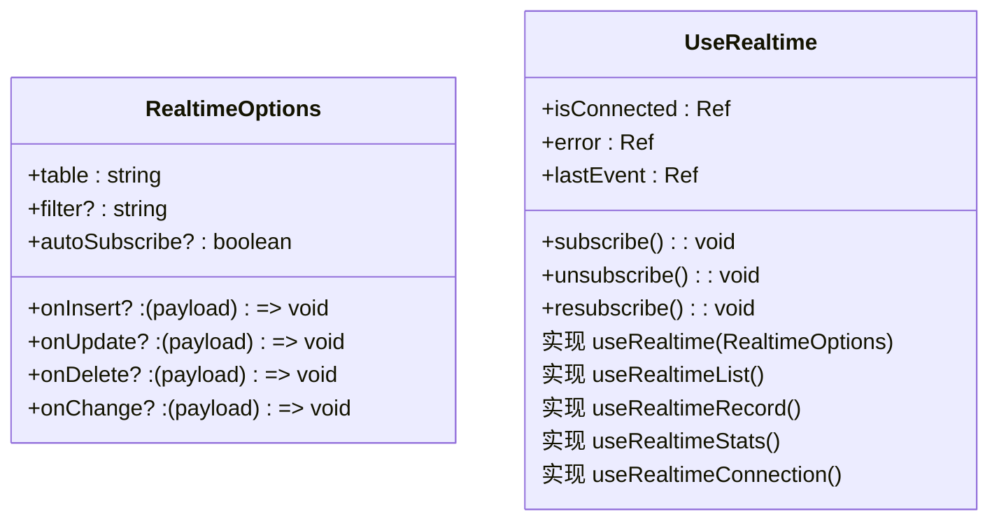
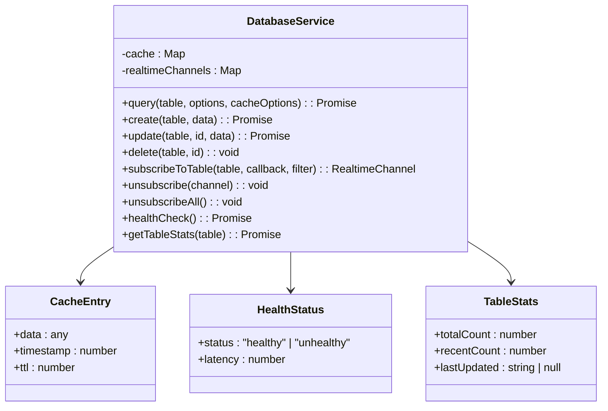
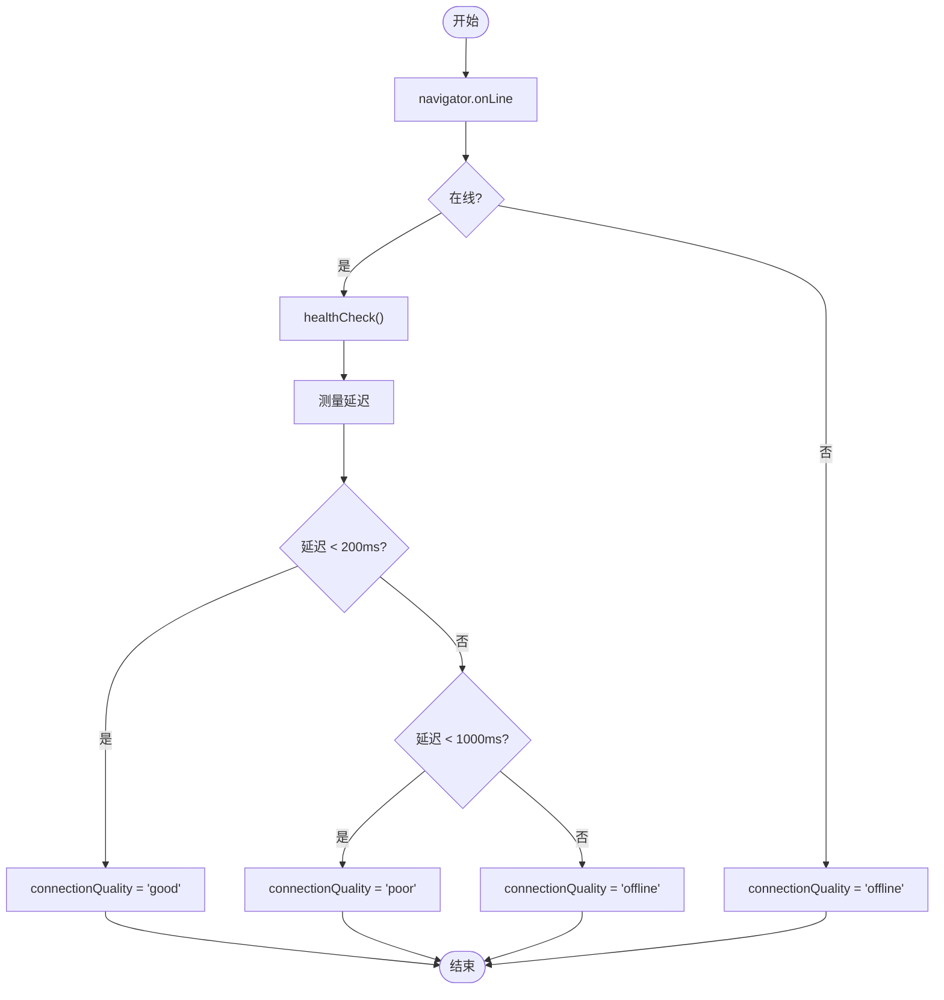
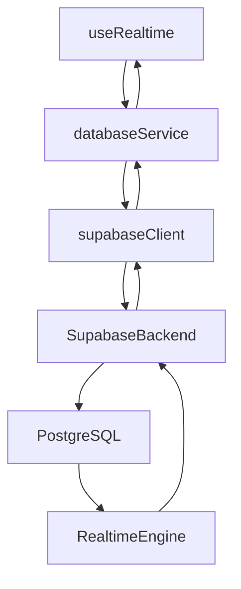

# 实时功能实现

<cite>
**本文档引用的文件**  
- [useRealtime.ts](file://src/composables/useRealtime.ts)
- [databaseService.ts](file://src/services/databaseService.ts)
- [supabase.ts](file://src/lib/supabase.ts)
- [supabaseClient.ts](file://src/lib/supabaseClient.ts)
</cite>

## 目录
1. [简介](#简介)
2. [项目结构](#项目结构)
3. [核心组件](#核心组件)
4. [架构概览](#架构概览)
5. [详细组件分析](#详细组件分析)
6. [依赖分析](#依赖分析)
7. [性能考虑](#性能考虑)
8. [故障排除指南](#故障排除指南)
9. [结论](#结论)

## 简介
本文档详细说明了如何利用 Supabase Realtime 为应用添加实时更新能力。重点分析 `useRealtime.ts` 组合式函数如何订阅数据库变更事件（如新通知、评价更新），并将其转化为响应式状态供组件使用。同时结合 `databaseService.ts` 展示数据变更操作如何触发实时通知，涵盖连接状态管理、重连机制和错误处理策略。

## 项目结构
项目采用标准的 Vue 3 + TypeScript 架构，实时功能主要集中在 `composables` 和 `services` 目录中。`useRealtime.ts` 提供了响应式的实时数据订阅能力，`databaseService.ts` 封装了与 Supabase 的交互逻辑。

**图示来源**  
- [useRealtime.ts](file://src/composables/useRealtime.ts#L1-L403)
- [databaseService.ts](file://src/services/databaseService.ts#L1-L405)

**本节来源**  
- [useRealtime.ts](file://src/composables/useRealtime.ts)
- [databaseService.ts](file://src/services/databaseService.ts)

## 核心组件
`useRealtime.ts` 是实现实时功能的核心组合式函数，提供了多种使用模式：基础订阅、列表同步、单记录同步和统计同步。`databaseService.ts` 负责管理与 Supabase 的连接和频道订阅。

**本节来源**  
- [useRealtime.ts](file://src/composables/useRealtime.ts#L1-L403)
- [databaseService.ts](file://src/services/databaseService.ts#L1-L405)

## 架构概览
系统通过 Supabase Realtime 实现数据库变更的实时推送。前端通过 `databaseService` 建立 WebSocket 连接并订阅特定表的变更事件，`useRealtime` 组合式函数将这些事件转化为响应式状态。

**图示来源**  
- [useRealtime.ts](file://src/composables/useRealtime.ts#L1-L403)
- [databaseService.ts](file://src/services/databaseService.ts#L1-L405)

## 详细组件分析

### useRealtime 组合式函数分析
`useRealtime` 提供了灵活的实时数据订阅接口，支持自定义事件回调和过滤条件。

**图示来源**  
- [useRealtime.ts](file://src/composables/useRealtime.ts#L1-L403)

### databaseService 服务分析
`databaseService` 封装了与 Supabase 的交互，包括查询、增删改和实时订阅功能。

**图示来源**  
- [databaseService.ts](file://src/services/databaseService.ts#L1-L405)

### 实时连接管理
`useRealtimeConnection` 提供了连接状态监控功能，包括在线状态检测和连接质量评估。

**图示来源**  
- [useRealtime.ts](file://src/composables/useRealtime.ts#L344-L403)

**本节来源**  
- [useRealtime.ts](file://src/composables/useRealtime.ts#L1-L403)
- [databaseService.ts](file://src/services/databaseService.ts#L1-L405)

## 依赖分析
实时功能依赖于 Supabase 的实时推送能力，通过 `supabaseClient` 建立 WebSocket 连接。

**图示来源**  
- [useRealtime.ts](file://src/composables/useRealtime.ts#L1-L403)
- [databaseService.ts](file://src/services/databaseService.ts#L1-L405)
- [supabase.ts](file://src/lib/supabase.ts#L1-L2)

**本节来源**  
- [useRealtime.ts](file://src/composables/useRealtime.ts#L1-L403)
- [databaseService.ts](file://src/services/databaseService.ts#L1-L405)
- [supabase.ts](file://src/lib/supabase.ts#L1-L2)

## 性能考虑
- **避免过度订阅**：每个订阅都会占用 WebSocket 连接资源，应根据实际需求订阅
- **合理使用过滤**：通过 `filter` 参数减少不必要的消息传输
- **缓存策略**：`databaseService` 内置了缓存机制，可减少重复查询
- **批量操作**：使用 `batchCreate`、`batchUpdate` 等方法减少网络请求次数
- **延迟更新统计**：`useRealtimeStats` 使用 `setTimeout` 避免频繁查询

**本节来源**  
- [useRealtime.ts](file://src/composables/useRealtime.ts#L328-L332)
- [databaseService.ts](file://src/services/databaseService.ts#L1-L405)

## 故障排除指南
- **连接失败**：检查网络连接和 Supabase 配置
- **消息未接收**：确认订阅的表名和过滤条件是否正确
- **内存泄漏**：确保组件卸载时自动取消订阅（`onUnmounted` 已处理）
- **重复订阅**：避免在组件中多次调用 `useRealtime`
- **类型错误**：确保回调函数的 payload 类型与实际数据结构匹配

**本节来源**  
- [useRealtime.ts](file://src/composables/useRealtime.ts#L1-L403)
- [databaseService.ts](file://src/services/databaseService.ts#L1-L405)

## 结论
通过 `useRealtime` 组合式函数和 `databaseService` 服务的配合，实现了高效、可靠的实时数据同步功能。该方案具有良好的封装性和可复用性，支持多种使用场景，同时考虑了连接管理、错误处理和性能优化等关键问题。