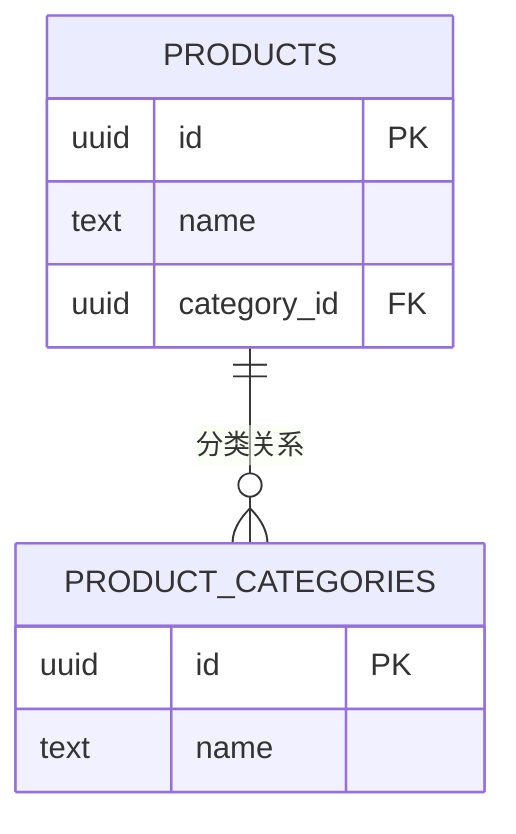
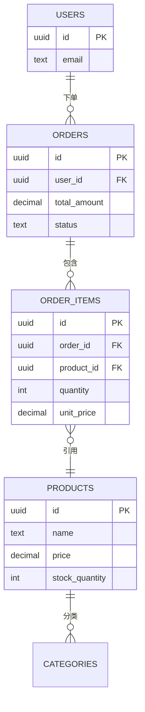

# 产品表结构设计

<cite>
**本文档引用的文件**   
- [20241224000001_initial_schema.sql](file://supabase/migrations/20241224000001_initial_schema.sql)
- [20250101000003_merge_categories.sql](file://supabase/migrations/20250101000003_merge_categories.sql)
- [database.ts](file://src/types/database.ts)
- [productsService.ts](file://src/services/productsService.ts)
- [orderService.ts](file://src/services/orderService.ts)
</cite>

## 目录
1. [产品表字段构成](#产品表字段构成)
2. [价格字段精度控制策略](#价格字段精度控制策略)
3. [库存字段业务约束](#库存字段业务约束)
4. [与分类表的外键关系](#与分类表的外键关系)
5. [与订单表的关联方式](#与订单表的关联方式)
6. [产品上下架状态管理建议](#产品上下架状态管理建议)

## 产品表字段构成

产品表（products）是系统中存储商品信息的核心数据表，包含以下主要字段：

- **id**: UUID类型，主键，使用uuid_generate_v4()生成唯一标识
- **name**: TEXT类型，非空，存储产品名称
- **description**: TEXT类型，非空，存储产品详细描述
- **price**: DECIMAL(10,2)类型，非空，存储产品价格
- **image_url**: TEXT[]数组类型，默认值为'{}'，存储产品图片URL列表
- **stock**: INTEGER类型，存储产品库存数量，可为空
- **category_id**: UUID类型，外键，关联产品分类
- **created_at**: TIMESTAMP WITH TIME ZONE类型，默认值为NOW()，记录创建时间

此外，表中还包含original_price（原价）、currency（货币类型）、is_featured（是否推荐）、status（产品状态）等辅助字段，以及created_by（创建者）等审计字段。

**本节来源**
- [20241224000001_initial_schema.sql](file://supabase/migrations/20241224000001_initial_schema.sql#L107-L141)
- [database.ts](file://src/types/database.ts#L88-L134)

## 价格字段精度控制策略

价格字段（price）采用DECIMAL(10,2)数据类型，这是一种精确的数值类型，专门用于存储货币金额，避免了浮点数运算可能带来的精度损失问题。

该字段的精度定义为(10,2)，表示总共10位数字，其中小数点后保留2位。这种设计策略确保了：
- 支持最大99999999.99的金额，满足绝大多数商品定价需求
- 精确到分（0.01）单位，符合货币计算标准
- 避免二进制浮点数的舍入误差，保证财务计算的准确性

在应用层，价格数据以数字类型（number）在TypeScript中表示，与数据库的DECIMAL类型无缝对接，确保了前后端数据的一致性。

```mermaid
erDiagram
PRODUCTS ||--o{ PRICING : "价格字段"
PRODUCTS {
decimal price 10,2
decimal original_price 10,2
text currency
}
```

**图表来源**
- [20241224000001_initial_schema.sql](file://supabase/migrations/20241224000001_initial_schema.sql#L107-L141)
- [database.ts](file://src/types/database.ts#L88-L134)

**本节来源**
- [20241224000001_initial_schema.sql](file://supabase/migrations/20241224000001_initial_schema.sql#L107-L141)

## 库存字段业务约束

库存字段（stock_quantity）在系统中具有重要的业务约束意义，其设计和使用遵循以下原则：

- 数据类型为INTEGER，可为空值，表示某些产品可能不进行库存管理（如数字产品）
- 当is_digital字段为true时，stock_quantity可能被忽略，因为数字产品通常不受物理库存限制
- 在订单创建过程中，系统会检查库存数量，确保不会超卖
- 库存更新通过事务处理，保证数据一致性

虽然数据库层面没有设置NOT NULL约束，但在业务逻辑层，对于需要库存管理的实体产品，系统会强制要求设置合理的库存值。库存为null表示无限库存或不适用库存管理。

**本节来源**
- [20241224000001_initial_schema.sql](file://supabase/migrations/20241224000001_initial_schema.sql#L107-L141)
- [database.ts](file://src/types/database.ts#L88-L134)

## 与分类表的外键关系

产品表与分类表之间存在明确的外键关系，这种关系在系统演进过程中经历了优化：

最初，产品表通过category_id字段外键引用product_categories表，删除行为设置为ON DELETE SET NULL，这意味着当分类被删除时，相关产品的分类引用将被置空而非级联删除，保护了产品数据的完整性。



**图表来源**
- [20241224000001_initial_schema.sql](file://supabase/migrations/20241224000001_initial_schema.sql#L69-L107)

后续通过迁移脚本20250101000003_merge_categories.sql，系统将categories和product_categories表合并为统一的unified_categories表，实现了工具和产品分类的统一管理。这一变更通过添加category_type字段来区分分类类型，优化了数据库设计，减少了重复结构。

**本节来源**
- [20241224000001_initial_schema.sql](file://supabase/migrations/20241224000001_initial_schema.sql#L69-L107)
- [20250101000003_merge_categories.sql](file://supabase/migrations/20250101000003_merge_categories.sql#L1-L134)

## 与订单表的关联方式

产品表与订单表通过订单项表（order_items）建立多对多关联关系，这种设计支持一个订单包含多个产品，同时一个产品可被多个订单购买。

关联流程如下：
1. 用户在前端选择产品并进入支付流程
2. 系统创建订单（orders表记录）
3. 同时创建订单项（order_items表记录），记录产品ID、数量、单价和总价
4. 订单项表的product_id外键引用产品表的id

特别地，订单项表的外键约束设置为ON DELETE SET NULL，这意味着即使产品被删除，历史订单记录仍然保留，只是产品引用被置空，确保了交易数据的完整性和可追溯性。



**图表来源**
- [20241224000001_initial_schema.sql](file://supabase/migrations/20241224000001_initial_schema.sql#L139-L171)
- [orderService.ts](file://src/services/orderService.ts#L46-L93)

**本节来源**
- [20241224000001_initial_schema.sql](file://supabase/migrations/20241224000001_initial_schema.sql#L139-L171)
- [orderService.ts](file://src/services/orderService.ts#L46-L93)

## 产品上下架状态管理建议

产品状态管理通过status字段实现，该字段为枚举类型（product_status），包含'active'、'inactive'、'draft'三种状态，为产品上下架提供了灵活的管理机制。

基于系统设计，提出以下实现建议：

1. **状态定义清晰化**：
   - active：产品已上架，可在前端展示和购买
   - inactive：产品已下架，前端不可见，但保留数据
   - draft：草稿状态，仅创建者和管理员可见

2. **前端过滤策略**：
   在产品查询服务中，应默认添加.status = 'active'的过滤条件，确保只有上架产品被展示：
   ```typescript
   // productsService.ts中的查询示例
   .from("products")
   .select("*")
   .eq("status", "active")
   ```

3. **管理界面功能**：
   - 提供明确的上架/下架按钮，状态切换应有确认提示
   - 下架产品应保留在管理列表中，可通过状态筛选查看
   - 草稿状态产品应有独立的管理视图

4. **数据一致性**：
   - 下架产品不影响历史订单的完整性
   - 库存更新仅对上架产品有效
   - 搜索和推荐系统应排除下架和草稿产品

5. **审计追踪**：
   - 记录状态变更日志，包括操作人和时间
   - 利用updated_at字段跟踪最后修改时间

这种状态管理模式既保证了用户体验的流畅性，又确保了数据的完整性和可追溯性。

**本节来源**
- [20241224000001_initial_schema.sql](file://supabase/migrations/20241224000001_initial_schema.sql#L107-L141)
- [database.ts](file://src/types/database.ts#L88-L134)
- [productsService.ts](file://src/services/productsService.ts#L85-L138)