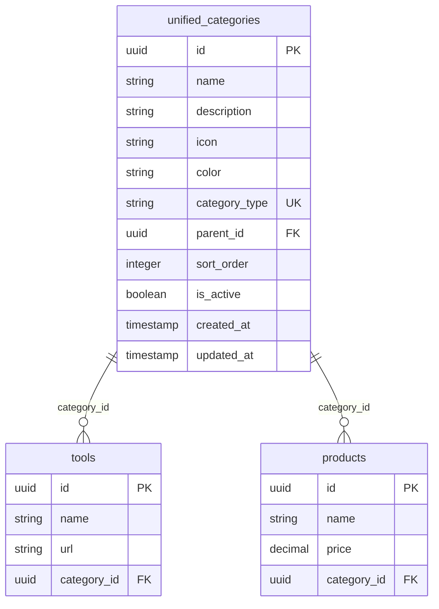

# 分类系统重构演进

<cite>
**本文档引用的文件**  
- [20241224000001_initial_schema.sql](file://supabase/migrations/20241224000001_initial_schema.sql)
- [20250101000003_merge_categories.sql](file://supabase/migrations/20250101000003_merge_categories.sql)
- [categoriesService.ts](file://src/services/categoriesService.ts)
- [database.ts](file://src/types/database.ts)
</cite>

## 目录
1. [引言](#引言)
2. [初始分类表结构分析](#初始分类表结构分析)
3. [合并迁移的动机与目标](#合并迁移的动机与目标)
4. [merge_categories.sql 结构变更详解](#merge_categories.sql-结构变更详解)
5. [数据一致性保障机制](#数据一致性保障机制)
6. [前端 categoriesService 适配分析](#前端-categoriesService-适配分析)
7. [分类树递归查询与性能优化](#分类树递归查询与性能优化)
8. [结论](#结论)

## 引言
本文档旨在深入分析 `initial_schema.sql` 与 `merge_categories.sql` 中关于 `categories` 表的结构演进，重点阐述从扁平分类到层级分类的重构过程。通过对比数据库迁移脚本、解析结构变更语句、审查数据迁移策略以及前端服务适配逻辑，全面揭示分类系统重构的技术细节与设计考量。

## 初始分类表结构分析
在初始数据库架构中，系统定义了两个独立的分类表：`categories`（用于工具）和 `product_categories`（用于产品）。这种设计导致了结构重复和维护困难。

### 表结构特征
- **字段冗余**：两个表具有完全相同的字段结构（`id`, `name`, `description`, `icon`, `color`, `parent_id`, `sort_order`, `is_active`, `created_at`, `updated_at`），仅表名不同。
- **层级支持**：通过 `parent_id UUID REFERENCES categories(id)` 字段，已具备实现树形结构的基础，但被分散在两个表中。
- **索引配置**：均创建了 `parent_id` 和 `sort_order` 索引，为层级查询和排序提供了基础支持。

**Section sources**
- [20241224000001_initial_schema.sql](file://supabase/migrations/20241224000001_initial_schema.sql#L45-L68)
- [20241224000001_initial_schema.sql](file://supabase/migrations/20241224000001_initial_schema.sql#L70-L93)

## 合并迁移的动机与目标
`merge_categories.sql` 迁移脚本的核心动机是解决初始设计中的重复和碎片化问题。

### 演进动机
1. **消除冗余**：合并两个结构完全相同的表，减少数据库对象数量，简化维护。
2. **统一管理**：提供一个统一的接口来管理所有分类，无论是工具还是产品分类。
3. **增强一致性**：确保分类的创建、更新、删除等操作逻辑统一，避免因双表维护导致的不一致。
4. **简化前端逻辑**：前端服务无需再区分 `categories` 和 `product_categories`，可以使用单一服务进行操作。

### 核心目标
- 创建一个名为 `unified_categories` 的新表，整合原有功能。
- 通过 `category_type` 字段明确区分分类的用途（工具或产品）。
- 完整迁移历史数据，并保证外键引用的完整性。
- 实施严格的迁移后数据验证，确保系统稳定性。



**Diagram sources**
- [20250101000003_merge_categories.sql](file://supabase/migrations/20250101000003_merge_categories.sql#L6-L23)
- [20241224000001_initial_schema.sql](file://supabase/migrations/20241224000001_initial_schema.sql#L95-L108)
- [20241224000001_initial_schema.sql](file://supabase/migrations/20241224000001_initial_schema.sql#L110-L123)

## merge_categories.sql 结构变更详解
`merge_categories.sql` 脚本执行了一系列原子性操作，确保迁移过程的安全与可靠。

### 新表创建与字段调整
脚本首先创建 `unified_categories` 表，其关键变更包括：
- **新增 `category_type` 字段**：`category_type TEXT NOT NULL CHECK (category_type IN ('tool', 'product'))`，用于区分分类类型，这是合并的核心。
- **保留 `parent_id` 字段**：`parent_id UUID REFERENCES unified_categories(id)`，维持了对树形结构的支持，允许创建无限层级的分类。
- **字段类型一致性**：所有字段类型与原表保持一致，确保数据无缝迁移。

### 外键引用更新
脚本通过 `ALTER TABLE ... DROP CONSTRAINT ... ADD CONSTRAINT ...` 语句，安全地更新了 `tools` 和 `products` 表的外键约束，使其指向新的 `unified_categories` 表。此操作确保了数据引用的完整性。

### 索引重建
为新表创建了三个关键索引：
- `idx_unified_categories_type`：加速按 `category_type` 的查询。
- `idx_unified_categories_parent_id`：优化树形结构的遍历查询。
- `idx_unified_categories_sort_order`：支持分类的排序展示。

### RLS 策略与触发器
- **行级安全（RLS）**：为新表启用 RLS，并定义了“所有人可读，仅管理员可管理”的策略，继承了系统的安全模型。
- **更新时间触发器**：`update_unified_categories_updated_at` 触发器确保 `updated_at` 字段在记录更新时自动刷新。

**Section sources**
- [20250101000003_merge_categories.sql](file://supabase/migrations/20250101000003_merge_categories.sql#L6-L80)

## 数据一致性保障机制
迁移脚本内置了多层保障措施，以确保数据的完整性和系统的可靠性。

### 事务性操作
整个迁移过程被包裹在 `BEGIN; ... COMMIT;` 事务块中。任何步骤的失败都将导致整个事务回滚，防止数据库进入不一致状态。

### 数据迁移验证
脚本末尾的 `DO $$ ... $$` 匿名代码块执行了关键的数据验证：
1. **引用完整性检查**：通过查询 `tools` 和 `products` 表，确认所有 `category_id` 都能在 `unified_categories` 表中找到对应记录。
2. **计数统计**：输出迁移后的工具分类数、产品分类数和总数，供人工核对。
3. **异常处理**：使用 `EXCEPTION` 块捕获任何错误，记录日志并主动 `ROLLBACK`，确保失败时系统状态可预测。

这些措施共同构成了一个健壮的迁移流程，最大限度地降低了生产环境的风险。

**Section sources**
- [20250101000003_merge_categories.sql](file://supabase/migrations/20250101000003_merge_categories.sql#L107-L134)

## 前端 categoriesService 适配分析
前端 `categoriesService.ts` 服务已完全适配新的统一分类表结构。

### 接口适配
- **表名常量**：`TABLES.CATEGORIES` 常量（定义于 `supabaseClient.ts`）直接指向 `unified_categories` 表（或迁移后重命名的 `categories` 表），服务代码无需修改表名。
- **数据查询**：`getCategories` 方法使用 `supabase.from(TABLES.CATEGORIES).select("*")` 查询所有分类，新表的 `category_type` 字段可被前端选择性使用或忽略。

### 层级树构建
服务的核心方法 `buildCategoryTree` 完美适配了树形结构：
- **算法逻辑**：该方法通过 `parent_id` 字段，将扁平的分类数组递归构建成一个树形结构。
- **前端展示**：返回的树形结构可直接用于渲染多级分类菜单，实现了从扁平到层级的无缝过渡。

### 业务逻辑增强
- **删除保护**：`deleteCategory` 方法在删除前检查子分类和关联工具，防止了数据孤岛，体现了良好的业务约束。
- **统计信息**：`getCategoriesWithStats` 方法结合工具数据，为分类提供计数信息，增强了用户体验。

**Section sources**
- [categoriesService.ts](file://src/services/categoriesService.ts#L7-L277)
- [database.ts](file://src/types/database.ts#L40-L71)

## 分类树递归查询与性能优化
虽然前端通过 `buildCategoryTree` 在应用层构建树，但在某些场景下，直接在数据库中进行递归查询可能更高效。

### 递归查询 SQL 示例
以下 SQL 使用 PostgreSQL 的 `WITH RECURSIVE` 语法，查询指定分类（例如 `id = 'root_id'`）下的所有子分类：

```sql
WITH RECURSIVE category_tree AS (
  -- 锚点成员：选择根节点
  SELECT 
    id, 
    name, 
    parent_id, 
    0 AS level,
    ARRAY[id] AS path
  FROM unified_categories 
  WHERE id = 'root_id' AND is_active = true

  UNION ALL

  -- 递归成员：选择子节点
  SELECT 
    c.id, 
    c.name, 
    c.parent_id, 
    ct.level + 1,
    ct.path || c.id
  FROM unified_categories c
  INNER JOIN category_tree ct ON c.parent_id = ct.id
  WHERE c.is_active = true
)
SELECT * FROM category_tree ORDER BY path;
```

### 性能优化建议
1. **索引利用**：确保 `parent_id` 和 `is_active` 字段上有复合索引（`CREATE INDEX idx_unified_categories_parent_active ON unified_categories(parent_id, is_active);`），这能极大加速递归查询中的连接操作。
2. **限制层级**：在应用中设置最大分类层级（如5层），避免无限递归导致性能问题。
3. **缓存策略**：对于不频繁变动的分类树，前端或应用服务器应实现缓存（如 Redis），减少对数据库的直接查询。
4. **分页查询**：对于大型分类树，考虑实现分页或懒加载，避免一次性加载过多数据。

**Section sources**
- [20250101000003_merge_categories.sql](file://supabase/migrations/20250101000003_merge_categories.sql#L25-L39)
- [categoriesService.ts](file://src/services/categoriesService.ts#L190-L210)

## 结论
本次分类系统的重构是一次成功的数据库演进。通过 `merge_categories.sql` 脚本，系统成功地将两个重复的扁平分类表合并为一个支持层级结构的统一分类表。这一变更不仅消除了冗余，还通过 `parent_id` 字段实现了灵活的树形分类，为未来的业务扩展奠定了坚实基础。迁移过程中的事务控制和数据验证确保了数据一致性，而前端 `categoriesService` 的适配则保证了用户体验的平滑过渡。该案例展示了如何通过精心设计的数据库迁移，实现系统架构的持续优化。