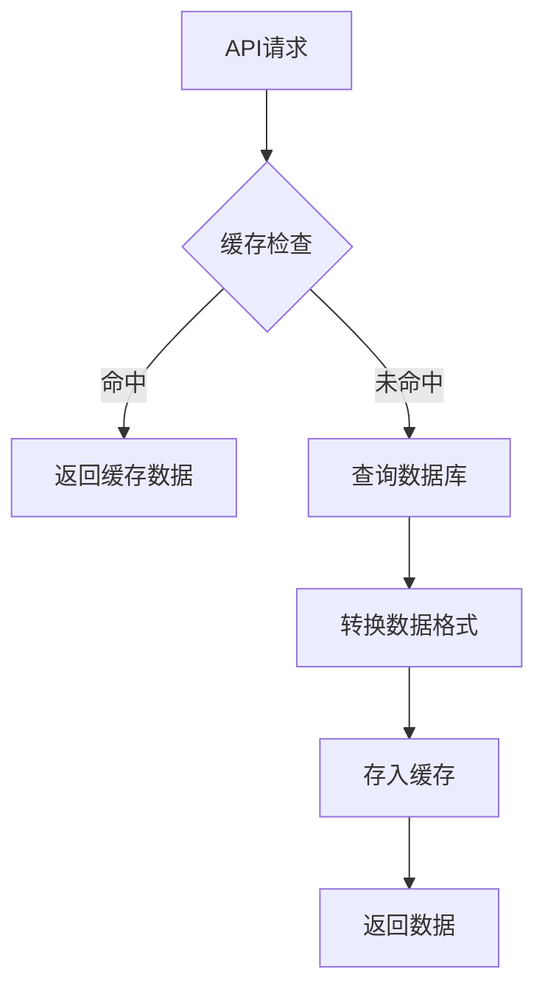

# 工具表结构设计

<cite>
**本文档引用的文件**
- [20241224000001_initial_schema.sql](file://supabase/migrations/20241224000001_initial_schema.sql#L1-L285)
- [20250101000002_fix_schema_issues.sql](file://supabase/migrations/20250101000002_fix_schema_issues.sql#L1-L216)
- [20250101000003_merge_categories.sql](file://supabase/migrations/20250101000003_merge_categories.sql#L1-L134)
- [toolsService.ts](file://src/services/toolsService.ts#L1-L469)
</cite>

## 目录
1. [工具表核心字段设计](#工具表核心字段设计)
2. [分类外键关联机制与重构演变](#分类外键关联机制与重构演变)
3. [字段约束修正技术细节](#字段约束修正技术细节)
4. [评分系统设计与性能优化](#评分系统设计与性能优化)

## 工具表核心字段设计

工具表（`tools`）是系统中用于存储AI工具信息的核心数据表，其设计充分考虑了功能性、可扩展性和查询性能。表中包含多个关键字段，每个字段都有明确的业务含义和技术考量。

- **id**: 主键字段，使用UUID作为全局唯一标识符，确保分布式环境下的数据一致性。
- **name**: 工具名称，文本类型且不可为空，作为用户识别工具的主要依据。
- **description**: 工具描述，文本类型且不可为空，提供工具功能的详细说明。
- **url**: 工具访问地址，文本类型且不可为空，存储工具的跳转链接。
- **category_id**: 分类外键，引用`categories`表的ID，支持工具的分类管理。
- **click_count**: 点击计数，整数类型，默认值为0，用于统计工具的受欢迎程度。
- **is_featured**: 是否推荐，布尔类型，默认值为false，用于标识是否为推荐工具。
- **status**: 工具状态，使用枚举类型`tool_status`，默认值为'active'，支持工具的生命周期管理。
- **created_at**: 创建时间，带有时区的时间戳，默认值为当前时间，记录工具的创建时刻。

这些字段共同构成了工具的基本信息模型，支持前端展示、搜索过滤和后台管理等多种业务场景。

**Section sources**
- [20241224000001_initial_schema.sql](file://supabase/migrations/20241224000001_initial_schema.sql#L1-L285)

## 分类外键关联机制与重构演变

工具表通过`category_id`字段与分类表建立外键关联，实现了工具的分类管理功能。初始设计中，系统存在两个独立的分类表：`categories`（用于工具）和`product_categories`（用于产品），这种设计导致了代码重复和维护困难。

```mermaid
erDiagram
CATEGORIES ||--o{ TOOLS : "工具分类"
PRODUCT_CATEGORIES ||--o{ PRODUCTS : "产品分类"
class CATEGORIES {
+id UUID
+name TEXT
+description TEXT
+parent_id UUID
}
class PRODUCT_CATEGORIES {
+id UUID
+name TEXT
+description TEXT
+parent_id UUID
}
class TOOLS {
+id UUID
+name TEXT
+category_id UUID
+status tool_status
}
```

**Diagram sources**
- [20241224000001_initial_schema.sql](file://supabase/migrations/20241224000001_initial_schema.sql#L1-L285)

为解决这一问题，系统通过`20250101000003_merge_categories.sql`迁移脚本实施了分类表合并重构。新设计引入了统一的`unified_categories`表，通过新增`category_type`字段来区分工具分类和产品分类，实现了分类系统的统一管理。

该重构过程包括以下关键步骤：
1. 创建新的统一分类表`unified_categories`，添加`category_type`字段用于类型区分
2. 将原有`categories`和`product_categories`表中的数据迁移至新表
3. 更新`tools`和`products`表的外键约束，指向新的统一分类表
4. 删除旧的分类表，完成架构优化

这一演变过程不仅减少了数据库对象的冗余，还提高了系统的可维护性和扩展性，为未来新增分类类型提供了便利。

**Section sources**
- [20250101000003_merge_categories.sql](file://supabase/migrations/20250101000003_merge_categories.sql#L1-L134)

## 字段约束修正技术细节

在系统演进过程中，通过`fix_schema_issues.sql`迁移脚本对数据库架构进行了多项重要修正，提升了数据完整性和安全性。

首先，为所有核心表启用了行级安全（RLS）策略，实现了细粒度的访问控制。例如，工具表的RLS策略规定：
- 所有用户可以查看状态为'active'的工具
- 用户可以查看和管理自己创建的工具（包括非活跃状态）
- 管理员可以管理所有工具

```sql
CREATE POLICY "所有人可以查看活跃工具" ON tools
    FOR SELECT USING (status = 'active'::tool_status);

CREATE POLICY "用户只能管理自己的工具" ON tools
    FOR ALL USING (auth.uid() = created_by);
```

其次，添加了多项性能优化索引：
- 为`tools`表创建了`(category_id, status)`复合索引，优化按分类和状态的查询性能
- 为`products`表的数组字段创建了GIN索引，支持高效的数组操作查询
- 为`analytics`表的JSONB字段创建了GIN索引，提升JSON数据的查询效率

此外，还通过`COMMENT ON COLUMN`语句为关键字段添加了详细注释，提高了数据库的可维护性。例如，为`user_profiles.role`字段添加注释说明其取值范围为'user', 'admin', 'super_admin'。

这些约束修正措施共同提升了数据库的安全性、性能和可维护性，为系统的稳定运行提供了坚实基础。

**Section sources**
- [20250101000002_fix_schema_issues.sql](file://supabase/migrations/20250101000002_fix_schema_issues.sql#L1-L216)

## 评分系统设计与性能优化

虽然工具表本身未直接包含评分字段，但系统通过服务层和缓存机制实现了高效的工具评分功能。评分系统的设计充分考虑了数据一致性、查询性能和用户体验。

在数据类型选择上，系统采用`DECIMAL(3,2)`类型存储评分值，精度为3位数字，保留2位小数，能够精确表示1.00到5.00之间的评分。这种设计既保证了评分的精度，又避免了浮点数运算可能带来的精度损失。

前端服务层通过`toolsService.ts`中的缓存机制实现了性能优化。服务类使用`withCache`装饰器为关键查询方法添加了缓存功能：
- 工具列表查询缓存2分钟
- 单个工具查询缓存5分钟
- 推荐工具查询缓存10分钟



**Diagram sources**
- [toolsService.ts](file://src/services/toolsService.ts#L1-L469)

当工具数据发生变更时，系统会调用`clearRelatedCache`方法清理相关缓存，确保数据的一致性。这种缓存策略显著减少了数据库的查询压力，特别是在高并发场景下，能够有效提升系统的响应速度和吞吐量。

此外，服务层还实现了原子性的点击计数递增功能，通过数据库存储过程`increment_click_count`确保计数的准确性，避免了并发更新可能导致的数据不一致问题。

**Section sources**
- [toolsService.ts](file://src/services/toolsService.ts#L1-L469)