# 数据库模式设计

<cite>
**本文档引用的文件**  
- [20241224000001_initial_schema.sql](file://supabase/migrations/20241224000001_initial_schema.sql)
- [20250101000003_merge_categories.sql](file://supabase/migrations/20250101000003_merge_categories.sql)
- [database.ts](file://src/types/database.ts)
- [database_migration.sql](file://database_migration.sql)
- [database_migration_check.sql](file://database_migration_check.sql)
- [database_rollback.sql](file://database_rollback.sql)
</cite>

## 更新摘要
**变更内容**   
- 更新了订单表（orders）结构，新增 `billing_address` 和 `payment_id` 字段
- 新增支付表（payments）的完整结构定义与RLS策略
- 更新实体关系图（ER图）以反映新的支付系统架构
- 新增支付系统迁移与验证机制说明
- 更新TypeScript类型定义以同步最新数据库结构

## 目录
1. [引言](#引言)
2. [初始数据库架构](#初始数据库架构)
3. [核心表结构与关系建模](#核心表结构与关系建模)
4. [分类系统重构：合并迁移](#分类系统重构：合并迁移)
5. [TypeScript 类型同步机制](#typescript-类型同步机制)
6. [实体关系图（ER 图）](#实体关系图（er-图）)
7. [字段命名规范与时间戳处理](#字段命名规范与时间戳处理)
8. [软删除实现方式](#软删除实现方式)
9. [索引策略与约束条件](#索引策略与约束条件)
10. [支付系统架构演进](#支付系统架构演进)
11. [迁移与回滚机制](#迁移与回滚机制)
12. [结论](#结论)

## 引言
本文档旨在全面分析基于 Supabase 的数据库模式设计，重点解析从 `initial_schema.sql` 到 `merge_categories.sql` 的演进过程。通过深入研究用户、工具、产品、分类、订单、评价等核心表的字段定义与关系建模，揭示系统架构的设计理念。特别关注分类系统的重构决策，并结合前端 TypeScript 类型定义说明数据库与应用层之间的结构同步机制。新增对支付系统架构的详细分析，包括 `payments` 表的设计、迁移脚本的实现以及完整的验证机制。

## 初始数据库架构
初始数据库架构由 `20241224000001_initial_schema.sql` 脚本定义，包含多个核心表和枚举类型。该脚本通过幂等性设计确保可重复执行，使用 `IF NOT EXISTS` 条件创建表和类型，避免重复定义错误。架构中引入了 `uuid-ossp` 和 `pgcrypto` 扩展以支持 UUID 生成和加密功能。

系统定义了多种枚举类型，如 `user_role`、`tool_status`、`product_status`、`order_status` 和 `payment_status`，用于约束关键字段的取值范围，提升数据一致性。所有表均采用统一的时间戳管理机制，包含 `created_at` 和 `updated_at` 字段，并通过触发器自动更新 `updated_at`。

**中文(中文)**
- [20241224000001_initial_schema.sql](file://supabase/migrations/20241224000001_initial_schema.sql#L1-L285)

## 核心表结构与关系建模
### 用户表（user_profiles）
用户资料表作为系统的核心身份实体，与 Supabase Auth 系统集成，通过 `id` 字段引用 `auth.users(id)` 实现级联删除。包含用户名、邮箱、角色、活跃状态等基本信息，并支持个人简介、头像、网站等扩展属性。

### 工具表（tools）与产品表（products）
工具和产品分别由独立的表管理，均包含名称、描述、状态、分类引用、创建者等通用字段。工具表侧重链接和点击统计，而产品表则包含价格、库存、数字商品标识、评分等电商相关属性。

### 分类表（categories 与 product_categories）
初始设计中存在两套独立的分类体系：`categories` 用于工具分类，`product_categories` 用于产品分类。两者结构完全相同，支持层级结构（通过 `parent_id` 自引用）、排序和激活状态控制。

### 关联关系
- **收藏表（favorites）**：支持用户对工具或产品的收藏，通过 `CHECK` 约束确保 `tool_id` 和 `product_id` 互斥。
- **订单与订单项（orders 与 order_items）**：实现一对多关系，订单包含多个订单项，每个订单项关联一个产品。
- **支付表（payments）**：与订单一对一关联，记录支付状态和第三方支付信息。
- **评价表（product_reviews）**：用户对产品的评价，包含评分、标题、内容，并通过唯一约束防止重复评价。

**中文(中文)**
- [20241224000001_initial_schema.sql](file://supabase/migrations/20241224000001_initial_schema.sql#L50-L200)

## 分类系统重构：合并迁移
### 重构背景
初始设计中存在 `categories` 和 `product_categories` 两张结构完全相同的表，导致代码重复、维护困难和潜在的数据不一致风险。为优化数据库设计，通过 `20250101000003_merge_categories.sql` 迁移脚本将两者合并为统一的分类表。

### 统一分类表设计
创建 `unified_categories` 表，新增 `category_type` 字段用于区分“工具”和“产品”分类。该字段为 `TEXT` 类型，并通过 `CHECK` 约束限制取值为 `'tool'` 或 `'product'`。

```sql
CREATE TABLE unified_categories (
    ...
    category_type TEXT NOT NULL CHECK (category_type IN ('tool', 'product')),
    ...
);
```

### 数据迁移与外键更新
迁移脚本分步执行：
1. 将原 `categories` 表数据插入 `unified_categories`，`category_type` 设为 `'tool'`。
2. 将原 `product_categories` 表数据插入 `unified_categories`，`category_type` 设为 `'product'`。
3. 更新 `tools` 和 `products` 表的外键约束，使其引用 `unified_categories(id)`。
4. 删除旧的 `categories` 和 `product_categories` 表。

### 安全性与验证
- **行级安全（RLS）**：为 `unified_categories` 启用 RLS，允许所有人查看分类，仅管理员可管理。
- **数据验证**：通过 `DO` 块执行验证逻辑，确保迁移后所有工具和产品的分类引用有效。

**中文(中文)**
- [20250101000003_merge_categories.sql](file://supabase/migrations/20250101000003_merge_categories.sql#L8-L134)

## TypeScript 类型同步机制
`src/types/database.ts` 文件定义了与数据库表结构完全对应的 TypeScript 接口，确保前后端类型安全。

### 类型结构
每个表在 `Database` 接口中定义了 `Row`、`Insert` 和 `Update` 三种类型：
- **Row**：表示从数据库查询返回的完整行数据。
- **Insert**：表示插入新记录时的可选字段集合。
- **Update**：表示更新记录时的可选字段集合。

例如，`tools` 表的 `Insert` 类型中，`id`、`created_at` 等字段为可选，符合自动生成的惯例。

### 枚举与复杂类型
- **枚举映射**：数据库枚举类型（如 `tool_status`）直接映射为 TypeScript 联合类型（如 `"active" | "inactive" | "pending"`）。
- **JSON 字段**：`orders` 表的 `billing_address` 字段定义为嵌套对象类型，确保结构化数据的类型安全。
- **数组字段**：`products` 表的 `images` 和 `features` 字段定义为 `string[]`，准确反映 PostgreSQL 的数组类型。

此机制通常由 Supabase CLI 工具自动生成，保证了数据库模式变更后前端类型的及时同步。

**中文(中文)**
- [database.ts](file://src/types/database.ts#L1-L395)

## 实体关系图（ER 图）

```mermaid
erDiagram
user_profiles {
string id PK
string email UK
string username UK
string full_name
string avatar_url
string bio
string website
string location
user_role role
bool is_active
bool email_verified
datetime created_at
datetime updated_at
datetime last_login_at
}
unified_categories {
string id PK
string name
string description
string icon
string color
string category_type
string parent_id FK
int sort_order
bool is_active
datetime created_at
datetime updated_at
}
tools {
string id PK
string name
string description
string url
string icon
string category_id FK
int click_count
bool is_featured
tool_status status
datetime created_at
datetime updated_at
string created_by FK
string meta_title
string meta_description
int sort_order
}
products {
string id PK
string name
string description
string short_description
decimal price
decimal original_price
string currency
string category_id FK
string[] images
string[] features
string demo_url
string download_url
bool is_featured
bool is_digital
int stock_quantity
product_status status
datetime created_at
datetime updated_at
string created_by FK
string meta_title
string meta_description
int sort_order
decimal average_rating
int total_reviews
}
favorites {
string id PK
string user_id FK
string tool_id FK
string product_id FK
datetime created_at
}
orders {
string id PK
string user_id FK
decimal total_amount
string currency
order_status status
string payment_method
string payment_id
json billing_address
datetime created_at
datetime updated_at
datetime completed_at
}
order_items {
string id PK
string order_id FK
string product_id FK
int quantity
decimal unit_price
decimal total_price
datetime created_at
}
payments {
string id PK
string order_id FK
decimal amount
string currency
string payment_method
string payment_provider
string provider_payment_id
string transaction_id UK
string external_reference
json payment_data
string failure_reason
decimal refund_amount
datetime refunded_at
datetime expires_at
payment_status payment_status
datetime created_at
datetime updated_at
datetime completed_at
}
product_reviews {
string id PK
string user_id FK
string product_id FK
int rating
string title
string content
bool is_verified
datetime created_at
datetime updated_at
}
user_profiles ||--o{ tools : "创建"
user_profiles ||--o{ products : "创建"
user_profiles ||--o{ favorites : "收藏"
user_profiles ||--o{ orders : "下单"
user_profiles ||--o{ product_reviews : "评价"
user_profiles ||--o{ payments : "支付"
unified_categories ||--o{ tools : "分类"
unified_categories ||--o{ products : "分类"
unified_categories }o--|| unified_categories : "父子分类"
tools ||--o{ favorites : "被收藏"
products ||--o{ favorites : "被收藏"
products ||--o{ order_items : "包含"
products ||--o{ product_reviews : "拥有"
orders ||--o{ order_items : "包含"
orders ||--o{ payments : "关联"
favorites }o--|| user_profiles : "属于"
favorites }o--|| tools : "指向"
favorites }o--|| products : "指向"
order_items }o--|| orders : "属于"
order_items }o--|| products : "关联"
payments }o--|| orders : "属于"
product_reviews }o--|| user_profiles : "来自"
product_reviews }o--|| products : "针对"
```



**图示来源**
- [20241224000001_initial_schema.sql](file://supabase/migrations/20241224000001_initial_schema.sql)
- [20250101000003_merge_categories.sql](file://supabase/migrations/20250101000003_merge_categories.sql)
- [database_migration.sql](file://database_migration.sql)

## 字段命名规范与时间戳处理
### 命名规范
- **小写下划线命名法**：所有字段和表名均采用 `snake_case` 命名，如 `created_at`、`user_id`。
- **语义清晰**：字段名力求表达明确，如 `is_featured` 表示是否为特色项，`click_count` 表示点击次数。
- **外键命名**：外键字段以 `_id` 结尾，并直接引用目标表名，如 `category_id` 引用 `unified_categories.id`。

### 时间戳处理
- **双时间戳字段**：所有主要表均包含 `created_at` 和 `updated_at` 字段。
- **自动填充**：
  - `created_at` 默认值为 `NOW()`，在插入时自动设置。
  - `updated_at` 通过 `update_updated_at_column` 触发器函数在每次更新前自动更新为当前时间。
- **时区支持**：字段类型为 `TIMESTAMP WITH TIME ZONE`，确保时间数据的时区正确性。

**中文(中文)**
- [20241224000001_initial_schema.sql](file://supabase/migrations/20241224000001_initial_schema.sql#L100-L150)

## 软删除实现方式
当前数据库模式**未显式实现软删除**。外键约束普遍使用 `ON DELETE SET NULL` 或 `ON DELETE CASCADE`，而非添加 `deleted_at` 字段。

- **`ON DELETE SET NULL`**：当被引用的记录删除时，外键字段设为 `NULL`，保留主记录。例如，删除分类时，相关工具和产品的 `category_id` 被置空。
- **`ON DELETE CASCADE`**：当被引用的记录删除时，相关记录也被级联删除。例如，删除用户时，其收藏记录被删除。

虽然没有 `deleted_at` 字段，但通过 `is_active` 布尔字段（如 `user_profiles.is_active`、`unified_categories.is_active`）实现了逻辑上的“停用”功能，可视为一种轻量级的软删除替代方案。

**中文(中文)**
- [20241224000001_initial_schema.sql](file://supabase/migrations/20241224000001_initial_schema.sql#L50-L80)

## 索引策略与约束条件
### 索引策略
索引设计旨在优化查询性能，主要策略包括：
- **主键索引**：所有表的 `id` 字段自动创建主键索引。
- **唯一索引**：`user_profiles.email` 和 `user_profiles.username` 创建唯一索引，保证全局唯一性。
- **外键索引**：所有外键字段（如 `category_id`、`user_id`）均创建索引，加速关联查询。
- **状态与布尔索引**：`status`、`is_featured`、`is_active` 等常用过滤字段创建索引。
- **排序索引**：`sort_order` 字段创建索引，支持有序展示。
- **复合索引**：`favorites` 表在 `(user_id, tool_id)` 和 `(user_id, product_id)` 上创建唯一索引，同时优化查询和保证约束。

### 约束条件
- **主键约束 (PK)**：确保每条记录的唯一性。
- **唯一约束 (UK)**：防止关键字段重复，如用户邮箱和用户名。
- **外键约束 (FK)**：维护表间引用完整性，定义删除行为（`CASCADE` 或 `SET NULL`）。
- **检查约束 (CHECK)**：限制字段取值范围，如 `rating` 在 1-5 之间，`category_type` 在预定义值中。
- **非空约束 (NOT NULL)**：确保关键字段必须有值，如 `name`、`description`。

**中文(中文)**
- [20241224000001_initial_schema.sql](file://supabase/migrations/20241224000001_initial_schema.sql#L200-L285)

## 支付系统架构演进
### 订单表扩展
通过 `20250101000004_add_billing_address_to_orders.sql` 和 `database_migration.sql` 脚本，对 `orders` 表进行了重要扩展：
- **`billing_address` 字段**：新增 `JSONB` 类型字段，存储结构化的账单地址信息，包含街道、城市、州、邮政编码和国家等详细信息。
- **`payment_id` 字段**：新增 `TEXT` 类型字段，用于存储与第三方支付平台关联的支付ID。

### 支付表（payments）设计
创建了独立的 `payments` 表，与 `orders` 表形成一对一关系，专门管理支付相关数据：
- **核心字段**：`order_id`（外键）、`amount`（金额）、`currency`（货币）、`payment_method`（支付方式）、`payment_status`（支付状态）。
- **扩展字段**：`transaction_id`（第三方交易ID）、`external_reference`（外部参考号）、`payment_data`（支付相关JSON数据）、`failure_reason`（失败原因）、`refund_amount`（退款金额）、`refunded_at`（退款时间）、`expires_at`（过期时间）。
- **状态枚举**：`payment_status` 包含 `pending`、`processing`、`completed`、`failed`、`cancelled`、`refunded`、`partially_refunded` 等多种状态，支持复杂的支付流程。

### RLS与安全性
为 `payments` 表启用了行级安全（RLS），并定义了严格的访问策略：
- **查看权限**：用户只能查看自己订单关联的支付记录。
- **插入权限**：用户只能为自己的订单创建支付记录。
- **更新权限**：用户只能更新自己订单的支付记录。

**中文(中文)**
- [database_migration.sql](file://database_migration.sql#L91-L153)
- [database.ts](file://src/types/database.ts#L300-L395)

## 迁移与回滚机制
### 数据库迁移流程
`database_migration.sql` 脚本实现了完整的支付系统迁移流程：
1. **预检查**：验证 `orders` 表是否存在。
2. **字段添加**：使用 `IF NOT EXISTS` 安全地添加 `billing_address` 和 `payment_id` 字段。
3. **表创建**：使用 `CREATE TABLE IF NOT EXISTS` 创建 `payments` 表。
4. **索引创建**：为新字段和关键查询路径创建索引，包括 `GIN` 索引用于 `JSONB` 字段查询。
5. **触发器与函数**：确保 `update_updated_at_column` 触发器函数存在，并为 `payments` 表添加更新触发器。
6. **RLS策略**：为 `payments` 表创建基于用户身份的访问控制策略。

### 验证与回滚
- **迁移验证**：`database_migration_check.sql` 脚本提供了全面的迁移状态检查，包括表结构、字段、约束、索引、RLS策略和触发器的验证，并生成详细的迁移状态总结报告。
- **回滚机制**：`database_rollback.sql` 脚本提供了安全的回滚功能，按顺序删除 `payments` 表的RLS策略、触发器、索引和表本身，并移除 `orders` 表的新增字段，确保系统可以恢复到迁移前的状态。

**中文(中文)**
- [database_migration.sql](file://database_migration.sql)
- [database_migration_check.sql](file://database_migration_check.sql)
- [database_rollback.sql](file://database_rollback.sql)

## 结论
本文档详细分析了系统的数据库模式演进历程。从初始的双分类表设计，到通过 `merge_categories.sql` 迁移脚本实现的统一分类体系，体现了数据库设计从冗余到规范化的优化过程。`unified_categories` 表通过 `category_type` 字段巧妙地解决了类型区分问题，同时保持了结构的简洁性。

最新的支付系统重构通过引入独立的 `payments` 表和扩展 `orders` 表，构建了一个更加健壮和可扩展的支付架构。`JSONB` 字段的使用提供了灵活的数据存储能力，而详细的 `payment_status` 枚举和RLS策略确保了支付流程的安全性和完整性。

TypeScript 类型定义与数据库模式的紧密同步，确保了全栈开发的类型安全。统一的命名规范、时间戳处理机制和完善的索引策略，共同构建了一个健壮、高效且易于维护的数据库架构。尽管未采用传统的软删除模式，但通过 `is_active` 字段和合理的外键策略，实现了灵活的数据管理。新增的迁移、验证和回滚脚本为数据库变更提供了可靠的操作保障。