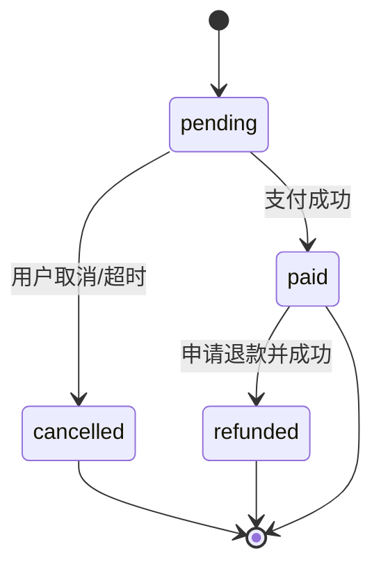
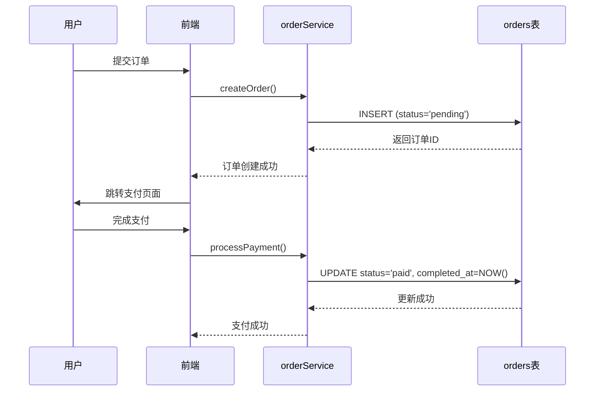

# 订单与评价表结构

<cite>
**本文档引用的文件**  
- [20241224000001_initial_schema.sql](file://supabase/migrations/20241224000001_initial_schema.sql) - *基础表结构定义*
- [20250101000002_fix_schema_issues.sql](file://supabase/migrations/20250101000002_fix_schema_issues.sql) - *修复安全漏洞和性能优化*
- [20250101000004_add_billing_address_to_orders.sql](file://supabase/migrations/20250101000004_add_billing_address_to_orders.sql) - *订单表新增字段*
- [database_migration.sql](file://database_migration.sql) - *支付系统迁移脚本*
- [orderService.ts](file://src/services/orderService.ts) - *订单服务实现*
- [reviewService.ts](file://src/services/reviewService.ts) - *评价服务实现*
- [database.ts](file://src/types/database.ts) - *类型定义*
</cite>

## 更新摘要
**变更内容**   
- 更新了订单表结构设计，包含新增字段和索引
- 修正了订单状态机设计，增加了支付状态流转
- 新增了支付记录表（payments）的说明
- 更新了评价表结构设计，包含审核状态和投票机制
- 增强了订单完成后触发评价机制的数据库层面实现方案

## 目录
1. [引言](#引言)  
2. [订单表结构设计](#订单表结构设计)  
3. [评价表结构设计](#评价表结构设计)  
4. [订单状态机设计](#订单状态机设计)  
5. [评价内容审核字段说明](#评价内容审核字段说明)  
6. [订单完成后触发评价机制](#订单完成后触发评价机制)  
7. [结论](#结论)

## 引言
本文档系统性地说明 `orders` 表与 `reviews` 表（即 `product_reviews`）的数据库结构设计、字段含义、相互关系及业务逻辑实现。重点分析订单状态流转机制、评价表的多态关联实现方式、评价内容审核字段的添加目的，以及订单完成后触发用户评价功能的数据库层面可能性。

**文档来源**  
- 数据库迁移文件 `20241224000001_initial_schema.sql` 定义了核心表结构。
- `20250101000002_fix_schema_issues.sql` 提供了安全策略和性能优化的参考。
- `20250101000004_add_billing_address_to_orders.sql` 揭示了订单表字段扩展。
- `database_migration.sql` 展示了支付系统的完整迁移方案。
- 前端服务 `orderService.ts` 和 `reviewService.ts` 揭示了业务逻辑。
- 类型定义文件 `database.ts` 提供了类型接口映射。

## 订单表结构设计

`orders` 表是系统中记录用户购买行为的核心表，其结构设计遵循清晰的业务需求，主要字段包括：

- **id**: 主键，使用 UUID 自动生成，确保全局唯一性。
- **user_id**: 外键，关联 `user_profiles` 表，标识下单用户。删除策略为 `ON DELETE SET NULL`，保证订单历史可追溯。
- **total_amount**: 订单总金额，DECIMAL(10,2) 类型，确保金额计算的精确性。
- **currency**: 货币类型，默认为 'CNY'（人民币）。
- **status**: 订单状态，使用枚举类型 `order_status`，默认值为 'pending'。
- **payment_method**: 支付方式，记录用户选择的支付渠道。
- **payment_id**: 支付ID，关联第三方支付平台的交易ID。
- **billing_address**: 账单地址，以 JSONB 格式存储，包含街道、城市、省份、邮政编码和国家。
- **created_at**: 订单创建时间，带有时区信息，默认为当前时间。
- **updated_at**: 订单最后更新时间，带有时区信息，默认为当前时间。
- **completed_at**: 订单完成时间，用于记录支付成功或订单完成的具体时间点。

该表通过 `idx_orders_user_id`、`idx_orders_status`、`idx_orders_created_at` 和 `idx_orders_user_status` 等索引优化查询性能，支持按用户、状态和时间快速检索订单。新增了 `idx_orders_billing_address` GIN 索引以优化账单地址的查询性能。

**Section sources**
- [20241224000001_initial_schema.sql](file://supabase/migrations/20241224000001_initial_schema.sql#L150-L171)
- [20250101000004_add_billing_address_to_orders.sql](file://supabase/migrations/20250101000004_add_billing_address_to_orders.sql#L8-L14) - *新增字段定义*
- [database_migration.sql](file://database_migration.sql#L25-L45) - *字段添加和索引创建*

## 评价表结构设计

`product_reviews` 表用于存储用户对产品的评价，其设计注重数据完整性与用户体验。

- **id**: 主键，UUID 自动生成。
- **user_id**: 外键，关联 `user_profiles` 表，标识评价用户。删除策略为 `ON DELETE SET NULL`，允许用户删除账号后保留评价记录。
- **product_id**: 外键，关联 `products` 表，标识被评价的产品。删除策略为 `ON DELETE CASCADE`，当产品被删除时，其所有评价也随之删除。
- **rating**: 评分，整数类型，通过 `CHECK (rating >= 1 AND rating <= 5)` 约束确保评分在1到5星之间。
- **title**: 评价标题，可选字段。
- **content**: 评价内容，文本类型，存储用户撰写的具体评价。
- **pros**: 优点列表，字符串数组类型，记录用户提到的产品优点。
- **cons**: 缺点列表，字符串数组类型，记录用户提到的产品缺点。
- **is_verified_purchase**: 布尔值，标识该评价是否为已验证购买（Verified Purchase）。
- **is_anonymous**: 布尔值，标识用户是否选择匿名评价。
- **status**: 评价状态，使用枚举类型，限制为 `('pending', 'approved', 'rejected')`，实现内容审核流程。
- **helpful_count**: 有用投票计数，整数类型，记录认为该评价有用的用户数量。
- **unhelpful_count**: 无用投票计数，整数类型，记录认为该评价无用的用户数量。
- **reply_count**: 回复数量，整数类型，记录该评价收到的回复数量。
- **created_at**: 评价创建时间。
- **updated_at**: 评价最后更新时间。
- **UNIQUE(user_id, product_id)**: 唯一性约束，确保一个用户对一个产品只能发表一条评价。

此表通过 `idx_product_reviews_product_id` 和 `idx_product_reviews_rating` 等索引优化按产品和评分的查询。

**Section sources**
- [20241224000001_initial_schema.sql](file://supabase/migrations/20241224000001_initial_schema.sql#L240-L260)
- [reviewService.ts](file://src/services/reviewService.ts#L10-L40) - *评价接口定义*
- [database.ts](file://src/types/database.ts#L342-L394)

## 订单状态机设计

订单状态机的设计是保证交易流程正确性的关键。系统通过枚举类型 `order_status` 定义了四种核心状态：



**状态流转说明**：
- **pending (待支付)**: 订单创建后的初始状态。此时订单已生成，但用户尚未完成支付。
- **paid (已支付)**: 用户成功完成支付后，状态由 `pending` 变更为 `paid`。此状态变更由 `orderService.processPayment` 方法触发，通过更新 `status` 和 `completed_at` 字段来实现。
- **cancelled (已取消)**: 用户主动取消订单，或系统检测到支付超时后，将状态变更为 `cancelled`。
- **refunded (已退款)**: 在 `paid` 状态下，若用户申请退款并经审核通过，订单状态变更为 `refunded`。

**状态流转约束**：
- 状态变更必须通过服务层（如 `orderService`）进行，确保业务逻辑的集中管理。
- 例如，`processPayment` 方法在更新状态时，会检查原状态是否为 `pending`，防止对已取消或已退款的订单进行支付操作。



**Section sources**
- [20241224000001_initial_schema.sql](file://supabase/migrations/20241224000001_initial_schema.sql#L10-L15)
- [orderService.ts](file://src/services/orderService.ts#L90-L139)

## 评价内容审核字段说明

`product_reviews` 表通过 `status` 字段实现了评价内容的审核流程，该字段使用枚举类型限制为 `('pending', 'approved', 'rejected')`。

`status` 字段的关键作用：
- **pending (待审核)**: 用户提交评价后的初始状态。此时评价不会对其他用户可见。
- **approved (已批准)**: 管理员审核通过后，评价状态变更为 `approved`，对所有用户可见。
- **rejected (已拒绝)**: 管理员审核拒绝后，评价状态变更为 `rejected`，仅提交用户可见。

**添加目的**：
1. **内容安全**：通过前置审核机制，防止不当内容、广告或恶意评价直接发布。
2. **质量控制**：确保评价内容符合社区准则，提升整体评价质量。
3. **流程化管理**：`status` 字段将审核过程从简单的“通过/拒绝”扩展为一个多阶段流程，便于团队协作和任务跟踪。
4. **可追溯性**：结合 `moderated_by` 和 `moderated_at` 字段，确保所有审核操作都有据可查。
5. **用户体验**：通过 `is_verified_purchase` 字段，为真实购买用户提供“已验证购买”标识，增强评价可信度。

此设计模式通过 `reviewService.moderateReview` 方法实现，管理员可以调用此方法更新评价状态。

**Section sources**
- [reviewService.ts](file://src/services/reviewService.ts#L257-L317) - *评价创建与审核逻辑*
- [20250101000002_fix_schema_issues.sql](file://supabase/migrations/20250101000002_fix_schema_issues.sql#L100-L105) - *RLS策略定义*

## 订单完成后触发评价机制

系统通过应用层逻辑和数据库层面的协同实现“订单完成后触发评价”功能。

**应用层实现**：
- 当订单状态变更为 `paid` 后，前端或后端服务可以引导用户进入评价页面。
- `reviewService.createReview` 方法允许用户提交评价，其业务逻辑确保只有购买过该产品的用户才能评价，并自动设置 `is_verified_purchase` 字段。

**数据库层面约束与触发器可能性**：
1. **约束 (Constraints)**：
    - 可以在 `product_reviews` 表上创建一个检查约束，确保 `user_id` 必须存在于已完成的订单（`orders.status = 'paid'`）中。但这在SQL中实现较为复杂，通常不推荐。
    - 更实际的约束是应用层的业务逻辑验证。

2. **触发器 (Triggers)**：
    - **可能性**：可以创建一个 `AFTER UPDATE` 触发器，当 `orders` 表的 `status` 从非 `paid` 变更为 `paid` 时被触发。
    - **触发器功能**：
        - **发送通知**：触发器可以调用 `pg_notify` 函数，向客户端推送“订单已完成，可进行评价”的实时通知。
        - **初始化评价状态**：可以向一个 `review_invitations` 表插入一条记录，表示向该用户发出了评价邀请。
    - **示例伪代码**：
        ```sql
        CREATE OR REPLACE FUNCTION notify_order_completion()
        RETURNS TRIGGER AS $$
        BEGIN
            IF OLD.status != 'paid' AND NEW.status = 'paid' THEN
                PERFORM pg_notify('order_completed', json_build_object(
                    'order_id', NEW.id,
                    'user_id', NEW.user_id,
                    'product_id', (SELECT product_id FROM order_items WHERE order_id = NEW.id LIMIT 1)
                )::text);
            END IF;
            RETURN NEW;
        END;
        $$ LANGUAGE plpgsql;

        CREATE TRIGGER trigger_notify_order_completion
            AFTER UPDATE ON orders
            FOR EACH ROW
            EXECUTE FUNCTION notify_order_completion();
        ```
    - **优势**：确保通知的实时性和可靠性，即使应用层服务短暂中断，数据库触发器仍能工作。
    - **劣势**：增加了数据库的复杂性，应谨慎使用。

**Section sources**
- [orderService.ts](file://src/services/orderService.ts#L90-L139)
- [reviewService.ts](file://src/services/reviewService.ts#L56-L123)
- [20250101000002_fix_schema_issues.sql](file://supabase/migrations/20250101000002_fix_schema_issues.sql#L100-L105)

## 结论
`orders` 表和 `reviews` 表的设计体现了清晰的业务导向和良好的数据完整性。订单状态机通过枚举和应用层服务实现了安全的状态流转。评价表通过外键、唯一性约束和审核状态字段保证了数据的准确性和内容安全。`user_feedback` 表的设计为内容审核提供了成熟的模式参考。订单完成后触发评价的功能目前由应用层驱动，但数据库触发器提供了一个强大且可靠的增强方案，可用于实现更复杂的自动化通知和工作流。