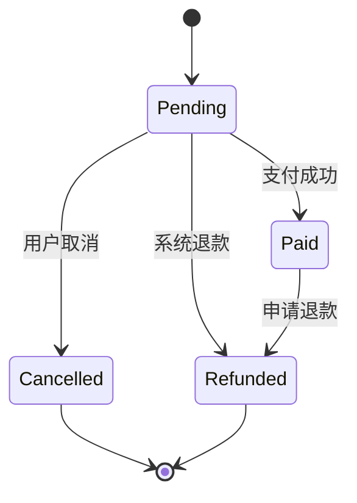
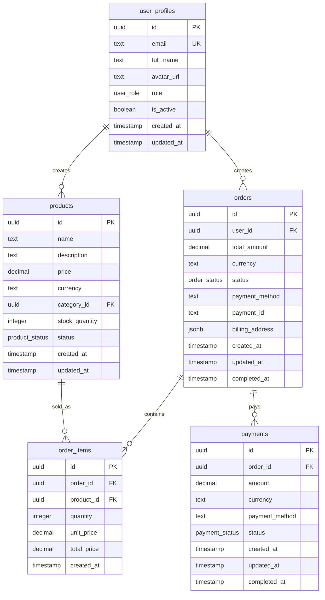
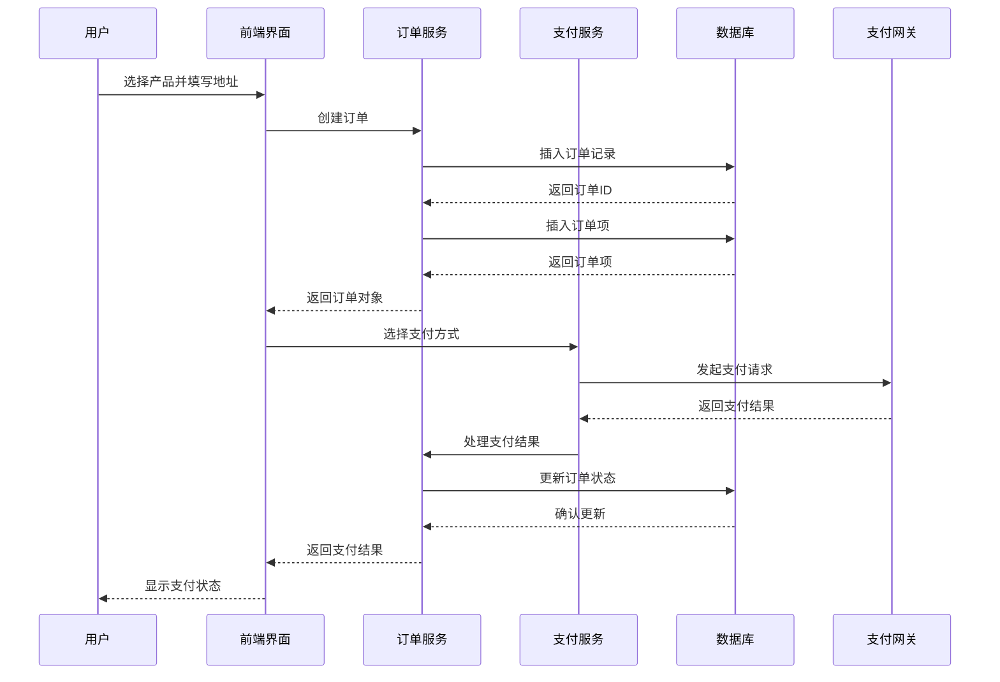
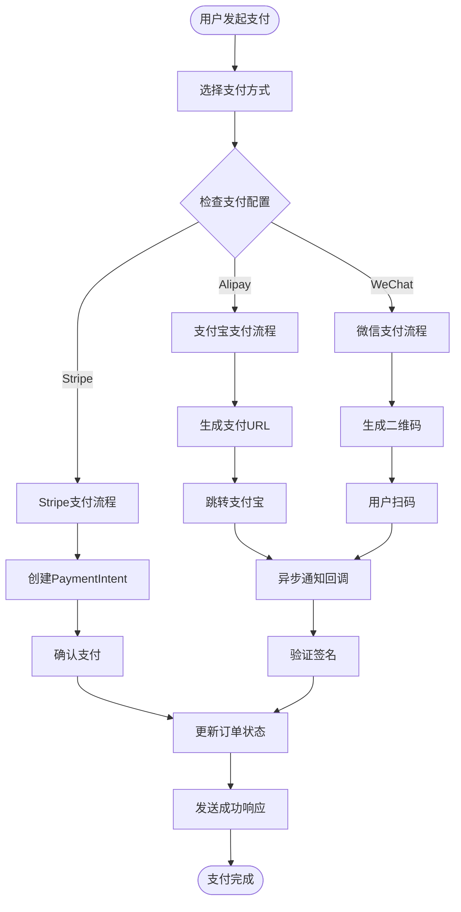

现在我已经收集了足够的信息来创建关于产品与订单模型的综合文档。让我开始编写文档：

<docs>
# 产品与订单模型 (Products & Orders)

<cite>
**本文档引用的文件**
- [20241224000001_initial_schema.sql](file://supabase/migrations/20241224000001_initial_schema.sql)
- [20250101000004_add_billing_address_to_orders.sql](file://supabase/migrations/20250101000004_add_billing_address_to_orders.sql)
- [20250103000001_add_performance_indexes.sql](file://supabase\migrations\20250103000001_add_performance_indexes.sql)
- [paymentService.ts](file://src\services\paymentService.ts)
- [orderService.ts](file://src\services\orderService.ts)
- [OrderManagementView.vue](file://src\views\admin\OrderManagementView.vue)
- [PaymentView.vue](file://src\views\PaymentView.vue)
- [productsService.ts](file://src\services\productsService.ts)
- [index.ts](file://src\types\index.ts)
</cite>

## 目录
1. [简介](#简介)
2. [产品表结构设计](#产品表结构设计)
3. [订单表状态机设计](#订单表状态机设计)
4. [账单地址字段演进](#账单地址字段演进)
5. [外键关系与事务一致性](#外键关系与事务一致性)
6. [购买流程与前后端交互](#购买流程与前后端交互)
7. [支付服务集成](#支付服务集成)
8. [订单查询与性能优化](#订单查询与性能优化)
9. [总结](#总结)

## 简介

本文档深入分析了Advanced Tools Navigation系统中Products和Orders两个核心表的结构设计与业务联动。该系统采用PostgreSQL数据库，通过Supabase进行管理，实现了完整的电商功能，包括产品展示、订单管理、支付集成等功能模块。

系统的核心设计理念是基于领域驱动设计(DDD)，将业务逻辑清晰地分离到不同的服务层，并通过TypeScript确保类型安全。产品表负责存储商品信息，订单表则追踪交易状态，两者通过外键关系建立强关联。

## 产品表结构设计

### 核心字段分析

产品表(`products`)的设计体现了现代电商系统的最佳实践，包含了丰富的业务字段：

```sql
CREATE TABLE IF NOT EXISTS products (
    id UUID DEFAULT uuid_generate_v4() PRIMARY KEY,
    name TEXT NOT NULL,
    description TEXT NOT NULL,
    short_description TEXT,
    price DECIMAL(10,2) NOT NULL,
    original_price DECIMAL(10,2),
    currency TEXT DEFAULT 'CNY',
    category_id UUID REFERENCES product_categories(id) ON DELETE SET NULL,
    images TEXT[] DEFAULT '{}',
    features TEXT[] DEFAULT '{}',
    demo_url TEXT,
    download_url TEXT,
    is_featured BOOLEAN DEFAULT false,
    is_digital BOOLEAN DEFAULT true,
    stock_quantity INTEGER,
    status product_status DEFAULT 'active',
    created_at TIMESTAMP WITH TIME ZONE DEFAULT NOW(),
    updated_at TIMESTAMP WITH TIME ZONE DEFAULT NOW(),
    created_by UUID REFERENCES user_profiles(id) ON DELETE SET NULL,
    meta_title TEXT,
    meta_description TEXT,
    sort_order INTEGER DEFAULT 0,
    average_rating DECIMAL(3,2) DEFAULT 0,
    total_reviews INTEGER DEFAULT 0
);
```

### 关键字段详解

#### 价格与货币体系
- **price**: 使用DECIMAL(10,2)精确存储价格，避免浮点数精度问题
- **original_price**: 可选字段，用于显示折扣价
- **currency**: 默认为"CNY"，支持多币种扩展

#### 库存管理
- **stock_quantity**: 整数类型，直接存储库存数量
- **is_digital**: 布尔值标识数字产品，影响下载权限验证

#### 分类与组织
- **category_id**: 外键关联到产品分类表，支持树形结构
- **features**: 文本数组，存储产品特性标签

### 枚举类型设计

系统使用PostgreSQL枚举类型确保数据完整性：

```sql
CREATE TYPE product_status AS ENUM ('active', 'inactive', 'draft');
```

这种设计的优势：
- **数据一致性**: 防止无效状态值
- **查询优化**: 枚举类型在索引中表现优异
- **维护便利**: 集中管理状态值

**章节来源**
- [20241224000001_initial_schema.sql](file://supabase\migrations\20241224000001_initial_schema.sql#L100-L122)
- [index.ts](file://src\types\index.ts#L50-L91)

## 订单表状态机设计

### 状态流转机制

订单表(`orders`)实现了完整的状态机模式，支持四种主要状态：

```sql
CREATE TYPE order_status AS ENUM ('pending', 'paid', 'cancelled', 'refunded');
```

```sql
CREATE TABLE IF NOT EXISTS orders (
    id UUID DEFAULT uuid_generate_v4() PRIMARY KEY,
    user_id UUID REFERENCES user_profiles(id) ON DELETE SET NULL,
    total_amount DECIMAL(10,2) NOT NULL,
    currency TEXT DEFAULT 'CNY',
    status order_status DEFAULT 'pending',
    payment_method TEXT,
    payment_id TEXT,
    billing_address JSONB,
    created_at TIMESTAMP WITH TIME ZONE DEFAULT NOW(),
    updated_at TIMESTAMP WITH TIME ZONE DEFAULT NOW(),
    completed_at TIMESTAMP WITH TIME ZONE
);
```

### 状态转换规则



**图表来源**
- [20241224000001_initial_schema.sql](file://supabase\migrations\20241224000001_initial_schema.sql#L14-L18)

### 状态字段设计考量

#### 时间戳管理
- **created_at**: 订单创建时间
- **updated_at**: 状态变更时间
- **completed_at**: 完成状态的时间戳

#### 支付集成
- **payment_method**: 存储支付方式标识
- **payment_id**: 第三方支付平台的订单号

### 状态验证机制

系统在业务逻辑层面实现了严格的状态验证：

```typescript
// 只能更新待支付的订单
const { error } = await supabase
  .from("orders")
  .update(orderUpdateData)
  .eq("id", paymentData.order_id)
  .eq("status", "pending");
```

这种设计确保了状态转换的原子性和一致性。

**章节来源**
- [20241224000001_initial_schema.sql](file://supabase\migrations\20241224000001_initial_schema.sql#L14-L18)
- [orderService.ts](file://src\services\orderService.ts#L130-L150)

## 账单地址字段演进

### 初始设计阶段

在系统早期版本中，账单地址信息相对简单：

```sql
-- 初始订单表设计
CREATE TABLE IF NOT EXISTS orders (
    id UUID DEFAULT uuid_generate_v4() PRIMARY KEY,
    user_id UUID REFERENCES user_profiles(id) ON DELETE SET NULL,
    total_amount DECIMAL(10,2) NOT NULL,
    currency TEXT DEFAULT 'CNY',
    status order_status DEFAULT 'pending',
    payment_method TEXT,
    payment_id TEXT,
    billing_address JSONB,
    created_at TIMESTAMP WITH TIME ZONE DEFAULT NOW(),
    updated_at TIMESTAMP WITH TIME ZONE DEFAULT NOW(),
    completed_at TIMESTAMP WITH TIME ZONE
);
```

### 字段演进历程

账单地址字段经历了多次优化：

#### 版本1：基础JSONB结构
```sql
billing_address JSONB
```

#### 版本2：增强字段完整性
```sql
-- 添加 payment_id 字段
ALTER TABLE orders 
ADD COLUMN IF NOT EXISTS billing_address JSONB,
ADD COLUMN IF NOT EXISTS payment_id TEXT;
```

### 当前字段结构

```typescript
export interface BillingAddress {
  full_name: string;
  email: string;
  phone?: string;
  country: string;
  state?: string;
  city: string;
  address: string;
  postal_code: string;
}
```

### 设计优势分析

#### JSONB字段的优势
- **灵活性**: 支持不同国家的地址格式
- **扩展性**: 新增字段无需修改表结构
- **查询能力**: 支持GIN索引进行快速检索

#### 字段标准化
- **full_name**: 规范化的姓名字段
- **email**: 必填的联系邮箱
- **phone**: 可选的联系电话
- **country/state/city**: 分层地理信息
- **address/postal_code**: 详细地址信息

### 查询优化策略

```sql
-- 为JSONB字段创建GIN索引
CREATE INDEX IF NOT EXISTS idx_orders_billing_address ON orders USING GIN (billing_address);
```

这种设计允许高效的地址搜索和过滤操作。

**章节来源**
- [20250101000004_add_billing_address_to_orders.sql](file://supabase\migrations\20250101000004_add_billing_address_to_orders.sql#L1-L42)
- [orderService.ts](file://src\services\orderService.ts#L564-L589)

## 外键关系与事务一致性

### 外键约束设计

系统建立了完善的外键关系网络：



**图表来源**
- [20241224000001_initial_schema.sql](file://supabase\migrations\20241224000001_initial_schema.sql#L100-L180)

### 事务一致性保障

#### 级联删除策略
- **orders.user_id**: ON DELETE SET NULL - 用户删除不影响历史订单
- **order_items.order_id**: ON DELETE CASCADE - 订单删除时自动清理订单项
- **order_items.product_id**: ON DELETE SET NULL - 产品删除不影响历史订单项

#### 外键验证机制

```sql
DO $$
BEGIN
    -- 检查并添加外键约束（如果不存在）
    IF NOT EXISTS (
        SELECT 1 FROM information_schema.table_constraints
        WHERE constraint_name = 'fk_orders_user_id'
        AND table_name = 'orders'
    ) THEN
        ALTER TABLE orders ADD CONSTRAINT fk_orders_user_id
        FOREIGN KEY (user_id) REFERENCES user_profiles(id) ON DELETE CASCADE;
    END IF;
END $$;
```

### 并发控制

系统通过以下机制确保数据一致性：

#### 乐观锁机制
```typescript
// 订单状态更新时的乐观锁
const { error } = await supabase
  .from("orders")
  .update(orderUpdateData)
  .eq("id", paymentData.order_id)
  .eq("status", "pending"); // 只能更新待支付的订单
```

#### 事务边界控制
```typescript
// 创建订单的完整事务
static async createOrder(orderData: CreateOrderData, userId: string): Promise<Order> {
  try {
    // 开始事务
    const { data: product, error: productError } = await supabase
      .from("products")
      .select("id, name, price, is_digital")
      .eq("id", orderData.product_id)
      .eq("status", "active")
      .single();

    // 创建订单
    const { data: order, error: orderError } = await supabase
      .from("orders")
      .insert([orderInsertData])
      .select()
      .single();

    // 创建订单项
    const { data: orderItem, error: itemError } = await supabase
      .from("order_items")
      .insert([orderItemInsertData])
      .select()
      .single();

    // 提交事务
    return transformedOrder;
  } catch (error) {
    // 回滚事务
    throw new Error("创建订单失败");
  }
}
```

**章节来源**
- [20241224000001_initial_schema.sql](file://supabase\migrations\20241224000001_initial_schema.sql#L200-L287)
- [orderService.ts](file://src\services\orderService.ts#L60-L150)

## 购买流程与前后端交互

### 完整购买流程



**图表来源**
- [PaymentView.vue](file://src\views\PaymentView.vue#L1-L100)
- [orderService.ts](file://src\services\orderService.ts#L60-L150)

### 前端组件交互

#### PaymentView.vue - 支付界面
```vue
<template>
  <div class="payment-view">
    <div class="payment-container">
      <!-- 订单信息展示 -->
      <div class="order-summary">
        <h3>订单信息</h3>
        <div class="order-items">
          <div v-for="item in orderItems" :key="item.id" class="order-item">
            <div class="item-image">
              
            </div>
            <div class="item-info">
              <h4 class="item-name">{{ item.name }}</h4>
              <p class="item-description">{{ item.description }}</p>
              <div class="item-meta">
                <span class="item-quantity">数量: {{ item.quantity }}</span>
                <span class="item-price">¥{{ item.price }}</span>
              </div>
            </div>
          </div>
        </div>
      </div>

      <!-- 支付方式选择 -->
      <div class="payment-methods">
        <h3>选择支付方式</h3>
        <div class="methods-list">
          <label v-for="method in paymentMethods" :key="method.id" class="method-option">
            <input v-model="selectedMethod" type="radio" :value="method.id" name="paymentMethod" />
            <div class="method-content">
              <div class="method-icon">
                
              </div>
              <div class="method-info">
                <div class="method-name">{{ method.name }}</div>
                <div class="method-description">{{ method.description }}</div>
              </div>
            </div>
          </label>
        </div>
      </div>

      <!-- 账单地址填写 -->
      <div class="billing-address">
        <h3>账单地址</h3>
        <form class="address-form">
          <div class="form-row">
            <div class="form-group">
              <label for="fullName">姓名 *</label>
              <input id="fullName" v-model="billingInfo.full_name" type="text" required placeholder="请输入姓名" />
            </div>
            <div class="form-group">
              <label for="email">邮箱 *</label>
              <input id="email" v-model="billingInfo.email" type="email" required placeholder="请输入邮箱地址" />
            </div>
          </div>
          <!-- 更多地址字段 -->
        </form>
      </div>
    </div>
  </div>
</template>
```

#### 订单创建流程

```typescript
const handlePayment = async () => {
  try {
    loading.value = true;
    error.value = null;

    const { OrderService } = await import("@/services/orderService");
    const { PaymentService } = await import("@/services/paymentService");
    const { useAuthStore } = await import("@/stores/auth");

    const authStore = useAuthStore();
    if (!authStore.user) {
      throw new Error("请先登录");
    }

    // 创建订单（如果还没有）
    let orderId = route.query.order as string;

    if (!orderId) {
      // 从产品创建新订单
      const productId = route.query.product as string;
      if (!productId) {
        throw new Error("缺少产品信息");
      }

      const orderData = {
        product_id: productId,
        quantity: 1,
        billing_address: billingInfo.value,
      };

      const newOrder = await OrderService.createOrder(
        orderData,
        authStore.user.id,
      );
      orderId = newOrder.id;
    }

    // 处理支付逻辑...
  } catch (err) {
    error.value = err instanceof Error ? err.message : "支付失败，请重试";
  } finally {
    loading.value = false;
  }
};
```

### 后端服务协调

#### 订单服务接口
```typescript
export class OrderService {
  // 创建订单
  static async createOrder(orderData: CreateOrderData, userId: string): Promise<Order> {
    try {
      // 获取产品信息
      const { data: product, error: productError } = await supabase
        .from("products")
        .select("id, name, price, is_digital")
        .eq("id", orderData.product_id)
        .eq("status", "active")
        .single();

      if (productError || !product) {
        throw new Error("产品不存在或已下架");
      }

      const totalAmount = (product as ProductRow).price * orderData.quantity;

      // 创建订单
      const orderInsertData: OrderInsertData = {
        user_id: userId,
        total_amount: totalAmount,
        currency: "CNY",
        status: "pending",
        billing_address: convertBillingAddress(orderData.billing_address),
      };

      const { data: order, error: orderError } = await supabase
        .from("orders")
        .insert([orderInsertData])
        .select()
        .single();

      // 创建订单项...
      return transformedOrder;
    } catch (error) {
      console.error("创建订单失败:", error);
      throw new Error("创建订单失败");
    }
  }

  // 处理支付
  static async processPayment(paymentData: PaymentData): Promise<void> {
    try {
      const orderUpdateData: OrderUpdateData = {
        status: "paid",
        payment_method: paymentData.payment_method,
        payment_id: paymentData.payment_id,
        completed_at: new Date().toISOString(),
        updated_at: new Date().toISOString(),
      };

      const { error } = await supabase
        .from("orders")
        .update(orderUpdateData)
        .eq("id", paymentData.order_id)
        .eq("status", "pending");

      if (error) throw error;

      // 创建支付记录...
    } catch (error) {
      console.error("处理支付失败:", error);
      throw new Error("处理支付失败");
    }
  }
}
```

**章节来源**
- [PaymentView.vue](file://src\views\PaymentView.vue#L1-L200)
- [orderService.ts](file://src\services\orderService.ts#L60-L150)

## 支付服务集成

### 多支付平台支持

系统集成了三种主流支付平台，提供了完整的支付解决方案：

```typescript
// 支付网关配置
const PAYMENT_CONFIG = {
  stripe: {
    publicKey: import.meta.env.VITE_STRIPE_PUBLIC_KEY || "",
    secretKey: import.meta.env.VITE_STRIPE_SECRET_KEY || "",
    enabled: !!import.meta.env.VITE_STRIPE_PUBLIC_KEY,
  },
  alipay: {
    appId: import.meta.env.VITE_ALIPAY_APP_ID || "",
    privateKey: import.meta.env.VITE_ALIPAY_PRIVATE_KEY || "",
    alipayPublicKey: import.meta.env.VITE_ALIPAY_PUBLIC_KEY || "",
    gateway: import.meta.env.VITE_ALIPAY_GATEWAY_URL || "https://openapi.alipay.com/gateway.do",
    charset: import.meta.env.VITE_ALIPAY_CHARSET || "UTF-8",
    signType: import.meta.env.VITE_ALIPAY_SIGN_TYPE || "RSA2",
    enabled: !!import.meta.env.VITE_ALIPAY_APP_ID,
  },
  wechat: {
    appId: import.meta.env.VITE_WECHAT_APP_ID || "",
    mchId: import.meta.env.VITE_WECHAT_MCH_ID || "",
    apiKey: import.meta.env.VITE_WECHAT_API_KEY || "",
    apiVersion: import.meta.env.VITE_WECHAT_API_VERSION || "v3",
    enabled: !!import.meta.env.VITE_WECHAT_APP_ID,
  },
};
```

### 支付流程架构



**图表来源**
- [paymentService.ts](file://src\services\paymentService.ts#L1-L100)

### Stripe支付集成

#### 支付初始化
```typescript
static async processStripePayment(paymentData: PaymentData): Promise<PaymentResult> {
  try {
    // 检查Stripe配置
    if (!PAYMENT_CONFIG.stripe.publicKey) {
      throw new Error("Stripe支付配置缺失，请在.env文件中配置 VITE_STRIPE_PUBLIC_KEY");
    }

    console.log("开始处理Stripe支付:", paymentData);

    // 初始化 Stripe
    const stripe = await initializeStripe();
    if (!stripe) {
      throw new Error("Stripe 初始化失败");
    }

    // 创建支付意图 (PaymentIntent)
    const paymentIntentData = {
      amount: Math.round(paymentData.amount * 100), // Stripe 使用分作为单位
      currency: "cny",
      metadata: {
        order_id: paymentData.order_id,
        payment_method: paymentData.payment_method,
      },
      description: `订单支付 - ${paymentData.order_id}`,
    };

    // 模拟PaymentIntent创建
    const mockPaymentIntent = {
      id: `pi_${Date.now()}`,
      client_secret: `pi_${Date.now()}_secret_${Math.random().toString(36).substr(2, 9)}`,
      status: "requires_payment_method",
      amount: paymentIntentData.amount,
      currency: paymentIntentData.currency,
    };

    return {
      success: true,
      paymentId: mockPaymentIntent.id,
      paymentIntentId: mockPaymentIntent.id,
      clientSecret: mockPaymentIntent.client_secret,
      orderId: paymentData.order_id,
      amount: paymentData.amount,
      currency: "CNY",
      method: "stripe",
      message: "PaymentIntent 已创建，请完成支付确认",
    };
  } catch (error) {
    console.error("Stripe支付处理失败:", error);
    return {
      success: false,
      orderId: paymentData.order_id,
      amount: paymentData.amount,
      currency: "CNY",
      method: "stripe",
      message: error instanceof Error ? error.message : "支付处理失败",
    };
  }
}
```

#### 支付确认
```typescript
static async confirmStripePayment(clientSecret: string, paymentMethodId: string): Promise<PaymentResult> {
  try {
    const stripe = await initializeStripe();
    if (!stripe) {
      throw new Error("Stripe 初始化失败");
    }

    const { error, paymentIntent } = await stripe.confirmCardPayment(clientSecret, {
      payment_method: paymentMethodId,
    });

    if (error) {
      throw new Error(error.message);
    }

    if (paymentIntent.status === "succeeded") {
      return {
        success: true,
        paymentId: paymentIntent.id,
        orderId: (paymentIntent as { metadata?: { order_id?: string } }).metadata?.order_id || "",
        amount: paymentIntent.amount / 100, // 转换回元
        currency: paymentIntent.currency.toUpperCase(),
        method: "stripe",
        message: "支付成功",
      };
    } else {
      throw new Error(`支付状态异常: ${paymentIntent.status}`);
    }
  } catch (error) {
    console.error("Stripe支付确认失败:", error);
    return {
      success: false,
      orderId: "",
      amount: 0,
      currency: "CNY",
      method: "stripe",
      message: error instanceof Error ? error.message : "支付确认失败",
    };
  }
}
```

### 支付宝支付集成

#### 支付请求构建
```typescript
static async processAlipayPayment(paymentData: PaymentData): Promise<PaymentResult> {
  try {
    // 检查支付宝配置
    if (!PAYMENT_CONFIG.alipay.appId) {
      throw new Error("支付宝支付配置缺失，请在.env文件中配置 VITE_ALIPAY_APP_ID");
    }

    console.log("开始处理支付宝支付:", paymentData);

    // 创建支付宝支付请求参数
    const alipayParams = {
      // 公共参数
      app_id: PAYMENT_CONFIG.alipay.appId,
      method: "alipay.trade.page.pay", // PC网站支付
      charset: PAYMENT_CONFIG.alipay.charset,
      sign_type: PAYMENT_CONFIG.alipay.signType,
      timestamp: new Date().toISOString().slice(0, 19).replace("T", " "),
      version: "1.0",
      notify_url: `${window.location.origin}/api/payment/alipay/notify`, // 异步通知URL
      return_url: `${window.location.origin}/payment/success`, // 同步返回URL

      // 业务参数
      biz_content: JSON.stringify({
        out_trade_no: paymentData.order_id, // 商户订单号
        total_amount: paymentData.amount.toFixed(2), // 支付金额
        subject: `订单支付 - ${paymentData.order_id}`, // 订单标题
        product_code: "FAST_INSTANT_TRADE_PAY", // 产品码
        timeout_express: "30m", // 超时时间
      }),
    };

    // 生成支付URL
    const mockPaymentUrl = this.generateAlipayMockUrl(alipayParams);

    return {
      success: true,
      paymentId: `alipay_${Date.now()}`,
      orderId: paymentData.order_id,
      amount: paymentData.amount