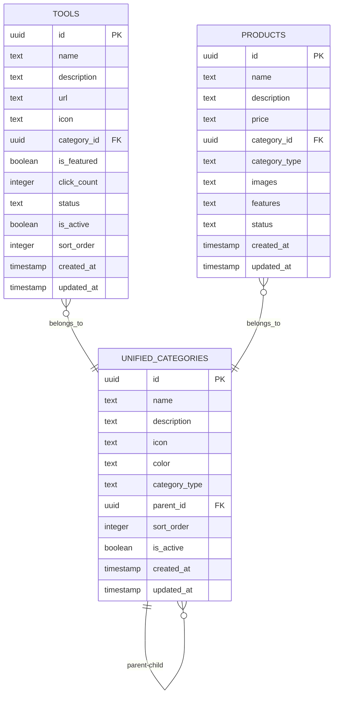
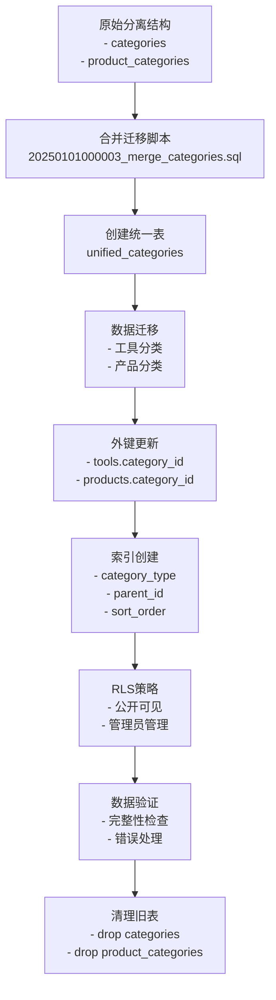
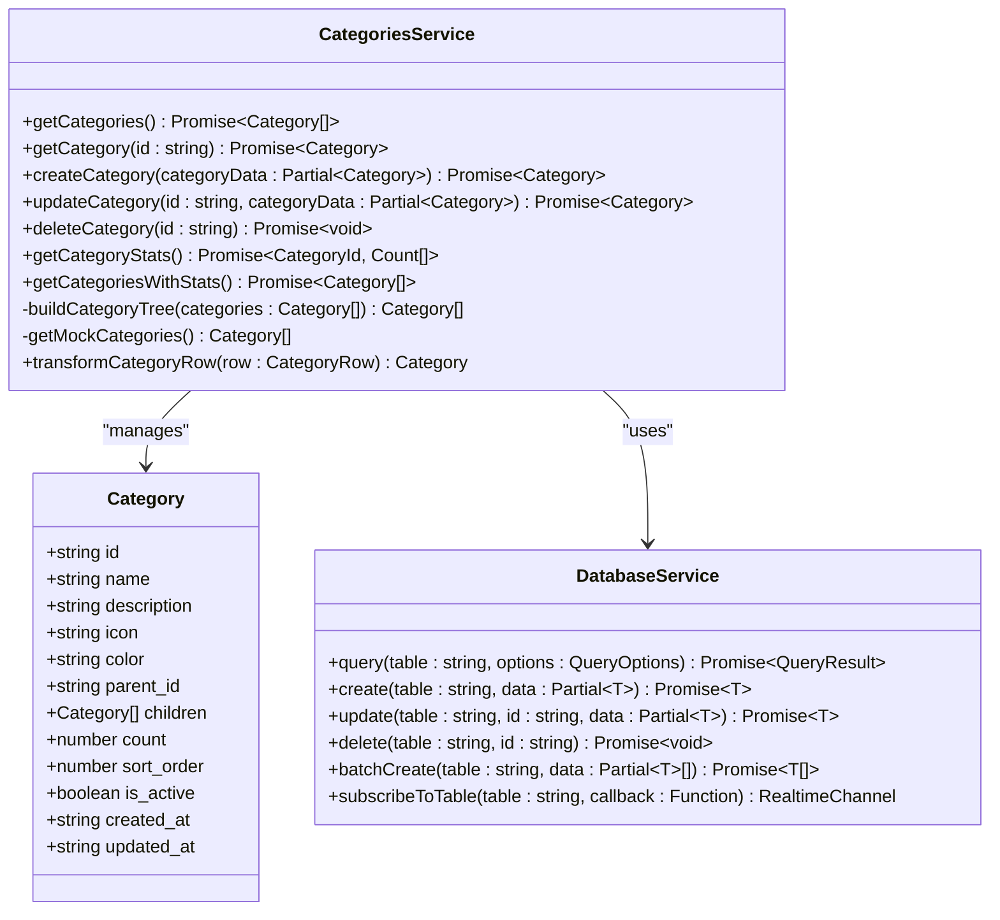
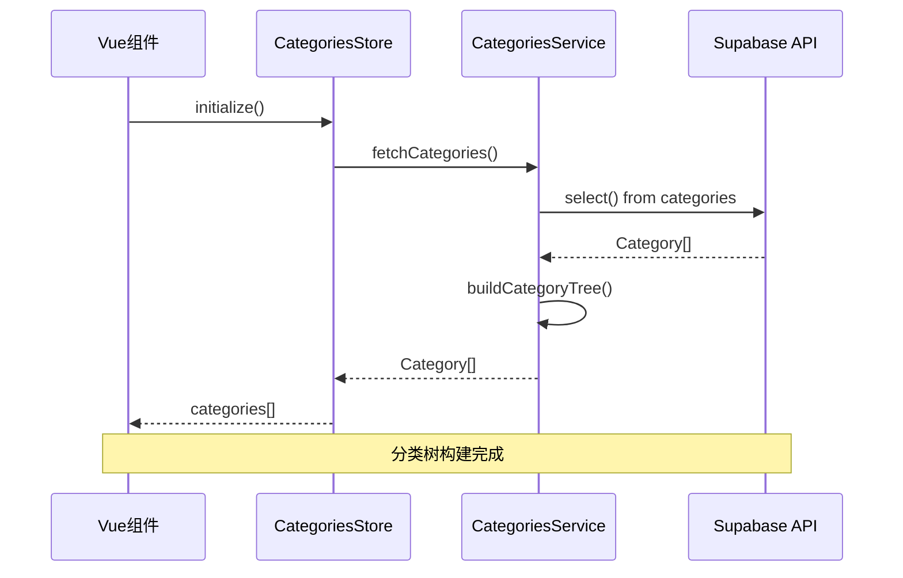
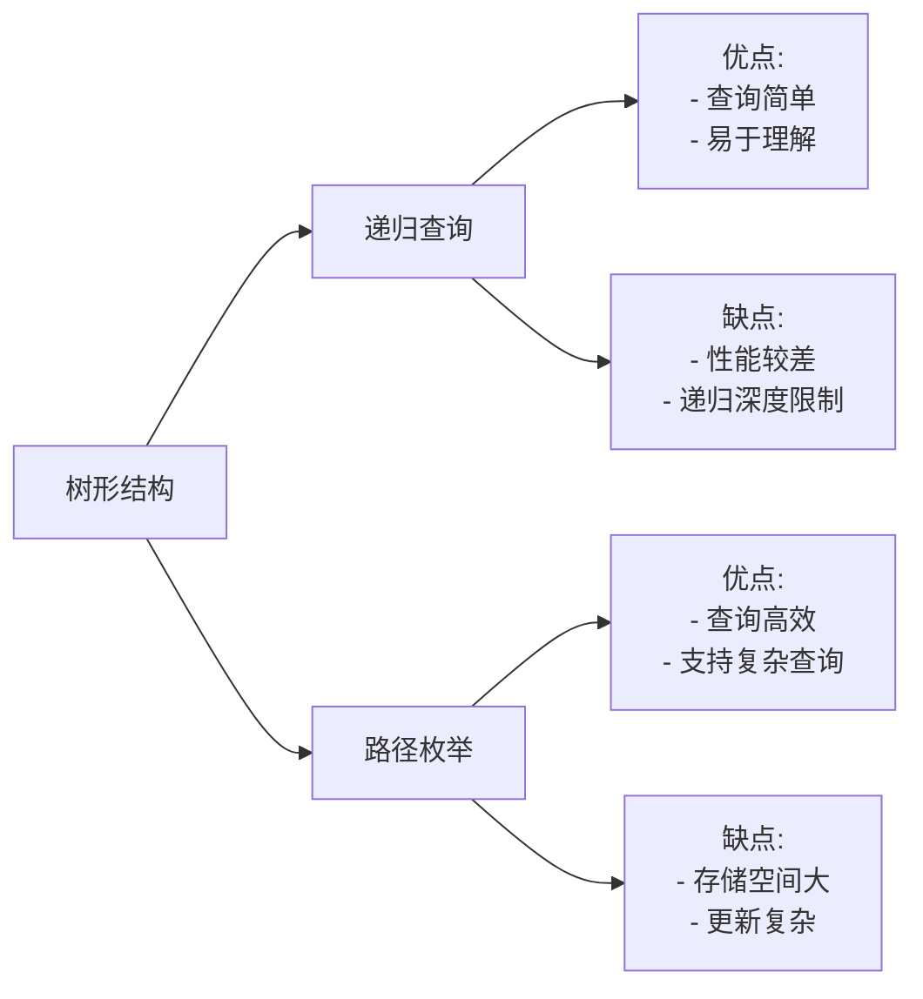

# 分类模型 (Categories) 设计文档

<cite>
**本文档中引用的文件**
- [20250101000003_merge_categories.sql](file://supabase/migrations/20250101000003_merge_categories.sql)
- [categoriesService.ts](file://src/services/categoriesService.ts)
- [AdminToolsView.vue](file://src/views/AdminToolsView.vue)
- [SearchResultsView.vue](file://src/views/SearchResultsView.vue)
- [categories.ts](file://src/stores/categories.ts)
- [databaseService.ts](file://src/services/databaseService.ts)
- [supabase-schema.ts](file://src/lib/supabase-schema.ts)
- [index.ts](file://src/types/index.ts)
- [supabaseClient.ts](file://src/lib/supabaseClient.ts)
</cite>

## 目录
1. [简介](#简介)
2. [数据库架构设计](#数据库架构设计)
3. [迁移策略分析](#迁移策略分析)
4. [服务层设计](#服务层设计)
5. [前端集成](#前端集成)
6. [性能优化](#性能优化)
7. [数据完整性保障](#数据完整性保障)
8. [最佳实践建议](#最佳实践建议)

## 简介

分类系统是高级工具导航平台的核心功能之一，负责组织和管理工具与产品的分类结构。该系统采用统一的分类表设计，支持树形结构存储，并通过多种优化策略确保查询效率和数据完整性。

## 数据库架构设计

### 统一分类表结构



**图表来源**
- [20250101000003_merge_categories.sql](file://supabase/migrations/20250101000003_merge_categories.sql#L1-L40)
- [supabase-schema.ts](file://src/lib/supabase-schema.ts#L280-L290)

### 核心字段定义

#### 基础字段
- **id**: UUID主键，全局唯一标识符
- **name**: 分类名称，必填字段
- **description**: 分类描述，可选文本字段
- **icon**: 图标标识符，支持emoji或图标库名称
- **color**: 颜色代码，默认值'#0078d4'

#### 层级结构字段
- **parent_id**: 父分类ID，自引用外键，支持树形结构
- **sort_order**: 排序权重，整数类型，用于控制显示顺序

#### 类型区分字段
- **category_type**: 分类类型，枚举值('tool'|'product')，区分工具分类和产品分类

#### 状态管理字段
- **is_active**: 激活状态，布尔值，默认true
- **created_at**: 创建时间戳，默认NOW()
- **updated_at**: 更新时间戳，自动触发器维护

**章节来源**
- [20250101000003_merge_categories.sql](file://supabase/migrations/20250101000003_merge_categories.sql#L1-L80)
- [supabase-schema.ts](file://src/lib/supabase-schema.ts#L280-L290)

## 迁移策略分析

### 合并迁移过程

分类系统经历了从分离表结构到统一表结构的重大重构：



**图表来源**
- [20250101000003_merge_categories.sql](file://supabase/migrations/20250101000003_merge_categories.sql#L1-L134)

### 迁移关键步骤

#### 1. 新表创建
```sql
CREATE TABLE unified_categories (
    id UUID DEFAULT uuid_generate_v4() PRIMARY KEY,
    name TEXT NOT NULL,
    description TEXT,
    icon TEXT,
    color TEXT DEFAULT '#0078d4',
    category_type TEXT NOT NULL CHECK (category_type IN ('tool', 'product')),
    parent_id UUID REFERENCES unified_categories(id) ON DELETE SET NULL,
    sort_order INTEGER DEFAULT 0,
    is_active BOOLEAN DEFAULT true,
    created_at TIMESTAMP WITH TIME ZONE DEFAULT NOW(),
    updated_at TIMESTAMP WITH TIME ZONE DEFAULT NOW()
);
```

#### 2. 数据迁移策略
- **工具分类迁移**: 保留原有字段，添加`category_type = 'tool'`
- **产品分类迁移**: 保留原有字段，添加`category_type = 'product'`
- **数据完整性验证**: 确保迁移前后引用关系完整

#### 3. 外键约束更新
```sql
-- 更新工具表外键
ALTER TABLE tools 
DROP CONSTRAINT tools_category_id_fkey,
ADD CONSTRAINT tools_category_id_fkey 
    FOREIGN KEY (category_id) 
    REFERENCES unified_categories(id) 
    ON DELETE SET NULL;

-- 更新产品表外键
ALTER TABLE products 
DROP CONSTRAINT products_category_id_fkey,
ADD CONSTRAINT products_category_id_fkey 
    FOREIGN KEY (category_id) 
    REFERENCES unified_categories(id) 
    ON DELETE SET NULL;
```

**章节来源**
- [20250101000003_merge_categories.sql](file://supabase/migrations/20250101000003_merge_categories.sql#L1-L134)

## 服务层设计

### 分类服务架构



**图表来源**
- [categoriesService.ts](file://src/services/categoriesService.ts#L1-L50)
- [databaseService.ts](file://src/services/databaseService.ts#L1-L50)

### 核心服务方法

#### 1. 分类树构建算法

```typescript
private static buildCategoryTree(categories: Category[]): Category[] {
  const categoryMap = new Map<string, Category>();
  const rootCategories: Category[] = [];

  // 创建分类映射
  categories.forEach((category) => {
    categoryMap.set(category.id, { ...category, children: [] });
  });

  // 构建树结构
  categories.forEach((category) => {
    const categoryNode = categoryMap.get(category.id)!;

    if (category.parent_id) {
      const parent = categoryMap.get(category.parent_id);
      if (parent) {
        parent.children = parent.children || [];
        parent.children.push(categoryNode);
      } else {
        // 父分类不存在，作为根分类处理
        rootCategories.push(categoryNode);
      }
    } else {
      rootCategories.push(categoryNode);
    }
  });

  return rootCategories;
}
```

#### 2. 统计信息聚合

```typescript
static async getCategoriesWithStats(): Promise<Category[]> {
  const [categories, stats] = await Promise.all([
    this.getCategories(),
    this.getCategoryStats(),
  ]);

  const statsMap = new Map(stats.map((s) => [s.categoryId, s.count]));

  const updateCategoryCount = (category: Category): Category => {
    const count = statsMap.get(category.id) || 0;
    const children = category.children?.map(updateCategoryCount) || [];
    const childrenCount = children.reduce(
      (sum, child) => sum + child.count,
      0,
    );

    return {
      ...category,
      count: count + childrenCount,
      children,
    };
  };

  return categories.map(updateCategoryCount);
}
```

**章节来源**
- [categoriesService.ts](file://src/services/categoriesService.ts#L180-L250)
- [categoriesService.ts](file://src/services/categoriesService.ts#L200-L250)

## 前端集成

### 分类存储管理



**图表来源**
- [categories.ts](file://src/stores/categories.ts#L1-L50)
- [categoriesService.ts](file://src/services/categoriesService.ts#L20-L40)

### AdminToolsView中的分类应用

在AdminToolsView中，分类系统主要用于：

#### 1. 工具分类筛选
```vue
<select v-model="selectedCategory" class="category-filter">
  <option value="">全部分类</option>
  <option
    v-for="category in categoriesStore.categories"
    :key="category.id"
    :value="category.id"
  >
    {{ category.name }}
  </option>
</select>
```

#### 2. 工具分类统计
```javascript
const featuredCount = computed(
  () => toolsStore.tools.filter((tool) => tool.is_featured).length,
);

const activeToolsCount = computed(
  () => toolsStore.tools.filter((tool) => tool.status === "active").length,
);
```

### SearchResultsView中的分类应用

在SearchResultsView中，分类系统支持：

#### 1. 搜索结果分类展示
```javascript
const toolResults = computed(() => {
  if (!searchResult.value) return [];
  return searchResult.value.items.filter(
    (item) =>
      item.type === "tool" ||
      !item.type ||
      item.hasOwnProperty("clickCount") ||
      item.hasOwnProperty("category_id"),
  );
});
```

#### 2. 分类类型筛选
```javascript
<select v-model="currentType" @change="filterResults">
  <option value="all">全部类型</option>
  <option value="tools">工具</option>
  <option value="products">产品</option>
  <option value="categories">分类</option>
</select>
```

**章节来源**
- [AdminToolsView.vue](file://src/views/AdminToolsView.vue#L60-L80)
- [SearchResultsView.vue](file://src/views/SearchResultsView.vue#L100-L120)

## 性能优化

### 查询优化策略

#### 1. 索引设计
```sql
-- 分类类型索引
CREATE INDEX idx_unified_categories_type ON unified_categories(category_type);

-- 父分类索引
CREATE INDEX idx_unified_categories_parent_id ON unified_categories(parent_id);

-- 排序索引
CREATE INDEX idx_unified_categories_sort_order ON unified_categories(sort_order);
```

#### 2. 分页查询优化
```typescript
async function fetchCategories() {
  // 使用分页查询减少内存占用
  const { data, error: queryError } = await supabase
    .from("categories")
    .select("*")
    .eq("is_active", true)
    .order("sort_order", { ascending: true });
}
```

#### 3. 缓存策略
```typescript
// 数据库服务缓存机制
private cache = new Map<string, { data: unknown; timestamp: number; ttl: number }>();

// 查询缓存
if (cacheOptions?.ttl) {
  const cached = this.getFromCache<QueryResult<T>>(cacheKey);
  if (cached) {
    return cached;
  }
}
```

### 树形结构查询优化

#### 递归查询 vs 路径枚举



#### 推荐优化方案

1. **混合策略**: 对于浅层次树结构使用递归查询，深层结构使用路径枚举
2. **预计算**: 在后台定期预计算常用查询结果
3. **懒加载**: 按需加载子节点，避免一次性加载整个树

**章节来源**
- [20250101000003_merge_categories.sql](file://supabase/migrations/20250101000003_merge_categories.sql#L60-L70)
- [databaseService.ts](file://src/services/databaseService.ts#L100-L150)

## 数据完整性保障

### RLS策略设计

```sql
-- 公开可见策略
CREATE POLICY "所有人可以查看分类" ON unified_categories
    FOR SELECT USING (true);

-- 管理员管理策略
CREATE POLICY "只有管理员可以管理分类" ON unified_categories
    FOR ALL USING (auth.jwt() ->> 'role' = 'admin' OR auth.jwt() ->> 'role' = 'super_admin');
```

### 数据验证机制

#### 1. 外键约束验证
```typescript
async deleteCategory(id: string): Promise<void> {
  // 检查是否有子分类
  const { data: children, error: childrenError } = await supabase
    .from(TABLES.CATEGORIES)
    .select("id")
    .eq("parent_id", id);

  if (children && children.length > 0) {
    throw new Error("无法删除包含子分类的分类，请先删除或移动子分类");
  }

  // 检查是否有关联的工具
  const { data: tools, error: toolsError } = await supabase
    .from(TABLES.TOOLS)
    .select("id")
    .eq("category_id", id);

  if (tools && tools.length > 0) {
    throw new Error("无法删除包含工具的分类，请先删除或移动工具");
  }
}
```

#### 2. 数据一致性检查
```sql
-- 迁移后的数据一致性验证
IF (SELECT COUNT(*) FROM tools WHERE category_id IS NOT NULL AND category_id NOT IN (SELECT id FROM unified_categories)) > 0 THEN
    RAISE EXCEPTION '数据迁移错误: 存在无效的工具分类引用';
END IF;
```

**章节来源**
- [20250101000003_merge_categories.sql](file://supabase/migrations/20250101000003_merge_categories.sql#L80-L120)
- [categoriesService.ts](file://src/services/categoriesService.ts#L120-L160)

## 最佳实践建议

### 1. 分类设计原则

#### a) 层级深度控制
- 建议不超过4层，避免过深的树形结构影响性能
- 使用扁平化设计处理简单的层级关系

#### b) 分类命名规范
- 使用清晰、一致的命名规则
- 避免过于宽泛的分类名称
- 提供多语言支持的分类名称

#### c) 分类类型管理
```typescript
// 类型安全的分类类型定义
export type CategoryType = 'tool' | 'product';

interface UnifiedCategory {
  id: string;
  name: string;
  category_type: CategoryType;
  parent_id?: string;
}
```

### 2. 性能监控指标

#### a) 查询性能指标
- 分类树构建时间
- 分类统计查询响应时间
- 分页查询延迟

#### b) 数据库性能指标
- 索引命中率
- 并发查询数量
- 数据库连接池使用情况

### 3. 扩展性考虑

#### a) 多租户支持
```sql
-- 添加租户字段支持多租户
ALTER TABLE unified_categories ADD COLUMN tenant_id UUID NOT NULL;
CREATE INDEX idx_unified_categories_tenant ON unified_categories(tenant_id);
```

#### b) 国际化支持
```typescript
interface LocalizedCategory {
  id: string;
  translations: Record<string, {
    name: string;
    description?: string;
  }>;
}
```

#### c) 动态分类配置
```typescript
interface DynamicCategoryConfig {
  enabled: boolean;
  max_depth: number;
  allowed_types: CategoryType[];
  validation_rules: ValidationRule[];
}
```

### 4. 监控和告警

#### a) 数据异常监控
- 分类引用完整性检查
- 分类层级深度监控
- 分类数量增长趋势

#### b) 性能监控
- 查询响应时间监控
- 缓存命中率监控
- 数据库连接池监控

#### c) 用户行为监控
- 分类使用频率统计
- 分类创建/删除操作监控
- 分类搜索行为分析

通过以上设计和优化策略，分类系统能够有效支持复杂的树形结构管理，同时保证查询性能和数据完整性。系统采用现代化的Vue 3 + TypeScript架构，结合Supabase实时数据库，提供了高性能、可扩展的分类管理解决方案。