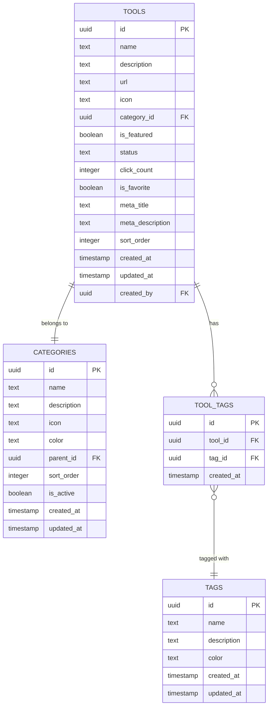
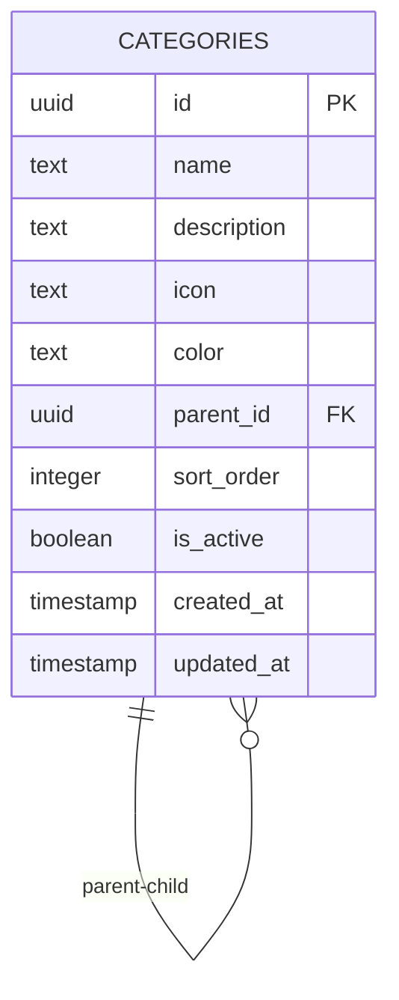
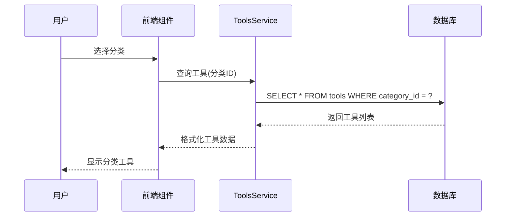
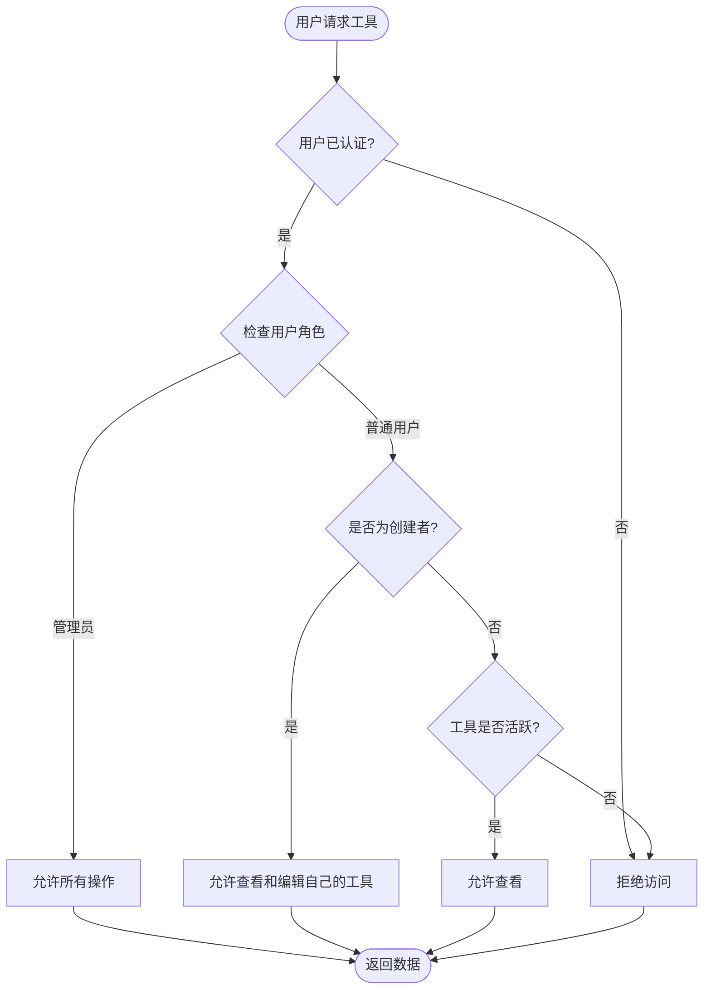
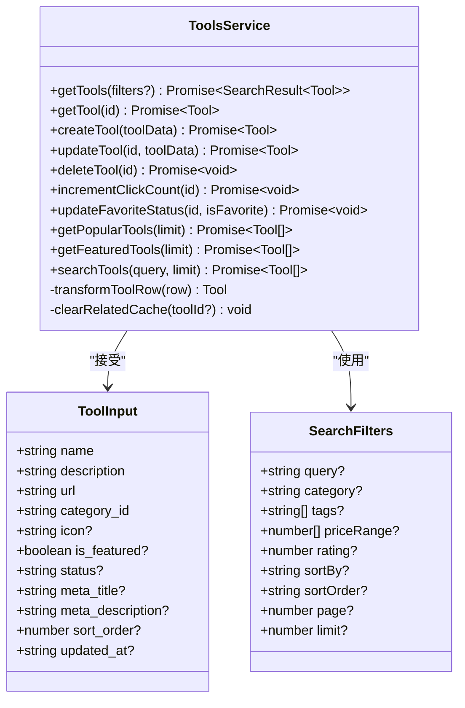
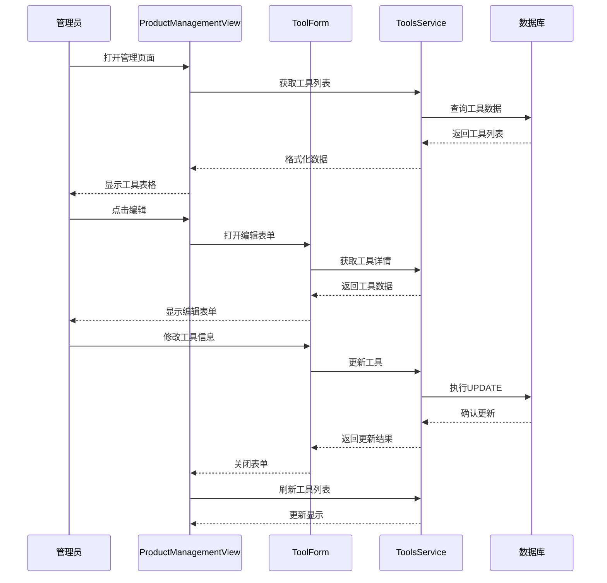
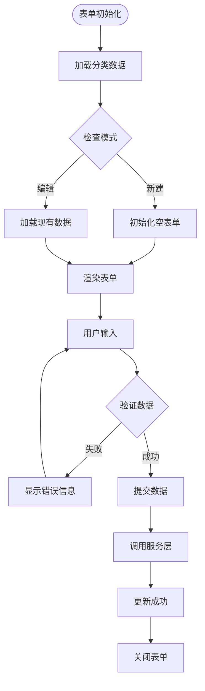

# 工具模型 (Tools) 详细文档

<cite>
**本文档引用的文件**
- [README.md](file://README.md)
- [20250103000002_fix_table_structure.sql](file://supabase/migrations/20250103000002_fix_table_structure.sql)
- [toolsService.ts](file://src/services/toolsService.ts)
- [tools.ts](file://src/stores/tools.ts)
- [ProductManagementView.vue](file://src/views/admin/ProductManagementView.vue)
- [ToolForm.vue](file://src/components/admin/ToolForm.vue)
- [supabase-schema.ts](file://src/lib/supabase-schema.ts)
- [database.ts](file://src/types/database.ts)
- [index.ts](file://src/types/index.ts)
</cite>

## 目录
1. [简介](#简介)
2. [数据库表结构](#数据库表结构)
3. [核心字段详解](#核心字段详解)
4. [分类关联关系](#分类关联关系)
5. [RLS策略与权限控制](#rls策略与权限控制)
6. [服务层实现](#服务层实现)
7. [前端管理流程](#前端管理流程)
8. [性能优化建议](#性能优化建议)
9. [实际代码示例](#实际代码示例)
10. [总结](#总结)

## 简介

工具模型（Tools）是本项目的核心数据结构之一，负责存储和管理各类在线工具的信息。该模型采用了现代化的数据库设计，结合Supabase的Row Level Security (RLS)策略，实现了安全的数据访问控制和高效的查询性能。

项目基于Vue 3 + Vite + Pinia + TypeScript技术栈，采用Fluent Design设计语言，提供了完整的工具导航、搜索、分类管理和用户交互功能。

## 数据库表结构

### Tools表结构概览



**图表来源**
- [20250103000002_fix_table_structure.sql](file://supabase/migrations/20250103000002_fix_table_structure.sql#L1-L50)
- [supabase-schema.ts](file://src/lib/supabase-schema.ts#L200-L210)

### 字段类型优化调整

在20250103000002_fix_table_structure.sql迁移中，对字段类型进行了多项优化：

1. **UUID主键统一**：所有表使用UUID作为主键，确保分布式环境下的唯一性
2. **索引优化**：为常用查询字段创建了专门的索引
3. **默认值设置**：为布尔字段设置了合理的默认值
4. **外键约束**：建立了清晰的表间关系

**章节来源**
- [20250103000002_fix_table_structure.sql](file://supabase/migrations/20250103000002_fix_table_structure.sql#L1-L210)

## 核心字段详解

### 基础字段

| 字段名 | 类型 | 默认值 | 业务含义 |
|--------|------|--------|----------|
| `id` | UUID | uuid_generate_v4() | 工具唯一标识符 |
| `name` | TEXT | - | 工具名称，必填字段 |
| `description` | TEXT | NULL | 工具描述信息 |
| `url` | TEXT | - | 工具访问链接，必填字段 |
| `icon` | TEXT | NULL | 工具图标URL或emoji |

### 状态控制字段

| 字段名 | 类型 | 默认值 | 业务含义 |
|--------|------|--------|----------|
| `is_featured` | BOOLEAN | false | 是否为推荐工具 |
| `status` | TEXT | 'active' | 工具状态：active/inactive |
| `is_favorite` | BOOLEAN | false | 用户收藏状态 |
| `click_count` | INTEGER | 0 | 工具点击计数 |

### 排序与组织字段

| 字段名 | 类型 | 默认值 | 业务含义 |
|--------|------|--------|----------|
| `sort_order` | INTEGER | 0 | 排序权重，数值越小越靠前 |
| `category_id` | UUID | NULL | 所属分类ID |

### SEO优化字段

| 字段名 | 类型 | 默认值 | 业务含义 |
|--------|------|--------|----------|
| `meta_title` | TEXT | NULL | SEO标题，用于搜索引擎优化 |
| `meta_description` | TEXT | NULL | SEO描述，提升搜索可见性 |

### 时间戳字段

| 字段名 | 类型 | 默认值 | 业务含义 |
|--------|------|--------|----------|
| `created_at` | TIMESTAMP WITH TIME ZONE | NOW() | 创建时间 |
| `updated_at` | TIMESTAMP WITH TIME ZONE | NOW() | 更新时间 |

**章节来源**
- [20250103000002_fix_table_structure.sql](file://supabase/migrations/20250103000002_fix_table_structure.sql#L15-L35)
- [supabase-schema.ts](file://src/lib/supabase-schema.ts#L200-L210)

## 分类关联关系

### 分类表结构



**图表来源**
- [20250103000002_fix_table_structure.sql](file://supabase/migrations/20250103000002_fix_table_structure.sql#L8-L20)

### 分类服务处理逻辑

在categoriesService中，分类的处理逻辑包括：

1. **层级结构管理**：支持多级分类，通过parent_id建立父子关系
2. **激活状态控制**：通过is_active字段控制分类是否显示
3. **排序机制**：使用sort_order字段控制分类显示顺序
4. **图标与颜色**：提供视觉标识，增强用户体验

### 分类与工具的关联



**图表来源**
- [toolsService.ts](file://src/services/toolsService.ts#L40-L80)
- [ProductManagementView.vue](file://src/views/admin/ProductManagementView.vue#L100-L150)

**章节来源**
- [20250103000002_fix_table_structure.sql](file://supabase/migrations/20250103000002_fix_table_structure.sql#L8-L20)
- [toolsService.ts](file://src/services/toolsService.ts#L40-L80)

## RLS策略与权限控制

### RLS策略概述

项目使用Supabase的Row Level Security (RLS)策略来控制数据访问权限，确保不同角色的用户只能访问和修改其权限范围内的数据。

### 工具表RLS策略

```sql
-- 所有人可以查看活跃工具
CREATE POLICY "所有人可以查看活跃工具" ON tools
    FOR SELECT USING (status = 'active');

-- 用户可以看到自己的工具（包括非活跃）
CREATE POLICY "用户可以看到自己的工具（包括非活跃）" ON tools
    FOR SELECT USING (auth.uid() = created_by OR status = 'active');

-- 用户只能管理自己的工具
CREATE POLICY "用户只能管理自己的工具" ON tools
    FOR ALL USING (auth.uid() = created_by);

-- 管理员可以管理所有工具
CREATE POLICY "管理员可以管理所有工具" ON tools
    FOR ALL USING (auth.jwt() ->> 'role' = 'admin' OR auth.jwt() ->> 'role' = 'super_admin');
```

### 权限控制流程



**图表来源**
- [20250103000002_fix_table_structure.sql](file://supabase/migrations/20250103000002_fix_table_structure.sql#L60-L80)

### 角色权限矩阵

| 操作 | 普通用户 | 管理员 | 超级管理员 |
|------|----------|--------|------------|
| 查看公开工具 | ✅ | ✅ | ✅ |
| 查看自己创建的工具 | ✅ | ✅ | ✅ |
| 创建工具 | ✅ | ✅ | ✅ |
| 编辑自己创建的工具 | ✅ | ✅ | ✅ |
| 编辑所有工具 | ❌ | ✅ | ✅ |
| 删除自己创建的工具 | ✅ | ✅ | ✅ |
| 删除所有工具 | ❌ | ✅ | ✅ |

**章节来源**
- [20250103000002_fix_table_structure.sql](file://supabase/migrations/20250103000002_fix_table_structure.sql#L60-L80)

## 服务层实现

### ToolsService架构



**图表来源**
- [toolsService.ts](file://src/services/toolsService.ts#L20-L50)
- [toolsService.ts](file://src/services/toolsService.ts#L25-L35)

### 核心方法实现

#### 1. 获取工具列表

```typescript
static async getTools(filters?: SearchFilters): Promise<SearchResult<Tool>> {
  // 生成缓存键
  const cacheKey = `tools_${JSON.stringify(filters || {})}`;
  
  // 使用缓存装饰器
  return withCache(
    this._getToolsFromAPI.bind(this),
    () => cacheKey,
    apiCache,
    2 * 60 * 1000, // 2分钟缓存
  )(filters);
}
```

#### 2. 创建工具

```typescript
static async createTool(toolData: ToolInput): Promise<Tool> {
  try {
    // 验证必需字段
    validateRequiredFields(toolData, ["name", "description", "url"], "Tool");
    
    // 验证并提取分类 ID
    const categoryId = requireCategoryId(toolData);
    
    const { data, error } = await supabase
      .from(TABLES.TOOLS)
      .insert({
        name: toolData.name,
        description: toolData.description,
        url: toolData.url,
        category_id: categoryId,
        icon: toolData.icon,
        is_featured: toolData.is_featured || false,
        status: TOOL_STATUS.ACTIVE,
        meta_title: toolData.meta_title,
        meta_description: toolData.meta_description,
        sort_order: toolData.sort_order || 0,
      })
      .select()
      .single();
      
    return this.transformToolRow(data);
  } catch (error) {
    throw ErrorHandler.handleApiError(error);
  }
}
```

#### 3. 更新工具

```typescript
static async updateTool(id: string, toolData: Partial<ToolInput>): Promise<Tool> {
  try {
    const updateData: Partial<ToolInput> = {};
    
    // 只更新提供的字段
    if (toolData.name) updateData.name = toolData.name;
    if (toolData.description) updateData.description = toolData.description;
    if (toolData.url) updateData.url = toolData.url;
    
    // 处理分类 ID
    const categoryId = extractCategoryId(toolData);
    if (categoryId) {
      updateData.category_id = categoryId;
    }
    
    updateData.updated_at = new Date().toISOString();
    
    const { data, error } = await supabase
      .from(TABLES.TOOLS)
      .update(updateData)
      .eq("id", id)
      .select()
      .single();
      
    return this.transformToolRow(data);
  } catch (error) {
    throw ErrorHandler.handleApiError(error);
  }
}
```

**章节来源**
- [toolsService.ts](file://src/services/toolsService.ts#L40-L150)
- [toolsService.ts](file://src/services/toolsService.ts#L160-L220)
- [toolsService.ts](file://src/services/toolsService.ts#L230-L290)

## 前端管理流程

### ProductManagementView.vue 管理界面



**图表来源**
- [ProductManagementView.vue](file://src/views/admin/ProductManagementView.vue#L1-L100)
- [ToolForm.vue](file://src/components/admin/ToolForm.vue#L1-L100)

### ToolForm.vue 表单组件



**图表来源**
- [ToolForm.vue](file://src/components/admin/ToolForm.vue#L100-L200)

### 管理流程特点

1. **双模式支持**：同时支持新建和编辑两种模式
2. **实时验证**：表单字段实时验证，提供即时反馈
3. **分类联动**：分类选择与工具信息联动
4. **状态管理**：集成Pinia状态管理，保持数据一致性

**章节来源**
- [ProductManagementView.vue](file://src/views/admin/ProductManagementView.vue#L1-L200)
- [ToolForm.vue](file://src/components/admin/ToolForm.vue#L1-L200)

## 性能优化建议

### 索引优化方案

根据20250103000002_fix_table_structure.sql中的索引创建语句，以下是针对搜索场景的索引优化建议：

#### 1. 主要查询字段索引

```sql
-- 工具表主要查询字段索引
CREATE INDEX IF NOT EXISTS idx_tools_category_id ON tools(category_id);
CREATE INDEX IF NOT EXISTS idx_tools_status ON tools(status);
CREATE INDEX IF NOT EXISTS idx_tools_is_featured ON tools(is_featured);
CREATE INDEX IF NOT EXISTS idx_tools_click_count ON tools(click_count);
CREATE INDEX IF NOT EXISTS idx_tools_sort_order ON tools(sort_order);

-- 分类表索引
CREATE INDEX IF NOT EXISTS idx_categories_parent_id ON categories(parent_id);
CREATE INDEX IF NOT EXISTS idx_categories_sort_order ON categories(sort_order);
CREATE INDEX IF NOT EXISTS idx_categories_is_active ON categories(is_active);
```

#### 2. 复合索引优化

```sql
-- 搜索复合索引
CREATE INDEX IF NOT EXISTS idx_tools_search_combined 
ON tools(name, description, status) 
WHERE status = 'active';

-- 分类搜索索引
CREATE INDEX IF NOT EXISTS idx_tools_category_status 
ON tools(category_id, status, sort_order)
WHERE status = 'active';
```

### 查询性能优化

#### 1. 分页查询优化

```typescript
// 优化的分页查询
const { data, error, count } = await supabase
  .from(TABLES.TOOLS)
  .select('*', { count: 'exact' })
  .eq('status', TOOL_STATUS.ACTIVE)
  .range(offset, offset + limit - 1)
  .order('sort_order', { ascending: true });
```

#### 2. 缓存策略

```typescript
// 多级缓存策略
const cacheStrategies = {
  // 热点数据：推荐工具，10分钟缓存
  FEATURED_TOOLS: 10 * 60 * 1000,
  // 中等热度：热门工具，5分钟缓存
  POPULAR_TOOLS: 5 * 60 * 1000,
  // 常规数据：工具列表，2分钟缓存
  TOOL_LIST: 2 * 60 * 1000,
  // 详情数据：工具详情，5分钟缓存
  TOOL_DETAIL: 5 * 60 * 1000
};
```

#### 3. 查询优化技巧

- **使用LIMIT减少数据传输**
- **避免SELECT ***：只查询需要的字段
- **合理使用ORDER BY**：配合索引优化排序性能
- **分页查询**：避免一次性加载大量数据

**章节来源**
- [20250103000002_fix_table_structure.sql](file://supabase/migrations/20250103000002_fix_table_structure.sql#L35-L50)
- [toolsService.ts](file://src/services/toolsService.ts#L40-L80)

## 实际代码示例

### 1. 创建工具的实际调用

```typescript
// 在组件中使用
import { ToolsService } from '@/services/toolsService';

async function createNewTool() {
  const toolData = {
    name: '新工具名称',
    description: '工具详细描述',
    url: 'https://example.com',
    category_id: 'category-uuid',
    icon: '🔧',
    is_featured: false,
    meta_title: 'SEO标题',
    meta_description: 'SEO描述'
  };
  
  try {
    const newTool = await ToolsService.createTool(toolData);
    console.log('工具创建成功:', newTool);
    // 更新UI状态
    await toolsStore.initialize();
  } catch (error) {
    console.error('工具创建失败:', error);
    // 显示错误信息
  }
}
```

### 2. 搜索工具的完整实现

```typescript
// 搜索服务实现
class SearchService {
  static async searchTools(query: string, filters: SearchFilters = {}): Promise<SearchResult<Tool>> {
    // 构建查询条件
    let queryBuilder = supabase
      .from(TABLES.TOOLS)
      .select(`
        *,
        categories(*)
      `)
      .eq('status', TOOL_STATUS.ACTIVE);
    
    // 应用搜索关键词
    if (query) {
      queryBuilder = queryBuilder.or(
        `name.ilike.%${query}%,description.ilike.%${query}%`
      );
    }
    
    // 应用分类过滤
    if (filters.category && filters.category !== 'all') {
      queryBuilder = queryBuilder.eq('category_id', filters.category);
    }
    
    // 应用排序
    const sortBy = filters.sortBy || 'sort_order';
    const sortOrder = filters.sortOrder || 'asc';
    queryBuilder = queryBuilder.order(sortBy, { ascending: sortOrder === 'asc' });
    
    // 分页处理
    const page = filters.page || 1;
    const limit = filters.limit || 20;
    const offset = (page - 1) * limit;
    
    const { data, error, count } = await queryBuilder.range(offset, offset + limit - 1);
    
    if (error) {
      throw new Error(handleSupabaseError(error));
    }
    
    const tools = (data || []).map(this.transformToolRow);
    
    return {
      items: tools,
      total: count || 0,
      page,
      limit,
      hasMore: (count || 0) > offset + limit
    };
  }
}
```

### 3. 工具点击统计

```typescript
// 点击计数服务
class ClickTrackingService {
  static async trackToolClick(toolId: string): Promise<void> {
    try {
      // 原子操作：使用RPC函数
      const { error } = await supabase.rpc('increment_click_count', {
        tool_id: toolId
      });
      
      if (error) {
        throw new Error(handleSupabaseError(error));
      }
      
      // 更新本地缓存
      const toolsStore = useToolsStore();
      const tool = toolsStore.getToolById(toolId);
      if (tool) {
        tool.click_count++;
      }
      
    } catch (error) {
      console.error('点击统计失败:', error);
      // 可以考虑本地记录，稍后重试
    }
  }
}
```

### 4. 收藏功能实现

```typescript
// 收藏管理
class FavoriteService {
  static async toggleFavorite(toolId: string): Promise<boolean> {
    const toolsStore = useToolsStore();
    const tool = toolsStore.getToolById(toolId);
    
    if (!tool) {
      throw new Error('工具不存在');
    }
    
    const isFavorite = !tool.is_favorite;
    
    try {
      // 更新数据库
      const { error } = await supabase
        .from(TABLES.TOOLS)
        .update({
          is_favorite: isFavorite,
          updated_at: new Date().toISOString()
        })
        .eq('id', toolId);
      
      if (error) {
        throw new Error(handleSupabaseError(error));
      }
      
      // 更新本地状态
      tool.is_favorite = isFavorite;
      
      return isFavorite;
      
    } catch (error) {
      console.error('收藏状态更新失败:', error);
      throw error;
    }
  }
}
```

**章节来源**
- [toolsService.ts](file://src/services/toolsService.ts#L160-L220)
- [toolsService.ts](file://src/services/toolsService.ts#L300-L350)
- [tools.ts](file://src/stores/tools.ts#L150-L200)

## 总结

工具模型（Tools）是本项目的核心数据结构，具有以下关键特性：

### 技术优势

1. **现代化数据库设计**：采用UUID主键，支持分布式部署
2. **完善的RLS策略**：实现细粒度的权限控制
3. **高性能查询**：通过索引优化和缓存策略提升性能
4. **类型安全**：基于TypeScript的强类型定义

### 功能完整性

1. **完整的CRUD操作**：支持工具的创建、读取、更新、删除
2. **智能搜索**：支持关键词搜索和多维过滤
3. **状态管理**：提供收藏、推荐、点击统计等功能
4. **分类体系**：支持多级分类和灵活的组织结构

### 安全保障

1. **角色权限控制**：区分普通用户和管理员权限
2. **数据访问控制**：RLS策略确保数据安全
3. **输入验证**：前端和服务端双重验证
4. **错误处理**：完善的异常处理和日志记录

### 开发体验

1. **模块化设计**：清晰的服务层和组件分离
2. **类型推导**：完整的TypeScript类型定义
3. **缓存策略**：多级缓存提升用户体验
4. **错误处理**：统一的错误处理和用户反馈

该工具模型为项目提供了坚实的数据基础，支持高效的工具管理、搜索和用户交互功能，是整个系统的核心组成部分。通过合理的架构设计和性能优化，确保了系统的可扩展性和用户体验。