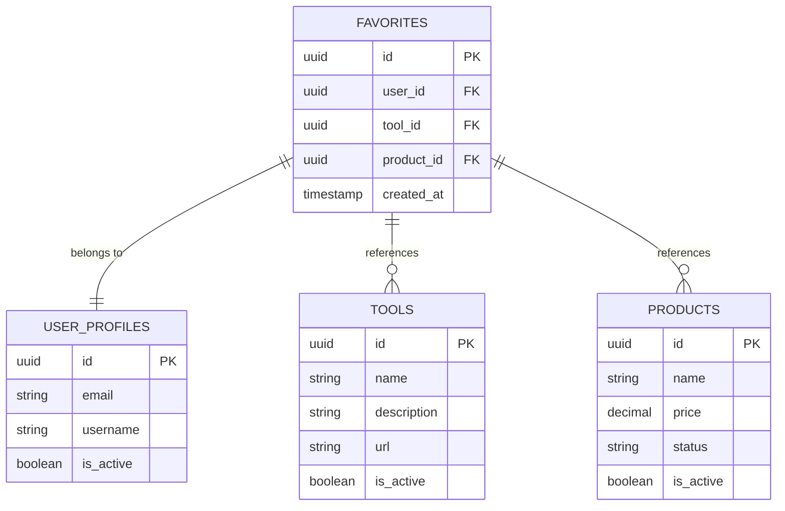
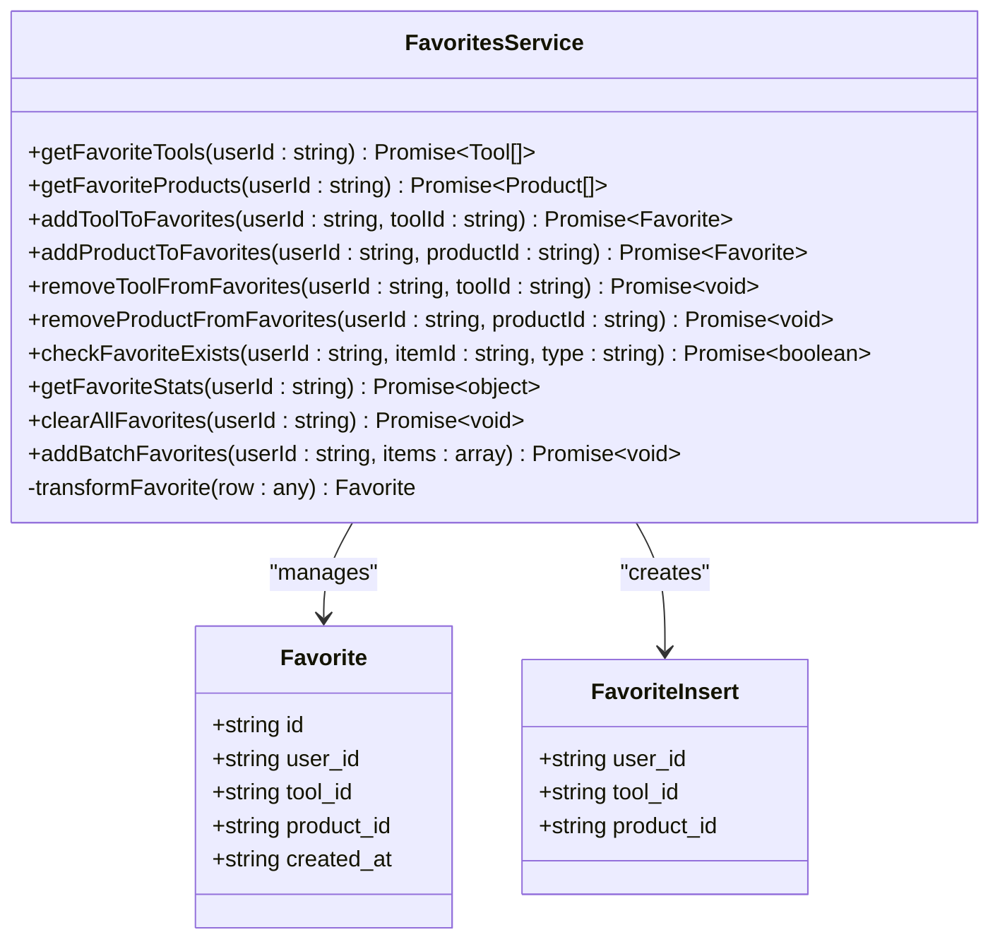
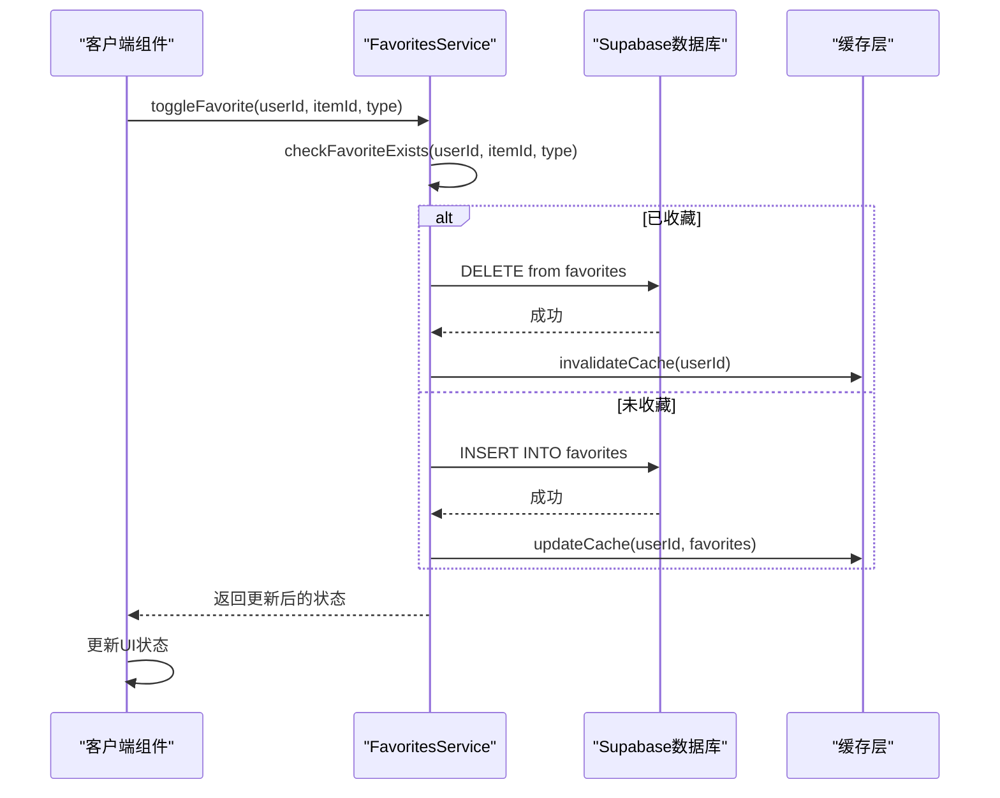
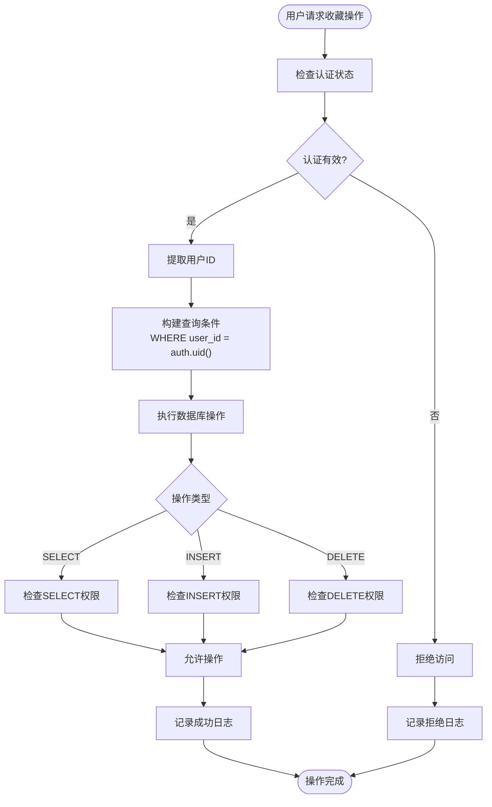
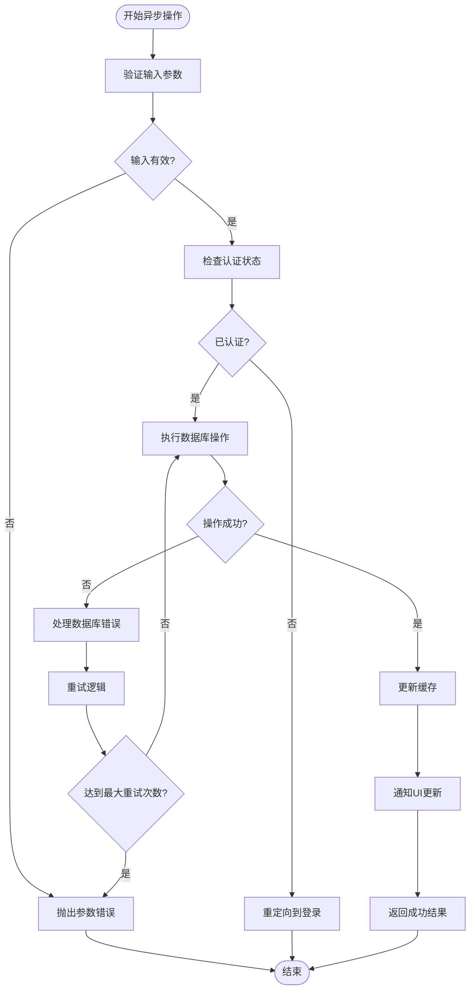
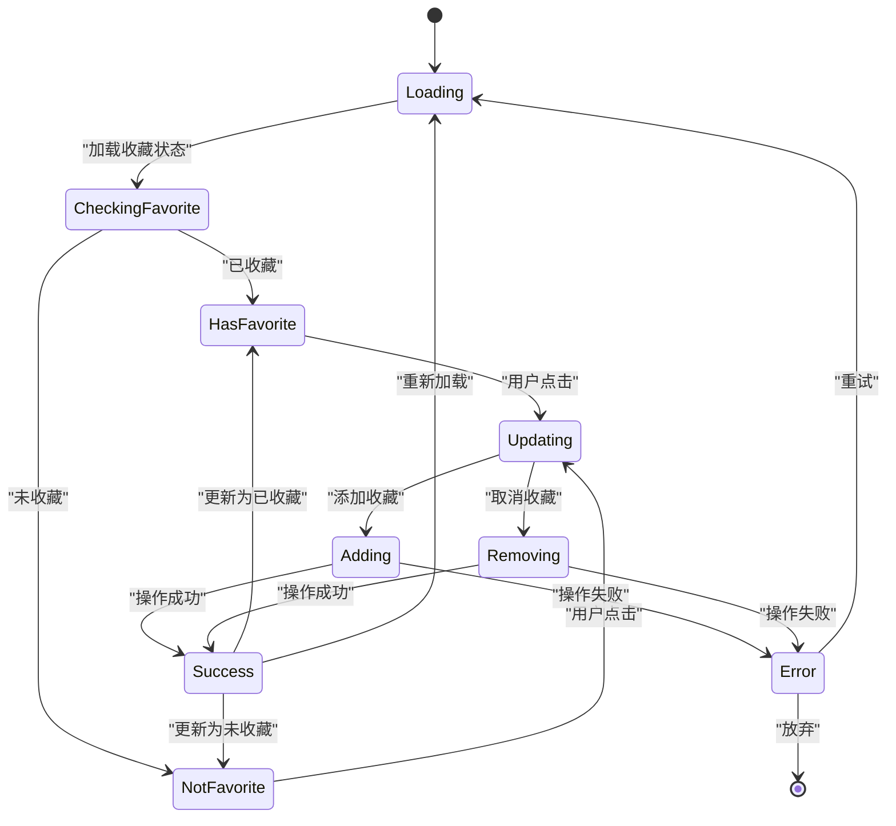
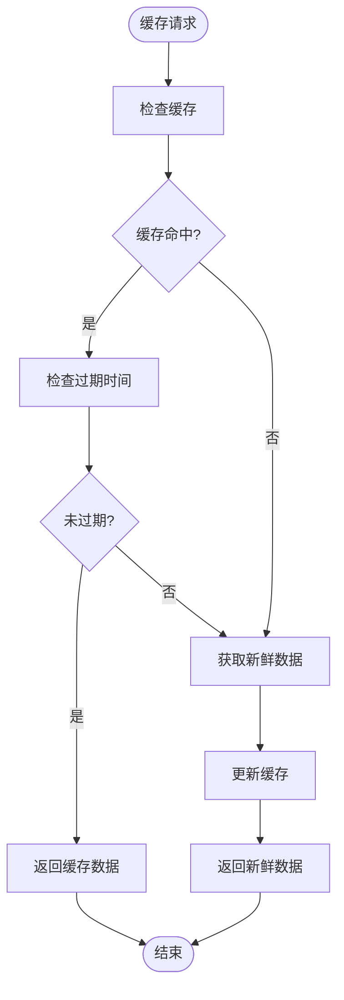
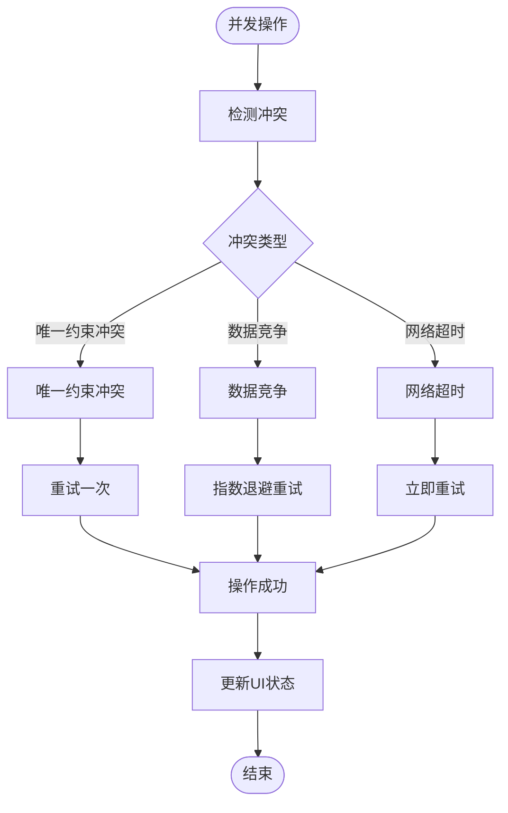
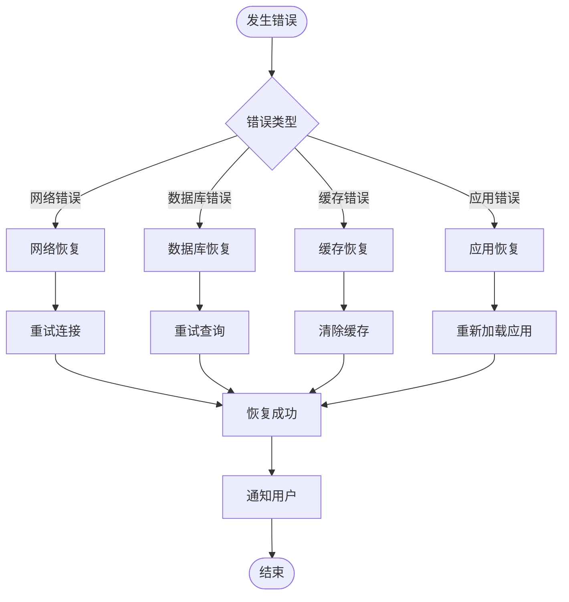

# 收藏模型 (Favorites) 技术文档

<cite>
**本文档引用的文件**
- [favoritesService.ts](file://src/services/favoritesService.ts)
- [supabase-schema.ts](file://src/lib/supabase-schema.ts)
- [database.ts](file://src/types/database.ts)
- [initial_schema.sql](file://supabase/migrations/20241224000001_initial_schema.sql)
- [rls_policies.sql](file://supabase/migrations/20241224000002_rls_policies.sql)
- [StarRating.vue](file://src/components/ui/StarRating.vue)
- [ToolDetailView.vue](file://src/views/ToolDetailView.vue)
- [ProductDetailView.vue](file://src/views/ProductDetailView.vue)
- [FavoritesView.vue](file://src/views/user/FavoritesView.vue)
- [ToolRating.vue](file://src/components/ToolRating.vue)
- [cacheManager.ts](file://src/utils/cacheManager.ts)
- [localStorageService.ts](file://src/services/localStorageService.ts)
</cite>

## 目录
1. [简介](#简介)
2. [数据库架构设计](#数据库架构设计)
3. [核心组件分析](#核心组件分析)
4. [RLS策略实现](#rls策略实现)
5. [异步操作实现](#异步操作实现)
6. [状态管理与UI同步](#状态管理与ui同步)
7. [性能优化策略](#性能优化策略)
8. [高并发处理](#高并发处理)
9. [故障排除指南](#故障排除指南)
10. [总结](#总结)

## 简介

收藏模型(Favorites)是高级工具导航系统中的核心功能组件，它作为用户与工具(Product)和产品之间的多对多关系桥梁，实现了用户个性化内容管理的核心需求。该模型采用复合主键设计，通过行级安全(RLS)策略确保数据安全，并提供了完整的异步操作支持和状态同步机制。

## 数据库架构设计

### 表结构设计

收藏表(favorites)采用了精心设计的复合主键结构，确保数据完整性和查询效率：



**图表来源**
- [initial_schema.sql](file://supabase/migrations/20241224000001_initial_schema.sql#L139-L172)
- [supabase-schema.ts](file://src/lib/supabase-schema.ts#L45-L50)

### 复合主键设计原理

收藏表的复合主键设计遵循以下原则：

1. **唯一约束**：每个用户只能收藏同一个工具或产品一次
2. **外键完整性**：确保引用的数据存在且有效
3. **数据一致性**：防止重复收藏和孤立记录

```sql
CREATE TABLE IF NOT EXISTS favorites (
    id UUID DEFAULT uuid_generate_v4() PRIMARY KEY,
    user_id UUID REFERENCES user_profiles(id) ON DELETE CASCADE,
    tool_id UUID REFERENCES tools(id) ON DELETE CASCADE,
    product_id UUID REFERENCES products(id) ON DELETE CASCADE,
    created_at TIMESTAMP WITH TIME ZONE DEFAULT NOW(),
    CONSTRAINT favorites_check CHECK (
        (tool_id IS NOT NULL AND product_id IS NULL) OR
        (tool_id IS NULL AND product_id IS NOT NULL)
    ),
    UNIQUE(user_id, tool_id),
    UNIQUE(user_id, product_id)
);
```

**章节来源**
- [initial_schema.sql](file://supabase/migrations/20241224000001_initial_schema.sql#L139-L172)

## 核心组件分析

### FavoritesService 类架构



**图表来源**
- [favoritesService.ts](file://src/services/favoritesService.ts#L1-L374)

### 核心方法实现

#### 获取收藏工具

```typescript
static async getFavoriteTools(userId: string): Promise<Tool[]> {
  try {
    // 第一步：获取收藏记录
    const { data: favorites, error: favoritesError } = await supabase
      .from("favorites")
      .select("tool_id")
      .eq("user_id", userId)
      .not("tool_id", "is", null)
      .order("created_at", { ascending: false });

    if (favoritesError) throw favoritesError;
    if (!favorites || favorites.length === 0) return [];

    // 第二步：获取工具详情
    const toolIds = favorites.map((f) => f.tool_id).filter(Boolean) as string[];
    const { data: tools, error: toolsError } = await supabase
      .from("tools")
      .select(`
        *,
        category:categories(*)
      `)
      .in("id", toolIds)
      .eq("status", "active");

    if (toolsError) throw toolsError;

    return tools.map((tool) => ({
      id: tool.id,
      name: tool.name,
      description: tool.description,
      url: tool.url,
      icon: tool.icon,
      // ... 其他字段映射
      is_favorite: true,
      click_count: tool.click_count,
      // ...
    }));
  } catch (error) {
    console.error("获取收藏工具失败:", error);
    throw new Error("获取收藏工具失败");
  }
}
```

**章节来源**
- [favoritesService.ts](file://src/services/favoritesService.ts#L8-L60)

#### 异步操作模式

收藏服务采用标准的异步操作模式，确保数据一致性和错误处理：



**图表来源**
- [favoritesService.ts](file://src/services/favoritesService.ts#L144-L209)

## RLS策略实现

### 行级安全策略设计

RLS策略确保每个用户只能操作自己的收藏记录，实现真正的数据隔离：

```sql
-- 收藏策略
CREATE POLICY "用户可以查看自己的收藏" ON favorites
    FOR SELECT USING (user_id = auth.uid());

CREATE POLICY "用户可以管理自己的收藏" ON favorites
    FOR ALL USING (user_id = auth.uid());
```

### 策略执行流程



**图表来源**
- [rls_policies.sql](file://supabase/migrations/20241224000002_rls_policies.sql#L130-L135)

**章节来源**
- [rls_policies.sql](file://supabase/migrations/20241224000002_rls_policies.sql#L130-L135)

## 异步操作实现

### toggleFavorite 方法详解

toggleFavorite 方法是收藏功能的核心入口，实现了完整的异步操作流程：

```typescript
// 工具详情页中的收藏切换
const toggleFavorite = async () => {
  if (!authStore.isAuthenticated) {
    router.push("/auth/login");
    return;
  }

  try {
    // 显示加载状态
    loading.value = true;
    
    // 检查当前收藏状态
    const isCurrentlyFavorite = await FavoritesService.checkFavoriteExists(
      authStore.user.id,
      tool.value.id,
      "tool"
    );

    if (isCurrentlyFavorite) {
      // 取消收藏
      await FavoritesService.removeToolFromFavorites(
        authStore.user.id,
        tool.value.id
      );
      isFavorited.value = false;
    } else {
      // 添加收藏
      await FavoritesService.addToolToFavorites(
        authStore.user.id,
        tool.value.id
      );
      isFavorited.value = true;
    }

    // 更新UI状态
    toast.success(isCurrentlyFavorite ? "已取消收藏" : "已添加收藏");
  } catch (error) {
    console.error("切换收藏状态失败:", error);
    toast.error("操作失败，请重试");
  } finally {
    loading.value = false;
  }
};
```

### 错误处理机制



**图表来源**
- [favoritesService.ts](file://src/services/favoritesService.ts#L144-L209)

**章节来源**
- [ToolDetailView.vue](file://src/views/ToolDetailView.vue#L150-L180)

## 状态管理与UI同步

### StarRating 组件集成

StarRating 组件展示了如何在UI层面实现收藏状态的即时反馈：

```vue
<template>
  <div class="star-rating">
    <span
      v-for="n in 5"
      :key="n"
      class="star"
      :class="{ filled: n <= modelValue }"
      @click="updateRating(n)"
    >
      ★
    </span>
  </div>
</template>

<script lang="ts" setup>
import { defineProps, defineEmits } from "vue";

const props = defineProps({
  modelValue: {
    type: Number,
    required: true,
  },
  readonly: {
    type: Boolean,
    default: false,
  },
});
const emit = defineEmits(["update:modelValue"]);

function updateRating(n: number) {
  if (!props.readonly) {
    emit("update:modelValue", n);
  }
}
</script>
```

### 状态同步策略



**图表来源**
- [StarRating.vue](file://src/components/ui/StarRating.vue#L1-L55)

**章节来源**
- [StarRating.vue](file://src/components/ui/StarRating.vue#L1-L55)

## 性能优化策略

### 缓存管理策略

系统采用多层次缓存策略来优化收藏数据的访问性能：

```typescript
// 默认缓存配置
export const defaultCache = new CacheManager({
  maxAge: 5 * 60 * 1000, // 5分钟
  maxSize: 100,
  version: "1.0.0",
  serialize: true,
  prefix: "advanced_tools_",
});

// API数据缓存配置
export const apiCache = new CacheManager({
  maxAge: 3 * 60 * 1000, // 3分钟
  maxSize: 200,
  serialize: true,
  prefix: "api_cache_",
});
```

### 缓存装饰器模式

```typescript
export function withCache<T extends (...args: any[]) => Promise<any>>(
  fn: T,
  cacheKey: ((...args: Parameters<T>) => string) | string,
  cacheInstance: CacheManager = defaultCache,
  maxAge?: number,
): T {
  return (async (...args: Parameters<T>) => {
    const key = typeof cacheKey === "function" ? cacheKey(...args) : cacheKey;

    // 尝试从缓存获取
    const cachedResult = cacheInstance.get(key);
    if (cachedResult !== null) {
      return cachedResult;
    }

    // 执行原函数
    const result = await fn(...args);

    // 缓存结果
    cacheInstance.set(key, result, maxAge);

    return result;
  }) as T;
}
```

### 缓存生命周期管理



**图表来源**
- [cacheManager.ts](file://src/utils/cacheManager.ts#L1-L400)

**章节来源**
- [cacheManager.ts](file://src/utils/cacheManager.ts#L1-L400)

## 高并发处理

### 并发控制策略

在高并发场景下，系统采用以下策略确保数据一致性：

1. **乐观锁机制**：通过版本号控制并发更新
2. **事务隔离**：使用数据库事务保证操作原子性
3. **重试机制**：自动处理短暂的并发冲突

```typescript
// 批量添加收藏的并发处理
static async addBatchFavorites(
  userId: string,
  items: Array<{ id: string; type: "tool" | "product" }>,
): Promise<void> {
  try {
    const favoriteData: FavoriteInsert[] = items.map((item) => ({
      user_id: userId,
      tool_id: item.type === "tool" ? item.id : null,
      product_id: item.type === "product" ? item.id : null,
    }));

    // 使用数据库事务处理批量操作
    const { error } = await (supabase as any)
      .from("favorites")
      .insert(favoriteData);

    if (error) throw error;
  } catch (error) {
    console.error("批量添加收藏失败:", error);
    throw new Error("批量添加收藏失败");
  }
}
```

### 冲突处理策略



**章节来源**
- [favoritesService.ts](file://src/services/favoritesService.ts#L324-L372)

## 故障排除指南

### 常见问题诊断

#### 1. 收藏状态不同步

**症状**：UI显示与实际数据库状态不一致

**诊断步骤**：
```typescript
// 检查收藏状态
const checkSyncStatus = async (userId: string, itemId: string, type: string) => {
  try {
    // 1. 检查数据库状态
    const dbStatus = await FavoritesService.checkFavoriteExists(userId, itemId, type);
    
    // 2. 检查缓存状态
    const cacheKey = `favorites_${userId}_${type}_${itemId}`;
    const cachedStatus = cacheManager.has(cacheKey);
    
    // 3. 检查本地状态
    const localStatus = localStorage.getItem(`local_favorite_${itemId}`);
    
    console.log({
      dbStatus,
      cachedStatus,
      localStatus,
      timestamp: new Date().toISOString()
    });
  } catch (error) {
    console.error("状态检查失败:", error);
  }
};
```

#### 2. 性能问题排查

**监控指标**：
- 数据库查询响应时间
- 缓存命中率
- 并发请求数量
- 内存使用情况

**优化建议**：
```typescript
// 性能监控装饰器
export function monitorPerformance<T extends (...args: any[]) => Promise<any>>(
  fn: T,
  operationName: string,
): T {
  return (async (...args: Parameters<T>) => {
    const startTime = performance.now();
    
    try {
      const result = await fn(...args);
      const endTime = performance.now();
      
      console.log(`${operationName} 耗时: ${endTime - startTime}ms`);
      return result;
    } catch (error) {
      const endTime = performance.now();
      console.error(`${operationName} 失败, 耗时: ${endTime - startTime}ms`, error);
      throw error;
    }
  }) as T;
}
```

### 错误恢复机制



## 总结

收藏模型(Favorites)作为高级工具导航系统的核心功能组件，通过精心设计的数据库架构、完善的RLS策略、高效的异步操作和智能的缓存管理，实现了用户个性化内容管理的完整解决方案。

### 主要特性总结

1. **数据安全**：基于RLS的行级安全策略确保数据隔离
2. **性能优化**：多层次缓存策略提升访问效率
3. **状态同步**：实时UI反馈提供良好的用户体验
4. **并发处理**：完善的冲突处理机制保证数据一致性
5. **错误恢复**：健壮的错误处理和恢复机制

### 最佳实践建议

1. **合理使用缓存**：根据数据更新频率选择合适的缓存策略
2. **监控性能指标**：定期检查缓存命中率和数据库性能
3. **优雅降级**：在网络异常时提供本地化的功能体验
4. **持续优化**：根据用户行为数据不断调整缓存策略

通过这些设计和实现，收藏模型能够满足现代Web应用对高性能、高可用性和良好用户体验的需求，为用户提供流畅的个性化内容管理体验。