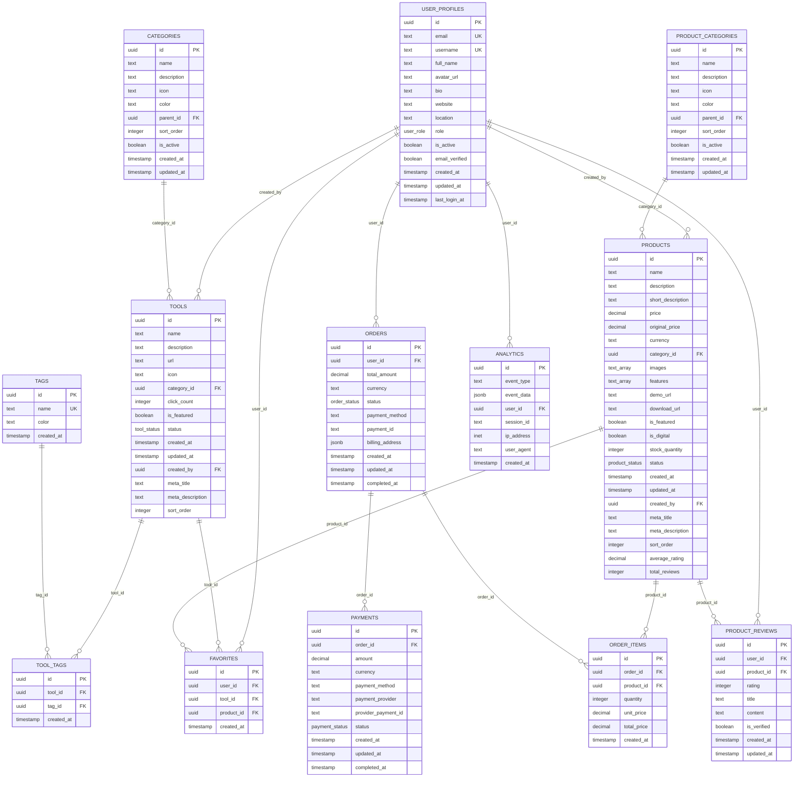

现在我已经收集了足够的信息来创建全面的数据库设计文档。让我开始生成文档内容：

<docs>
# 数据库设计文档

<cite>
**本文档中引用的文件**
- [20241224000001_initial_schema.sql](file://supabase/migrations/20241224000001_initial_schema.sql)
- [20241224000002_rls_policies.sql](file://supabase/migrations/20241224000002_rls_policies.sql)
- [20241224000004_seed_data.sql](file://supabase/migrations/20241224000004_seed_data.sql)
- [20250101000002_fix_schema_issues.sql](file://supabase/migrations/20250101000002_fix_schema_issues.sql)
- [20250102000001_fix_rls_performance.sql](file://supabase/migrations/20250102000001_fix_rls_performance.sql)
- [20250103000001_add_performance_indexes.sql](file://supabase/migrations/20250103000001_add_performance_indexes.sql)
- [supabase-schema.ts](file://src/lib/supabase-schema.ts)
- [config.toml](file://supabase/config.toml)
</cite>

## 目录
1. [简介](#简介)
2. [项目结构概览](#项目结构概览)
3. [核心数据模型](#核心数据模型)
4. [架构概览](#架构概览)
5. [详细组件分析](#详细组件分析)
6. [表结构演进机制](#表结构演进机制)
7. [版本化数据库变更管理](#版本化数据库变更管理)
8. [性能优化策略](#性能优化策略)
9. [类型安全的数据库访问](#类型安全的数据库访问)
10. [故障排除指南](#故障排除指南)
11. [结论](#结论)

## 简介

本文档详细介绍了基于Supabase PostgreSQL数据库的完整Schema设计，涵盖了从初始架构到性能优化的完整演进过程。该数据库系统采用现代化的行级安全(RLS)策略，支持复杂的业务逻辑和高性能查询需求。

数据库设计围绕核心业务实体构建，包括用户管理(UserProfiles)、工具管理(Tools)、产品管理(Products)、订单处理(Orders)、收藏功能(Favorites)和分类管理(Categories)等模块。通过精心设计的索引策略和优化的RLS策略，确保了系统的安全性和性能表现。

## 项目结构概览

数据库架构采用分层设计，通过migrations目录实现版本化的数据库变更管理：


**图表来源**
- [config.toml](file://supabase/config.toml#L1-L128)
- [20241224000001_initial_schema.sql](file://supabase/migrations/20241224000001_initial_schema.sql#L1-L288)

**章节来源**
- [config.toml](file://supabase/config.toml#L1-L128)
- [20241224000001_initial_schema.sql](file://supabase/migrations/20241224000001_initial_schema.sql#L1-L288)

## 核心数据模型

### 用户资料表 (UserProfiles)

用户资料表是整个系统的核心，存储用户的基本信息和权限设置：

```sql
CREATE TABLE IF NOT EXISTS user_profiles (
    id UUID REFERENCES auth.users(id) ON DELETE CASCADE PRIMARY KEY,
    email TEXT UNIQUE NOT NULL,
    username TEXT UNIQUE,
    full_name TEXT,
    avatar_url TEXT,
    bio TEXT,
    website TEXT,
    location TEXT,
    role user_role DEFAULT 'user',
    is_active BOOLEAN DEFAULT true,
    email_verified BOOLEAN DEFAULT false,
    created_at TIMESTAMP WITH TIME ZONE DEFAULT NOW(),
    updated_at TIMESTAMP WITH TIME ZONE DEFAULT NOW(),
    last_login_at TIMESTAMP WITH TIME ZONE
);
```

**关键特性：**
- 基于UUID的主键设计，确保分布式环境下的唯一性
- 与Supabase Auth集成，自动同步用户信息
- 角色枚举类型支持用户权限分级
- 自动更新时间戳机制
- 邮箱验证状态跟踪

### 工具表 (Tools)

工具表管理AI工具的信息和状态：

```sql
CREATE TABLE IF NOT EXISTS tools (
    id UUID DEFAULT uuid_generate_v4() PRIMARY KEY,
    name TEXT NOT NULL,
    description TEXT NOT NULL,
    url TEXT NOT NULL,
    icon TEXT,
    category_id UUID REFERENCES categories(id) ON DELETE SET NULL,
    click_count INTEGER DEFAULT 0,
    is_featured BOOLEAN DEFAULT false,
    status tool_status DEFAULT 'active',
    created_at TIMESTAMP WITH TIME ZONE DEFAULT NOW(),
    updated_at TIMESTAMP WITH TIME ZONE DEFAULT NOW(),
    created_by UUID REFERENCES user_profiles(id) ON DELETE SET NULL,
    meta_title TEXT,
    meta_description TEXT,
    sort_order INTEGER DEFAULT 0
);
```

**关键特性：**
- 支持工具的层级分类结构
- 点击计数统计功能
- 特色工具标记
- 审核状态管理
- 创建者关联

### 产品表 (Products)

产品表管理可购买的产品信息：

```sql
CREATE TABLE IF NOT EXISTS products (
    id UUID DEFAULT uuid_generate_v4() PRIMARY KEY,
    name TEXT NOT NULL,
    description TEXT NOT NULL,
    short_description TEXT,
    price DECIMAL(10,2) NOT NULL,
    original_price DECIMAL(10,2),
    currency TEXT DEFAULT 'CNY',
    category_id UUID REFERENCES product_categories(id) ON DELETE SET NULL,
    images TEXT[] DEFAULT '{}',
    features TEXT[] DEFAULT '{}',
    demo_url TEXT,
    download_url TEXT,
    is_featured BOOLEAN DEFAULT false,
    is_digital BOOLEAN DEFAULT true,
    stock_quantity INTEGER,
    status product_status DEFAULT 'active',
    created_at TIMESTAMP WITH TIME ZONE DEFAULT NOW(),
    updated_at TIMESTAMP WITH TIME ZONE DEFAULT NOW(),
    created_by UUID REFERENCES user_profiles(id) ON DELETE SET NULL,
    meta_title TEXT,
    meta_description TEXT,
    sort_order INTEGER DEFAULT 0,
    average_rating DECIMAL(3,2) DEFAULT 0,
    total_reviews INTEGER DEFAULT 0
);
```

**关键特性：**
- 数组字段支持多个图片和特性
- 数字产品与实体产品的区分
- 库存管理
- 评分和评论统计
- 原价对比功能

### 订单表 (Orders)

订单表管理用户的购买流程：

```sql
CREATE TABLE IF NOT EXISTS orders (
    id UUID DEFAULT uuid_generate_v4() PRIMARY KEY,
    user_id UUID REFERENCES user_profiles(id) ON DELETE SET NULL,
    total_amount DECIMAL(10,2) NOT NULL,
    currency TEXT DEFAULT 'CNY',
    status order_status DEFAULT 'pending',
    payment_method TEXT,
    payment_id TEXT,
    billing_address JSONB,
    created_at TIMESTAMP WITH TIME ZONE DEFAULT NOW(),
    updated_at TIMESTAMP WITH TIME ZONE DEFAULT NOW(),
    completed_at TIMESTAMP WITH TIME ZONE
);
```

**关键特性：**
- JSONB字段支持灵活的账单地址结构
- 支付状态跟踪
- 订单生命周期管理
- 多货币支持

### 收藏表 (Favorites)

收藏表实现用户对工具和产品的收藏功能：

```sql
CREATE TABLE IF NOT EXISTS favorites (
    id UUID DEFAULT uuid_generate_v4() PRIMARY KEY,
    user_id UUID REFERENCES user_profiles(id) ON DELETE CASCADE,
    tool_id UUID REFERENCES tools(id) ON DELETE CASCADE,
    product_id UUID REFERENCES products(id) ON DELETE CASCADE,
    created_at TIMESTAMP WITH TIME ZONE DEFAULT NOW(),
    CONSTRAINT favorites_check CHECK (
        (tool_id IS NOT NULL AND product_id IS NULL) OR
        (tool_id IS NULL AND product_id IS NOT NULL)
    ),
    UNIQUE(user_id, tool_id),
    UNIQUE(user_id, product_id)
);
```

**关键特性：**
- 排他性约束确保收藏唯一性
- 复合唯一约束防止重复收藏
- 外键级联删除保证数据一致性

**章节来源**
- [20241224000001_initial_schema.sql](file://supabase/migrations/20241224000001_initial_schema.sql#L30-L288)

## 架构概览

数据库架构采用三层设计模式，确保安全性、可维护性和性能：



**图表来源**
- [20241224000001_initial_schema.sql](file://supabase/migrations/20241224000001_initial_schema.sql#L30-L288)

## 详细组件分析

### 枚举类型系统

数据库使用PostgreSQL枚举类型确保数据的一致性和完整性：

```sql
-- 用户角色枚举
CREATE TYPE user_role AS ENUM ('user', 'admin', 'super_admin');

-- 工具状态枚举
CREATE TYPE tool_status AS ENUM ('active', 'inactive', 'draft');

-- 产品状态枚举
CREATE TYPE product_status AS ENUM ('active', 'inactive', 'draft');

-- 订单状态枚举
CREATE TYPE order_status AS ENUM ('pending', 'paid', 'cancelled', 'refunded');

-- 支付状态枚举
CREATE TYPE payment_status AS ENUM ('pending', 'completed', 'failed', 'cancelled');
```

### 行级安全(RLS)策略

RLS策略确保数据的安全访问控制：


**图表来源**
- [20241224000002_rls_policies.sql](file://supabase/migrations/20241224000002_rls_policies.sql#L1-L296)

### 触发器机制

数据库自动维护时间戳字段：

```sql
CREATE OR REPLACE FUNCTION update_updated_at_column()
RETURNS TRIGGER AS $$
BEGIN
    NEW.updated_at = NOW();
    RETURN NEW;
END;
$$ language 'plpgsql';

-- 为需要的表添加更新时间触发器
CREATE TRIGGER update_user_profiles_updated_at 
BEFORE UPDATE ON user_profiles 
FOR EACH ROW EXECUTE FUNCTION update_updated_at_column();

CREATE TRIGGER update_tools_updated_at 
BEFORE UPDATE ON tools 
FOR EACH ROW EXECUTE FUNCTION update_updated_at_column();
```

**章节来源**
- [20241224000001_initial_schema.sql](file://supabase/migrations/20241224000001_initial_schema.sql#L250-L288)

## 表结构演进机制

数据库经历了四个主要阶段的演进：

### 第一阶段：初始架构 (20241224000001)

初始架构奠定了基础的数据模型和索引结构：


**图表来源**
- [20241224000001_initial_schema.sql](file://supabase/migrations/20241224000001_initial_schema.sql#L1-L288)

### 第二阶段：RLS策略完善 (20241224000002)

添加行级安全策略，确保数据访问的安全性：

```sql
-- 启用RLS
ALTER TABLE user_profiles ENABLE ROW LEVEL SECURITY;
ALTER TABLE tools ENABLE ROW LEVEL SECURITY;
ALTER TABLE products ENABLE ROW LEVEL SECURITY;

-- 用户资料策略
CREATE POLICY "用户可以查看所有公开资料" ON user_profiles
    FOR SELECT USING (true);

CREATE POLICY "用户可以更新自己的资料" ON user_profiles
    FOR UPDATE USING (auth.uid() = id);
```

### 第三阶段：架构修复 (20250101000002)

修复安全漏洞和性能问题：

```sql
-- 修复RLS性能问题
CREATE POLICY "用户只能查看自己的资料" ON user_profiles
    FOR SELECT USING (auth.uid() = id);

CREATE POLICY "管理员可以管理所有用户" ON user_profiles
    FOR ALL USING (auth.jwt() ->> 'role' = 'admin' OR auth.jwt() ->> 'role' = 'super_admin');
```

### 第四阶段：性能优化 (20250103000001)

添加大量性能索引和优化策略：

```sql
-- 全文搜索索引
CREATE INDEX IF NOT EXISTS idx_tools_name_gin ON tools USING gin(to_tsvector('chinese', name));
CREATE INDEX IF NOT EXISTS idx_tools_description_gin ON tools USING gin(to_tsvector('chinese', description));

-- 复合索引
CREATE INDEX IF NOT EXISTS idx_tools_status_featured ON tools(status, is_featured);
CREATE INDEX IF NOT EXISTS idx_tools_category_status ON tools(category_id, status);
```

**章节来源**
- [20241224000001_initial_schema.sql](file://supabase/migrations/20241224000001_initial_schema.sql#L1-L288)
- [20241224000002_rls_policies.sql](file://supabase/migrations/20241224000002_rls_policies.sql#L1-L296)
- [20250101000002_fix_schema_issues.sql](file://supabase/migrations/20250101000002_fix_schema_issues.sql#L1-L217)
- [20250103000001_add_performance_indexes.sql](file://supabase/migrations/20250103000001_add_performance_indexes.sql#L1-L353)

## 版本化数据库变更管理

数据库变更采用严格的版本化管理，每个迁移都有明确的目的和描述：

### 迁移命名规范

迁移文件按照时间戳格式命名：
- `YYYYMMDDHHMMSS_<描述>.sql`
- 示例：`20241224000001_initial_schema.sql`

### 迁移类型分类


### 幂等性设计

所有DDL语句都包含幂等性检查：

```sql
-- 使用IF NOT EXISTS确保幂等性
CREATE TABLE IF NOT EXISTS user_profiles (
    id UUID REFERENCES auth.users(id) ON DELETE CASCADE PRIMARY KEY,
    -- ... 字段定义
);

-- 使用DO块确保枚举类型的幂等性
DO $$
BEGIN
    IF NOT EXISTS (SELECT 1 FROM pg_type WHERE typname = 'user_role') THEN
        CREATE TYPE user_role AS ENUM ('user', 'admin', 'super_admin');
    END IF;
END $$;
```

**章节来源**
- [20241224000001_initial_schema.sql](file://supabase/migrations/20241224000001_initial_schema.sql#L1-L50)
- [20241224000004_seed_data.sql](file://supabase/migrations/20241224000004_seed_data.sql#L1-L106)

## 性能优化策略

### 索引策略

数据库实施了多层次的索引策略：


**图表来源**
- [20250103000001_add_performance_indexes.sql](file://supabase/migrations/20250103000001_add_performance_indexes.sql#L10-L100)

### 查询优化技术

1. **全文搜索索引**：支持中文全文搜索
2. **相似度索引**：使用pg_trgm扩展进行模糊匹配
3. **复合索引**：针对常见查询组合优化
4. **部分索引**：只索引活跃数据减少存储开销

### RLS性能优化

解决了多个性能问题：

```sql
-- 修复auth