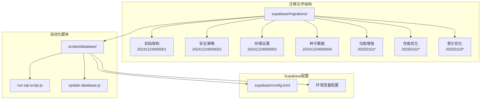
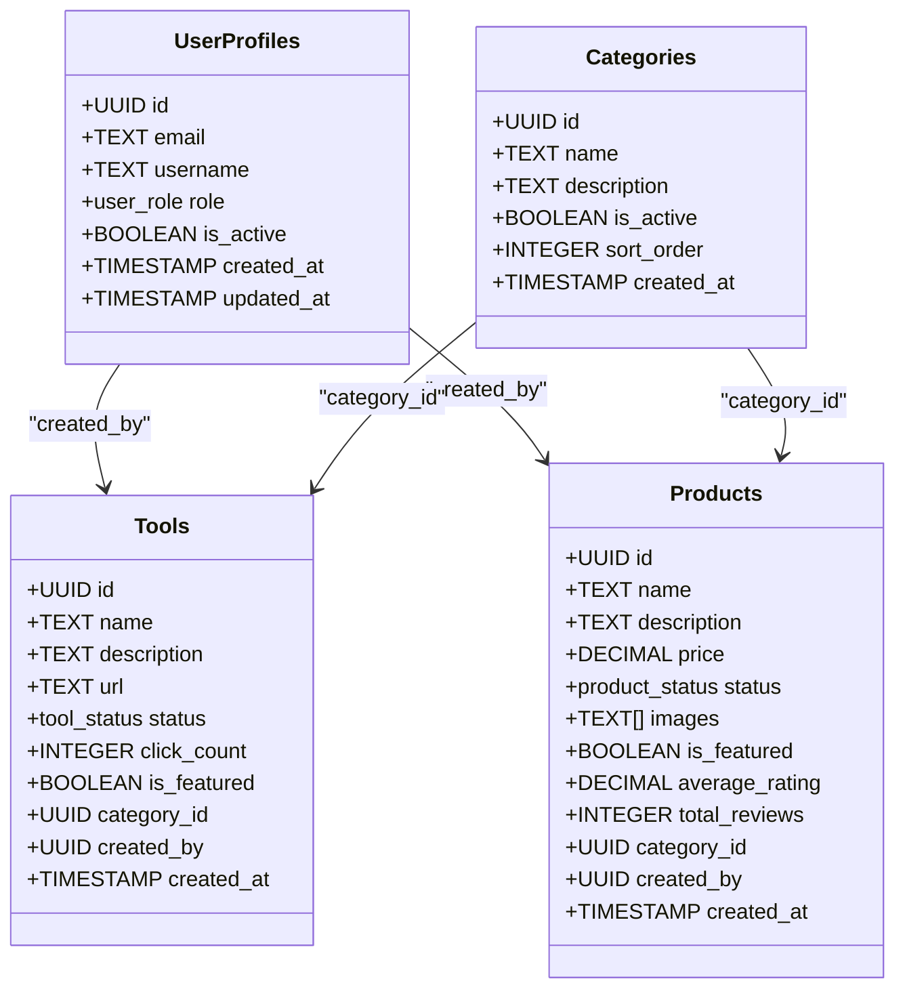
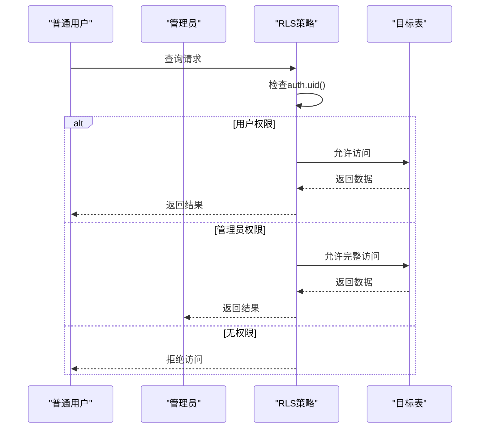
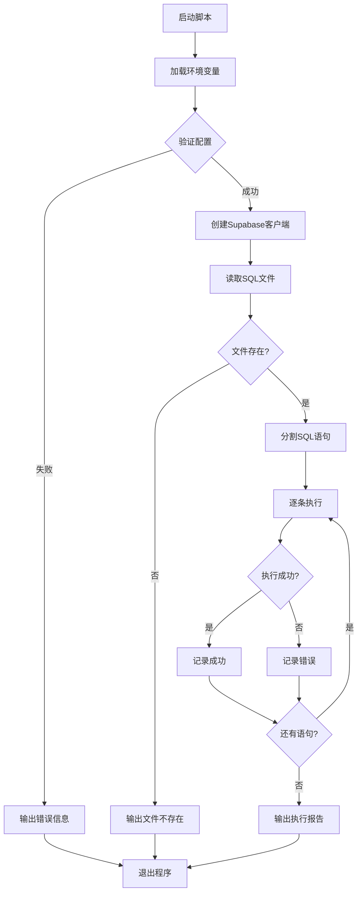
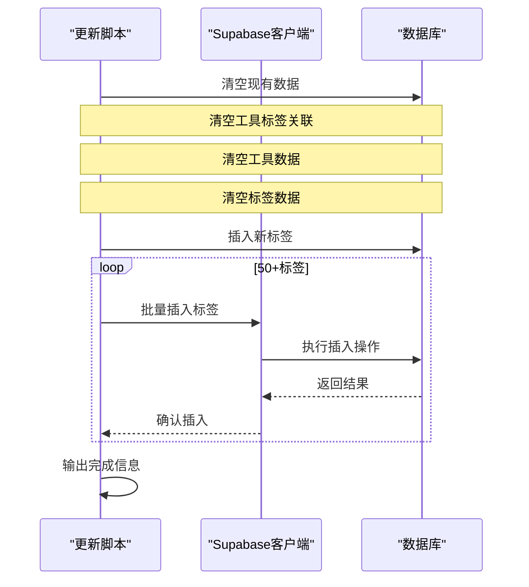
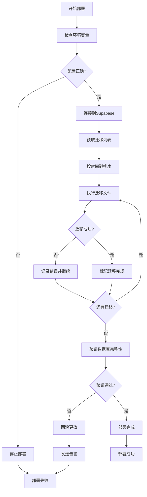

# 数据库迁移管理

<cite>
**本文档中引用的文件**
- [20241224000001_initial_schema.sql](file://supabase/migrations/20241224000001_initial_schema.sql)
- [20241224000002_rls_policies.sql](file://supabase/migrations/20241224000002_rls_policies.sql)
- [20241224000003_storage_setup.sql](file://supabase/migrations/20241224000003_storage_setup.sql)
- [20250102000001_fix_rls_performance.sql](file://supabase/migrations/20250102000001_fix_rls_performance.sql)
- [20250103000001_add_performance_indexes.sql](file://supabase/migrations/20250103000001_add_performance_indexes.sql)
- [run-sql-script.js](file://scripts/database/run-sql-script.js)
- [update-database.js](file://scripts/database/update-database.js)
</cite>

## 目录
1. [简介](#简介)
2. [项目结构概览](#项目结构概览)
3. [核心迁移文件分析](#核心迁移文件分析)
4. [迁移脚本架构](#迁移脚本架构)
5. [自动化部署流程](#自动化部署流程)
6. [最佳实践指南](#最佳实践指南)
7. [故障排除指南](#故障排除指南)
8. [总结](#总结)

## 简介

本文档详细介绍了基于Supabase的版本化数据库迁移管理系统。该系统采用时间戳命名规范的SQL迁移文件，配合JavaScript自动化脚本，实现了完整的数据库版本控制、安全策略配置、存储桶管理和性能优化功能。

系统的核心特点包括：
- 基于时间戳的迁移文件命名规范
- 完整的安全策略(RLS)配置
- 多层次的存储桶权限管理
- 自动化的性能索引优化
- 可靠的回滚和验证机制

## 项目结构概览



**图表来源**
- [20241224000001_initial_schema.sql](file://supabase/migrations/20241224000001_initial_schema.sql#L1-L288)
- [run-sql-script.js](file://scripts/database/run-sql-script.js#L1-L101)
- [update-database.js](file://scripts/database/update-database.js#L1-L305)

## 核心迁移文件分析

### 初始架构迁移 (20241224000001)

这是整个数据库的基础架构，包含了完整的表结构定义和基本索引。



**图表来源**
- [20241224000001_initial_schema.sql](file://supabase/migrations/20241224000001_initial_schema.sql#L30-L288)

**节来源**
- [20241224000001_initial_schema.sql](file://supabase/migrations/20241224000001_initial_schema.sql#L1-L288)

### 安全策略迁移 (20241224000002)

这一层实现了基于行级安全(RLS)的访问控制，确保数据的安全性和权限分离。



**图表来源**
- [20241224000002_rls_policies.sql](file://supabase/migrations/20241224000002_rls_policies.sql#L1-L296)

**节来源**
- [20241224000002_rls_policies.sql](file://supabase/migrations/20241224000002_rls_policies.sql#L1-L296)

### 存储桶设置迁移 (20241224000003)

配置了多个存储桶及其相应的访问策略，支持不同类型的文件存储需求。

**节来源**
- [20241224000003_storage_setup.sql](file://supabase/migrations/20241224000003_storage_setup.sql#L1-L129)

### 性能优化迁移系列

#### RLS性能优化 (20250102000001)

修复了RLS策略中的性能问题，解决了`auth_rls_initplan`和`multiple_permissive_policies`警告。

```mermaid
flowchart TD
A[开始性能优化] --> B[检查RLS策略]
B --> C{发现性能问题?}
C --> |是| D[重构策略语法]
C --> |否| E[检查重复策略]
D --> F[使用select(auth.uid())替代auth.uid()]
F --> G[重新创建策略]
G --> H[验证修复结果]
E --> I{发现重复策略?}
I --> |是| J[删除冗余策略]
I --> |否| H
J --> H
H --> K[完成优化]
```

**图表来源**
- [20250102000001_fix_rls_performance.sql](file://supabase/migrations/20250102000001_fix_rls_performance.sql#L1-L231)

**节来源**
- [20250102000001_fix_rls_performance.sql](file://supabase/migrations/20250102000001_fix_rls_performance.sql#L1-L231)

#### 索引性能优化 (20250103000001)

添加了全面的索引策略，包括全文搜索索引、复合索引和部分索引。

**节来源**
- [20250103000001_add_performance_indexes.sql](file://supabase/migrations/20250103000001_add_performance_indexes.sql#L1-L353)

## 迁移脚本架构

### run-sql-script.js 脚本分析

这是一个通用的SQL脚本执行器，支持单个SQL文件的批量执行。



**图表来源**
- [run-sql-script.js](file://scripts/database/run-sql-script.js#L1-L101)

**节来源**
- [run-sql-script.js](file://scripts/database/run-sql-script.js#L1-L101)

### update-database.js 脚本分析

专门用于更新数据库数据的脚本，支持标签数据的批量导入。



**图表来源**
- [update-database.js](file://scripts/database/update-database.js#L1-L305)

**节来源**
- [update-database.js](file://scripts/database/update-database.js#L1-L305)

## 自动化部署流程

### 迁移执行顺序

```mermaid
gantt
title 数据库迁移执行时间线
dateFormat X
axisFormat %s
section 第一阶段 - 基础架构
初始架构 :20241224000001, 0, 1
安全策略 :20241224000002, 1, 2
存储设置 :20241224000003, 2, 3
种子数据 :20241224000004, 3, 4
section 第二阶段 - 功能增强
用户反馈 :20241227000001, 4, 5
架构修复 :20250101000002, 5, 6
分类合并 :20250101000003, 6, 7
订单地址 :20250101000004, 7, 8
section 第三阶段 - 性能优化
RLS性能优化 :20250102000001, 8, 9
索引优化 :20250103000001, 9, 10
结构修复 :20250103000002, 10, 11
```



### 执行流程图



## 最佳实践指南

### 本地开发环境同步

1. **备份策略**
   ```bash
   # 导出生产数据库结构
   supabase db dump --schema-only > backup/schema.sql
   
   # 导出生产数据
   supabase db dump --data-only > backup/data.sql
   ```

2. **验证步骤**
   ```bash
   # 在本地验证迁移
   node scripts/database/run-sql-script.js supabase/migrations/20250103000001_add_performance_indexes.sql
   
   # 验证RLS策略
   psql -h localhost -U postgres -d mydb -c "\dp"
   ```

3. **回滚策略**
   ```bash
   # 使用Supabase CLI回滚
   supabase db reset
   
   # 或手动执行回滚脚本
   node scripts/database/run-sql-script.js scripts/database/rollback.sql
   ```

### 迁移文件命名规范

- **格式**: `YYYYMMDDHHIISS_description.sql`
- **示例**: `20250103000001_add_performance_indexes.sql`
- **规则**:
  - 时间戳精确到秒
  - 描述使用下划线分隔的小写字母
  - 必须以数字开头

### 安全最佳实践

1. **RLS策略验证**
   ```sql
   -- 检查所有表的RLS状态
   SELECT schemaname, tablename, rls_enabled, rls_forced 
   FROM pg_tables 
   WHERE schemaname = 'public';
   ```

2. **权限审计**
   ```sql
   -- 检查所有策略
   SELECT * FROM pg_policies WHERE schemaname = 'public';
   ```

3. **存储桶权限检查**
   ```sql
   -- 验证存储桶配置
   SELECT * FROM storage.buckets;
   
   -- 检查存储策略
   SELECT * FROM storage.policies;
   ```

## 故障排除指南

### 常见问题及解决方案

1. **迁移执行失败**
   ```bash
   # 查看具体错误
   supabase db logs
   
   # 检查SQL语法
   node scripts/database/run-sql-script.js --dry-run migration.sql
   ```

2. **RLS策略冲突**
   ```sql
   -- 检查策略冲突
   SELECT * FROM pg_policies 
   WHERE schemaname = 'public'
   AND policyname LIKE '%duplicate%';
   
   -- 删除冲突策略
   DROP POLICY IF EXISTS "冲突策略名" ON 表名;
   ```

3. **索引创建失败**
   ```sql
   -- 检查索引冲突
   SELECT * FROM pg_indexes 
   WHERE schemaname = 'public'
   AND indexname LIKE 'idx_%';
   
   -- 删除冲突索引
   DROP INDEX IF EXISTS 冲突索引名;
   ```

### 监控和维护

1. **性能监控**
   ```sql
   -- 监控查询性能
   SELECT query, mean_time, calls 
   FROM pg_stat_statements 
   ORDER BY mean_time DESC LIMIT 10;
   ```

2. **定期维护**
   ```sql
   -- 重建索引
   REINDEX DATABASE mydb;
   
   -- 更新统计信息
   ANALYZE;
   ```

**节来源**
- [20241224000001_initial_schema.sql](file://supabase/migrations/20241224000001_initial_schema.sql#L250-L288)
- [20241224000002_rls_policies.sql](file://supabase/migrations/20241224000002_rls_policies.sql#L250-L296)

## 总结

本文档详细介绍了基于Supabase的数据库迁移管理系统，涵盖了从基础架构到性能优化的完整流程。该系统具有以下优势：

1. **模块化设计**: 每个迁移文件专注于特定的功能领域
2. **自动化程度高**: JavaScript脚本提供了可靠的执行和验证机制
3. **安全性强**: 完整的RLS策略和存储桶权限管理
4. **性能优化**: 全面的索引策略和查询优化
5. **可维护性**: 清晰的命名规范和完善的回滚机制

通过遵循本文档中的最佳实践，开发团队可以确保数据库迁移过程的安全性、可靠性和可追溯性，为应用的稳定运行奠定坚实的基础。