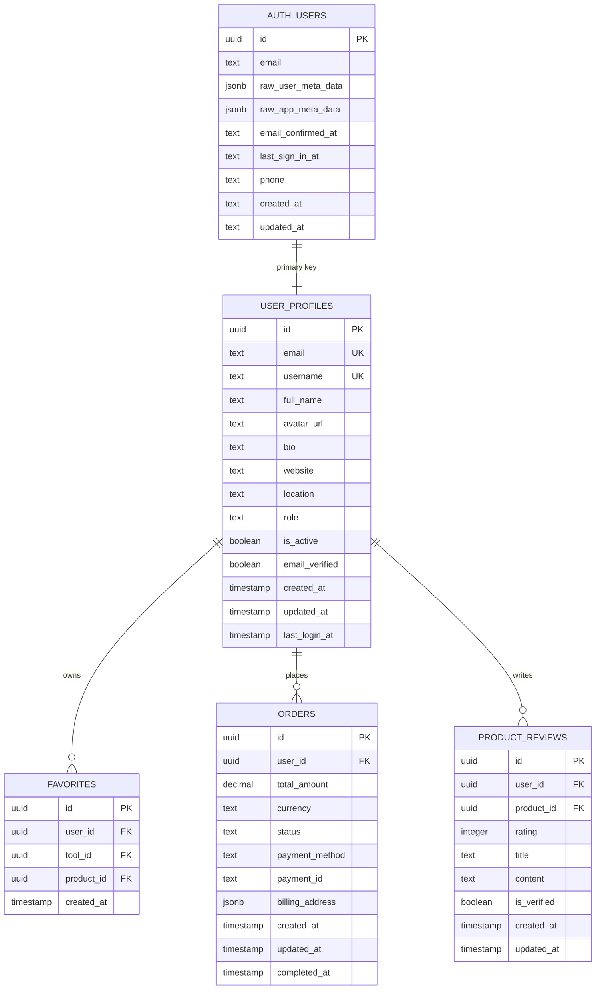
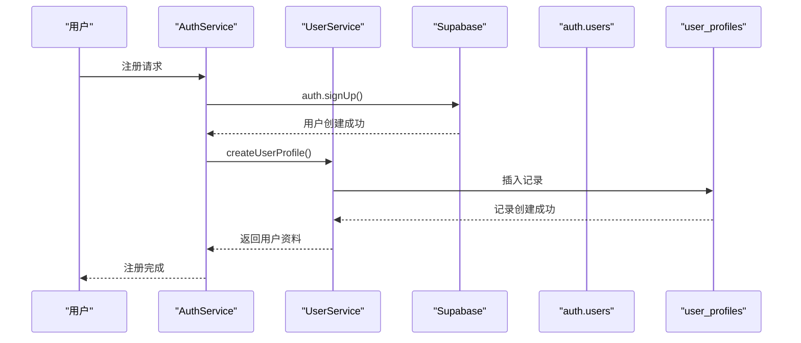
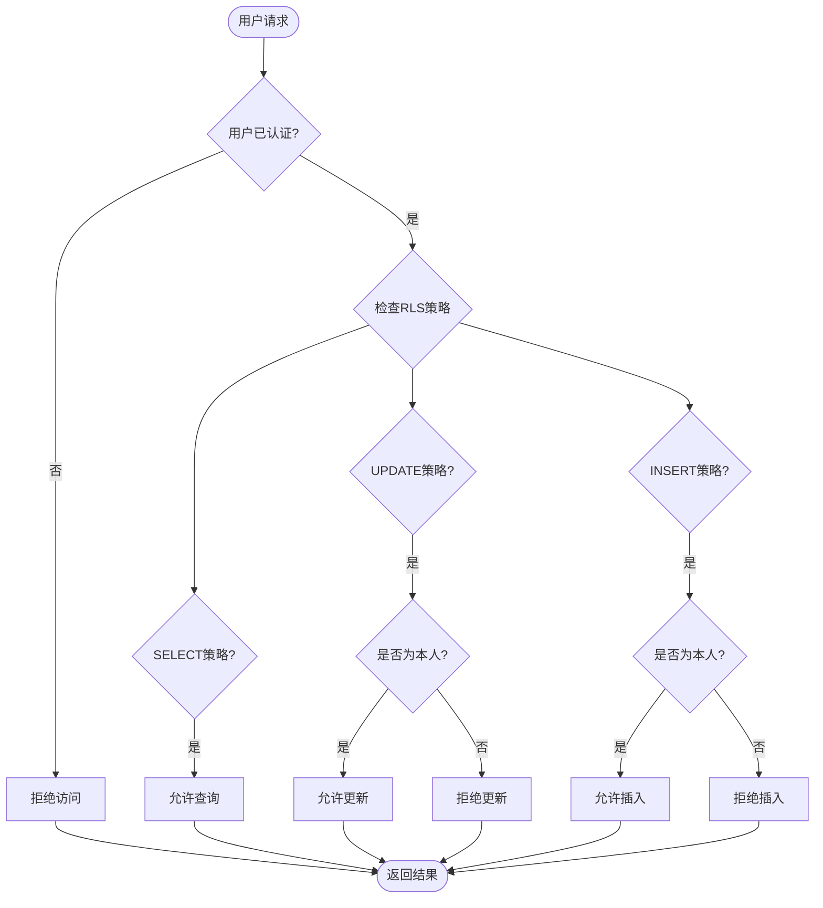
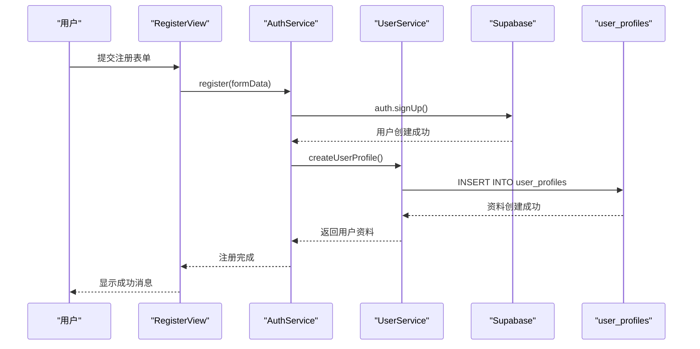
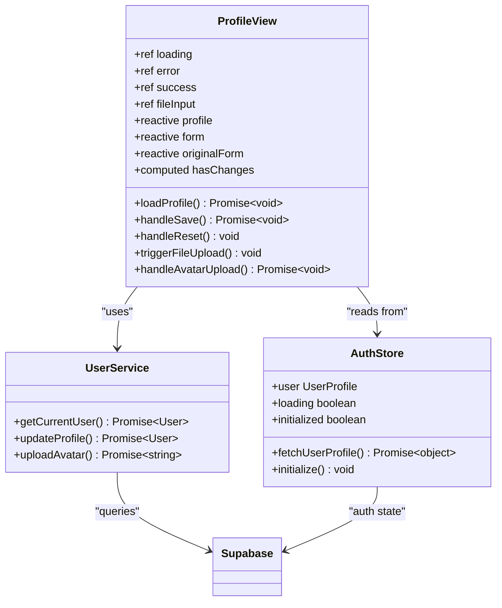

# 用户资料模型 (UserProfiles)

<cite>
**本文档引用的文件**
- [src/types/database.ts](file://src/types/database.ts)
- [src/types/global.d.ts](file://src/types/global.d.ts)
- [src/lib/supabase-schema.ts](file://src/lib/supabase-schema.ts)
- [src/lib/supabaseClient.ts](file://src/lib/supabaseClient.ts)
- [src/services/authService.ts](file://src/services/authService.ts)
- [src/services/userService.ts](file://src/services/userService.ts)
- [src/stores/auth.ts](file://src/stores/auth.ts)
- [src/views/user/ProfileView.vue](file://src/views/user/ProfileView.vue)
- [supabase/migrations/20241224000001_initial_schema.sql](file://supabase/migrations/20241224000001_initial_schema.sql)
- [supabase/migrations/20241224000002_rls_policies.sql](file://supabase/migrations/20241224000002_rls_policies.sql)
- [scripts/database/test-supabase-connection.js](file://scripts/database/test-supabase-connection.js)
</cite>

## 目录
1. [简介](#简介)
2. [表结构设计](#表结构设计)
3. [字段定义详解](#字段定义详解)
4. [与Supabase auth.users的集成](#与supabase-authusers的集成)
5. [RLS策略配置](#rls策略配置)
6. [TypeScript类型映射](#typescript类型映射)
7. [用户注册流程](#用户注册流程)
8. [数据库操作服务](#数据库操作服务)
9. [前端组件集成](#前端组件集成)
10. [性能优化与最佳实践](#性能优化与最佳实践)
11. [故障排除指南](#故障排除指南)
12. [总结](#总结)

## 简介

UserProfiles表是Advanced Tools Navigation应用的核心数据模型之一，它扩展了Supabase默认的auth.users表，为用户提供更丰富的个人资料信息。该表采用外键约束与Supabase的用户认证系统紧密集成，并通过行级安全(RLS)策略确保数据的安全性和访问控制。

## 表结构设计



**图表来源**
- [supabase/migrations/20241224000001_initial_schema.sql](file://supabase/migrations/20241224000001_initial_schema.sql#L30-L50)
- [src/lib/supabase-schema.ts](file://src/lib/supabase-schema.ts#L280-L304)

**章节来源**
- [supabase/migrations/20241224000001_initial_schema.sql](file://supabase/migrations/20241224000001_initial_schema.sql#L30-L50)
- [src/lib/supabase-schema.ts](file://src/lib/supabase-schema.ts#L280-L304)

## 字段定义详解

### 核心字段

**id (UUID)**: 主键，与Supabase auth.users表的id字段建立外键关系，确保一对一映射。

**email (TEXT)**: 用户邮箱地址，具有UNIQUE约束，与auth.users.email保持同步。

**username (TEXT)**: 用户名，具有UNIQUE约束，允许为空但推荐设置。

**full_name (TEXT)**: 用户全名，存储用户的实际姓名信息。

**avatar_url (TEXT)**: 头像图片URL，指向Supabase Storage中的文件路径。

### 个人资料字段

**bio (TEXT)**: 个人简介，支持多行文本描述用户信息。

**website (TEXT)**: 个人网站链接，格式为URL。

**location (TEXT)**: 地理位置信息，存储用户所在城市或地区。

### 权限与状态字段

**role (ENUM)**: 用户角色，可选值包括'user'、'admin'、'super_admin'。

**is_active (BOOLEAN)**: 用户账户激活状态，默认为true。

**email_verified (BOOLEAN)**: 邮箱验证状态，默认为false。

### 时间戳字段

**created_at (TIMESTAMP WITH TIME ZONE)**: 记录创建时间，默认为NOW()。

**updated_at (TIMESTAMP WITH TIME ZONE)**: 记录最后更新时间，默认为NOW()。

**last_login_at (TIMESTAMP WITH TIME ZONE)**: 最后登录时间，用于统计分析。

**章节来源**
- [supabase/migrations/20241224000001_initial_schema.sql](file://supabase/migrations/20241224000001_initial_schema.sql#L30-L50)
- [src/lib/supabase-schema.ts](file://src/lib/supabase-schema.ts#L280-L304)

## 与Supabase auth.users的集成

### 外键约束机制

UserProfiles表通过外键约束与Supabase的auth.users表建立了强关联：

```sql
CREATE TABLE IF NOT EXISTS user_profiles (
    id UUID REFERENCES auth.users(id) ON DELETE CASCADE PRIMARY KEY,
    email TEXT UNIQUE NOT NULL,
    -- 其他字段...
);
```

这种设计确保：
- 每个用户都有唯一的资料记录
- 用户删除时自动级联删除其资料
- 避免孤立的用户资料记录

### 自动创建机制

当用户通过AuthService注册时，系统会自动创建对应的UserProfiles记录：

```typescript
// 注册时自动创建用户资料
const userProfile = await UserService.createUserProfile(
  data.user.id,
  userData.email,
);
```

### 数据同步策略



**图表来源**
- [src/services/authService.ts](file://src/services/authService.ts#L50-L70)
- [src/services/userService.ts](file://src/services/userService.ts#L120-L140)

**章节来源**
- [src/services/authService.ts](file://src/services/authService.ts#L50-L70)
- [src/services/userService.ts](file://src/services/userService.ts#L120-L140)

## RLS策略配置

### 行级安全策略概述

RLS策略确保只有授权用户才能访问和修改UserProfiles数据：

```sql
-- 启用RLS
ALTER TABLE user_profiles ENABLE ROW LEVEL SECURITY;

-- 用户可以查看所有公开资料
CREATE POLICY "用户可以查看所有公开资料" ON user_profiles
    FOR SELECT USING (true);

-- 用户可以更新自己的资料
CREATE POLICY "用户可以更新自己的资料" ON user_profiles
    FOR UPDATE USING (auth.uid() = id);

-- 用户可以插入自己的资料
CREATE POLICY "用户可以插入自己的资料" ON user_profiles
    FOR INSERT WITH CHECK (auth.uid() = id);
```

### 策略执行流程



**图表来源**
- [supabase/migrations/20241224000002_rls_policies.sql](file://supabase/migrations/20241224000002_rls_policies.sql#L15-L25)

### 角色权限控制

RLS策略支持基于用户角色的细粒度权限控制：

```sql
-- 管理员可以管理所有用户资料
CREATE POLICY "管理员可以管理所有用户资料" ON user_profiles
    FOR ALL USING (
        EXISTS (
            SELECT 1 FROM user_profiles 
            WHERE id = auth.uid() 
            AND role IN ('admin', 'super_admin')
        )
    );
```

**章节来源**
- [supabase/migrations/20241224000002_rls_policies.sql](file://supabase/migrations/20241224000002_rls_policies.sql#L15-L25)

## TypeScript类型映射

### 数据库类型定义

```typescript
export interface UserProfiles {
  id: string;
  email: string;
  username?: string | null;
  full_name?: string | null;
  avatar_url?: string | null;
  bio?: string | null;
  website?: string | null;
  location?: string | null;
  role?: string | null;
  is_active?: boolean;
  email_verified?: boolean;
  created_at?: string;
  updated_at?: string;
  last_login_at?: string | null;
}
```

### 扩展用户类型

```typescript
export type UserProfile = SupabaseUser & {
  username: string;
  avatar_url: string;
  role: "user" | "admin" | "super_admin";
};
```

### 类型安全的数据库操作

```typescript
// 类型安全的查询
const { data, error } = await supabase
  .from("user_profiles")
  .select("*")
  .eq("id", userId)
  .single<UserProfile>();
```

**章节来源**
- [src/lib/supabase-schema.ts](file://src/lib/supabase-schema.ts#L280-L304)
- [src/stores/auth.ts](file://src/stores/auth.ts#L10-L15)

## 用户注册流程

### 注册触发逻辑



**图表来源**
- [src/services/authService.ts](file://src/services/authService.ts#L50-L70)
- [src/services/userService.ts](file://src/services/userService.ts#L120-L140)

### 注册服务实现

```typescript
static async register(userData: RegisterForm): Promise<{ user: User; session: AuthSession }> {
  try {
    // 1. 检查用户名可用性
    if (userData.username) {
      const isUsernameAvailable = await UserService.checkUsernameAvailability(userData.username);
      if (!isUsernameAvailable) {
        throw new Error("用户名已被使用");
      }
    }

    // 2. 创建Supabase用户
    const { data, error } = await supabase.auth.signUp({
      email: userData.email,
      password: userData.password,
      options: {
        data: {
          full_name: userData.full_name,
          username: userData.username,
        },
      },
    });

    // 3. 创建用户资料
    const userProfile = await UserService.createUserProfile(data.user.id, userData.email);

    // 4. 返回完整用户信息
    return {
      user: userProfile,
      session: data.session,
    };
  } catch (error) {
    throw ErrorHandler.handleApiError(error);
  }
}
```

**章节来源**
- [src/services/authService.ts](file://src/services/authService.ts#L50-L70)

## 数据库操作服务

### UserService核心功能

UserService提供了完整的UserProfiles操作接口：

```typescript
export class UserService {
  // 获取当前用户信息
  static async getCurrentUser(): Promise<User | null> {
    const { data: { user } } = await supabase.auth.getUser();
    
    if (!user) return null;
    
    const { data: profile, error } = await supabase
      .from("user_profiles")
      .select("*")
      .eq("id", user.id)
      .single();
    
    return this.transformUser(profile);
  }

  // 创建用户资料
  static async createUserProfile(userId: string, email: string): Promise<User> {
    const profileData: UserProfileInsert = {
      id: userId,
      email,
      role: "user",
      is_active: true,
      email_verified: false,
    };

    const { data, error } = await supabase
      .from("user_profiles")
      .insert(profileData)
      .select("*")
      .single();

    return this.transformUser(data);
  }

  // 更新用户资料
  static async updateProfile(userId: string, profileData: ProfileForm): Promise<User> {
    const updateData: UserProfileUpdate = {
      full_name: profileData.full_name,
      username: profileData.username,
      bio: profileData.bio,
      website: profileData.website,
      location: profileData.location,
      updated_at: new Date().toISOString(),
    };

    // 处理头像上传
    if (profileData.avatar) {
      const avatarUrl = await this.uploadAvatar(userId, profileData.avatar);
      updateData.avatar_url = avatarUrl;
    }

    const { data, error } = await supabase
      .from("user_profiles")
      .update(updateData)
      .eq("id", userId)
      .select("*")
      .single();

    return this.transformUser(data);
  }
}
```

### 头像上传功能

```typescript
static async uploadAvatar(userId: string, file: File): Promise<string> {
  const fileExt = file.name.split(".").pop();
  const fileName = `${userId}-${Date.now()}.${fileExt}`;
  const filePath = `avatars/${fileName}`;

  // 删除旧头像
  const { data: oldFiles } = await supabase.storage
    .from("avatars")
    .list("", { search: userId });

  if (oldFiles && oldFiles.length > 0) {
    const filesToRemove = oldFiles.map((file) => file.name);
    await supabase.storage.from("avatars").remove(filesToRemove);
  }

  // 上传新头像
  const { error: uploadError } = await supabase.storage
    .from("avatars")
    .upload(filePath, file);

  if (uploadError) throw uploadError;

  const { data } = supabase.storage.from("avatars").getPublicUrl(filePath);
  return data.publicUrl;
}
```

**章节来源**
- [src/services/userService.ts](file://src/services/userService.ts#L15-L140)

## 前端组件集成

### ProfileView组件架构



**图表来源**
- [src/views/user/ProfileView.vue](file://src/views/user/ProfileView.vue#L1-L50)
- [src/services/userService.ts](file://src/services/userService.ts#L15-L50)

### 组件状态管理

```typescript
// 响应式状态
const loading = ref(false);
const error = ref<string | null>(null);
const success = ref(false);
const fileInput = ref<HTMLInputElement>();

const profile = ref({
  id: "",
  email: "",
  username: "",
  fullName: "",
  avatarUrl: "",
  bio: "",
  website: "",
  location: "",
});

const form = ref({
  fullName: "",
  username: "",
  email: "",
  bio: "",
  website: "",
  location: "",
});
```

### 表单验证与提交

```typescript
// 计算属性：检测表单是否有变更
const hasChanges = computed(() => {
  return Object.keys(form.value).some((key) => {
    return form.value[key as keyof typeof form.value] !== 
           originalForm.value[key as keyof typeof originalForm.value];
  });
});

// 保存表单
const handleSave = async () => {
  try {
    loading.value = true;
    error.value = null;
    success.value = false;

    // 更新用户资料
    await UserService.updateProfile(form.value);

    // 更新本地状态
    profile.value = { ...profile.value, ...form.value };
    originalForm.value = { ...form.value };
    success.value = true;

    setTimeout(() => {
      success.value = false;
    }, 3000);
  } catch (err) {
    error.value = err instanceof Error ? err.message : "保存失败，请重试";
  } finally {
    loading.value = false;
  }
};
```

**章节来源**
- [src/views/user/ProfileView.vue](file://src/views/user/ProfileView.vue#L100-L200)

## 性能优化与最佳实践

### 索引策略

UserProfiles表的关键索引设计：

```sql
-- 创建索引提高查询性能
CREATE INDEX idx_user_profiles_email ON user_profiles(email);
CREATE INDEX idx_user_profiles_username ON user_profiles(username);
CREATE INDEX idx_user_profiles_role ON user_profiles(role);
CREATE INDEX idx_user_profiles_created_at ON user_profiles(created_at);
```

### 触发器优化

```sql
-- 创建更新时间戳的函数
CREATE OR REPLACE FUNCTION update_updated_at_column()
RETURNS TRIGGER AS $$
BEGIN
    NEW.updated_at = NOW();
    RETURN NEW;
END;
$$ language 'plpgsql';

-- 为需要的表添加更新时间戳触发器
CREATE TRIGGER update_user_profiles_updated_at 
BEFORE UPDATE ON user_profiles 
FOR EACH ROW EXECUTE FUNCTION update_updated_at_column();
```

### 查询优化建议

1. **使用适当的索引**：确保常用查询字段有合适的索引
2. **限制查询范围**：避免SELECT *，只查询需要的字段
3. **批量操作**：对于大量数据操作，考虑使用批量处理
4. **缓存策略**：对频繁访问的用户资料实施缓存

**章节来源**
- [supabase/migrations/20241224000001_initial_schema.sql](file://supabase/migrations/20241224000001_initial_schema.sql#L250-L280)

## 故障排除指南

### 常见问题诊断

#### 1. Profile不同步问题

**症状**：用户注册后无法看到个人资料

**排查步骤**：
```javascript
// 使用测试脚本检查连接
node scripts/database/test-supabase-connection.js

// 检查用户是否存在
const { data, error } = await supabase
  .from("user_profiles")
  .select("*")
  .eq("id", userId)
  .single();
```

**解决方案**：
- 检查RLS策略配置
- 验证外键约束
- 确认用户认证状态

#### 2. 头像上传失败

**症状**：头像上传后无法显示

**排查步骤**：
```typescript
// 检查Storage权限
const { data: buckets } = await supabase.storage.listBuckets();
console.log(buckets);

// 检查文件权限
const { data: files } = await supabase.storage
  .from("avatars")
  .list(userId);
```

**解决方案**：
- 确认Storage桶权限
- 检查文件URL有效性
- 验证CORS配置

#### 3. RLS策略问题

**症状**：用户无法访问自己的资料

**排查步骤**：
```sql
-- 检查RLS策略
SELECT * FROM pg_policies WHERE tablename = 'user_profiles';

-- 测试策略
SET ROLE authenticated;
SELECT * FROM user_profiles WHERE id = current_setting('request.jwt.claim.sub');
```

**解决方案**：
- 重新创建RLS策略
- 检查用户角色配置
- 验证JWT令牌

### 修复脚本使用

```javascript
// test-supabase-connection.js 使用示例
async function testConnection() {
  try {
    // 测试基本连接
    const { data: categories, error: categoriesError } = await supabase
      .from("categories")
      .select("*")
      .eq("is_active", true);

    // 测试用户资料查询
    const { data: profiles, error: profilesError } = await supabase
      .from("user_profiles")
      .select("*")
      .eq("id", userId);

    console.log("✅ 连接测试成功");
  } catch (error) {
    console.error("❌ 连接测试失败:", error);
  }
}
```

**章节来源**
- [scripts/database/test-supabase-connection.js](file://scripts/database/test-supabase-connection.js#L20-L80)

## 总结

UserProfiles数据模型是Advanced Tools Navigation应用的核心组成部分，它通过以下关键特性确保了系统的完整性、安全性和可扩展性：

### 核心优势

1. **数据完整性**：通过外键约束确保用户资料与认证系统的同步
2. **安全性**：RLS策略提供细粒度的访问控制
3. **类型安全**：完整的TypeScript类型定义确保编译时检查
4. **性能优化**：合理的索引设计和触发器机制提升查询效率
5. **用户体验**：自动化的资料创建和实时的状态更新

### 技术亮点

- **无缝集成**：与Supabase生态系统的深度整合
- **自动同步**：注册流程中的自动化资料创建
- **灵活扩展**：支持多种用户角色和权限级别
- **错误处理**：完善的异常处理和用户反馈机制

### 最佳实践建议

1. **定期备份**：确保UserProfiles数据的定期备份
2. **监控告警**：设置数据库性能和错误监控
3. **权限审计**：定期审查RLS策略的有效性
4. **容量规划**：根据用户增长预测存储需求
5. **安全更新**：及时更新Supabase和相关依赖版本

通过遵循这些指导原则和最佳实践，开发者可以构建一个稳定、安全且高性能的用户资料管理系统，为用户提供优质的数字体验。