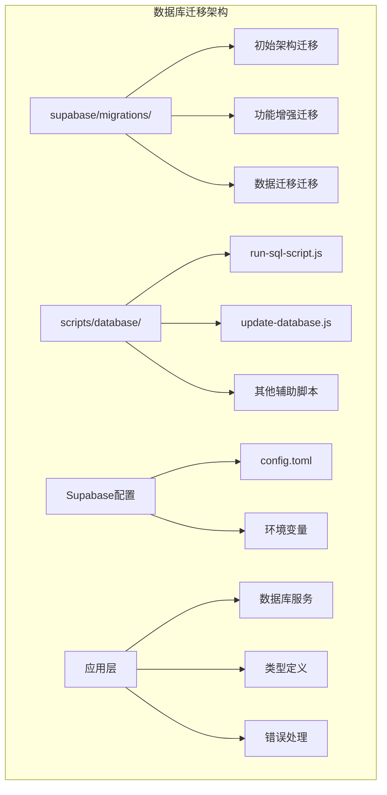
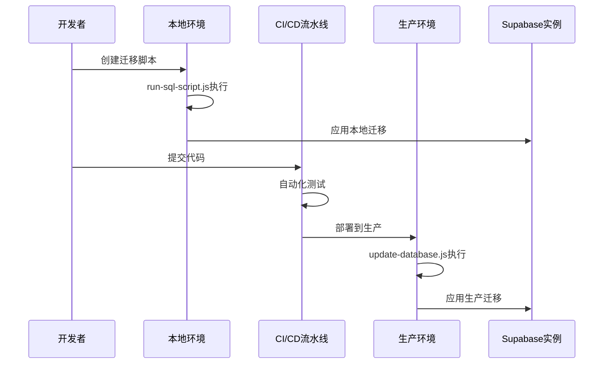
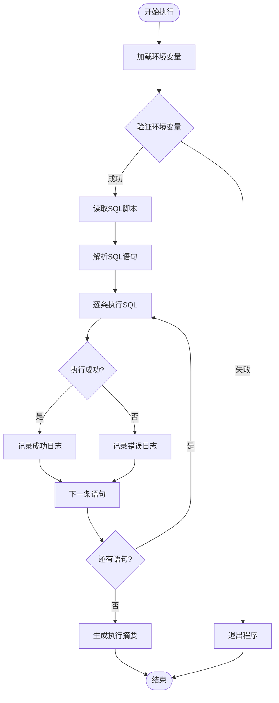
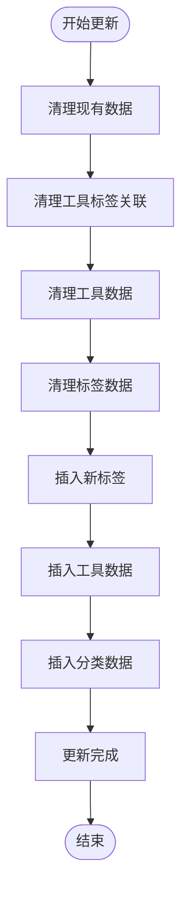
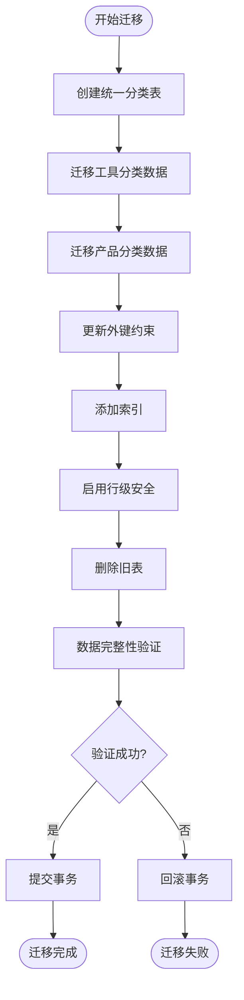
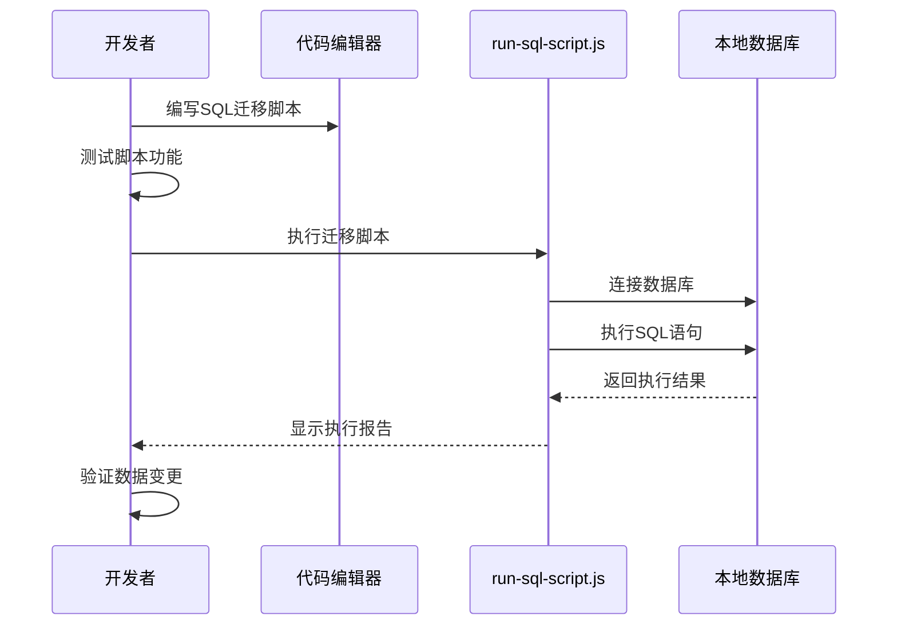
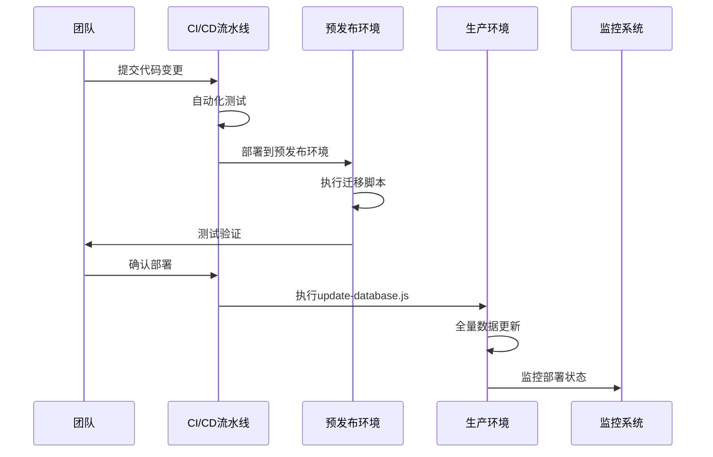
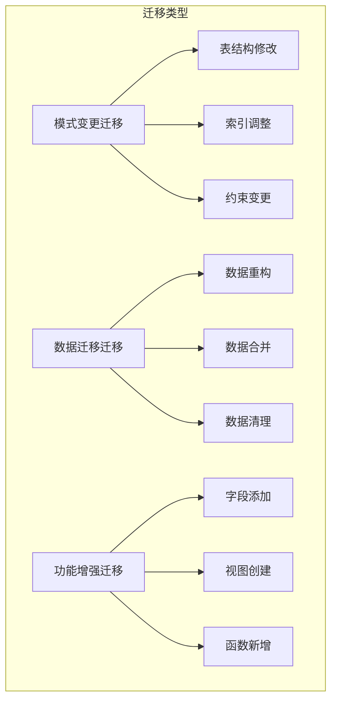
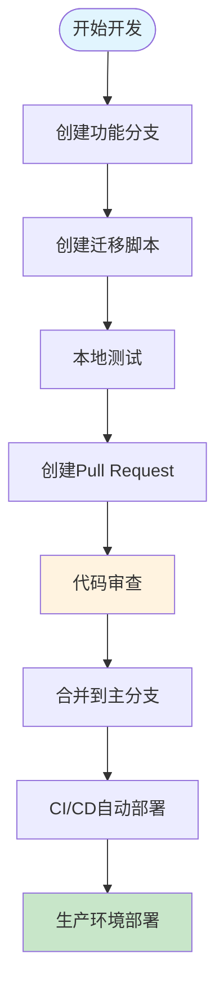

# 数据库迁移管理

<cite>
**本文档中引用的文件**
- [run-sql-script.js](file://scripts/database/run-sql-script.js)
- [update-database.js](file://scripts/database/update-database.js)
- [20241224000001_initial_schema.sql](file://supabase/migrations/20241224000001_initial_schema.sql)
- [20250101000003_merge_categories.sql](file://supabase/migrations/20250101000003_merge_categories.sql)
- [20250101000004_add_billing_address_to_orders.sql](file://supabase/migrations/20250101000004_add_billing_address_to_orders.sql)
- [supabase_complete_deploy.sql](file://scripts/database/supabase_complete_deploy.sql)
- [config.toml](file://supabase/config.toml)
</cite>

## 目录
1. [简介](#简介)
2. [项目结构概览](#项目结构概览)
3. [迁移系统架构](#迁移系统架构)
4. [核心迁移组件](#核心迁移组件)
5. [迁移脚本分析](#迁移脚本分析)
6. [迁移工作流程](#迁移工作流程)
7. [数据迁移策略](#数据迁移策略)
8. [团队协作最佳实践](#团队协作最佳实践)
9. [故障排除指南](#故障排除指南)
10. [总结](#总结)

## 简介

本项目采用基于Supabase的版本化数据库迁移工作流，通过时间戳命名的SQL脚本实现数据库Schema的可追溯演进。该系统提供了完整的迁移管理解决方案，包括本地开发环境和CI/CD环境中的自动化部署能力。

数据库迁移系统的核心特点：
- **时间戳命名规范**：所有迁移脚本按照YYYYMMDDHHMMSS格式命名，确保执行顺序的确定性
- **幂等性设计**：每个迁移脚本都具备幂等性，支持重复执行而不产生副作用
- **事务安全保障**：关键操作使用事务包装，确保数据一致性
- **回滚机制**：提供数据迁移回滚策略，降低变更风险
- **团队协作支持**：通过有序的迁移序列避免团队协作中的冲突

## 项目结构概览



**图表来源**
- [config.toml](file://supabase/config.toml#L1-L128)
- [run-sql-script.js](file://scripts/database/run-sql-script.js#L1-L101)

**章节来源**
- [config.toml](file://supabase/config.toml#L1-L128)

## 迁移系统架构

### 整体架构设计



**图表来源**
- [run-sql-script.js](file://scripts/database/run-sql-script.js#L25-L85)
- [update-database.js](file://scripts/database/update-database.js#L25-L50)

### 迁移脚本组织结构

迁移脚本按照以下层次结构组织：

1. **初始架构迁移** (`20241224*`)
   - 基础表结构创建
   - 枚举类型定义
   - 基础索引建立

2. **功能增强迁移** (`20250101*`)
   - 表结构调整
   - 新功能字段添加
   - 性能优化

3. **数据迁移迁移** (`20250101*`)
   - 数据重构
   - 数据合并
   - 数据清理

**章节来源**
- [20241224000001_initial_schema.sql](file://supabase/migrations/20241224000001_initial_schema.sql#L1-L288)
- [20250101000003_merge_categories.sql](file://supabase/migrations/20250101000003_merge_categories.sql#L1-L135)

## 核心迁移组件

### run-sql-script.js - 单文件迁移执行器

该脚本负责在本地开发环境中执行单个SQL迁移脚本，是开发阶段的主要工具。



**图表来源**
- [run-sql-script.js](file://scripts/database/run-sql-script.js#L25-L85)

主要特性：
- **环境变量验证**：确保Supabase连接配置完整
- **SQL语句分割**：智能分割多条SQL语句
- **错误隔离**：单条语句失败不影响后续执行
- **详细日志**：提供每条语句的执行状态

### update-database.js - 全量数据库更新器

该脚本用于生产环境的全量数据库更新，包括数据清理和重新初始化。



**图表来源**
- [update-database.js](file://scripts/database/update-database.js#L25-L150)

**章节来源**
- [run-sql-script.js](file://scripts/database/run-sql-script.js#L1-L101)
- [update-database.js](file://scripts/database/update-database.js#L1-L305)

## 迁移脚本分析

### 初始架构迁移 (20241224000001_initial_schema.sql)

这是系统的第一个迁移脚本，建立了完整的数据库架构基础。

#### 关键特性：
- **幂等性设计**：使用`IF NOT EXISTS`确保重复执行安全
- **扩展依赖**：预创建必需的PostgreSQL扩展
- **枚举类型**：定义系统使用的状态枚举
- **触发器函数**：自动更新时间戳的通用函数
- **索引优化**：为高频查询字段创建索引

#### 核心表结构：
- **用户管理**：`user_profiles` - 用户基本信息和权限
- **分类系统**：`categories` 和 `product_categories` - 工具和产品分类
- **内容管理**：`tools` 和 `products` - 工具和产品数据
- **关系映射**：`tool_tags` - 工具与标签的多对多关系
- **业务逻辑**：`orders`, `payments`, `favorites` - 电商相关功能

### 数据迁移脚本 (20250101000003_merge_categories.sql)

这是一个复杂的数据迁移示例，展示了如何安全地重构数据库结构。



**图表来源**
- [20250101000003_merge_categories.sql](file://supabase/migrations/20250101000003_merge_categories.sql#L1-L135)

#### 迁移策略：
- **渐进式重构**：先创建新表，再迁移数据，最后切换引用
- **事务保护**：整个迁移过程在一个事务中执行
- **数据验证**：迁移完成后进行完整性检查
- **回滚准备**：如果验证失败，自动回滚到原始状态

### 功能增强脚本 (20250101000004_add_billing_address_to_orders.sql)

展示如何安全地添加新字段到现有表中。

#### 特点：
- **条件添加**：使用`IF NOT EXISTS`防止重复添加
- **索引优化**：为新字段创建适当的索引
- **注释说明**：为新字段添加清晰的文档注释
- **验证机制**：迁移后验证字段是否正确添加

**章节来源**
- [20241224000001_initial_schema.sql](file://supabase/migrations/20241224000001_initial_schema.sql#L1-L288)
- [20250101000003_merge_categories.sql](file://supabase/migrations/20250101000003_merge_categories.sql#L1-L135)
- [20250101000004_add_billing_address_to_orders.sql](file://supabase/migrations/20250101000004_add_billing_address_to_orders.sql#L1-L43)

## 迁移工作流程

### 本地开发工作流



**图表来源**
- [run-sql-script.js](file://scripts/database/run-sql-script.js#L25-L85)

### 生产部署工作流



**图表来源**
- [update-database.js](file://scripts/database/update-database.js#L25-L50)

### 迁移执行策略

1. **开发阶段**：使用`run-sql-script.js`执行单个迁移脚本
2. **集成测试**：在预发布环境验证迁移效果
3. **生产部署**：使用`update-database.js`进行全量更新
4. **监控验证**：部署后监控系统性能和数据完整性

## 数据迁移策略

### 迁移类型分类



### 幂等性保证

所有迁移脚本都遵循幂等性原则：

```sql
-- 示例：幂等性检查
CREATE TABLE IF NOT EXISTS categories (
    id UUID DEFAULT uuid_generate_v4() PRIMARY KEY,
    name TEXT NOT NULL
);

-- 示例：枚举类型幂等性
DO $$ 
BEGIN
    IF NOT EXISTS (SELECT 1 FROM pg_type WHERE typname = 'user_role') THEN
        CREATE TYPE user_role AS ENUM ('user', 'admin', 'super_admin');
    END IF;
END $$;
```

### 回滚策略

对于关键数据迁移，实施以下回滚策略：

1. **备份机制**：在执行重大数据迁移前创建备份
2. **事务包装**：使用数据库事务确保原子性
3. **验证检查**：迁移后立即验证数据完整性
4. **手动回滚**：必要时提供手动回滚脚本

**章节来源**
- [20250101000003_merge_categories.sql](file://supabase/migrations/20250101000003_merge_categories.sql#L100-L135)

## 团队协作最佳实践

### 迁移命名规范

- **时间戳格式**：YYYYMMDDHHMMSS
- **描述性命名**：包含迁移目的的简短描述
- **顺序执行**：严格按照时间戳顺序执行

### 冲突避免策略



### 协作检查清单

1. **代码审查**：
   - 验证迁移脚本的幂等性
   - 检查SQL语法正确性
   - 确认数据迁移的安全性

2. **测试验证**：
   - 在本地环境测试迁移
   - 验证数据完整性
   - 检查应用程序兼容性

3. **部署准备**：
   - 确认迁移脚本顺序
   - 准备回滚方案
   - 通知相关团队成员

## 故障排除指南

### 常见问题及解决方案

#### 1. 环境变量缺失

**问题症状**：
```
❌ 缺少必要的环境变量:
  - VITE_SUPABASE_URL
  - SUPABASE_SERVICE_ROLE_KEY
```

**解决方案**：
- 检查`.env`文件配置
- 确认环境变量名称正确
- 验证Supabase服务密钥有效性

#### 2. SQL语法错误

**问题症状**：
```
❌ 语句 1 执行失败: syntax error at or near "CREATE"
```

**解决方案**：
- 检查SQL语法正确性
- 验证PostgreSQL版本兼容性
- 使用数据库客户端测试脚本

#### 3. 数据迁移失败

**问题症状**：
```
RAISE EXCEPTION '数据迁移错误: 存在无效的工具分类引用'
```

**解决方案**：
- 检查源表数据完整性
- 验证目标表结构匹配
- 查看具体错误信息定位问题

### 监控和日志


### 最佳实践建议

1. **充分测试**：在生产环境执行前进行全面测试
2. **逐步部署**：采用蓝绿部署或滚动更新策略
3. **监控告警**：设置关键指标监控和告警
4. **文档维护**：及时更新迁移文档和说明

**章节来源**
- [run-sql-script.js](file://scripts/database/run-sql-script.js#L15-L25)
- [20250101000003_merge_categories.sql](file://supabase/migrations/20250101000003_merge_categories.sql#L100-L135)

## 总结

本数据库迁移管理系统通过精心设计的架构和工具链，实现了高效、安全、可追溯的数据库版本管理。系统的核心优势包括：

### 技术优势

- **自动化程度高**：从本地开发到生产部署的全流程自动化
- **安全性保障**：多重验证和回滚机制确保数据安全
- **团队协作友好**：明确的命名规范和工作流程减少冲突
- **可扩展性强**：模块化设计支持未来功能扩展

### 运营价值

- **降低运维成本**：自动化迁移减少人工干预
- **提高部署效率**：标准化流程加速交付周期
- **增强系统稳定性**：完善的测试和监控机制
- **促进团队协作**：清晰的工作流程提升开发效率

### 未来展望

随着项目的持续发展，该迁移系统将继续演进，支持更多高级功能，如：
- **增量迁移**：支持部分迁移执行
- **并行处理**：优化大型迁移的执行效率
- **智能监控**：基于机器学习的异常检测
- **可视化界面**：提供图形化的迁移管理界面

通过这套完整的数据库迁移管理体系，团队能够安全、高效地管理数据库演进，为业务的持续增长提供坚实的技术基础。