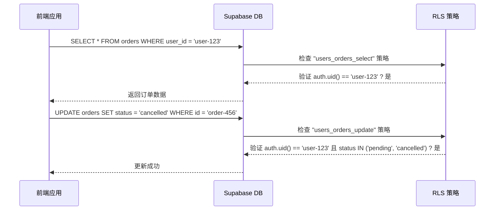
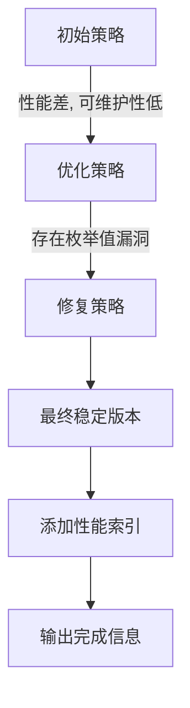

# 行级安全策略（RLS）

<cite>
**本文档引用的文件**  
- [create-rls-policies-optimized.sql](file://scripts/database/create-rls-policies-optimized.sql)
- [create-rls-policies-fixed.sql](file://scripts/database/create-rls-policies-fixed.sql)
- [20241224000002_rls_policies.sql](file://supabase/migrations/20241224000002_rls_policies.sql)
- [supabaseClient.ts](file://src/lib/supabaseClient.ts)
- [databaseService.ts](file://src/services/databaseService.ts)
- [database.ts](file://src/types/database.ts)
</cite>

## 目录
1. [引言](#引言)
2. [核心策略实现](#核心策略实现)
3. [策略版本对比与漏洞修复](#策略版本对比与漏洞修复)
4. [前端服务层影响](#前端服务层影响)
5. [权限错误诊断与修复](#权限错误诊断与修复)
6. [总结](#总结)

## 引言
行级安全（Row Level Security, RLS）是本项目数据安全的核心机制。通过在数据库层面实施细粒度的访问控制，RLS 确保了用户只能访问其被授权的数据，从根本上防止了越权访问。本文档深入解析了项目中 RLS 策略的具体实现，涵盖基于角色的全权访问、基于用户 ID 的数据隔离以及公开只读等核心场景，并详细说明了从初始版本到优化及修复版本的演进过程。

## 核心策略实现

### 基于角色的访问控制
RLS 策略通过定义安全函数来高效地判断用户角色，从而实现管理员和超级管理员的全权访问。

- **`private.is_admin()`**: 该函数判断用户角色是否为 `admin` 或 `super_admin`。管理员可以查看和管理所有分类、产品、工具、订单等核心数据。
- **`private.is_super_admin()`**: 该函数判断用户角色是否为 `super_admin`。超级管理员拥有最高权限，可以执行删除用户、分类等敏感操作。

例如，在 `products` 表中，管理员可以查看所有状态的产品（包括 `active`, `inactive`, `draft`），而普通用户只能查看 `active` 状态的产品。

**Section sources**
- [create-rls-policies-optimized.sql](file://scripts/database/create-rls-policies-optimized.sql#L15-L55)
- [create-rls-policies-fixed.sql](file://scripts/database/create-rls-policies-fixed.sql#L15-L55)

### 基于用户 ID 的数据隔离
对于用户私有数据，RLS 策略强制执行数据隔离，确保用户只能访问自己的数据。

- **个人资料 (`user_profiles`)**: 用户只能插入和更新 `id` 字段等于其 `auth.uid()` 的记录。
- **收藏夹 (`favorites`)**: 用户只能查看、添加和删除 `user_id` 等于其 `auth.uid()` 的收藏记录。
- **订单 (`orders`)**: 用户只能查看、创建和更新属于自己的订单。更新操作还受到状态限制，例如用户只能将 `pending` 状态的订单更新为 `cancelled`。

**Diagram sources**
- [create-rls-policies-optimized.sql](file://scripts/database/create-rls-policies-optimized.sql#L375-L408)
- [create-rls-policies-fixed.sql](file://scripts/database/create-rls-policies-fixed.sql#L375-L408)

**Section sources**
- [create-rls-policies-optimized.sql](file://scripts/database/create-rls-policies-optimized.sql#L375-L408)
- [create-rls-policies-fixed.sql](file://scripts/database/create-rls-policies-fixed.sql#L375-L408)

### 公开只读策略
对于需要向所有用户（包括未登录用户）公开的数据，RLS 策略允许 `authenticated` 和 `anon` 角色进行只读访问。

- **工具 (`tools`)**: 所有用户都可以查看 `status = 'active'` 且 `is_active = true` 的工具。
- **分类 (`categories`)**: 所有用户都可以查看 `is_active = true` 的分类。
- **产品评论 (`product_reviews`)**: 所有用户都可以查看所有评论。

**Section sources**
- [create-rls-policies-optimized.sql](file://scripts/database/create-rls-policies-optimized.sql#L297-L312)
- [create-rls-policies-fixed.sql](file://scripts/database/create-rls-policies-fixed.sql#L297-L312)

## 策略版本对比与漏洞修复

### 从初始版本到优化版本
初始的 RLS 策略（`20241224000002_rls_policies.sql`）存在性能和可维护性问题。优化版本（`create-rls-policies-optimized.sql`）进行了以下改进：

1.  **引入安全函数**: 将重复的角色检查逻辑（如 `EXISTS (SELECT 1 FROM user_profiles WHERE id = auth.uid() AND role IN ('admin', 'super_admin'))`）封装成 `private.is_admin()` 函数，提高了代码复用性和可读性。
2.  **使用 `SECURITY DEFINER`**: 安全函数使用 `SECURITY DEFINER` 模式，避免了在 RLS 策略中递归检查自身权限的性能问题。
3.  **策略命名规范化**: 使用更具描述性的策略名称，如 `public_tools_select` 和 `admin_tools_insert`，便于管理和审计。

### 修复版本的关键修正
优化版本虽然性能更优，但存在一个关键的权限漏洞：**枚举值不匹配**。

- **问题**: 在 `orders` 表的 `users_orders_update` 策略中，`USING` 子句检查 `status = 'pending'`，但 `WITH CHECK` 子句允许更新为 `status IN ('pending', 'cancelled')`。这导致当用户尝试将订单从 `pending` 更新为 `cancelled` 时，`USING` 条件失败，因为更新后的 `status` 不再是 `pending`，从而引发权限错误。
- **修复**: 修复版本（`create-rls-policies-fixed.sql`）修正了此问题，确保 `USING` 和 `WITH CHECK` 子句的逻辑一致。同时，该版本还为 `tool_ratings` 表（如果存在）添加了完整的 RLS 策略，并创建了必要的数据库索引以提升查询性能。

**Diagram sources**
- [20241224000002_rls_policies.sql](file://supabase/migrations/20241224000002_rls_policies.sql#L150-L180)
- [create-rls-policies-optimized.sql](file://scripts/database/create-rls-policies-optimized.sql#L410-L430)
- [create-rls-policies-fixed.sql](file://scripts/database/create-rls-policies-fixed.sql#L410-L430)

**Section sources**
- [20241224000002_rls_policies.sql](file://supabase/migrations/20241224000002_rls_policies.sql#L150-L180)
- [create-rls-policies-optimized.sql](file://scripts/database/create-rls-policies-optimized.sql#L410-L430)
- [create-rls-policies-fixed.sql](file://scripts/database/create-rls-policies-fixed.sql#L410-L430)

## 前端服务层影响
启用 RLS 后，前端服务层的数据库查询行为发生了根本性变化。

1.  **查询必须通过策略验证**: 所有对启用了 RLS 的表的查询，都必须满足至少一条 `SELECT` 策略的 `USING` 条件。例如，前端在查询 `orders` 表时，必须包含 `user_id = auth.uid()` 的条件，否则将返回空结果或权限错误。
2.  **依赖 Supabase 客户端**: 前端通过 `supabaseClient.ts` 中的 `supabase` 客户端进行数据库操作。该客户端会自动处理认证，并将用户的 JWT 令牌传递给数据库，RLS 策略通过 `auth.uid()` 函数从中提取用户 ID。
3.  **服务层封装**: `databaseService.ts` 封装了通用的数据库查询方法。它在执行查询时，会自动应用 RLS 所需的上下文（如用户 ID），并处理可能因策略拒绝而产生的错误。

**Section sources**
- [supabaseClient.ts](file://src/lib/supabaseClient.ts#L1-L267)
- [databaseService.ts](file://src/services/databaseService.ts#L1-L405)

## 权限错误诊断与修复
当用户遇到“权限被拒绝”或“未找到记录”等错误时，应按以下步骤进行诊断：

1.  **检查用户身份和角色**: 确认当前用户已登录，并通过 `getUserRole()` 函数确认其角色是否符合预期。
2.  **审查数据库查询**: 检查前端发出的数据库查询语句，确保其符合目标表的 RLS 策略要求。例如，查询 `orders` 表时是否包含了正确的 `user_id` 过滤。
3.  **验证策略逻辑**: 检查相关表的 RLS 策略，特别是 `USING` 和 `WITH CHECK` 子句，确保逻辑正确且无冲突。重点关注 `orders` 表的更新策略，确保 `USING` 和 `WITH CHECK` 的状态检查一致。
4.  **检查枚举值**: 确保前端传递给数据库的枚举值（如 `status`）与数据库定义的枚举类型完全匹配，避免因拼写错误或大小写问题导致策略不匹配。
5.  **使用修复版本**: 确保数据库中应用的是 `create-rls-policies-fixed.sql` 版本的策略，以避免已知的枚举值漏洞。

**Section sources**
- [create-rls-policies-fixed.sql](file://scripts/database/create-rls-policies-fixed.sql#L410-L430)
- [databaseService.ts](file://src/services/databaseService.ts#L1-L405)

## 总结
本项目的 RLS 策略经过了从初始实现到性能优化，再到关键漏洞修复的完整演进过程。最终的 `create-rls-policies-fixed.sql` 版本不仅提供了基于角色、用户 ID 和公开访问的全面安全控制，还通过安全函数和数据库索引保证了高性能。前端服务层通过 Supabase 客户端与 RLS 紧密集成，所有数据库操作都必须经过策略验证。开发者在进行数据库操作时，必须深刻理解 RLS 的工作原理，才能有效避免权限错误，确保应用的安全与稳定。