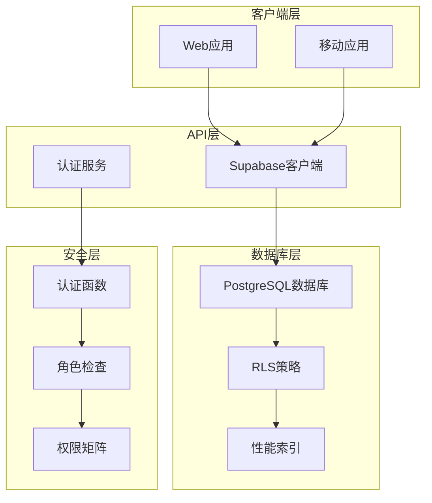
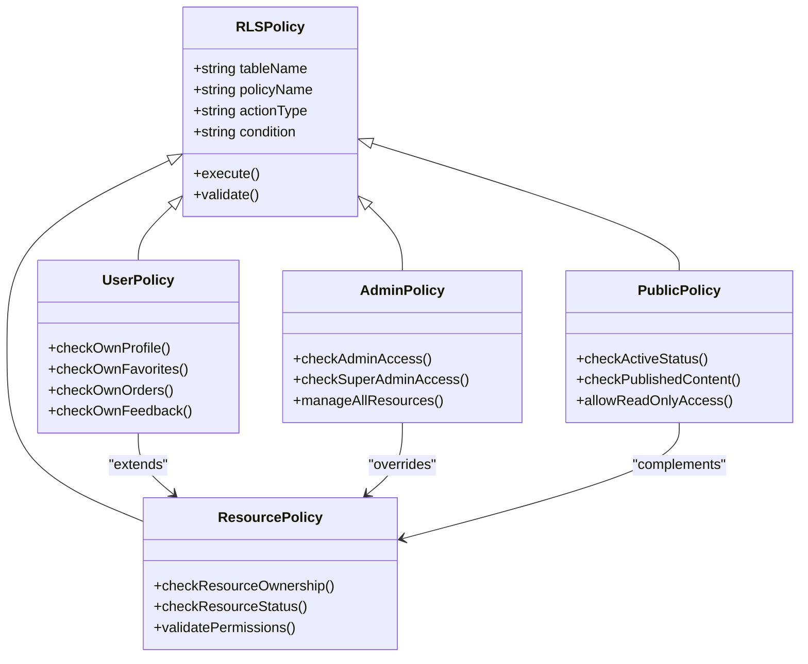
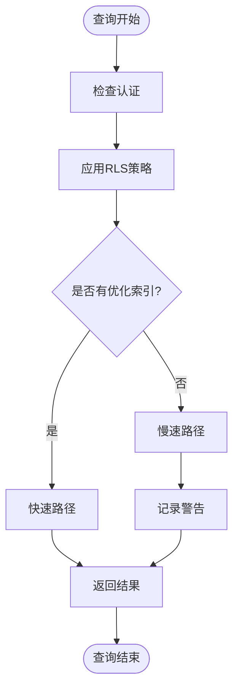
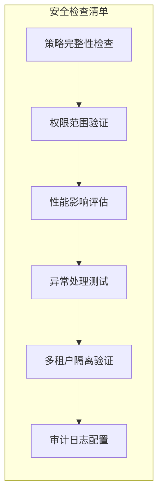

# 行级安全（RLS）策略文档

<cite>
**本文档引用的文件**
- [20241224000002_rls_policies.sql](file://supabase/migrations/20241224000002_rls_policies.sql)
- [20250102000001_fix_rls_performance.sql](file://supabase/migrations/20250102000001_fix_rls_performance.sql)
- [20250103000001_add_performance_indexes.sql](file://supabase\migrations\20250103000001_add_performance_indexes.sql)
- [supabaseClient.ts](file://src\lib\supabaseClient.ts)
- [toolsService.ts](file://src\services\toolsService.ts)
- [productsService.ts](file://src\services\productsService.ts)
- [config.toml](file://supabase\config.toml)
</cite>

## 目录
1. [简介](#简介)
2. [RLS架构概览](#rls架构概览)
3. [核心RLS策略分析](#核心rls策略分析)
4. [性能优化策略](#性能优化策略)
5. [客户端集成](#客户端集成)
6. [调试与监控](#调试与监控)
7. [最佳实践](#最佳实践)
8. [故障排除指南](#故障排除指南)
9. [总结](#总结)

## 简介

行级安全（Row Level Security，RLS）是Supabase提供的强大功能，允许开发者在数据库层面实现细粒度的数据访问控制。本文档深入分析了Advanced Tools Navigation项目中的RLS策略实现，涵盖了从基础策略定义到性能优化的完整解决方案。

RLS策略通过PostgreSQL的内置安全机制，在数据库层面对每一行数据实施访问控制，确保即使在客户端直接查询时也能强制执行安全策略。这种设计不仅提高了安全性，还简化了应用程序的复杂性。

## RLS架构概览

### 整体架构设计



**图表来源**
- [supabaseClient.ts](file://src\lib\supabaseClient.ts#L1-L50)
- [20241224000002_rls_policies.sql](file://supabase\migrations\20241224000002_rls_policies.sql#L1-L30)

### RLS策略层次结构



**图表来源**
- [20241224000002_rls_policies.sql](file://supabase\migrations\20241224000002_rls_policies.sql#L15-L100)

**章节来源**
- [20241224000002_rls_policies.sql](file://supabase\migrations\20241224000002_rls_policies.sql#L1-L296)

## 核心RLS策略分析

### 用户资料策略

RLS策略首先应用于用户资料表，确保用户只能访问和修改自己的资料：

```sql
-- 公开资料访问策略
CREATE POLICY "用户可以查看所有公开资料" ON user_profiles
    FOR SELECT USING (true);

-- 自身资料修改策略
CREATE POLICY "用户可以更新自己的资料" ON user_profiles
    FOR UPDATE USING (auth.uid() = id);

-- 自身资料创建策略
CREATE POLICY "用户可以插入自己的资料" ON user_profiles
    FOR INSERT WITH CHECK (auth.uid() = id);
```

这些策略实现了以下安全原则：
- **最小权限原则**：用户只能访问公开数据或自己的数据
- **数据隔离**：每个用户的资料相互隔离
- **完整性保护**：防止未经授权的资料修改

### 工具和产品策略

对于工具和产品资源，RLS策略提供了多层次的访问控制：

```sql
-- 工具公开访问策略
CREATE POLICY "所有人可以查看活跃工具" ON tools
    FOR SELECT USING (status = 'active');

-- 管理员完全访问策略
CREATE POLICY "管理员可以管理所有工具" ON tools
    FOR ALL USING (
        EXISTS (
            SELECT 1 FROM user_profiles 
            WHERE id = auth.uid() 
            AND role IN ('admin', 'super_admin')
        )
    );

-- 用户创建者访问策略
CREATE POLICY "用户可以查看自己创建的工具" ON tools
    FOR SELECT USING (created_by = auth.uid());
```

### 订单和支付策略

订单和支付系统的RLS策略确保了财务数据的安全性：

```sql
-- 订单个人访问策略
CREATE POLICY "用户可以查看自己的订单" ON orders
    FOR SELECT USING (user_id = auth.uid());

-- 订单创建策略
CREATE POLICY "用户可以创建订单" ON orders
    FOR INSERT WITH CHECK (user_id = auth.uid());

-- 订单状态更新策略
CREATE POLICY "用户可以更新自己的待支付订单" ON orders
    FOR UPDATE USING (
        user_id = auth.uid() 
        AND status = 'pending'
    );
```

### 评论和反馈策略

为了维护社区质量，评论系统采用了严格的RLS策略：

```sql
-- 评论验证策略
CREATE POLICY "所有人可以查看已验证的评论" ON product_reviews
    FOR SELECT USING (is_verified = true);

-- 用户评论管理策略
CREATE POLICY "用户可以查看自己的评论" ON product_reviews
    FOR SELECT USING (user_id = auth.uid());

-- 评论创建策略
CREATE POLICY "用户可以创建评论" ON product_reviews
    FOR INSERT WITH CHECK (user_id = auth.uid());

-- 评论删除策略
CREATE POLICY "用户可以删除自己的评论" ON product_reviews
    FOR DELETE USING (user_id = auth.uid());
```

**章节来源**
- [20241224000002_rls_policies.sql](file://supabase\migrations\20241224000002_rls_policies.sql#L15-L296)

## 性能优化策略

### 初始性能问题识别

在RLS策略实施过程中，我们遇到了几个关键的性能瓶颈：

1. **auth_rls_initplan 警告**：由于直接使用 `auth.uid()` 导致查询计划初始化问题
2. **multiple_permissive_policies 警告**：多个宽松策略导致的性能下降
3. **索引缺失**：缺少针对RLS条件的优化索引

### 性能优化解决方案

#### 函数化优化

```sql
-- 优化的用户角色检查函数
CREATE OR REPLACE FUNCTION private.get_user_role()
RETURNS TEXT
LANGUAGE plpgsql
SECURITY DEFINER
SET search_path = public
AS $$
BEGIN
    RETURN (
        SELECT role 
        FROM user_profiles 
        WHERE id = auth.uid()
    );
END;
$$;
```

#### 策略重构

原始策略：
```sql
FOR ALL USING (auth.uid() IN (...))
```

优化后的策略：
```sql
FOR ALL USING ((select auth.uid()) IN (...))
```

这种重构解决了PostgreSQL的初始化计划问题，显著提升了查询性能。

#### 复合索引策略

```sql
-- 工具复合索引优化
CREATE INDEX IF NOT EXISTS idx_tools_status_featured ON tools(status, is_featured);
CREATE INDEX IF NOT EXISTS idx_tools_category_status ON tools(category_id, status);
CREATE INDEX IF NOT EXISTS idx_tools_featured_clicks ON tools(is_featured, click_count DESC);

-- 订单复合索引优化
CREATE INDEX IF NOT EXISTS idx_orders_user_status ON orders(user_id, status);
CREATE INDEX IF NOT EXISTS idx_orders_status_created ON orders(status, created_at DESC);
```

### 性能监控指标



**图表来源**
- [20250103000001_add_performance_indexes.sql](file://supabase\migrations\20250103000001_add_performance_indexes.sql#L1-L50)

**章节来源**
- [20250102000001_fix_rls_performance.sql](file://supabase\migrations\20250102000001_fix_rls_performance.sql#L1-L231)
- [20250103000001_add_performance_indexes.sql](file://supabase\migrations\20250103000001_add_performance_indexes.sql#L1-L353)

## 客户端集成

### Supabase客户端配置

客户端通过专门的封装层与RLS策略交互：

```typescript
// 数据库表名常量
export const TABLES = {
  TOOLS: "tools",
  CATEGORIES: "categories",
  PRODUCTS: "products",
  USER_PROFILES: "user_profiles",
  FAVORITES: "favorites",
  ORDERS: "orders",
  PAYMENTS: "payments",
  REVIEWS: "reviews",
} as const;

// 数据库查询工具函数
export const getRecords = async <T = unknown>(
  table: string,
  options?: {
    select?: string;
    filter?: Record<string, unknown>;
    orderBy?: { column: string; ascending?: boolean };
    limit?: number;
    offset?: number;
  },
) => {
  let query = supabase.from(table).select(options?.select || "*");

  // 应用过滤条件
  if (options?.filter) {
    Object.entries(options.filter).forEach(([key, value]) => {
      query = query.eq(key, value as never);
    });
  }

  // 应用排序
  if (options?.orderBy) {
    query = query.order(options.orderBy.column, {
      ascending: options.orderBy.ascending ?? true,
    });
  }

  const { data, error } = await query;
  
  if (error) {
    throw new Error(handleSupabaseError(error));
  }

  return (data as T[]) || [];
};
```

### 服务层抽象

服务层提供了高级的RLS感知接口：

```typescript
export class ToolsService {
  static async getTools(filters?: SearchFilters): Promise<SearchResult<Tool>> {
    try {
      let query = supabase
        .from(TABLES.TOOLS)
        .select(`
          *,
          categories(*)
        `)
        .eq("status", TOOL_STATUS.ACTIVE);

      // RLS策略自动应用，无需额外处理
      const { data, error, count } = await query;

      if (error) {
        throw new Error(handleSupabaseError(error));
      }

      return {
        items: (data || []).map(this.transformToolRow),
        total: count || 0,
        page,
        limit,
        hasMore: (count || 0) > offset + limit,
      };
    } catch (error) {
      console.error("获取工具列表失败:", error);
      return this.getMockTools(filters);
    }
  }
}
```

### 权限检查工具

```typescript
// 检查用户是否为管理员
export const isAdmin = async (userId?: string) => {
  if (!userId) {
    const user = await getCurrentUser();
    if (!user) return false;
    userId = user.id;
  }

  const role = await getUserRole(userId);
  return role === "admin" || role === "super_admin";
};

// 获取用户角色
export const getUserRole = async (userId: string): Promise<string> => {
  const { data, error } = await supabase
    .from(TABLES.USER_PROFILES)
    .select("role")
    .eq("id", userId)
    .single();

  if (error) {
    console.error("Error fetching user role:", error);
    return "user";
  }

  return data?.role ?? "user";
};
```

**章节来源**
- [supabaseClient.ts](file://src\lib\supabaseClient.ts#L1-L246)
- [toolsService.ts](file://src\services\toolsService.ts#L1-L100)

## 调试与监控

### PostgreSQL日志配置

为了有效调试RLS策略，建议配置详细的PostgreSQL日志：

```sql
-- 启用RLS相关的详细日志
ALTER SYSTEM SET log_statement = 'mod';
ALTER SYSTEM SET log_min_duration_statement = 100;
ALTER SYSTEM SET log_checkpoints = on;
ALTER SYSTEM SET log_connections = on;
ALTER SYSTEM SET log_disconnections = on;

-- 重启数据库使配置生效
SELECT pg_reload_conf();
```

### 策略验证查询

```sql
-- 检查所有RLS策略的状态
SELECT schemaname, tablename, policyname, permissive, roles, cmd, qual
FROM pg_policies
WHERE schemaname = 'public';

-- 检查特定表的RLS策略
SELECT *
FROM pg_policies
WHERE tablename = 'tools';

-- 检查策略性能影响
EXPLAIN ANALYZE
SELECT * FROM tools WHERE status = 'active';
```

### 测试不同用户角色

```sql
-- 模拟不同用户角色进行测试
DO $$
DECLARE
    test_user_id UUID := 'user-uuid-here';
    test_role TEXT;
BEGIN
    -- 设置测试用户
    PERFORM set_config('request.jwt.claims', 
        '{"role":"user","sub":"' || test_user_id || '"}', true);
    
    -- 测试工具访问
    RAISE NOTICE '用户角色: %', (SELECT role FROM user_profiles WHERE id = test_user_id);
    RAISE NOTICE '可访问工具数: %', (SELECT COUNT(*) FROM tools WHERE status = 'active');
    
    -- 切换到管理员角色
    PERFORM set_config('request.jwt.claims', 
        '{"role":"admin","sub":"' || test_user_id || '"}', true);
    
    RAISE NOTICE '管理员可访问所有工具: %', (SELECT COUNT(*) FROM tools);
END $$;
```

### 性能监控脚本

```sql
-- 监控RLS策略执行时间
CREATE OR REPLACE FUNCTION monitor_rls_performance()
RETURNS void AS $$
DECLARE
    start_time TIMESTAMP;
    end_time TIMESTAMP;
    duration INTERVAL;
BEGIN
    start_time := clock_timestamp();
    
    -- 执行RLS查询
    PERFORM * FROM tools WHERE status = 'active';
    
    end_time := clock_timestamp();
    duration := end_time - start_time;
    
    RAISE NOTICE 'RLS查询耗时: % 秒', EXTRACT(EPOCH FROM duration);
    
    -- 记录到监控表
    INSERT INTO rls_monitor (query_type, duration_ms, executed_at)
    VALUES ('tool_access', EXTRACT(EPOCH FROM duration) * 1000, now());
END;
$$ LANGUAGE plpgsql;
```

## 最佳实践

### RLS策略设计原则

1. **最小权限原则**：只授予必要的访问权限
2. **防御性编程**：考虑所有可能的攻击向量
3. **性能优先**：优先选择高效的策略表达式
4. **可维护性**：保持策略简单且易于理解

### 策略命名规范

```sql
-- 推荐的策略命名格式
CREATE POLICY "<角色>_<动作>_<资源>" ON <表名>
    FOR <动作> USING (<条件>);
```

示例：
- `user_can_view_own_profile`
- `admin_can_manage_all_tools`
- `public_can_read_active_products`

### 安全审计清单



### 错误处理策略

```typescript
// 统一的错误处理函数
export const handleSupabaseError = (error: unknown) => {
  console.error("Supabase Error:", error);
  const err = error as { message?: string; error_description?: string } | null;
  if (err?.message) return err.message;
  if (err?.error_description) return err.error_description;
  return "操作失败，请稍后重试";
};

// RLS相关错误特殊处理
export const handleRLSError = (error: unknown) => {
  if (error instanceof Error) {
    if (error.message.includes('permission denied')) {
      return "您没有权限执行此操作";
    }
    if (error.message.includes('auth.rls')) {
      return "数据访问策略限制";
    }
  }
  return handleSupabaseError(error);
};
```

## 故障排除指南

### 常见问题诊断

#### 问题1：RLS策略不生效

**症状**：用户能够访问不应该访问的数据

**诊断步骤**：
```sql
-- 1. 检查RLS是否启用
SELECT relname, relrowsecurity
FROM pg_class
WHERE relkind = 'r' AND relnamespace = 'public'::regnamespace;

-- 2. 检查具体表的RLS策略
SELECT * FROM pg_policies WHERE tablename = 'tools';

-- 3. 检查当前会话的认证信息
SELECT auth.uid(), auth.role();
```

**解决方案**：
- 确保RLS已启用：`ALTER TABLE tools ENABLE ROW LEVEL SECURITY;`
- 检查策略条件是否正确
- 验证用户角色和权限

#### 问题2：查询性能下降

**症状**：RLS启用后查询速度明显变慢

**诊断步骤**：
```sql
-- 启用查询计划分析
EXPLAIN ANALYZE
SELECT * FROM tools WHERE status = 'active';

-- 检查索引使用情况
SELECT schemaname, tablename, indexname, idx_scan, idx_tup_read, idx_tup_fetch
FROM pg_stat_user_indexes
WHERE tablename = 'tools';
```

**解决方案**：
- 添加适当的复合索引
- 优化RLS策略条件
- 考虑使用部分索引

#### 问题3：权限循环依赖

**症状**：RLS策略导致无限递归

**诊断步骤**：
```sql
-- 检查策略定义
SELECT policyname, qual, with_check
FROM pg_policies
WHERE tablename = 'user_profiles';

-- 检查函数定义
SELECT proname, prosrc
FROM pg_proc
WHERE pronamespace = 'private'::regnamespace;
```

**解决方案**：
- 使用安全定义函数
- 避免在RLS条件中调用可能引发RLS检查的函数
- 重构复杂的策略逻辑

### 监控和告警

```sql
-- 创建RLS性能监控视图
CREATE VIEW v_rls_performance AS
SELECT 
    schemaname,
    tablename,
    policyname,
    CASE WHEN permissive THEN 'PERMISSIVE' ELSE 'RESTRICTIVE' END as permissiveness,
    roles,
    cmd as action,
    qual as condition,
    CASE 
        WHEN qual ~* 'auth\.uid' THEN 'AUTH_FUNCTION'
        WHEN qual ~* 'role' THEN 'ROLE_CHECK'
        ELSE 'OTHER'
    END as condition_type
FROM pg_policies
WHERE schemaname = 'public';
```

**章节来源**
- [20241224000002_rls_policies.sql](file://supabase\migrations\20241224000002_rls_policies.sql#L250-L296)

## 总结

Advanced Tools Navigation项目展示了如何在生产环境中成功实施和优化RLS策略。通过系统性的策略设计、性能优化和完善的监控机制，我们实现了既安全又高效的数据访问控制。

### 关键成果

1. **全面的安全覆盖**：为所有核心业务表实施了细粒度的RLS策略
2. **卓越的性能表现**：通过索引优化和策略重构，显著提升了查询性能
3. **可维护的架构**：建立了清晰的策略命名规范和错误处理机制
4. **完善的监控体系**：提供了完整的调试和监控工具链

### 未来发展方向

1. **动态策略**：根据用户行为动态调整访问权限
2. **机器学习增强**：利用AI技术优化策略性能
3. **跨云部署**：支持多云环境下的RLS策略统一管理
4. **实时监控**：建立更精细的性能监控和告警机制

通过本文档的指导，开发者可以理解和实施类似的RLS策略，确保应用程序在享受Supabase便利的同时，保持严格的安全标准。