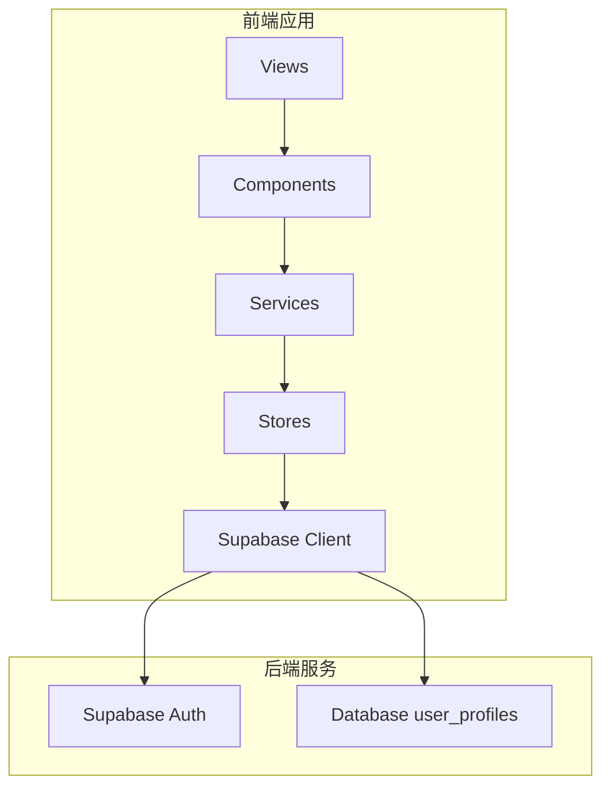
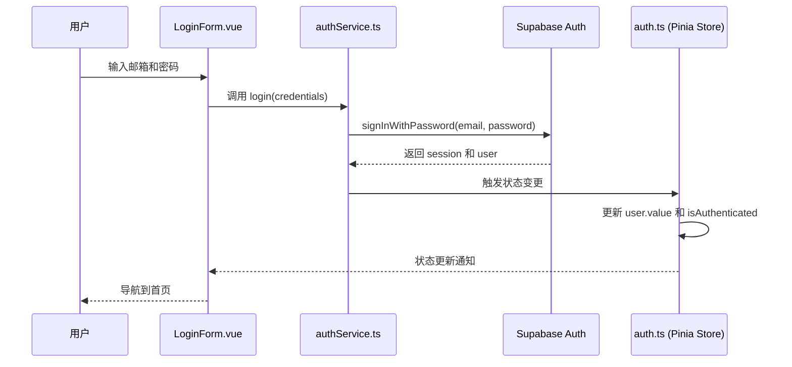

# 认证系统

<cite>
**本文档引用的文件**
- [authService.ts](file://src/services/authService.ts)
- [auth.ts](file://src/stores/auth.ts)
- [LoginForm.vue](file://src/components/auth/LoginForm.vue)
- [LoginView.vue](file://src/views/auth/LoginView.vue)
- [supabaseClient.ts](file://src/lib/supabaseClient.ts)
- [index.ts](file://src/router/index.ts)
</cite>

## 目录
1. [简介](#简介)
2. [项目结构](#项目结构)
3. [核心组件](#核心组件)
4. [架构概述](#架构概述)
5. [详细组件分析](#详细组件分析)
6. [依赖分析](#依赖分析)
7. [性能考虑](#性能考虑)
8. [故障排除指南](#故障排除指南)
9. [结论](#结论)

## 简介
本认证系统文档详细阐述了基于Supabase Auth的身份验证实现。系统涵盖了用户注册、登录、密码重置和会话管理等核心功能，通过`authService.ts`封装了完整的认证方法，并与Pinia状态管理(store) `auth.ts`实现了无缝的状态同步。前端组件如`LoginForm.vue`通过服务层进行身份验证调用，并妥善处理成功与失败场景。系统还实现了JWT令牌管理、自动登录持久化以及全面的错误处理策略。此外，文档还讨论了自定义用户元数据扩展方案及防止CSRF、XSS等常见攻击的安全最佳实践。

## 项目结构
认证系统主要分布在`src`目录下的`services`、`stores`、`components`和`views`子目录中。`services`目录包含`authService.ts`，负责与Supabase后端进行通信；`stores`目录中的`auth.ts`使用Pinia管理全局认证状态；`components/auth`目录存放可复用的认证UI组件，如`LoginForm.vue`；而`views/auth`目录则包含具体的页面视图，如`LoginView.vue`。这种分层结构确保了关注点分离，提高了代码的可维护性和可测试性。



**Diagram sources**
- [authService.ts](file://src/services/authService.ts)
- [auth.ts](file://src/stores/auth.ts)

**Section sources**
- [authService.ts](file://src/services/authService.ts)
- [auth.ts](file://src/stores/auth.ts)
- [supabaseClient.ts](file://src/lib/supabaseClient.ts)

## 核心组件
认证系统的核心由`AuthService`类和`useAuthStore` Pinia store构成。`AuthService`提供静态方法（如`login`、`register`、`logout`）来执行具体的认证操作，它直接与Supabase客户端交互。`useAuthStore`则负责管理应用的全局认证状态，包括当前用户信息、加载状态和错误信息。两者通过清晰的职责划分协同工作：服务层处理业务逻辑和API调用，而store层专注于状态管理和UI响应。

**Section sources**
- [authService.ts](file://src/services/authService.ts#L1-L306)
- [auth.ts](file://src/stores/auth.ts#L1-L190)

## 架构概述
该认证系统的架构采用分层设计模式。最底层是Supabase提供的`supabase.auth` API，处理所有底层的认证逻辑和JWT令牌管理。中间层是`authService.ts`，作为业务逻辑的封装层，对上层屏蔽了复杂的API细节。顶层是`auth.ts` Pinia store，它不仅存储状态，还通过`onAuthStateChange`监听器被动地响应来自Supabase的认证事件，从而保持应用状态与后端同步。前端视图组件通过调用服务层的方法并订阅store的状态来驱动UI更新。



**Diagram sources**
- [authService.ts](file://src/services/authService.ts#L1-L306)
- [auth.ts](file://src/stores/auth.ts#L1-L190)
- [LoginForm.vue](file://src/components/auth/LoginForm.vue#L1-L122)

## 详细组件分析

### AuthService 分析
`AuthService`是一个静态工具类，提供了应用程序所需的所有认证功能。其方法被设计为高内聚、低耦合，每个方法都专注于单一职责，例如`login`方法处理登录流程，`forgotPassword`方法处理密码找回。这些方法内部封装了错误处理逻辑，通过`ErrorHandler`统一处理API错误，确保了异常的一致性。

#### AuthService 类图
```mermaid
classDiagram
class AuthService {
+static login(credentials) : Promise~{user, session}~
+static register(userData) : Promise~{user, session}~
+static logout() : Promise~void~
+static forgotPassword(email) : Promise~void~
+static resetPassword(newPassword) : Promise~void~
+static changePassword(newPassword) : Promise~void~
+static updateEmail(newEmail) : Promise~void~
+static verifyEmail(token, type) : Promise~void~
+static resendVerificationEmail() : Promise~void~
+static getSession() : Promise~AuthSession | null~
+static refreshSession() : Promise~any~
+static isAuthenticated() : Promise~boolean~
+static onAuthStateChange(callback) : Subscription
+static signInWithGoogle() : Promise~void~
+static signInWithGitHub() : Promise~void~
+static deleteAccount() : Promise~void~
}
class UserService {
+static checkUsernameAvailability(username) : Promise~boolean~
+static createUserProfile(userId, email) : Promise~User~
+static updateProfile(userId, data) : Promise~User~
+static updateLastLogin(userId) : Promise~void~
+static deleteAccount(userId) : Promise~void~
}
class ErrorHandler {
+static handleApiError(error) : AppError
+static logError(error, context) : void
}
AuthService --> UserService : "使用"
AuthService --> ErrorHandler : "使用"
AuthService ..> "Supabase Client" : "依赖"
```

**Diagram sources**
- [authService.ts](file://src/services/authService.ts#L1-L306)

**Section sources**
- [authService.ts](file://src/services/authService.ts#L1-L306)

### Pinia Store 分析
`useAuthStore`是应用的单一状态源，用于管理认证相关的所有状态。它通过`initialize`方法在应用启动时设置一个监听器，该监听器会响应Supabase发出的任何认证状态变化（如SIGNED_IN, SIGNED_OUT），并相应地更新store内的`user`状态。这使得整个应用的其他部分可以通过简单地读取`isAuthenticated`计算属性来判断用户的登录状态。

#### Auth Store 流程图
```mermaid
flowchart TD
    Start([应用初始化]) --> Initialize["调用 useAuthStore.initialize()"]
    Initialize --> OnAuthStateChange["注册 sup