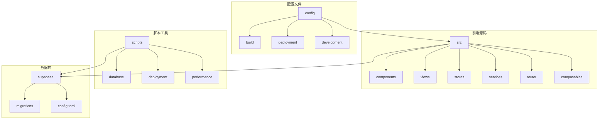

# 开发者指南

<cite>
**本文档中引用的文件**  
- [package.json](file://advanced-tools-navigation/package.json) - *更新了构建脚本和依赖*
- [.env.example](file://.env.example) - *新增的环境变量示例文件*
- [.gitignore](file://.gitignore) - *新增的gitignore配置文件*
- [vite.config.ts](file://advanced-tools-navigation/vite.config.ts)
- [supabase/config.toml](file://supabase/config.toml)
- [lib/supabase.ts](file://src/lib/supabase.ts)
- [lib/supabaseClient.ts](file://src/lib/supabaseClient.ts)
- [.env.local](file://.env.local)
- [scripts/init-data.js](file://scripts/init-data.js)
- [scripts/generate-default-icon.js](file://scripts/generate-default-icon.js)
- [scripts/database/test-supabase-connection.js](file://scripts/database/test-supabase-connection.js)
- [scripts/fix-database-connection.js](file://scripts/fix-database-connection.js)
- [netlify.toml](file://netlify.toml)
- [src/router/index.ts](file://src/router/index.ts)
- [vite.config.ts](file://vite.config.ts)
- [vitest.config.ts](file://vitest.config.ts)
</cite>

## 更新摘要
**已做更改**  
- 在"开发环境搭建"部分添加了 `.env.example` 和 `.gitignore` 文件的说明
- 更新了文档引用文件列表，包含新添加的配置文件
- 在前置条件中强调了环境配置的最佳实践

## 目录
1. [简介](#简介)
2. [项目结构](#项目结构)
3. [开发环境搭建](#开发环境搭建)
4. [运行与构建项目](#运行与构建项目)
5. [环境变量配置](#环境变量配置)
6. [数据库初始化与测试数据](#数据库初始化与测试数据)
7. [辅助工具脚本](#辅助工具脚本)
8. [常见问题与解决方案](#常见问题与解决方案)
9. [代码提交与分支管理](#代码提交与分支管理)
10. [调试技巧](#调试技巧)

## 简介
本指南旨在为新加入的开发者提供完整的本地开发环境搭建与日常开发操作指导。涵盖从环境准备、项目启动、数据库连接到问题排查的全流程，帮助开发者快速上手并高效参与项目开发。

## 项目结构
项目采用模块化结构，主要分为前端源码、配置文件、脚本工具和Supabase数据库管理四大部分。



**图示来源**  
- [src](file://src)
- [config](file://config)
- [scripts](file://scripts)
- [supabase](file://supabase)

## 开发环境搭建
### 前置条件
开发前需安装以下工具：

- **Node.js**：建议使用 v18.x 或 v20.x 版本
- **pnpm**：通过 `npm install -g pnpm` 安装
- **Supabase CLI**：通过 `npm install -g supabase` 安装

安装完成后，执行以下命令初始化项目：
```bash
pnpm install
```

### 环境配置
项目已添加 `.env.example` 文件作为环境变量模板，以及 `.gitignore` 文件用于排除敏感信息和构建产物。请按以下步骤配置：

1. 复制 `.env.example` 为 `.env.local`：
```bash
cp .env.example .env.local
```

2. 根据实际环境修改 `.env.local` 中的变量值

3. 确保 `.gitignore` 文件包含以下条目以保护敏感信息：
```
.env.local
node_modules/
dist/
```

**Section sources**
- [.env.example](file://.env.example) - *新增的环境变量示例文件*
- [.gitignore](file://.gitignore) - *新增的gitignore配置文件*
- [package.json](file://advanced-tools-navigation/package.json)

## 运行与构建项目
项目通过 npm scripts 管理不同运行模式：

- **开发模式**：`pnpm dev` 启动 Vite 开发服务器
- **生产构建**：`pnpm build` 生成静态资源
- **预览模式**：`pnpm preview` 预览构建结果

构建过程包含 TypeScript 类型检查与 Vite 打包两个阶段。

**Section sources**
- [package.json](file://advanced-tools-navigation/package.json)
- [vite.config.ts](file://advanced-tools-navigation/vite.config.ts)

## 环境变量配置
### Supabase 连接配置
创建 `.env.local` 文件并填入 Supabase 项目凭证：

```env
VITE_SUPABASE_URL=your-supabase-url
VITE_SUPABASE_ANON_KEY=your-anon-key
```

这些变量通过 `import.meta.env` 在代码中访问，用于初始化 Supabase 客户端。

**Section sources**
- [.env.local](file://.env.local)
- [lib/supabase.ts](file://src/lib/supabase.ts)
- [lib/supabaseClient.ts](file://src/lib/supabaseClient.ts)

## 数据库初始化与测试数据
### 初始化数据库
使用 Supabase CLI 启动本地数据库：
```bash
supabase start
```

### 运行数据库脚本
执行初始化脚本填充测试数据：
```bash
node scripts/init-data.js
```

该脚本会连接 Supabase 并插入预设的工具数据，用于开发和测试。

**Section sources**
- [scripts/init-data.js](file://scripts/init-data.js)
- [scripts/database/test-supabase-connection.js](file://scripts/database/test-supabase-connection.js)
- [supabase/config.toml](file://supabase/config.toml)

## 辅助工具脚本
### 数据生成工具
- **init-data.js**：初始化数据库测试数据
- **generate-default-icon.js**：为无图标的工具生成默认图标
- **fix-database-connection.js**：修复常见的数据库连接问题

这些脚本位于 `scripts/` 目录，可通过 `node scripts/[script-name].js` 单独执行。

**Section sources**
- [scripts/generate-default-icon.js](file://scripts/generate-default-icon.js)
- [scripts/fix-database-connection.js](file://scripts/fix-database-connection.js)
- [scripts/database](file://scripts/database)

## 常见问题与解决方案
### Vite 热重载失效
1. 检查文件是否在 `src` 目录下
2. 确认 `vite.config.ts` 中的 `server.hmr` 配置
3. 清除浏览器缓存并重启开发服务器

### Supabase 连接超时
1. 确认 `supabase start` 已成功运行
2. 检查 `.env.local` 中的 URL 和密钥是否正确
3. 执行 `scripts/fix-database-connection.js` 诊断问题

### 路由 404 错误
1. 检查 `src/router/index.ts` 中的路由定义
2. 确认 `vite.config.ts` 的 `base` 配置
3. 验证 Netlify 部署配置 `netlify.toml`

**Section sources**
- [src/router/index.ts](file://src/router/index.ts)
- [vite.config.ts](file://vite.config.ts)
- [netlify.toml](file://netlify.toml)
- [scripts/fix-database-connection.js](file://scripts/fix-database-connection.js)

## 代码提交与分支管理
### 分支策略
- `main`：生产环境代码
- `develop`：集成开发分支
- `feature/*`：功能开发分支
- `hotfix/*`：紧急修复分支

### 提交规范
采用 Angular 提交规范：
- `feat:` 新功能
- `fix:` 问题修复
- `docs:` 文档更新
- `style:` 代码格式调整
- `refactor:` 重构
- `test:` 测试相关
- `chore:` 构建或辅助工具变动

## 调试技巧
### 前端调试
- 使用 `console.log` 输出关键变量
- 利用 Vue DevTools 检查组件状态
- 在 `vite.config.ts` 中启用 `server.open` 自动打开浏览器

### 数据库调试
- 通过 `supabase status` 检查服务状态
- 使用 `scripts/database/test-supabase-connection.js` 测试连接
- 查看 `supabase/logs/` 中的日志文件

### 性能调试
- 运行 `pnpm build --report` 生成构建分析报告
- 使用 `scripts/performance/optimize-build.mjs` 优化构建体积
- 在生产环境中启用 Gzip 压缩

**Section sources**
- [vitest.config.ts](file://vitest.config.ts)
- [scripts/database/test-supabase-connection.js](file://scripts/database/test-supabase-connection.js)
- [scripts/performance/optimize-build.mjs](file://scripts/performance/optimize-build.mjs)