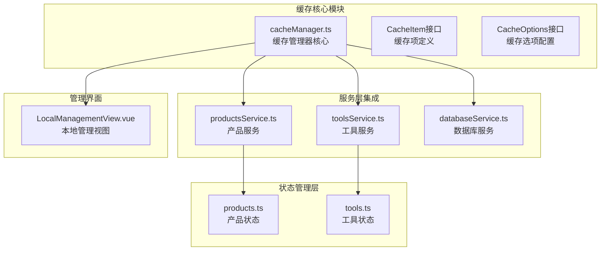
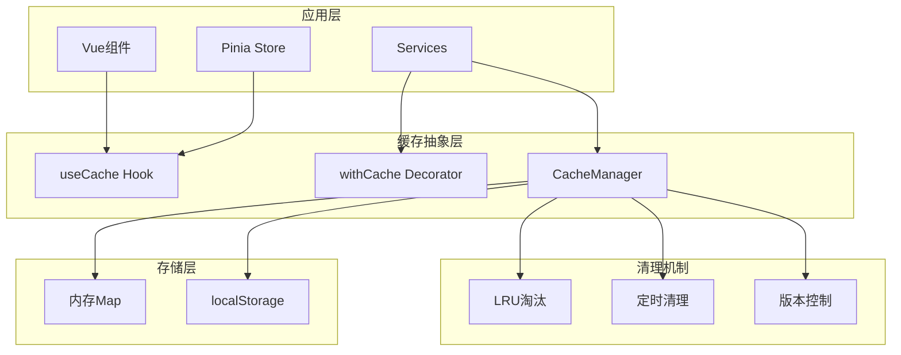
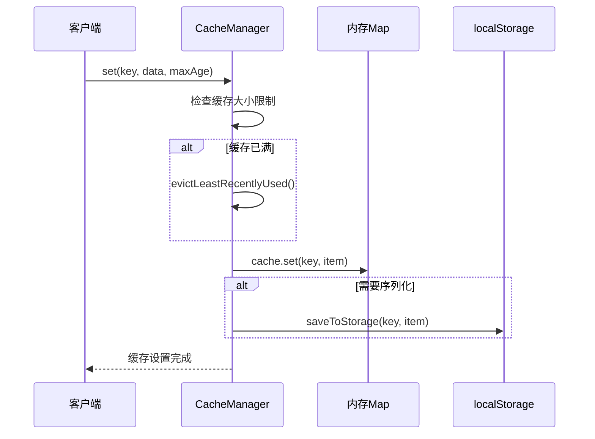
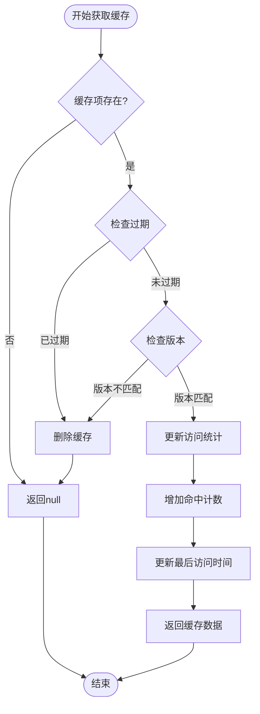
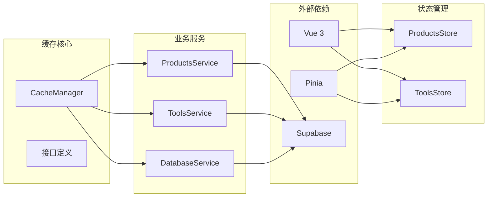

# 客户端缓存策略

<cite>
**本文档引用的文件**
- [cacheManager.ts](file://src/utils/cacheManager.ts)
- [productsService.ts](file://src/services/productsService.ts)
- [products.ts](file://src/stores/products.ts)
- [toolsService.ts](file://src/services/toolsService.ts)
- [databaseService.ts](file://src/services/databaseService.ts)
- [LocalManagementView.vue](file://src/views/admin/LocalManagementView.vue)
</cite>

## 目录
1. [简介](#简介)
2. [项目结构](#项目结构)
3. [核心组件](#核心组件)
4. [架构概览](#架构概览)
5. [详细组件分析](#详细组件分析)
6. [依赖关系分析](#依赖关系分析)
7. [性能考虑](#性能考虑)
8. [故障排除指南](#故障排除指南)
9. [结论](#结论)

## 简介

本文档深入分析了Advanced Tools Navigation项目中实现的智能客户端缓存策略。该系统通过多层缓存机制优化数据加载性能，减少不必要的API调用，并提供强大的缓存生命周期管理功能。

该项目采用了一个高度可配置的缓存管理器，支持内存缓存、localStorage持久化存储以及多种缓存策略。系统设计注重性能优化、内存占用控制和失效策略管理，为产品服务和状态管理提供了无缝的集成体验。

## 项目结构

缓存系统的核心文件组织如下：



**图表来源**
- [cacheManager.ts](file://src/utils/cacheManager.ts#L1-L400)
- [productsService.ts](file://src/services/productsService.ts#L1-L347)
- [toolsService.ts](file://src/services/toolsService.ts#L1-L642)

**章节来源**
- [cacheManager.ts](file://src/utils/cacheManager.ts#L1-L50)
- [productsService.ts](file://src/services/productsService.ts#L1-L41)

## 核心组件

### CacheManager类

CacheManager是整个缓存系统的核心，提供了完整的缓存生命周期管理功能：

```typescript
class CacheManager {
  private cache = reactive<Map<string, CacheItem>>(new Map());
  private options: Required<CacheOptions>;
  
  constructor(options: CacheOptions = {}) {
    this.options = { ...this.defaultOptions, ...options };
    
    if (this.options.serialize) {
      this.loadFromStorage();
    }
    
    this.startCleanupTimer();
  }
}
```

### 缓存项结构

每个缓存项包含以下关键属性：

```typescript
interface CacheItem<T = any> {
  data: T;                    // 实际缓存的数据
  timestamp: number;          // 创建时间戳
  expiry: number;             // 过期时间戳
  version: string;            // 缓存版本标识
  hits: number;               // 命中次数统计
  lastAccessed: number;       // 最后访问时间
}
```

### 缓存选项配置

系统支持灵活的缓存配置选项：

```typescript
interface CacheOptions {
  maxAge?: number;           // 最大生存时间（毫秒）
  maxSize?: number;          // 最大缓存项数量
  version?: string;          // 缓存版本
  serialize?: boolean;       // 是否序列化存储
  prefix?: string;           // localStorage前缀
}
```

**章节来源**
- [cacheManager.ts](file://src/utils/cacheManager.ts#L1-L100)

## 架构概览

缓存系统采用分层架构设计，实现了内存缓存与持久化存储的双重保障：



**图表来源**
- [cacheManager.ts](file://src/utils/cacheManager.ts#L25-L50)
- [cacheManager.ts](file://src/utils/cacheManager.ts#L332-L398)

## 详细组件分析

### 缓存管理器实现

#### 设置缓存



**图表来源**
- [cacheManager.ts](file://src/utils/cacheManager.ts#L50-L70)

#### 获取缓存



**图表来源**
- [cacheManager.ts](file://src/utils/cacheManager.ts#L72-L95)

### 缓存实例配置

系统预定义了三种不同用途的缓存实例：

#### 默认缓存实例

```typescript
export const defaultCache = new CacheManager({
  maxAge: 5 * 60 * 1000, // 5分钟
  maxSize: 100,
  serialize: true,
  prefix: "advanced_tools_",
});
```

#### 图片缓存实例

```typescript
export const imageCache = new CacheManager({
  maxAge: 30 * 60 * 1000, // 30分钟
  maxSize: 50,
  serialize: false, // 图片数据不适合序列化
  prefix: "img_cache_",
});
```

#### API数据缓存实例

```typescript
export const apiCache = new CacheManager({
  maxAge: 3 * 60 * 1000, // 3分钟
  maxSize: 200,
  serialize: true,
  prefix: "api_cache_",
});
```

### 缓存装饰器模式

系统提供了优雅的缓存装饰器，简化了函数级别的缓存集成：

```typescript
export function withCache<T extends (...args: any[]) => Promise<any>>(
  fn: T,
  cacheKey: ((...args: Parameters<T>) => string) | string,
  cacheInstance: CacheManager = defaultCache,
  maxAge?: number,
): T {
  return (async (...args: Parameters<T>) => {
    const key = typeof cacheKey === "function" ? cacheKey(...args) : cacheKey;
    
    // 尝试从缓存获取
    const cachedResult = cacheInstance.get(key);
    if (cachedResult !== null) {
      return cachedResult;
    }
    
    // 执行原函数
    const result = await fn(...args);
    
    // 缓存结果
    cacheInstance.set(key, result, maxAge);
    
    return result;
  }) as T;
}
```

### Vue Composition API集成

系统提供了完整的Vue Composition API支持：

```typescript
export function useCache(cacheInstance: CacheManager = defaultCache) {
  const isLoading = ref(false);
  const error = ref<string | null>(null);
  
  const loadWithCache = async <T>(
    key: string,
    fetcher: () => Promise<T>,
    maxAge?: number,
    forceRefresh = false,
  ): Promise<T> => {
    // 缓存逻辑实现
  };
  
  return {
    isLoading,
    error,
    getCachedData,
    setCachedData,
    loadWithCache,
    clearCache,
    getCacheStats,
  };
}
```

**章节来源**
- [cacheManager.ts](file://src/utils/cacheManager.ts#L289-L398)

### 产品服务集成

产品服务展示了缓存的实际应用场景：

```typescript
static async getProducts(filters?: SearchFilters): Promise<SearchResult<Product>> {
  // 生成缓存键
  const cacheKey = `products_${JSON.stringify(filters || {})}`;
  
  // 使用缓存装饰器
  return withCache(
    this._getProductsFromAPI.bind(this),
    () => cacheKey,
    apiCache,
    2 * 60 * 1000, // 2分钟缓存
  )(filters);
}
```

### 状态管理集成

Pinia store通过useCache hook集成了缓存功能：

```typescript
const { 
  isLoading, 
  error, 
  getCachedData, 
  setCachedData, 
  loadWithCache 
} = useCache(apiCache);
```

**章节来源**
- [productsService.ts](file://src/services/productsService.ts#L10-L50)
- [toolsService.ts](file://src/services/toolsService.ts#L40-L50)

## 依赖关系分析

缓存系统的依赖关系展现了清晰的分层架构：



**图表来源**
- [cacheManager.ts](file://src/utils/cacheManager.ts#L1-L10)
- [products.ts](file://src/stores/products.ts#L1-L10)

**章节来源**
- [cacheManager.ts](file://src/utils/cacheManager.ts#L1-L20)
- [products.ts](file://src/stores/products.ts#L1-L10)

## 性能考虑

### 内存占用控制

系统实现了精确的内存使用量估算：

```typescript
private estimateMemoryUsage(): number {
  let totalSize = 0;
  
  for (const [key, item] of this.cache) {
    totalSize += key.length * 2; // Unicode字符串
    totalSize += JSON.stringify(item).length * 2;
  }
  
  return totalSize; // 字节数
}
```

### LRU淘汰策略

当缓存达到容量上限时，系统采用最近最少使用(LRU)算法进行淘汰：

```typescript
private evictLeastRecentlyUsed(): void {
  let lruKey = "";
  let lruTime = Date.now();
  
  for (const [key, item] of this.cache) {
    if (item.lastAccessed < lruTime) {
      lruTime = item.lastAccessed;
      lruKey = key;
    }
  }
  
  if (lruKey) {
    this.delete(lruKey);
  }
}
```

### 定时清理机制

系统每分钟自动清理过期缓存：

```typescript
private startCleanupTimer(): void {
  setInterval(() => {
    this.cleanup();
  }, 60000); // 每分钟清理一次
}
```

### 版本控制机制

支持缓存版本升级，确保数据一致性：

```typescript
refreshVersion(newVersion: string): void {
  this.options.version = newVersion;
  this.clear(); // 清空旧版本缓存
}
```

## 故障排除指南

### 缓存统计监控

系统提供了全面的缓存统计信息：

```typescript
getStats() {
  const now = Date.now();
  let totalHits = 0;
  let validCount = 0;
  let expiredCount = 0;
  
  for (const [, item] of this.cache) {
    totalHits += item.hits;
    
    if (now > item.expiry) {
      expiredCount++;
    } else {
      validCount++;
    }
  }
  
  return {
    totalItems: this.cache.size,
    validItems: validCount,
    expiredItems: expiredCount,
    totalHits,
    hitRate: totalHits > 0 ? totalHits / this.cache.size : 0,
    memoryUsage: this.estimateMemoryUsage(),
  };
}
```

### 常见问题诊断

1. **缓存命中率低**
   - 检查缓存键生成逻辑
   - 验证缓存过期时间设置
   - 确认缓存实例配置正确

2. **内存占用过高**
   - 调整maxSize参数
   - 检查LRU淘汰策略是否正常工作
   - 监控内存使用量估算

3. **缓存持久化失败**
   - 检查localStorage可用性
   - 验证序列化配置
   - 查看控制台警告信息

### 离线场景应用

系统支持离线场景下的缓存利用：

```typescript
const loadWithCache = async <T>(
  key: string,
  fetcher: () => Promise<T>,
  maxAge?: number,
  forceRefresh = false,
): Promise<T> => {
  try {
    // 如果不强制刷新，先检查缓存
    if (!forceRefresh) {
      const cached = getCachedData<T>(key);
      if (cached !== null) {
        return cached;
      }
    }
    
    // 从fetcher获取数据
    const data = await fetcher();
    
    // 缓存数据
    setCachedData(key, data, maxAge);
    
    return data;
  } catch (err) {
    // 错误处理逻辑
  }
};
```

**章节来源**
- [cacheManager.ts](file://src/utils/cacheManager.ts#L133-L150)
- [cacheManager.ts](file://src/utils/cacheManager.ts#L340-L370)

## 结论

Advanced Tools Navigation项目的客户端缓存策略展现了一个成熟、高效的缓存管理系统。通过多层架构设计、灵活的配置选项和完善的生命周期管理，该系统成功实现了以下目标：

1. **性能优化**：显著减少了不必要的API调用，提升了用户体验
2. **资源控制**：精确的内存占用管理和LRU淘汰策略确保系统稳定性
3. **开发效率**：装饰器模式和Composition API简化了缓存集成
4. **可靠性**：持久化存储和版本控制机制保证了数据一致性

该缓存策略为现代Web应用提供了优秀的参考实现，特别是在需要频繁数据交互的产品导航系统中，这种设计模式具有很高的实用价值和推广意义。