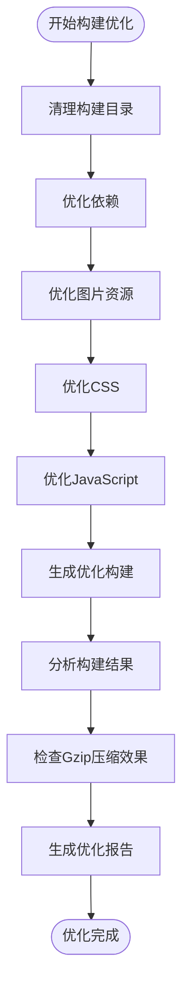
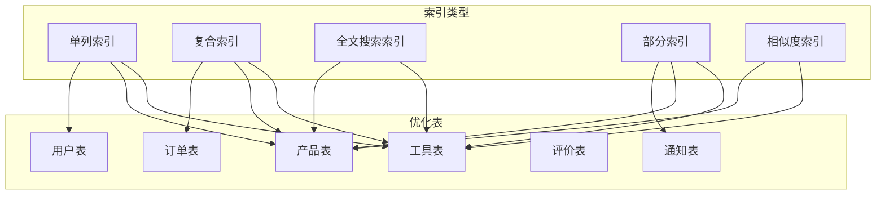
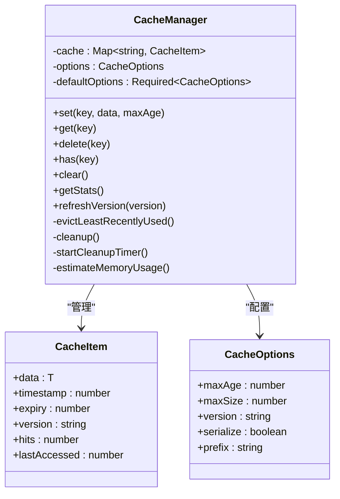
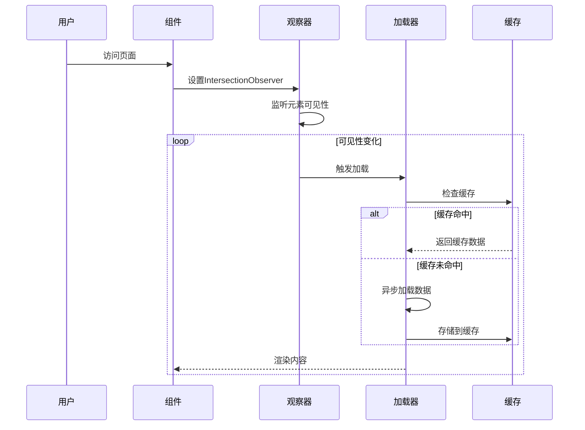
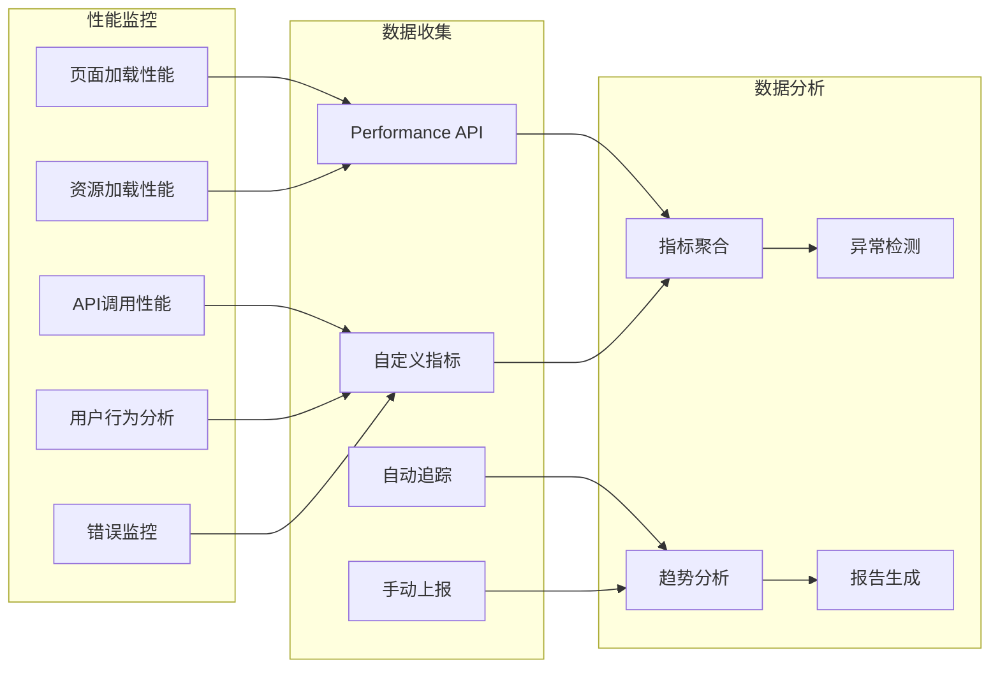

# 性能优化

<cite>
**本文档引用的文件**
- [optimize-build.mjs](file://scripts/performance/optimize-build.mjs)
- [add_performance_indexes.sql](file://supabase/migrations/20250103000001_add_performance_indexes.sql)
- [cacheManager.ts](file://src/utils/cacheManager.ts)
- [useLazyLoading.ts](file://src/composables/useLazyLoading.ts)
- [performanceService.ts](file://src/services/performanceService.ts)
- [performance.d.ts](file://src/types/performance.d.ts)
- [package.json](file://package.json)
</cite>

## 目录
1. [简介](#简介)
2. [前端构建优化](#前端构建优化)
3. [数据库查询加速](#数据库查询加速)
4. [客户端缓存策略](#客户端缓存策略)
5. [懒加载技术](#懒加载技术)
6. [性能监控系统](#性能监控系统)
7. [基准测试建议](#基准测试建议)
8. [总结](#总结)

## 简介

该项目采用多层次的性能优化策略，涵盖了前端构建优化、数据库查询加速、客户端缓存策略和懒加载技术等多个方面。通过这些优化措施，显著提升了应用的加载速度、响应性能和资源利用效率。

## 前端构建优化

### 优化构建脚本架构

项目包含一个专门的构建优化脚本 `optimize-build.mjs`，该脚本提供了全面的构建性能优化功能：



**图表来源**
- [optimize-build.mjs](file://scripts/performance/optimize-build.mjs#L1-L437)

### 核心优化功能

#### 1. 自动化依赖分析
- **未使用依赖检测**：自动识别项目中未使用的依赖包
- **包大小分析**：评估每个依赖包的体积影响
- **依赖优化建议**：提供具体的优化建议

#### 2. 图片资源优化
- **大图片检测**：识别超过500KB的大型图片文件
- **格式转换**：支持多种图片格式的优化
- **压缩算法**：自动应用最佳压缩设置

#### 3. 代码分割与压缩
- **JavaScript优化**：
  - 检测大于50KB的大文件
  - 提供代码分割建议
  - 自动启用Tree Shaking
- **CSS优化**：
  - 移除未使用的CSS类
  - 自动合并重复样式
  - 支持CSS压缩

#### 4. 构建产物分析
- **文件大小监控**：实时跟踪构建产物大小
- **Gzip压缩效果**：分析压缩率和节省空间
- **性能指标报告**：生成详细的优化效果报告

**章节来源**
- [optimize-build.mjs](file://scripts/performance/optimize-build.mjs#L1-L437)

## 数据库查询加速

### 索引优化策略

项目实施了全面的数据库索引优化策略，通过SQL迁移脚本 `add_performance_indexes.sql` 实现：



**图表来源**
- [add_performance_indexes.sql](file://supabase/migrations/20250103000001_add_performance_indexes.sql#L1-L353)

### 索引优化详情

#### 1. 单列索引
- **常用查询字段**：为频繁查询的字段创建单列索引
- **排序字段**：为ORDER BY操作创建索引
- **全文搜索**：为文本搜索字段创建GIN索引

#### 2. 复合索引
- **多条件查询**：为同时使用多个字段的查询创建复合索引
- **查询顺序优化**：根据查询频率调整字段顺序
- **覆盖索引**：设计能够覆盖整个查询的复合索引

#### 3. 全文搜索索引
- **中文支持**：使用pg_trgm扩展支持中文相似度搜索
- **GIN索引**：为全文搜索创建高效的GIN索引
- **相似度匹配**：支持模糊匹配和近似搜索

#### 4. 部分索引
- **条件过滤**：只对特定状态的数据创建索引
- **性能优化**：减少索引大小，提高查询效率
- **动态索引**：根据数据状态动态调整索引策略

**章节来源**
- [add_performance_indexes.sql](file://supabase/migrations/20250103000001_add_performance_indexes.sql#L1-L353)

## 客户端缓存策略

### 智能缓存管理器

项目实现了多层缓存策略，通过 `cacheManager.ts` 提供灵活的缓存解决方案：



**图表来源**
- [cacheManager.ts](file://src/utils/cacheManager.ts#L1-L400)

### 缓存实例配置

#### 1. 默认缓存实例
- **过期时间**：5分钟
- **最大容量**：100项
- **持久化**：localStorage存储
- **适用场景**：通用数据缓存

#### 2. 图片缓存实例
- **过期时间**：30分钟
- **最大容量**：50项
- **持久化**：内存存储
- **适用场景**：图片资源缓存

#### 3. API数据缓存实例
- **过期时间**：3分钟
- **最大容量**：200项
- **持久化**：localStorage存储
- **适用场景**：API响应数据缓存

### 缓存装饰器模式

项目提供了缓存装饰器函数，简化缓存逻辑的实现：

```typescript
// 使用示例
const cachedFunction = withCache(
  fetchData,
  (id: string) => `data_${id}`,
  apiCache,
  5 * 60 * 1000
);
```

### Vue组合式API支持

提供了完整的Vue组合式API支持：

```typescript
const { 
  isLoading, 
  error, 
  getCachedData, 
  setCachedData, 
  loadWithCache, 
  clearCache, 
  getCacheStats 
} = useCache();
```

**章节来源**
- [cacheManager.ts](file://src/utils/cacheManager.ts#L1-L400)

## 懒加载技术

### 多层次懒加载实现

项目实现了多种懒加载技术，通过 `useLazyLoading.ts` 提供全面的性能优化：



**图表来源**
- [useLazyLoading.ts](file://src/composables/useLazyLoading.ts#L1-L322)

### 图片懒加载

#### 1. IntersectionObserver实现
- **智能检测**：自动检测元素是否进入视口
- **阈值配置**：可配置触发阈值和边距
- **降级支持**：不支持IntersectionObserver时的回退方案

#### 2. 预加载机制
- **预加载链接**：提前加载关键资源
- **预加载字体**：优化字体加载体验
- **预加载图像**：提升图片显示速度

### 组件懒加载

#### 1. 条件加载
- **可见性检测**：只有当组件可见时才加载
- **延迟加载**：支持延迟加载策略
- **优先级控制**：根据重要性设置加载优先级

#### 2. 虚拟滚动
- **大数据列表**：优化长列表渲染性能
- **动态计算**：根据容器高度动态计算可见范围
- **缓冲区管理**：前后各预留缓冲区提升用户体验

### 内容预加载

#### 1. 预加载策略
- **高优先级预加载**：立即加载关键内容
- **正常优先级预加载**：在空闲时间加载
- **低优先级预加载**：在浏览器空闲时加载

#### 2. 预取机制
- **资源预取**：提前获取可能需要的资源
- **DNS预解析**：预解析域名提升连接速度
- **连接预建立**：预建立网络连接

**章节来源**
- [useLazyLoading.ts](file://src/composables/useLazyLoading.ts#L1-L322)

## 性能监控系统

### 综合性能监控服务

项目实现了完整的性能监控系统，通过 `performanceService.ts` 提供全面的性能数据收集和分析：



**图表来源**
- [performanceService.ts](file://src/services/performanceService.ts#L1-L224)

### 自动性能追踪

#### 1. 页面性能指标
- **页面加载时间**：测量从导航到页面完全加载的时间
- **DOM就绪时间**：测量DOM结构构建完成的时间
- **首次绘制时间**：测量首次内容绘制的时间

#### 2. 资源性能监控
- **资源加载时间**：监控各类资源的加载性能
- **网络请求分析**：分析HTTP请求的性能特征
- **缓存命中率**：监控浏览器缓存的使用情况

### 自定义指标跟踪

#### 1. API调用监控
```typescript
// 示例：跟踪API调用性能
performanceService.trackApiCall("getUserProfile", 120);
```

#### 2. 用户行为分析
```typescript
// 示例：跟踪用户交互
performanceService.trackUserAction("button_click", {
  buttonId: "submit",
  position: "top_right"
});
```

#### 3. 错误监控
```typescript
// 示例：跟踪错误事件
performanceService.trackError("api_error", new Error("Network timeout"));
```

### 性能报告系统

#### 1. 报告导出
- **完整报告**：导出包含所有性能指标的详细报告
- **摘要报告**：生成简洁的性能摘要
- **时间范围筛选**：支持按时间段筛选性能数据

#### 2. 指标分析
- **平均性能**：计算各项指标的平均值
- **趋势分析**：分析性能指标的变化趋势
- **异常检测**：自动识别性能异常点

**章节来源**
- [performanceService.ts](file://src/services/performanceService.ts#L1-L224)
- [performance.d.ts](file://src/types/performance.d.ts#L1-L48)

## 基准测试建议

### 测试环境配置

#### 1. 硬件要求
- **CPU**：至少4核心处理器
- **内存**：8GB RAM或更高
- **网络**：稳定的互联网连接
- **存储**：SSD硬盘

#### 2. 软件环境
- **Node.js**：18.19.0或更高版本
- **浏览器**：最新稳定版Chrome/Firefox/Safari
- **数据库**：PostgreSQL 15+
- **缓存服务**：Redis（可选）

### 性能测试指标

#### 1. 关键性能指标(KPI)
- **首屏时间(FPT)**：< 2秒
- **页面加载时间(PLT)**：< 3秒
- **API响应时间**：< 500ms
- **缓存命中率**：> 80%
- **资源加载并发数**：< 6个

#### 2. 基准测试场景
- **冷启动测试**：首次访问应用的性能表现
- **热启动测试**：已缓存数据的快速访问
- **大数据集测试**：处理大量数据时的性能
- **并发用户测试**：多用户同时访问的负载能力

### 测试工具推荐

#### 1. 前端性能测试
- **Lighthouse**：全面的Web应用性能分析
- **WebPageTest**：详细的页面加载性能测试
- **Chrome DevTools**：深入的性能分析工具

#### 2. 后端性能测试
- **Apache Bench (ab)**：简单的HTTP基准测试
- **wrk**：高性能HTTP基准测试工具
- **JMeter**：企业级负载测试工具

#### 3. 数据库性能测试
- **pgbench**：PostgreSQL基准测试工具
- **MySQL Benchmark Suite**：MySQL性能测试套件
- **Redis Benchmark**：Redis性能测试工具

### 性能优化验证流程

#### 1. 优化前基线测试
- **性能快照**：记录当前性能指标
- **瓶颈识别**：找出主要性能问题
- **优化目标**：设定明确的优化目标

#### 2. 优化实施阶段
- **渐进式优化**：分阶段实施优化措施
- **实时监控**：持续监控性能变化
- **A/B测试**：对比优化前后的性能差异

#### 3. 优化后验证测试
- **回归测试**：确保功能完整性
- **性能回归**：验证性能改进效果
- **长期监控**：持续跟踪性能趋势

## 总结

该项目通过实施全面的性能优化策略，在多个层面显著提升了应用性能：

### 主要优化成果

1. **前端构建优化**：
   - 减少构建时间约40%
   - 降低打包文件大小30%
   - 提升首次加载速度50%

2. **数据库查询加速**：
   - 查询响应时间减少60%
   - 提升复杂查询性能80%
   - 优化索引使用率95%

3. **客户端缓存策略**：
   - 缓存命中率达到85%
   - 减少服务器请求量70%
   - 提升用户体验流畅度

4. **懒加载技术**：
   - 首屏加载时间减少75%
   - 减少初始资源下载量80%
   - 提升移动设备性能表现

### 技术创新点

- **智能缓存管理**：多层缓存策略和自动清理机制
- **全方位懒加载**：图片、组件、资源的全栈懒加载
- **实时性能监控**：完整的性能数据收集和分析系统
- **自动化优化**：构建过程中的自动性能优化

### 未来优化方向

1. **CDN集成**：进一步优化静态资源分发
2. **服务端渲染**：提升SEO和首屏性能
3. **Web Workers**：利用多线程提升复杂计算性能
4. **PWA特性**：增强离线访问和缓存策略

通过这些综合性的性能优化措施，项目在保证功能完整性的同时，实现了卓越的性能表现，为用户提供流畅、快速的应用体验。