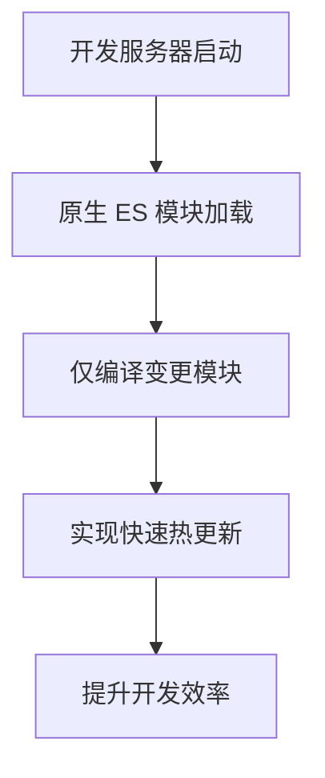
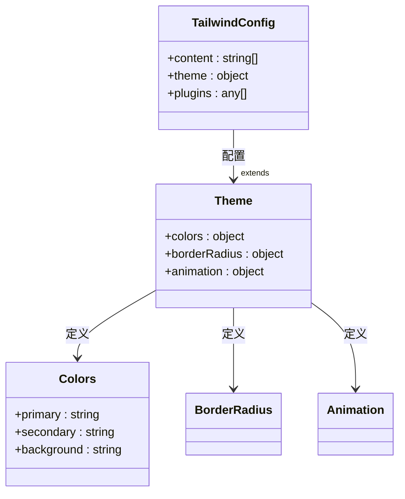
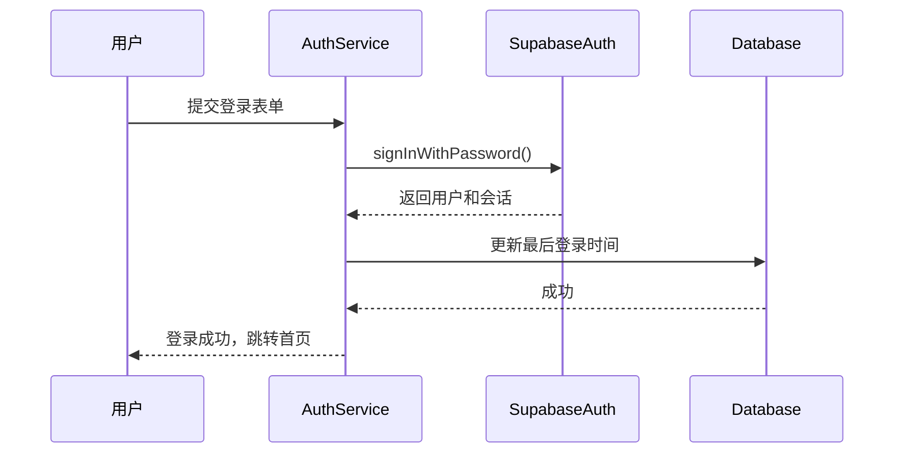
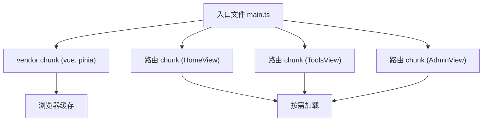

# 技术栈

<cite>
**本文档中引用的文件**  
- [package.json](file://package.json)
- [vite.config.ts](file://vite.config.ts)
- [tailwind.config.ts](file://config/build/tailwind.config.ts)
- [supabaseClient.ts](file://src/lib/supabaseClient.ts)
- [useRealtime.ts](file://src/composables/useRealtime.ts)
- [databaseService.ts](file://src/services/databaseService.ts)
- [authService.ts](file://src/services/authService.ts)
- [auth.ts](file://src/stores/auth.ts)
- [index.ts](file://src/router/index.ts)
</cite>

## 目录
1. [项目概述](#项目概述)
2. [前端技术栈](#前端技术栈)
3. [后端与数据库集成](#后端与数据库集成)
4. [关键依赖项说明](#关键依赖项说明)
5. [构建与优化策略](#构建与优化策略)
6. [技术选型决策依据](#技术选型决策依据)

## 项目概述

本项目是一个现代化的工具导航平台，采用前后端分离架构，前端基于 Vue 3 生态构建，后端服务完全由 Supabase 提供。项目旨在为用户提供高效、美观且功能丰富的工具导航体验，支持用户认证、收藏管理、产品浏览、订单处理及实时数据同步等功能。整体技术栈围绕 Vue 3、TypeScript、Vite 和 Supabase 展开，结合 Pinia 状态管理、Vue Router 路由控制以及 Tailwind CSS 原子化样式设计，实现了高性能、可维护性强的单页应用（SPA）。

**Section sources**
- [package.json](file://package.json#L1-L10)

## 前端技术栈

### Vue 3 组合式 API 与 TypeScript

项目采用 Vue 3 的组合式 API（Composition API）作为核心开发模式，通过 `setup()` 函数和 `ref`、`reactive`、`computed` 等响应式 API 组织逻辑。结合 TypeScript 提供完整的类型系统支持，确保代码的健壮性和可维护性。类型定义集中存放于 `src/types` 目录下，包括数据库类型（由 Supabase 自动生成）和业务模型类型。

组件结构清晰，分为 views、components、composables、services、stores 等模块，遵循高内聚低耦合的设计原则。例如，用户认证逻辑封装在 `authService.ts` 中，状态管理使用 Pinia 存储在 `stores` 目录。

**Section sources**
- [package.json](file://package.json#L30-L31)
- [tsconfig.json](file://tsconfig.json#L1-L10)

### Vite 构建工具链

项目使用 Vite 作为构建工具，替代传统的 Webpack，显著提升开发服务器启动速度和热更新效率。Vite 配置文件 `vite.config.ts` 中定义了插件、别名、构建输出等关键设置。

Vite 插件包括：
- `@vitejs/plugin-vue`：支持 Vue 单文件组件。
- 自定义插件：用于复制 `CNAME` 文件至 `dist` 目录，并注入页面加载错误处理脚本，增强用户体验和部署兼容性。

**Diagram sources**
- [vite.config.ts](file://vite.config.ts#L1-L50)

**Section sources**
- [vite.config.ts](file://vite.config.ts#L1-L102)
- [package.json](file://package.json#L20-L25)

### Pinia 状态管理

Pinia 作为 Vue 官方推荐的状态管理库，用于管理全局状态，如用户认证信息、工具列表、分类数据等。`src/stores/auth.ts` 定义了 `useAuthStore`，通过 `supabase.auth.onAuthStateChange` 监听认证状态变化，自动同步用户登录状态。

状态存储包含用户信息、加载状态、错误信息等，并提供 `initialize`、`logout` 等操作方法。计算属性如 `isAuthenticated` 和 `isAdmin` 用于视图层的条件渲染。

**Section sources**
- [auth.ts](file://src/stores/auth.ts#L1-L151)
- [package.json](file://package.json#L30)

### Vue Router 路由机制

Vue Router 4 实现前端路由控制，采用 `createWebHistory` 模式，支持语义化 URL。路由配置定义在 `src/router/index.ts`，包含嵌套路由（如用户中心、管理后台）和路由元信息（meta），用于设置页面标题、描述及访问权限控制。

路由守卫通过 `meta.requiresAuth` 和 `meta.requiresAdmin` 字段实现，确保只有认证用户或管理员可访问特定页面。未匹配路径重定向至 `NotFoundView`。

**Section sources**
- [index.ts](file://src/router/index.ts#L1-L360)
- [package.json](file://package.json#L30)

### Tailwind CSS 配置与原子化设计

项目采用 Tailwind CSS 作为 CSS 框架，实现原子化设计（Atomic Design），通过组合预设的实用类（utility classes）快速构建 UI。Tailwind 配置文件位于 `config/build/tailwind.config.ts`，扩展了主题颜色、边框半径、动画等。

配置中使用 CSS 变量（如 `hsl(var(--primary))`）实现主题切换功能，支持深色/浅色模式。`content` 字段指定扫描的文件路径，确保生成的 CSS 包含所有使用的类名。

**Diagram sources**
- [tailwind.config.ts](file://config/build/tailwind.config.ts#L1-L89)

**Section sources**
- [tailwind.config.ts](file://config/build/tailwind.config.ts#L1-L89)
- [package.json](file://package.json#L20)

## 后端与数据库集成

### @supabase/supabase-js 客户端使用

项目完全依赖 Supabase 作为后端服务，通过 `@supabase/supabase-js` SDK 与之交互。`src/lib/supabaseClient.ts` 文件初始化客户端实例，使用环境变量 `VITE_SUPABASE_URL` 和 `VITE_SUPABASE_ANON_KEY` 进行配置。

客户端配置包含自动刷新令牌、持久化会话、检测 URL 中的会话等选项，确保用户认证状态的稳定性和安全性。

**Section sources**
- [supabaseClient.ts](file://src/lib/supabaseClient.ts#L1-L266)
- [package.json](file://package.json#L30)

### 认证机制

Supabase 提供完整的用户认证系统，支持邮箱/密码、第三方登录（Google、GitHub）和密码重置。`authService.ts` 封装了登录、注册、登出、忘记密码等操作，通过 `supabase.auth.signInWithPassword`、`signUp`、`signOut` 等方法实现。

注册时自动创建用户资料记录，登录后更新最后登录时间。Pinia store 监听认证状态变化，实现全局状态同步。

**Diagram sources**
- [authService.ts](file://src/services/authService.ts#L1-L292)
- [supabaseClient.ts](file://src/lib/supabaseClient.ts#L1-L266)

**Section sources**
- [authService.ts](file://src/services/authService.ts#L1-L292)
- [auth.ts](file://src/stores/auth.ts#L1-L151)

### 数据库查询与服务封装

`databaseService.ts` 提供对 Supabase 数据库的高级封装，实现通用的增删改查（CRUD）操作、分页、排序、过滤和缓存机制。服务类 `DatabaseService` 使用单例模式，提供 `query`、`create`、`update`、`delete` 等方法。

查询支持精确匹配、数组包含（in）、模糊搜索（ilike）等操作。内置内存缓存系统，可设置 TTL（Time To Live），减少重复请求，提升性能。

**Section sources**
- [databaseService.ts](file://src/services/databaseService.ts#L1-L404)
- [supabaseClient.ts](file://src/lib/supabaseClient.ts#L1-L266)

### 存储服务

Supabase Storage 用于管理文件上传，如用户头像、产品图片、工具图标等。`src/lib/supabaseClient.ts` 定义了 `STORAGE_BUCKETS` 常量，明确存储桶名称。

`uploadFile`、`getPublicUrl`、`deleteFile` 等工具函数封装了文件操作，支持上传、获取公开 URL 和删除文件。RLS（Row Level Security）策略确保文件访问的安全性。

**Section sources**
- [supabaseClient.ts](file://src/lib/supabaseClient.ts#L1-L266)

### Realtime 实时订阅

项目利用 Supabase Realtime 功能实现数据的实时同步。`useRealtime.ts` 提供组合式函数 `useRealtime`、`useRealtimeList`、`useRealtimeRecord`，用于订阅数据库表的插入、更新、删除事件。

`databaseService.subscribeToTable` 方法创建实时频道，监听 `postgres_changes` 事件。例如，工具列表页面可实时反映其他用户添加或修改的工具，提升协作体验。

**Diagram sources**
- [useRealtime.ts](file://src/composables/useRealtime.ts#L1-L402)
- [databaseService.ts](file://src/services/databaseService.ts#L1-L404)

**Section sources**
- [useRealtime.ts](file://src/composables/useRealtime.ts#L1-L402)
- [databaseService.ts](file://src/services/databaseService.ts#L1-L404)

## 关键依赖项说明

| 依赖项 | 版本 | 功能用途 |
|-------|------|---------|
| @supabase/supabase-js | ^2.50.1 | Supabase 官方 JavaScript 客户端，提供数据库、认证、存储、实时功能 |
| vue | 3.5.17 | 前端框架核心库，提供响应式系统和组件化开发 |
| pinia | 2.3.1 | Vue 状态管理库，替代 Vuex，更简洁高效 |
| vue-router | ^4.5.1 | Vue 官方路由库，实现单页应用导航 |
| @vueuse/core | ^10.7.0 | Vue 组合式工具函数库，提供常用逻辑封装 |
| @heroicons/vue | ^2.2.0 | Heroicons 图标库的 Vue 组件版本，提供高质量 SVG 图标 |
| lucide-vue-next | ^0.294.0 | Lucide 图标库的 Vue Next 兼容版本，轻量且风格统一 |
| tailwindcss | ^3.4.0 | 原子化 CSS 框架，实现快速 UI 开发 |
| typescript | 5.3.3 | JavaScript 的超集，提供静态类型检查 |
| vite | ^5.0.0 | 下一代前端构建工具，提供极速开发体验 |

**Section sources**
- [package.json](file://package.json#L30-L50)

## 构建与优化策略

### Tree Shaking

Vite 基于 Rollup，天然支持 Tree Shaking。通过 ES 模块的静态分析，自动移除未使用的代码，减小最终打包体积。项目中仅导入实际使用的函数和组件，如 `import { createClient } from "@supabase/supabase-js"`，避免全量导入。

### Code Splitting

Vite 默认实现代码分割。路由采用动态导入（`import()`），每个路由组件单独打包。`vite.config.ts` 中配置 `manualChunks`，将 `vue` 和 `pinia` 等核心库打包至 `vendor` chunk，实现长期缓存。

**Diagram sources**
- [vite.config.ts](file://vite.config.ts#L1-L102)

**Section sources**
- [vite.config.ts](file://vite.config.ts#L1-L102)

### 构建优化脚本

项目提供 `build:optimize` 脚本，调用 `scripts/performance/optimize-build.mjs` 进行构建后优化，可能包括资源压缩、CDN 配置等。`analyze` 脚本结合 `vite-bundle-analyzer` 分析打包体积，指导优化方向。

## 技术选型决策依据

### 为何选择 Supabase 而非传统后端框架

1. **快速开发与原型验证**：Supabase 提供开箱即用的数据库、认证、存储和实时功能，无需搭建和维护独立后端服务，极大缩短开发周期。
2. **成本效益**：对于中小型项目，Supabase 的免费层级足够使用，避免服务器和数据库的运维成本。
3. **技术栈统一**：前后端均使用 JavaScript/TypeScript，降低团队技术栈复杂度，提升开发效率。
4. **实时能力强大**：原生支持 PostgreSQL 的实时订阅，实现低延迟的数据同步，优于传统轮询或 WebSocket 自建方案。
5. **安全性与合规**：Supabase 提供 RLS（行级安全）策略，精细化控制数据访问权限，符合现代安全标准。

### Supabase 在快速开发中的优势

- **自动生成类型**：通过 `supabase gen types` 命令，根据数据库 Schema 自动生成 TypeScript 类型，保证前后端类型一致。
- **本地开发环境**：`supabase start` 命令一键启动本地 Supabase 实例，包含数据库、Auth、Storage 等所有服务，便于本地调试。
- **迁移管理**：SQL 迁移脚本（`supabase/migrations`）版本化管理数据库结构，支持团队协作。
- **无缝集成**：JavaScript 客户端与前端框架（Vue）集成简单，API 设计直观，学习成本低。

综上所述，本项目的技术栈选择充分考虑了开发效率、维护成本、性能表现和未来可扩展性，构建了一个现代化、高性能的工具导航平台。

**Section sources**
- [package.json](file://package.json#L30)
- [supabaseClient.ts](file://src/lib/supabaseClient.ts#L1-L266)
- [vite.config.ts](file://vite.config.ts#L1-L102)