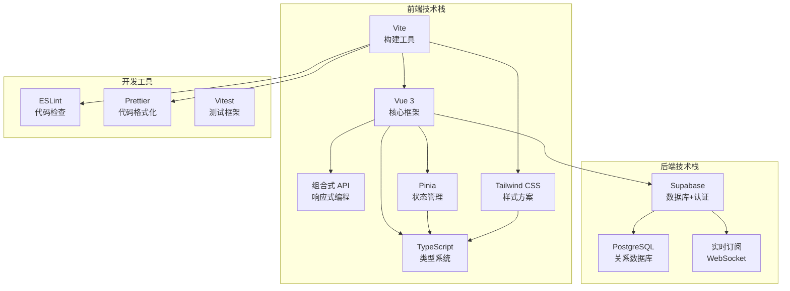
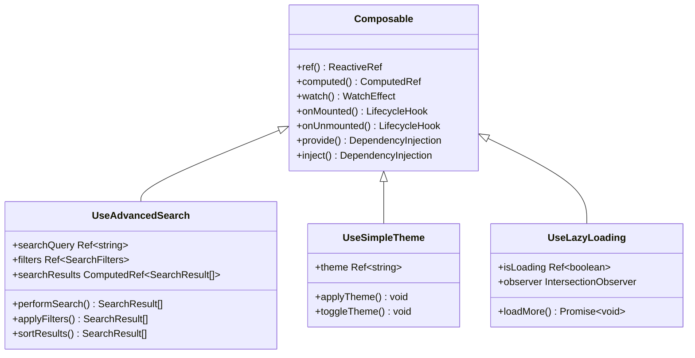
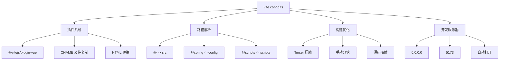
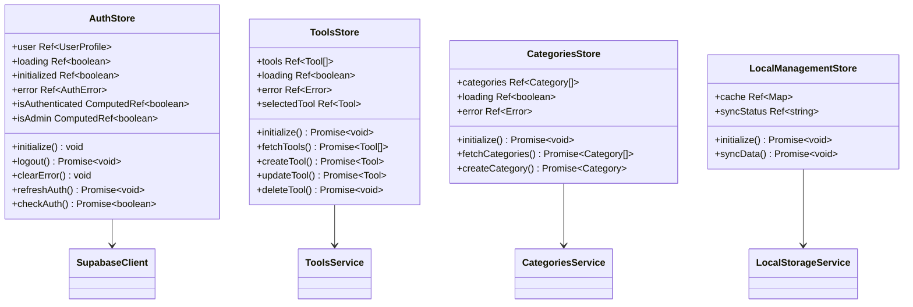
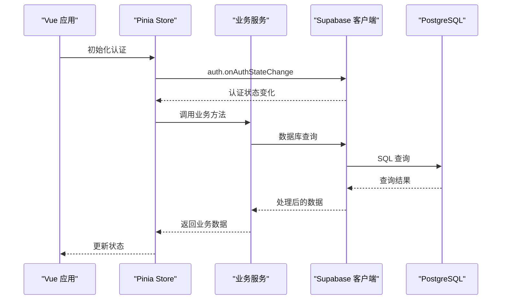
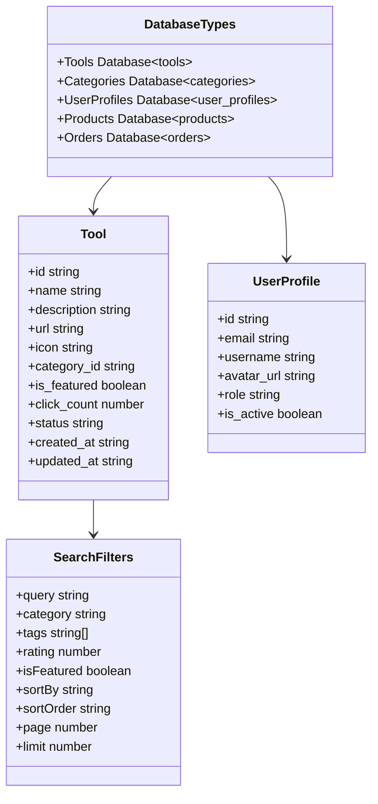
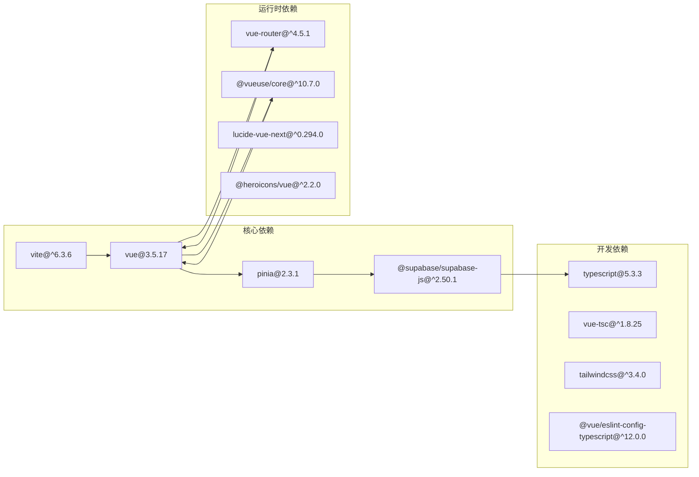

# advanced-tools-navigation 技术栈详解

<cite>
**本文档引用的文件**
- [package.json](file://package.json)
- [vite.config.ts](file://vite.config.ts)
- [src/main.ts](file://src/main.ts)
- [src/lib/supabaseClient.ts](file://src/lib/supabaseClient.ts)
- [src/stores/auth.ts](file://src/stores/auth.ts)
- [src/composables/useAdvancedSearch.ts](file://src/composables/useAdvancedSearch.ts)
- [src/router/index.ts](file://src/router/index.ts)
- [src/services/toolsService.ts](file://src/services/toolsService.ts)
- [src/types/database.ts](file://src/types/database.ts)
- [src/lib/supabase-schema.ts](file://src/lib/supabase-schema.ts)
</cite>

## 目录
1. [项目概述](#项目概述)
2. [前端技术栈架构](#前端技术栈架构)
3. [Vue 3 组合式 API 架构](#vue-3-组合式-api-架构)
4. [构建工具 Vite 配置](#构建工具-vite-配置)
5. [状态管理 Pinia 设计](#状态管理-pinia-设计)
6. [样式方案 Tailwind CSS](#样式方案-tailwind-css)
7. [后端 Supabase 集成](#后端-supabase-集成)
8. [TypeScript 类型系统](#typescript-类型系统)
9. [依赖项协同关系](#依赖项协同关系)
10. [技术栈应用示例](#技术栈应用示例)
11. [性能优化策略](#性能优化策略)
12. [总结](#总结)

## 项目概述

advanced-tools-navigation 是一个现代化的工具导航平台，采用全栈 TypeScript 技术栈构建。该项目展示了现代前端开发的最佳实践，包括 Vue 3 的组合式 API、Vite 构建工具、Pinia 状态管理、Tailwind CSS 样式方案以及 Supabase 后端服务的深度集成。

## 前端技术栈架构



**图表来源**
- [package.json](file://package.json#L25-L50)
- [vite.config.ts](file://vite.config.ts#L1-L20)

## Vue 3 组合式 API 架构

Vue 3 的组合式 API 是整个应用的核心架构模式，提供了更好的逻辑复用和组件组织能力。

### 组合式 API 核心特性



**图表来源**
- [src/composables/useAdvancedSearch.ts](file://src/composables/useAdvancedSearch.ts#L1-L50)
- [src/composables/useSimpleTheme.ts](file://src/composables/useSimpleTheme.ts)

### 组合式 API 实际应用

应用中的组合式 API 主要体现在以下几个方面：

1. **高级搜索功能**：`useAdvancedSearch` 提供了智能搜索算法和过滤器
2. **主题切换**：`useSimpleTheme` 实现了动态主题切换
3. **懒加载**：`useLazyLoading` 优化了组件渲染性能

**章节来源**
- [src/composables/useAdvancedSearch.ts](file://src/composables/useAdvancedSearch.ts#L1-L306)

## 构建工具 Vite 配置

Vite 作为现代化的构建工具，在项目中提供了出色的开发体验和生产优化。

### Vite 核心配置特点



**图表来源**
- [vite.config.ts](file://vite.config.ts#L1-L104)

### Vite 配置优化点

1. **别名配置**：通过 `resolve.alias` 提供了清晰的路径别名
2. **插件扩展**：自定义插件实现 CNAME 文件复制和 HTML 优化
3. **构建优化**：使用 Terser 进行代码压缩，保留必要的函数名
4. **开发体验**：热重载和快速启动

**章节来源**
- [vite.config.ts](file://vite.config.ts#L1-L104)

## 状态管理 Pinia 设计

Pinia 是 Vue 3 的官方状态管理库，提供了类型安全和直观的 API。

### Pinia Store 架构



**图表来源**
- [src/stores/auth.ts](file://src/stores/auth.ts#L1-L50)
- [src/stores/tools.ts](file://src/stores/tools.ts)

### Pinia 的设计优势

1. **类型安全**：完整的 TypeScript 支持
2. **模块化**：每个 Store 负责特定领域
3. **响应式**：自动追踪依赖关系
4. **持久化**：支持本地存储同步

**章节来源**
- [src/stores/auth.ts](file://src/stores/auth.ts#L1-L190)

## 样式方案 Tailwind CSS

Tailwind CSS 提供了实用优先的原子化 CSS 类，实现了快速开发和一致的样式管理。

### Tailwind CSS 集成特点

虽然项目中没有直接的 Tailwind CSS 配置文件，但从代码中可以看出其广泛应用：

1. **原子化类名**：大量使用 `class="..."` 属性
2. **响应式设计**：利用 Tailwind 的响应式前缀
3. **主题定制**：通过 CSS 变量实现主题切换
4. **性能优化**：仅打包使用的样式类

### 样式应用示例

```html
<!-- 主题切换按钮 -->
<button 
    class="bg-blue-500 hover:bg-blue-600 text-white px-4 py-2 rounded-lg shadow-md"
    @click="toggleTheme"
>
    切换主题
</button>

<!-- 响应式布局 -->
<div class="grid grid-cols-1 md:grid-cols-2 lg:grid-cols-3 gap-4">
    <!-- 工具卡片 -->
    <div class="bg-white dark:bg-gray-800 rounded-lg shadow-lg p-4">
        
        <h3 class="text-xl font-bold text-center">{{ tool.name }}</h3>
    </div>
</div>
```

## 后端 Supabase 集成

Supabase 作为 Firebase 替代方案，提供了完整的后端服务，包括数据库、认证和存储。

### Supabase 集成架构



**图表来源**
- [src/lib/supabaseClient.ts](file://src/lib/supabaseClient.ts#L1-L50)
- [src/stores/auth.ts](file://src/stores/auth.ts#L60-L90)

### Supabase 核心功能

1. **认证系统**：基于 JWT 的用户认证
2. **数据库操作**：类型安全的 CRUD 操作
3. **实时订阅**：WebSocket 实时数据同步
4. **文件存储**：云存储和 CDN 加速
5. **RLS 策略**：行级安全控制

**章节来源**
- [src/lib/supabaseClient.ts](file://src/lib/supabaseClient.ts#L1-L246)

## TypeScript 类型系统

TypeScript 在整个项目中提供了强大的类型安全保障，确保代码质量和开发体验。

### 类型系统架构



**图表来源**
- [src/lib/supabase-schema.ts](file://src/lib/supabase-schema.ts#L1-L100)
- [src/types/database.ts](file://src/types/database.ts#L1-L3)

### 类型系统应用实践

1. **数据库类型生成**：通过 Supabase CLI 自动生成类型
2. **接口定义**：清晰的业务接口定义
3. **泛型使用**：灵活的数据处理
4. **类型推断**：减少冗余类型声明

**章节来源**
- [src/lib/supabase-schema.ts](file://src/lib/supabase-schema.ts#L1-L305)
- [src/types/database.ts](file://src/types/database.ts#L1-L3)

## 依赖项协同关系

项目中的各个依赖项形成了紧密的协同关系，共同支撑起完整的应用架构。

### 核心依赖关系图



**图表来源**
- [package.json](file://package.json#L25-L50)

### 依赖项协同机制

1. **Vue 3 生态系统**：Vue 3 为核心，衍生出完整的生态系统
2. **TypeScript 集成**：所有主要依赖都提供类型定义
3. **构建工具链**：Vite 与 Vue 3 深度集成
4. **开发工具配合**：ESLint、Prettier 与 TypeScript 协同工作

**章节来源**
- [package.json](file://package.json#L1-L104)

## 技术栈应用示例

### 1. Vue 3 组合式 API 示例

```typescript
// useAdvancedSearch.ts - 高级搜索组合式 API
export function useAdvancedSearch() {
  const toolsStore = useToolsStore();
  const searchQuery = ref("");
  const filters = ref<SearchFilters>({});
  
  const searchResults = computed(() => {
    if (!toolsStore.tools.length) return [];
    
    let results = performSearch(searchQuery.value, toolsStore.tools);
    results = applyFilters(results);
    results = sortResults(results);
    
    return results;
  });
  
  return {
    searchQuery,
    filters,
    searchResults,
    search,
    clearSearch,
    resetFilters,
  };
}
```

### 2. Pinia 状态管理示例

```typescript
// auth.ts - 认证状态管理
export const useAuthStore = defineStore("auth", () => {
  const user = ref<UserProfile | null>(null);
  const loading = ref(false);
  const initialized = ref(false);
  
  const isAuthenticated = computed(() => !!user.value);
  const isAdmin = computed(() => {
    return user.value?.role === "admin" || user.value?.role === "super_admin";
  });
  
  function initialize() {
    const { data: { subscription } } = supabase.auth.onAuthStateChange(
      async (event, session) => {
        // 处理认证状态变化
      }
    );
  }
  
  return {
    user,
    loading,
    initialized,
    isAuthenticated,
    isAdmin,
    initialize,
    logout,
  };
});
```

### 3. Supabase 数据库操作示例

```typescript
// toolsService.ts - 工具数据服务
export class ToolsService {
  static async getTools(filters?: SearchFilters): Promise<SearchResult<Tool>> {
    const cacheKey = `tools_${JSON.stringify(filters || {})}`;
    
    return withCache(
      this._getToolsFromAPI.bind(this),
      () => cacheKey,
      apiCache,
      2 * 60 * 1000,
    )(filters);
  }
  
  private static async _getToolsFromAPI(filters?: SearchFilters) {
    let query = supabase
      .from(TABLES.TOOLS)
      .select("*, categories(*)")
      .eq("status", TOOL_STATUS.ACTIVE);
    
    if (filters?.query) {
      query = query.or(
        `name.ilike.%${filters.query}%,description.ilike.%${filters.query}%`
      );
    }
    
    const { data, error, count } = await query;
    // 处理返回结果...
  }
}
```

### 4. 路由守卫示例

```typescript
// router/index.ts - 路由守卫
router.beforeEach(async (to, from, next) => {
  const authStore = useAuthStore();
  
  if (to.meta.requiresAuth) {
    const isAuthenticated = authStore.isAuthenticated;
    
    if (!isAuthenticated) {
      await authStore.refreshAuth();
      
      if (!authStore.isAuthenticated) {
        return next({
          name: 'Login',
          query: { redirect: to.fullPath }
        });
      }
    }
  }
  
  if (to.meta.requiresAdmin) {
    const isAdmin = await authStore.isAdminFunction();
    if (!isAdmin) {
      return next({ name: 'NotFound' });
    }
  }
  
  next();
});
```

**章节来源**
- [src/composables/useAdvancedSearch.ts](file://src/composables/useAdvancedSearch.ts#L1-L306)
- [src/stores/auth.ts](file://src/stores/auth.ts#L1-L190)
- [src/services/toolsService.ts](file://src/services/toolsService.ts#L1-L100)
- [src/router/index.ts](file://src/router/index.ts#L300-L350)

## 性能优化策略

### 1. 缓存策略

项目实现了多层次的缓存机制：

```typescript
// 缓存装饰器模式
export const withCache = async (
  fn: (...args: any[]) => Promise<any>,
  getKey: () => string,
  cache: Map<string, any>,
  ttl: number
) => {
  const key = getKey();
  const cached = cache.get(key);
  
  if (cached && Date.now() - cached.timestamp < ttl) {
    return cached.data;
  }
  
  const result = await fn();
  cache.set(key, { data: result, timestamp: Date.now() });
  return result;
};
```

### 2. 懒加载优化

```typescript
// 路由懒加载
const routes: RouteRecordRaw[] = [
  {
    path: "/tools",
    name: "Tools",
    component: () => import("../views/ToolsView.vue"),
  },
  {
    path: "/products",
    name: "Products",
    component: () => import("@/views/ProductsView.vue"),
  },
];
```

### 3. 构建优化

Vite 配置中的优化选项：
- **代码分割**：手动分块配置
- **Tree Shaking**：自动移除未使用代码
- **压缩优化**：Terser 压缩配置
- **资源优化**：静态资源处理

## 总结

advanced-tools-navigation 展示了一个现代化全栈 TypeScript 应用的完整技术栈实现。通过 Vue 3 的组合式 API、Vite 构建工具、Pinia 状态管理、Tailwind CSS 样式方案和 Supabase 后端服务的深度集成，项目实现了：

1. **现代化开发体验**：TypeScript 类型安全 + Vue 3 组合式 API
2. **高性能构建**：Vite 快速开发 + 优化的生产构建
3. **可维护的状态管理**：Pinia 类型安全的状态管理
4. **优雅的样式方案**：Tailwind CSS 原子化样式
5. **完整的后端服务**：Supabase 提供的数据库和认证
6. **优秀的性能表现**：缓存策略 + 懒加载 + 代码分割

这个技术栈不仅提供了良好的开发体验，还确保了应用的可维护性和扩展性，是现代 Web 应用开发的优秀范例。