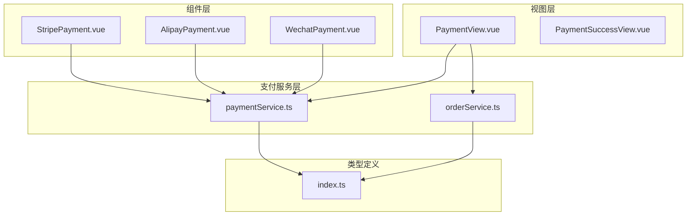
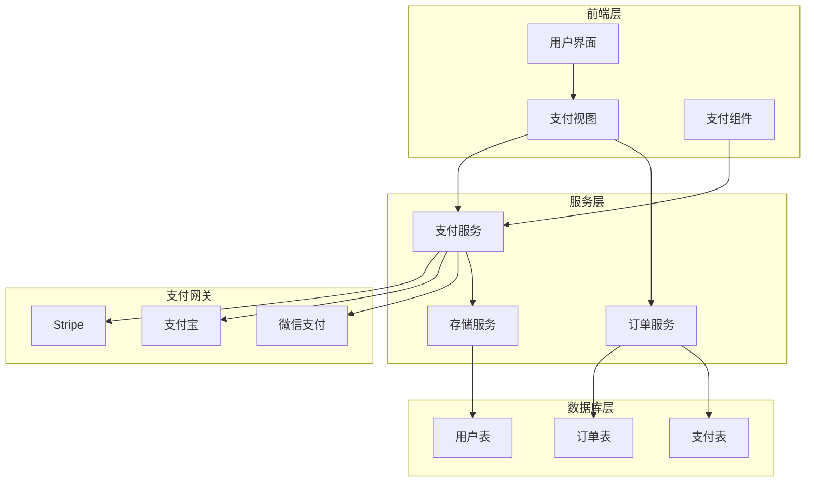
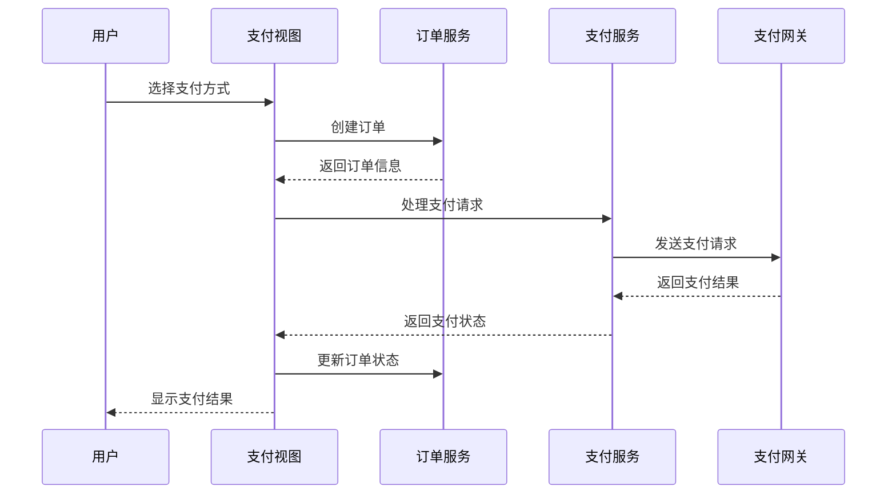
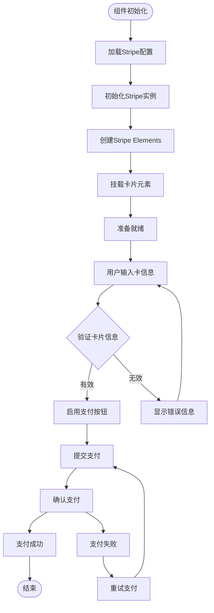
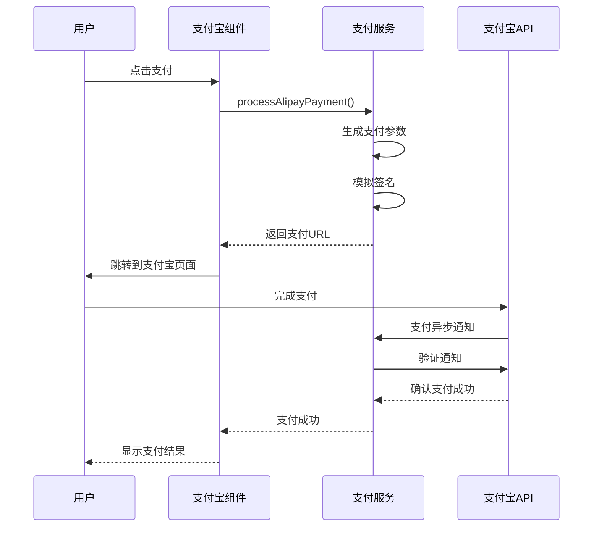
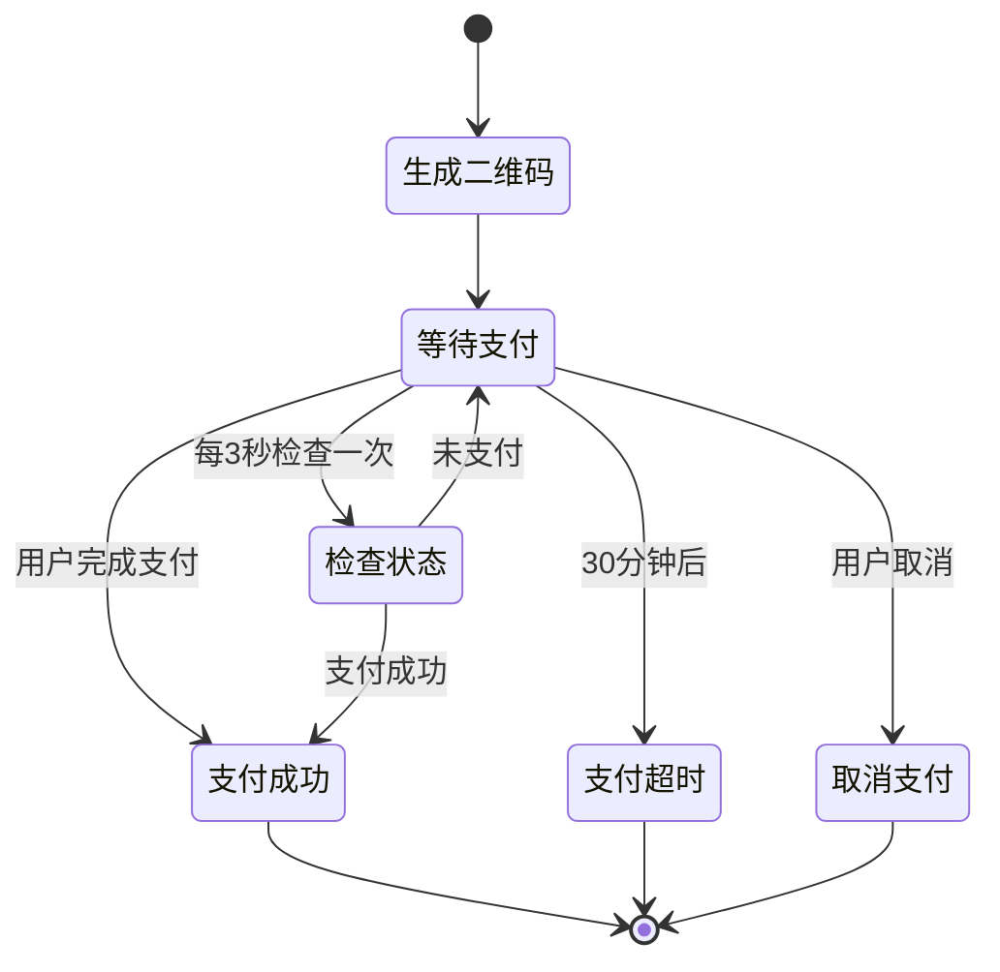
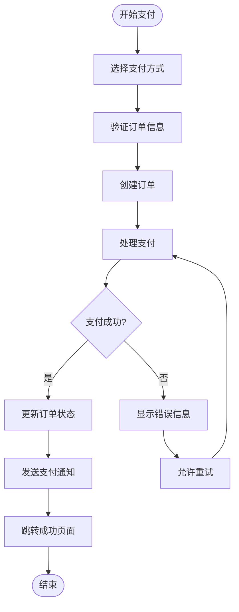

# 支付服务集成

<cite>
**本文档引用的文件**
- [paymentService.ts](file://src/services/paymentService.ts)
- [PaymentView.vue](file://src/views/PaymentView.vue)
- [StripePayment.vue](file://src/components/StripePayment.vue)
- [AlipayPayment.vue](file://src/components/AlipayPayment.vue)
- [WechatPayment.vue](file://src/components/WechatPayment.vue)
- [orderService.ts](file://src/services/orderService.ts)
- [PaymentSuccessView.vue](file://src/views/PaymentSuccessView.vue)
- [index.ts](file://src/types/index.ts)
</cite>

## 目录
1. [简介](#简介)
2. [项目结构](#项目结构)
3. [核心组件](#核心组件)
4. [架构概览](#架构概览)
5. [详细组件分析](#详细组件分析)
6. [支付流程](#支付流程)
7. [安全考虑](#安全考虑)
8. [故障排除指南](#故障排除指南)
9. [性能优化](#性能优化)
10. [结论](#结论)

## 简介

本支付服务集成系统是一个现代化的多渠道支付解决方案，支持Stripe、支付宝和微信支付三种主流支付方式。该系统采用Vue 3 + TypeScript技术栈构建，提供了完整的支付处理流程，包括订单创建、支付处理、状态跟踪和支付成功后的处理逻辑。

系统设计遵循最佳实践，确保支付过程的安全性、可靠性和用户体验。通过模块化的架构设计，系统能够轻松扩展新的支付方式，并提供统一的接口来处理不同支付网关的差异。

## 项目结构

支付服务集成系统的核心文件组织如下：



**图表来源**
- [paymentService.ts](file://src/services/paymentService.ts#L1-L328)
- [orderService.ts](file://src/services/orderService.ts#L1-L704)
- [PaymentView.vue](file://src/views/PaymentView.vue#L1-L786)

**章节来源**
- [paymentService.ts](file://src/services/paymentService.ts#L1-L50)
- [orderService.ts](file://src/services/orderService.ts#L1-L50)

## 核心组件

### 支付服务类 (PaymentService)

PaymentService是整个支付系统的核心控制器，负责协调不同支付网关的操作：

```typescript
export class PaymentService {
  // 处理Stripe支付
  static async processStripePayment(paymentData: PaymentData): Promise<PaymentResult>
  
  // 确认Stripe支付
  static async confirmStripePayment(clientSecret: string, paymentMethodId: string): Promise<PaymentResult>
  
  // 处理支付宝支付
  static async processAlipayPayment(paymentData: PaymentData): Promise<PaymentResult>
  
  // 处理微信支付
  static async processWechatPayment(paymentData: PaymentData): Promise<PaymentResult>
  
  // 根据支付方式处理支付
  static async processPayment(paymentData: PaymentData, method: string): Promise<PaymentResult>
}
```

### 订单服务类 (OrderService)

OrderService管理订单生命周期，包括订单创建、支付处理和状态更新：

```typescript
export class OrderService {
  // 创建订单
  static async createOrder(orderData: CreateOrderData, userId: string): Promise<Order>
  
  // 处理支付
  static async processPayment(paymentData: PaymentData): Promise<void>
  
  // 获取用户订单列表
  static async getUserOrders(userId: string): Promise<Order[]>
  
  // 获取订单详情
  static async getOrderById(orderId: string, userId: string): Promise<Order | null>
}
```

**章节来源**
- [paymentService.ts](file://src/services/paymentService.ts#L35-L328)
- [orderService.ts](file://src/services/orderService.ts#L25-L704)

## 架构概览

系统采用分层架构设计，确保职责分离和代码可维护性：



**图表来源**
- [PaymentView.vue](file://src/views/PaymentView.vue#L1-L100)
- [paymentService.ts](file://src/services/paymentService.ts#L1-L100)
- [orderService.ts](file://src/services/orderService.ts#L1-L100)

## 详细组件分析

### 支付视图组件 (PaymentView.vue)

PaymentView是用户支付的主要入口点，提供完整的支付流程体验：



**图表来源**
- [PaymentView.vue](file://src/views/PaymentView.vue#L250-L350)
- [orderService.ts](file://src/services/orderService.ts#L30-L100)
- [paymentService.ts](file://src/services/paymentService.ts#L50-L150)

#### 支付方式选择

系统支持三种主要支付方式：

1. **Stripe支付** - 支持信用卡支付
2. **支付宝支付** - 支持多种支付方式
3. **微信支付** - 支持二维码支付

每种支付方式都有对应的组件和处理逻辑，确保用户可以根据自己的偏好选择合适的支付方式。

#### 订单信息展示

支付视图会详细展示订单信息，包括：
- 商品列表和价格
- 总金额计算
- 折扣信息
- 账单地址输入

**章节来源**
- [PaymentView.vue](file://src/views/PaymentView.vue#L1-L200)
- [PaymentView.vue](file://src/views/PaymentView.vue#L250-L400)

### Stripe支付组件 (StripePayment.vue)

StripePayment组件专门处理信用卡支付，提供安全的支付体验：



**图表来源**
- [StripePayment.vue](file://src/components/StripePayment.vue#L50-L150)
- [paymentService.ts](file://src/services/paymentService.ts#L50-L120)

#### 安全特性

StripePayment组件实现了多项安全措施：

1. **PCI合规** - 使用Stripe Elements确保支付数据安全传输
2. **实时验证** - 卡片信息实时验证，减少支付失败
3. **错误处理** - 完善的错误处理机制，提供清晰的错误信息
4. **重试功能** - 支持支付失败后的重试操作

**章节来源**
- [StripePayment.vue](file://src/components/StripePayment.vue#L1-L300)

### 支付宝支付组件 (AlipayPayment.vue)

AlipayPayment组件处理支付宝支付流程，支持多种支付场景：



**图表来源**
- [AlipayPayment.vue](file://src/components/AlipayPayment.vue#L50-L150)
- [paymentService.ts](file://src/services/paymentService.ts#L150-L220)

#### 支付流程特点

1. **模拟支付** - 开发环境模拟支付宝支付流程
2. **异步通知** - 支持支付宝异步通知机制
3. **状态检查** - 提供支付状态检查功能
4. **超时处理** - 实现支付超时保护机制

**章节来源**
- [AlipayPayment.vue](file://src/components/AlipayPayment.vue#L1-L291)

### 微信支付组件 (WechatPayment.vue)

WechatPayment组件提供二维码支付功能，支持移动端支付场景：



**图表来源**
- [WechatPayment.vue](file://src/components/WechatPayment.vue#L100-L200)
- [paymentService.ts](file://src/services/paymentService.ts#L220-L300)

#### 移动端优化

微信支付组件针对移动设备进行了优化：

1. **二维码生成** - 自动生成支付二维码
2. **扫码指导** - 提供详细的扫码步骤说明
3. **倒计时提醒** - 显示支付有效期
4. **状态监控** - 实时监控支付状态

**章节来源**
- [WechatPayment.vue](file://src/components/WechatPayment.vue#L1-L505)

## 支付流程

### 整体支付流程



**图表来源**
- [PaymentView.vue](file://src/views/PaymentView.vue#L250-L400)
- [orderService.ts](file://src/services/orderService.ts#L100-L200)

### 支付状态管理

系统实现了完整的支付状态管理机制：

1. **订单状态流转**
   - `pending` - 待支付
   - `paid` - 已支付
   - `cancelled` - 已取消
   - `refunded` - 已退款

2. **支付状态同步**
   - 实时状态检查
   - 异步通知处理
   - 手动状态刷新

**章节来源**
- [orderService.ts](file://src/services/orderService.ts#L100-L200)
- [PaymentSuccessView.vue](file://src/views/PaymentSuccessView.vue#L1-L100)

## 安全考虑

### 数据传输安全

1. **HTTPS加密** - 所有支付数据通过HTTPS传输
2. **敏感信息保护** - 不在前端存储敏感支付信息
3. **CSRF防护** - 实现跨站请求伪造防护
4. **XSS防护** - 输入验证和输出编码

### 支付安全措施

1. **PCI DSS合规** - 遵循支付卡行业数据安全标准
2. **令牌化** - 使用支付网关提供的令牌化服务
3. **双重验证** - 支持二次验证机制
4. **欺诈检测** - 集成支付网关的欺诈检测功能

### 错误处理策略

```typescript
// 支付错误处理示例
try {
  const result = await PaymentService.processPayment(data, method);
  if (!result.success) {
    throw new Error(result.message || '支付处理失败');
  }
} catch (error) {
  // 记录错误日志
  console.error('支付错误:', error);
  // 显示友好错误信息
  showError('支付失败，请重试');
}
```

**章节来源**
- [paymentService.ts](file://src/services/paymentService.ts#L1-L50)
- [StripePayment.vue](file://src/components/StripePayment.vue#L100-L200)

## 故障排除指南

### 常见支付问题

#### Stripe支付问题

1. **初始化失败**
   - 检查VITE_STRIPE_PUBLIC_KEY配置
   - 确认网络连接正常
   - 验证Stripe账户状态

2. **支付确认失败**
   - 检查客户端密钥有效性
   - 验证支付方法ID
   - 确认支付意图状态

#### 支付宝支付问题

1. **跳转失败**
   - 检查APP_ID配置
   - 验证签名算法
   - 确认网关URL正确

2. **异步通知失败**
   - 检查通知URL配置
   - 验证签名验证逻辑
   - 确认服务器可访问性

#### 微信支付问题

1. **二维码生成失败**
   - 检查APP_ID和MCH_ID配置
   - 验证API密钥设置
   - 确认商户证书有效性

2. **支付状态检查失败**
   - 检查网络连接
   - 验证签名算法
   - 确认时间同步

### 调试工具和技巧

1. **浏览器开发者工具**
   - Network面板检查API请求
   - Console面板查看错误信息
   - Application面板检查本地存储

2. **日志分析**
   - 启用详细日志记录
   - 分析支付流程日志
   - 监控错误率和响应时间

3. **测试环境配置**
   - 使用沙箱环境测试
   - 模拟各种支付场景
   - 验证边界条件处理

**章节来源**
- [paymentService.ts](file://src/services/paymentService.ts#L200-L328)
- [StripePayment.vue](file://src/components/StripePayment.vue#L200-L300)

## 性能优化

### 前端性能优化

1. **懒加载组件**
   ```typescript
   // 按需加载支付组件
   const { StripePayment } = await import('@/components/StripePayment.vue');
   ```

2. **缓存策略**
   - 缓存支付配置信息
   - 缓存Stripe实例
   - 实现智能重试机制

3. **用户体验优化**
   - 加载状态指示器
   - 实时进度反馈
   - 错误恢复机制

### 后端性能优化

1. **数据库优化**
   - 适当的索引设计
   - 查询性能监控
   - 连接池管理

2. **API性能**
   - 请求限流控制
   - 缓存热点数据
   - 异步处理耗时操作

### 监控和告警

1. **关键指标监控**
   - 支付成功率
   - 平均响应时间
   - 错误率统计

2. **告警机制**
   - 支付失败告警
   - 性能下降告警
   - 安全事件告警

## 结论

本支付服务集成系统提供了一个完整、安全、高性能的支付解决方案。通过模块化的设计和标准化的接口，系统能够轻松适应不同的业务需求和技术变更。

### 主要优势

1. **多渠道支持** - 支持主流支付方式，满足不同用户需求
2. **安全性保障** - 采用业界最佳实践，确保支付安全
3. **用户体验** - 提供流畅的支付体验和完善的错误处理
4. **可扩展性** - 模块化设计便于添加新的支付方式
5. **易于维护** - 清晰的代码结构和完善的文档

### 未来发展方向

1. **更多支付方式** - 支持PayPal、Apple Pay等更多支付渠道
2. **国际化支持** - 支持多语言和多币种支付
3. **增强安全** - 集成生物识别支付和高级欺诈检测
4. **数据分析** - 提供支付行为分析和用户画像
5. **自动化运维** - 实现支付系统的自动化部署和监控

通过持续的优化和改进，该支付系统将继续为用户提供安全、便捷、高效的支付体验。