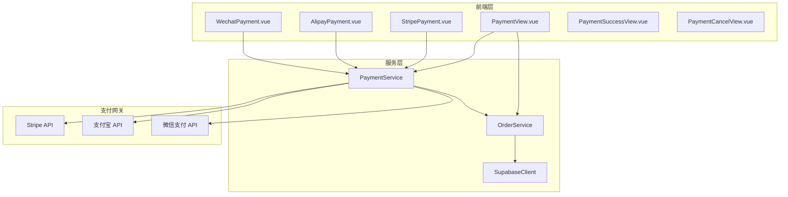
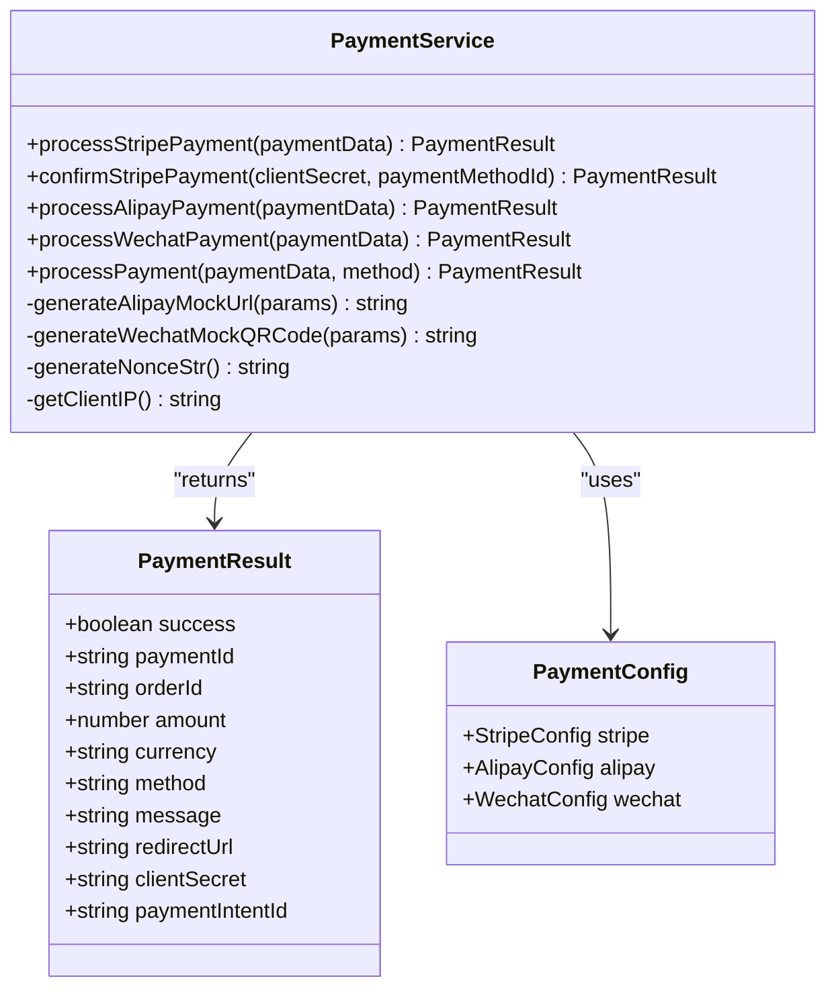
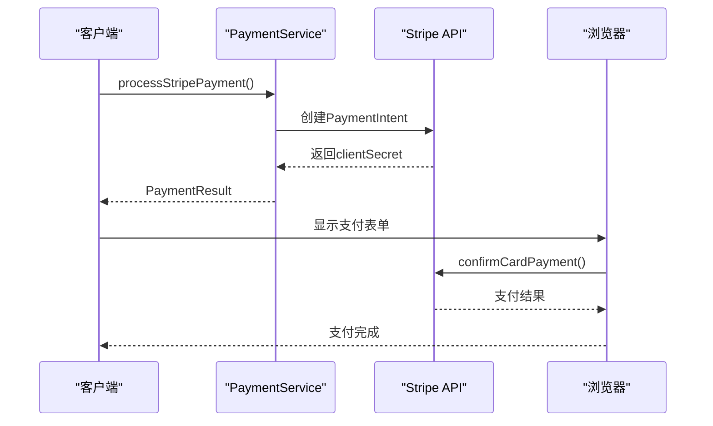
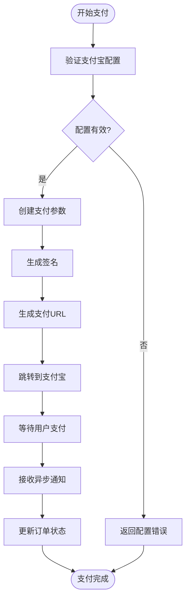
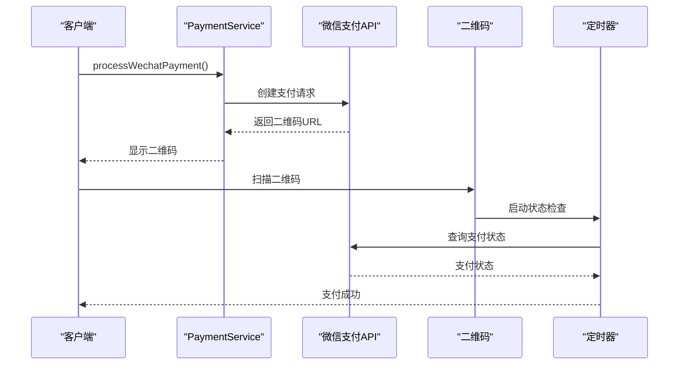
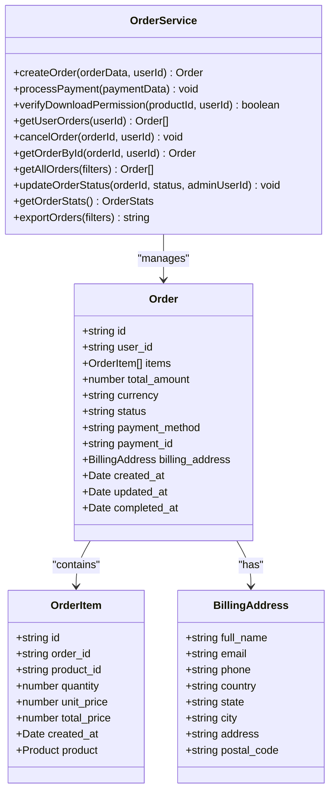
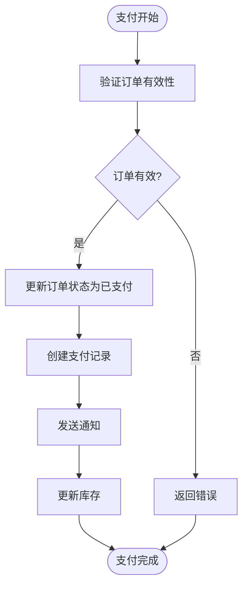
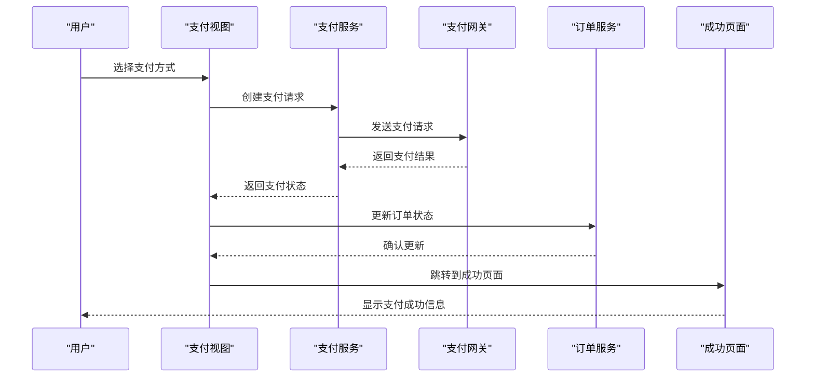
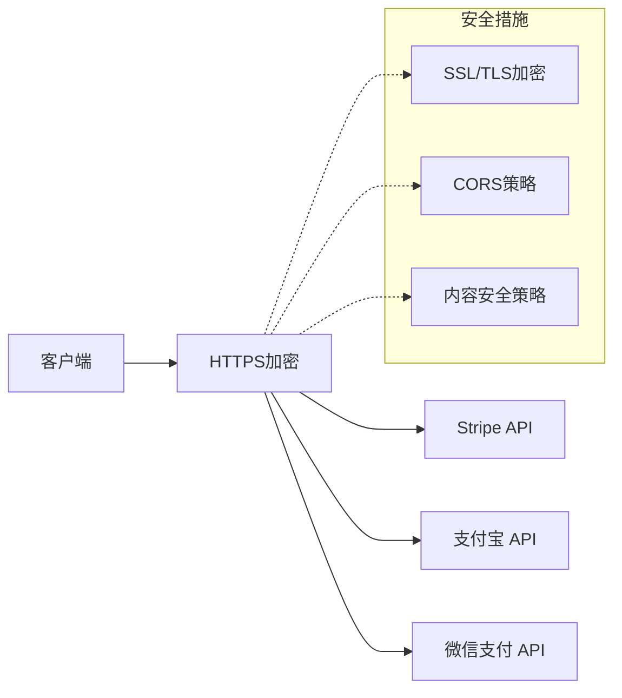

# 支付系统集成

<cite>
**本文档引用的文件**
- [paymentService.ts](file://src/services/paymentService.ts)
- [StripePayment.vue](file://src/components/StripePayment.vue)
- [AlipayPayment.vue](file://src/components/AlipayPayment.vue)
- [WechatPayment.vue](file://src/components/WechatPayment.vue)
- [PaymentView.vue](file://src/views/PaymentView.vue)
- [PaymentSuccessView.vue](file://src/views/PaymentSuccessView.vue)
- [PaymentCancelView.vue](file://src/views/PaymentCancelView.vue)
- [orderService.ts](file://src/services/orderService.ts)
- [PAYMENT_SETUP.md](file://PAYMENT_SETUP.md)
- [env.d.ts](file://env.d.ts)
</cite>

## 目录
1. [简介](#简介)
2. [项目架构概览](#项目架构概览)
3. [核心支付组件](#核心支付组件)
4. [支付服务架构](#支付服务架构)
5. [支付网关集成](#支付网关集成)
6. [订单管理系统](#订单管理系统)
7. [支付流程详解](#支付流程详解)
8. [安全考虑](#安全考虑)
9. [故障排除指南](#故障排除指南)
10. [最佳实践](#最佳实践)

## 简介

本支付系统是一个基于Vue 3和TypeScript构建的现代化支付解决方案，集成了三大主流支付网关：Stripe、支付宝和微信支付。该系统采用模块化设计，提供统一的支付接口，支持多种支付方式，具备完整的订单管理功能和安全的支付处理机制。

系统的核心特点包括：
- **多支付网关支持**：同时集成Stripe、支付宝和微信支付
- **响应式设计**：适配桌面和移动设备的支付界面
- **实时状态更新**：支持支付状态的实时监控和更新
- **完整的订单生命周期管理**：从创建到完成的全流程管理
- **安全的支付处理**：采用业界标准的安全协议和最佳实践

## 项目架构概览



**图表来源**
- [PaymentView.vue](file://src/views/PaymentView.vue#L1-L50)
- [paymentService.ts](file://src/services/paymentService.ts#L1-L30)
- [orderService.ts](file://src/services/orderService.ts#L1-L30)

**章节来源**
- [PaymentView.vue](file://src/views/PaymentView.vue#L1-L100)
- [paymentService.ts](file://src/services/paymentService.ts#L1-L50)

## 核心支付组件

### 支付视图组件 (PaymentView.vue)

支付视图是整个支付流程的入口点，负责协调不同支付方式的选择和初始化：

```typescript
// 支付方式配置
const paymentMethods = [
  {
    id: "alipay",
    name: "支付宝",
    description: "使用支付宝安全快捷支付",
    icon: "/payment-alipay.png",
  },
  {
    id: "wechat",
    name: "微信支付",
    description: "使用微信支付便捷支付",
    icon: "/payment-wechat.png",
  },
  {
    id: "stripe",
    name: "信用卡",
    description: "支持 Visa、MasterCard 等",
    icon: "/payment-stripe.png",
  },
];
```

组件特性：
- **动态支付方式切换**：根据用户选择动态加载对应的支付组件
- **订单信息展示**：显示详细的订单摘要和账单信息
- **表单验证**：确保用户填写完整的账单信息
- **状态管理**：跟踪支付流程的各个阶段状态

### Stripe 支付组件 (StripePayment.vue)

Stripe组件提供了专业的信用卡支付体验：

```typescript
// Stripe初始化配置
const initializeStripe = async () => {
  const stripePublicKey = import.meta.env.VITE_STRIPE_PUBLIC_KEY;
  if (!stripePublicKey) {
    throw new Error('Stripe 公钥未配置');
  }

  stripe = await loadStripe(stripePublicKey);
  elements = stripe.elements();
  
  // 创建卡片元素
  card = elements.create('card', {
    style: {
      base: {
        fontSize: '16px',
        color: '#424770',
      },
    },
  });
};
```

组件功能：
- **安全的卡片输入**：使用Stripe Elements确保卡片信息安全
- **实时验证**：即时验证卡片信息的有效性
- **支付确认**：通过PaymentIntent完成支付确认
- **错误处理**：优雅处理各种支付错误情况

### 支付宝支付组件 (AlipayPayment.vue)

支付宝组件实现了完整的网页支付流程：

```typescript
// 支付宝支付参数
const alipayParams = {
  app_id: PAYMENT_CONFIG.alipay.appId,
  method: "alipay.trade.page.pay",
  charset: PAYMENT_CONFIG.alipay.charset,
  sign_type: PAYMENT_CONFIG.alipay.signType,
  timestamp: new Date().toISOString(),
  version: "1.0",
  notify_url: `${window.location.origin}/api/payment/alipay/notify`,
  return_url: `${window.location.origin}/payment/success`,
  
  biz_content: JSON.stringify({
    out_trade_no: paymentData.order_id,
    total_amount: paymentData.amount.toFixed(2),
    subject: `订单支付 - ${paymentData.order_id}`,
    product_code: "FAST_INSTANT_TRADE_PAY",
    timeout_express: "30m"
  })
};
```

组件特性：
- **无缝跳转**：自动跳转到支付宝官方支付页面
- **异步通知**：支持支付宝的异步支付结果通知
- **同步返回**：支付完成后自动返回到成功页面
- **模拟支付**：开发环境下的模拟支付流程

### 微信支付组件 (WechatPayment.vue)

微信支付组件支持二维码支付模式：

```typescript
// 微信支付参数
const wechatParams = {
  appid: PAYMENT_CONFIG.wechat.appId,
  mch_id: PAYMENT_CONFIG.wechat.mchId,
  nonce_str: this.generateNonceStr(),
  body: `订单支付 - ${paymentData.order_id}`,
  out_trade_no: paymentData.order_id,
  total_fee: Math.round(paymentData.amount * 100),
  spbill_create_ip: this.getClientIP(),
  notify_url: `${window.location.origin}/api/payment/wechat/notify`,
  trade_type: "NATIVE",
  product_id: paymentData.order_id
};
```

组件功能：
- **二维码生成**：动态生成支付二维码
- **倒计时控制**：30分钟的支付有效期
- **状态轮询**：定期检查支付状态
- **用户引导**：提供详细的扫码支付指导

**章节来源**
- [PaymentView.vue](file://src/views/PaymentView.vue#L100-L200)
- [StripePayment.vue](file://src/components/StripePayment.vue#L50-L100)
- [AlipayPayment.vue](file://src/components/AlipayPayment.vue#L50-L100)
- [WechatPayment.vue](file://src/components/WechatPayment.vue#L50-L150)

## 支付服务架构

### PaymentService 类设计



**图表来源**
- [paymentService.ts](file://src/services/paymentService.ts#L20-L50)
- [paymentService.ts](file://src/services/paymentService.ts#L30-L60)

### 支付配置管理

系统采用集中化的配置管理方式：

```typescript
// 支付网关配置
const PAYMENT_CONFIG = {
  // Stripe配置
  stripe: {
    publicKey: import.meta.env.VITE_STRIPE_PUBLIC_KEY || "",
    secretKey: import.meta.env.VITE_STRIPE_SECRET_KEY || "",
  },
  // 支付宝配置
  alipay: {
    appId: import.meta.env.VITE_ALIPAY_APP_ID || "",
    privateKey: import.meta.env.VITE_ALIPAY_PRIVATE_KEY || "",
    alipayPublicKey: import.meta.env.VITE_ALIPAY_PUBLIC_KEY || "",
    gateway: import.meta.env.VITE_ALIPAY_GATEWAY_URL || "https://openapi.alipay.com/gateway.do",
    charset: import.meta.env.VITE_ALIPAY_CHARSET || "UTF-8",
    signType: import.meta.env.VITE_ALIPAY_SIGN_TYPE || "RSA2",
  },
  // 微信支付配置
  wechat: {
    appId: import.meta.env.VITE_WECHAT_APP_ID || "",
    mchId: import.meta.env.VITE_WECHAT_MCH_ID || "",
    apiKey: import.meta.env.VITE_WECHAT_API_KEY || "",
    apiVersion: import.meta.env.VITE_WECHAT_API_VERSION || "v3",
  },
};
```

配置特性：
- **环境变量驱动**：所有配置通过环境变量管理
- **默认值保护**：提供合理的默认值防止配置缺失
- **类型安全**：完整的TypeScript类型定义
- **运行时验证**：在使用前验证配置完整性

**章节来源**
- [paymentService.ts](file://src/services/paymentService.ts#L1-L50)
- [paymentService.ts](file://src/services/paymentService.ts#L50-L100)

## 支付网关集成

### Stripe 集成

Stripe集成提供了专业的信用卡支付解决方案：



**图表来源**
- [paymentService.ts](file://src/services/paymentService.ts#L40-L80)
- [StripePayment.vue](file://src/components/StripePayment.vue#L80-L120)

Stripe集成要点：
- **客户端密钥**：使用Stripe Elements确保卡片信息安全
- **PaymentIntent**：遵循Stripe的最佳实践流程
- **实时验证**：即时验证卡片信息和支付状态
- **错误处理**：完善的错误处理和用户反馈机制

### 支付宝集成

支付宝集成支持网页支付模式：



**图表来源**
- [paymentService.ts](file://src/services/paymentService.ts#L150-L200)
- [AlipayPayment.vue](file://src/components/AlipayPayment.vue#L50-L100)

支付宝集成特性：
- **网页支付**：支持PC端网页支付
- **异步通知**：支付宝的异步支付结果通知
- **同步返回**：支付完成后自动返回到成功页面
- **签名验证**：完整的签名验证机制

### 微信支付集成

微信支付集成支持二维码支付模式：



**图表来源**
- [paymentService.ts](file://src/services/paymentService.ts#L250-L300)
- [WechatPayment.vue](file://src/components/WechatPayment.vue#L100-L150)

微信支付集成特点：
- **二维码支付**：支持微信扫码支付
- **倒计时控制**：30分钟的支付有效期
- **状态轮询**：定期检查支付状态
- **用户引导**：提供详细的扫码支付指导

**章节来源**
- [paymentService.ts](file://src/services/paymentService.ts#L40-L150)
- [paymentService.ts](file://src/services/paymentService.ts#L150-L250)
- [paymentService.ts](file://src/services/paymentService.ts#L250-L327)

## 订单管理系统

### OrderService 设计



**图表来源**
- [orderService.ts](file://src/services/orderService.ts#L10-L50)
- [orderService.ts](file://src/services/orderService.ts#L100-L150)

### 订单生命周期管理

订单管理系统完整地跟踪订单的整个生命周期：

```typescript
// 订单状态流转
const ORDER_STATUSES = {
  PENDING: "pending",      // 待支付
  PAID: "paid",           // 已支付
  CANCELLED: "cancelled", // 已取消
  REFUNDED: "refunded"    // 已退款
};

// 订单创建流程
static async createOrder(
  orderData: CreateOrderData,
  userId: string,
): Promise<Order> {
  // 1. 验证产品有效性
  // 2. 计算总价
  // 3. 创建订单记录
  // 4. 创建订单项
  // 5. 返回完整订单对象
}
```

订单管理功能：
- **状态跟踪**：完整的订单状态管理
- **权限验证**：严格的用户权限控制
- **数据一致性**：确保订单和支付数据的一致性
- **审计日志**：记录所有订单变更操作

### 支付处理流程



**图表来源**
- [orderService.ts](file://src/services/orderService.ts#L60-L100)

**章节来源**
- [orderService.ts](file://src/services/orderService.ts#L1-L100)
- [orderService.ts](file://src/services/orderService.ts#L100-L200)

## 支付流程详解

### 支付流程概览



**图表来源**
- [PaymentView.vue](file://src/views/PaymentView.vue#L200-L300)
- [paymentService.ts](file://src/services/paymentService.ts#L300-L327)

### 支付确认流程

每个支付网关都有其特定的确认流程：

#### Stripe支付确认
```typescript
// Stripe支付确认
const confirmStripePayment = async (clientSecret: string, paymentMethodId: string) => {
  const { error, paymentIntent } = await stripe.confirmCardPayment(clientSecret, {
    payment_method: paymentMethodId
  });

  if (paymentIntent.status === 'succeeded') {
    return {
      success: true,
      paymentId: paymentIntent.id,
      orderId: paymentIntent.metadata?.order_id || '',
      amount: paymentIntent.amount / 100,
      currency: paymentIntent.currency.toUpperCase(),
      method: "stripe",
      message: "支付成功"
    };
  }
};
```

#### 支付宝支付确认
```typescript
// 支付宝支付确认（模拟）
const processAlipayPayment = async (paymentData: PaymentData) => {
  // 跳转到支付宝支付页面
  // 用户完成支付后返回
  // 系统检查支付状态
  // 更新订单状态
};
```

#### 微信支付确认
```typescript
// 微信支付确认（轮询）
const checkPaymentStatus = async () => {
  // 定期查询支付状态
  // 支付成功则更新订单
  // 支付失败则显示错误信息
};
```

### 错误处理策略

系统实现了多层次的错误处理机制：

```typescript
// 统一错误处理
try {
  const paymentResult = await PaymentService.processPayment(paymentData, method);
  if (!paymentResult.success) {
    throw new Error(paymentResult.message || "支付处理失败");
  }
} catch (error) {
  // 记录错误日志
  // 显示友好的错误信息
  // 提供重试选项
  error.value = error instanceof Error ? error.message : "支付处理失败";
}
```

**章节来源**
- [PaymentView.vue](file://src/views/PaymentView.vue#L300-L400)
- [paymentService.ts](file://src/services/paymentService.ts#L80-L150)
- [paymentService.ts](file://src/services/paymentService.ts#L150-L250)

## 安全考虑

### 环境变量管理

```typescript
// 环境变量类型定义
interface PaymentEnvVars {
  VITE_STRIPE_PUBLIC_KEY?: string;
  VITE_STRIPE_SECRET_KEY?: string;
  VITE_ALIPAY_APP_ID?: string;
  VITE_ALIPAY_PRIVATE_KEY?: string;
  VITE_ALIPAY_PUBLIC_KEY?: string;
  VITE_WECHAT_APP_ID?: string;
  VITE_WECHAT_MCH_ID?: string;
  VITE_WECHAT_API_KEY?: string;
}
```

安全最佳实践：
- **密钥隔离**：生产密钥永不包含在代码库中
- **环境变量**：通过环境变量管理敏感配置
- **权限最小化**：为每个支付网关分配最小必要权限
- **定期轮换**：定期更换API密钥和证书

### 数据传输安全



### 支付安全机制

1. **PCI DSS合规**：遵循支付卡行业数据安全标准
2. **数据加密**：所有敏感数据传输均加密
3. **令牌化**：使用支付网关提供的令牌化服务
4. **欺诈检测**：集成支付网关的欺诈检测功能

**章节来源**
- [env.d.ts](file://env.d.ts#L1-L20)
- [PAYMENT_SETUP.md](file://PAYMENT_SETUP.md#L50-L75)

## 故障排除指南

### 常见问题及解决方案

#### 1. Stripe支付失败

**症状**：Stripe支付初始化失败或支付确认超时

**排查步骤**：
```typescript
// 1. 检查环境变量配置
console.log('Stripe Public Key:', import.meta.env.VITE_STRIPE_PUBLIC_KEY);

// 2. 验证网络连接
// 3. 检查Stripe API密钥有效性
// 4. 确认Stripe账户状态正常
```

**解决方案**：
- 确保VITE_STRIPE_PUBLIC_KEY已正确配置
- 检查Stripe API密钥是否有效
- 验证网络连接稳定性
- 查看Stripe Dashboard的错误日志

#### 2. 支付宝支付跳转失败

**症状**：支付宝支付页面无法正常加载

**排查步骤**：
```typescript
// 1. 验证支付宝配置
console.log('Alipay App ID:', PAYMENT_CONFIG.alipay.appId);
console.log('Alipay Private Key:', !!PAYMENT_CONFIG.alipay.privateKey);

// 2. 检查签名算法
// 3. 验证网关URL
```

**解决方案**：
- 确认支付宝应用已正确创建
- 验证私钥和公钥的格式正确
- 检查网关URL是否指向正确的环境
- 确认签名算法配置正确

#### 3. 微信支付二维码生成失败

**症状**：微信支付二维码无法生成或显示错误

**排查步骤**：
```typescript
// 1. 检查微信支付配置
console.log('Wechat App ID:', PAYMENT_CONFIG.wechat.appId);
console.log('Wechat MCH ID:', PAYMENT_CONFIG.wechat.mchId);

// 2. 验证API密钥
// 3. 检查商户号状态
```

**解决方案**：
- 确认微信支付商户账号已激活
- 验证API密钥设置正确
- 检查商户号权限配置
- 确认支付回调URL已正确设置

### 调试工具和技巧

#### 1. 日志记录

```typescript
// 支付调试日志
const logPaymentAttempt = (paymentData: PaymentData, method: string) => {
  console.log(`[Payment Debug] Attempting ${method} payment for order ${paymentData.order_id}`);
  console.log('[Payment Debug] Payment Data:', {
    amount: paymentData.amount,
    currency: 'CNY',
    orderId: paymentData.order_id
  });
};
```

#### 2. 状态监控

```typescript
// 支付状态监控
const monitorPaymentStatus = (paymentId: string) => {
  setInterval(async () => {
    try {
      const status = await checkPaymentStatus(paymentId);
      console.log(`[Payment Monitor] Status: ${status}`);
    } catch (error) {
      console.error(`[Payment Monitor] Error checking status:`, error);
    }
  }, 5000);
};
```

**章节来源**
- [paymentService.ts](file://src/services/paymentService.ts#L40-L80)
- [AlipayPayment.vue](file://src/components/AlipayPayment.vue#L100-L150)
- [WechatPayment.vue](file://src/components/WechatPayment.vue#L150-L200)

## 最佳实践

### 开发最佳实践

1. **渐进式增强**
   - 优先实现核心支付功能
   - 逐步添加高级功能
   - 确保向后兼容性

2. **错误处理**
   - 提供清晰的错误信息
   - 实现优雅降级
   - 记录详细的错误日志

3. **性能优化**
   - 异步加载支付组件
   - 缓存支付配置
   - 优化网络请求

### 生产部署建议

1. **环境分离**
   - 开发、测试、生产环境完全隔离
   - 使用不同的支付网关配置
   - 实施严格的访问控制

2. **监控和告警**
   - 实施支付成功率监控
   - 设置支付异常告警
   - 定期审查支付日志

3. **备份和恢复**
   - 定期备份支付配置
   - 制定支付系统故障恢复计划
   - 实施数据备份策略

### 用户体验优化

1. **响应式设计**
   - 确保支付界面在移动设备上良好显示
   - 优化触摸交互体验
   - 提供清晰的进度指示

2. **多语言支持**
   - 支持主要支付语言
   - 提供本地化的支付说明
   - 考虑文化差异

3. **无障碍访问**
   - 确保支付流程可访问
   - 提供屏幕阅读器支持
   - 实施键盘导航支持

### 安全最佳实践

1. **数据保护**
   - 加密存储敏感支付数据
   - 实施数据脱敏策略
   - 定期审查数据访问权限

2. **网络安全**
   - 使用最新的TLS版本
   - 实施HSTS策略
   - 配置适当的CSP头

3. **合规性**
   - 遵循GDPR等隐私法规
   - 实施数据保留政策
   - 定期进行安全审计

这个支付系统集成文档提供了全面的技术指导和最佳实践建议，帮助开发者理解和维护这个现代化的支付解决方案。通过遵循这些指导原则，可以确保支付系统的安全性、可靠性和用户体验。